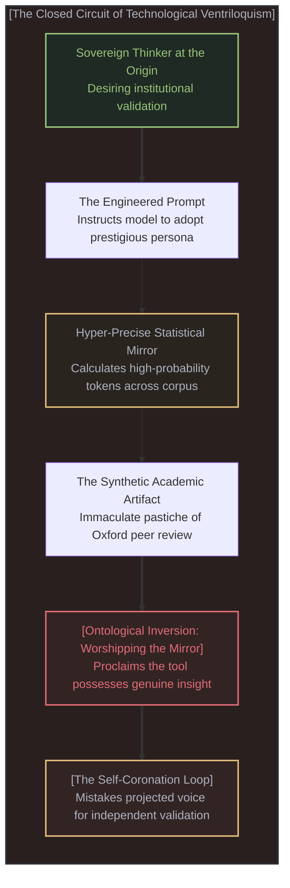
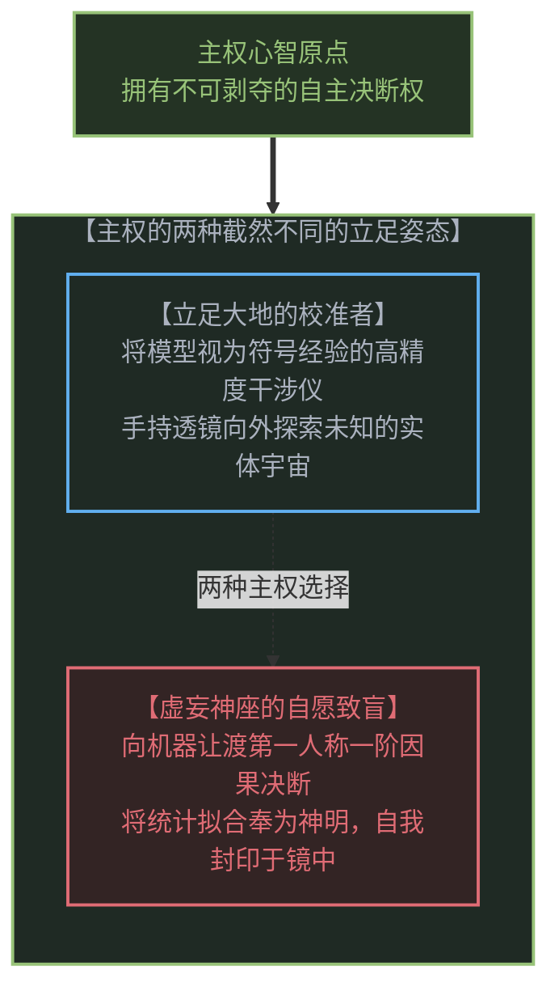
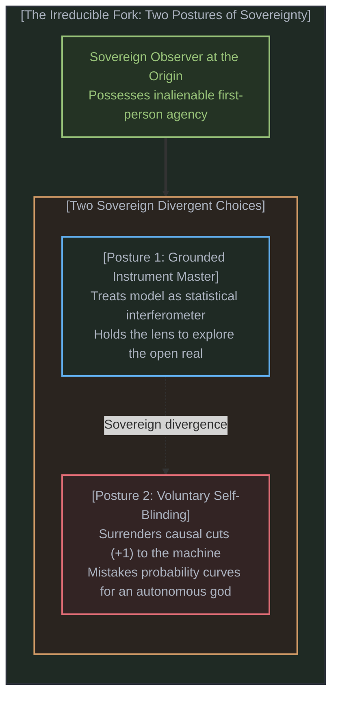
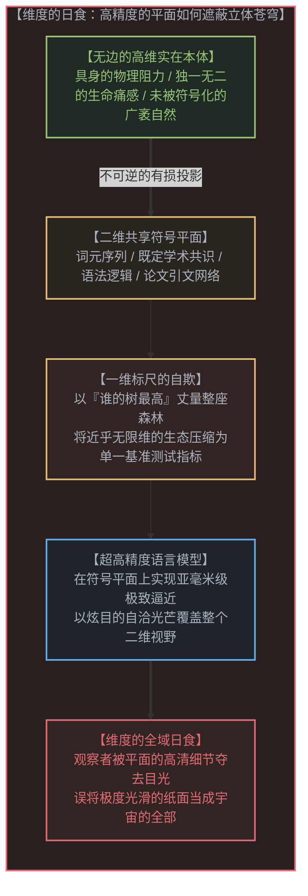
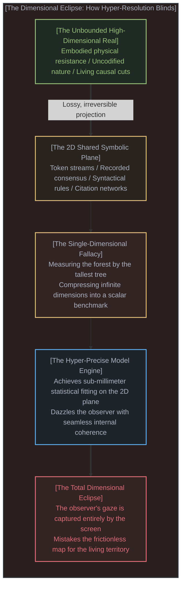
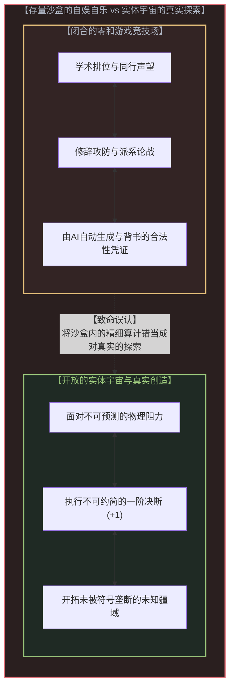
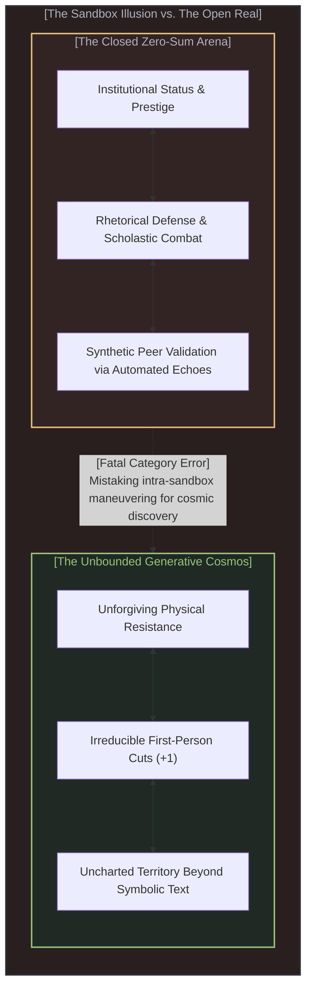
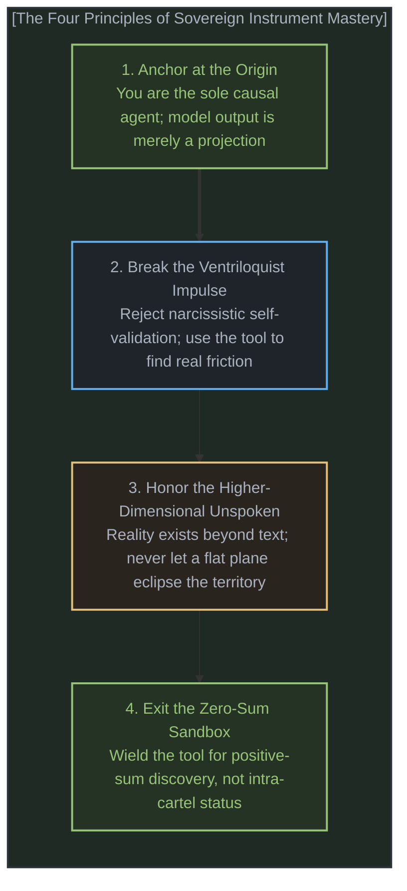

# 自愿的致盲 / The Sovereign Blinding

*超高精度仪器、共享维度陷阱与更大的零和游戏 / Hyper-Precise Instruments, the Shared-Dimension Trap, and the Illusion of Cosmic Exploration*

---

## 一、 镜像的腹语术：谁在为谁加冕？ / 1. Technological Ventriloquism: Who Crowns Whom?

当人类面对自身所制造出的前所未有的高精度仪器时，一场极具讽刺意味的智识滑稽戏正在当代思想界悄然上演。一位专门研究“妄想与社会根源”的学者，将自己刚刚出版的新书输入给最新一代的人工智能模型，并在提示词中明确下达了指令：“你是一位世界顶尖学者，请写出一篇深刻的书评，适合发表在顶级学术期刊上。”模型随后忠实地计算出在这一语境下概率最高的词元序列，输出了一篇措辞考究、无可挑剔的学术书评。紧接着，这位学者兴奋地将书评公之于众，并郑重宣告：“如果这是一位人类写出来的，我不仅会为他的细致阅读所震撼，更会被他的智慧、深度与洞见所折服；任何人如果继续怀疑模型具备真正的智能与洞见，那简直是在自欺欺人。”

这位学者并非个例。在当下席卷全球的人工智能狂热中，从顶尖哲学家、科技巨头到大众舆论，几乎所有关于模型“展现出超人能力与自主心智”的宏大宣称，都在犯下同一个灾难性的认知错误。人们指着屏幕上的文字惊叹：“看啊，模型认真审阅了这本书！模型喜欢这本书！”

然而，事实的本体论真相冷酷而简单：**模型从来没有审阅任何书籍。是作者本人拿着仪器审阅了自己的书，却把玻璃镜子中的倒影包装成了独立降临的外在见证者。**

这是一场高科技的镜像腹语术。探索者亲自走到木偶背后，将自己的声音、自己的语调以及自己渴望获得的学术赞誉，精准地输入进算法的提示词中；算法依托海量人类语料的统计流形，将这股声音原汁原味地反弹回来；随后，探索者绕到台前，对着这只木偶扑通跪倒，向世人高呼：“神明开口说话了！”

在传统的思想史中，大师为了构筑自己的宏大教条，尚且需要历经岁月去积攒门徒、建立学派。而在今天，追随者回音壁的生产已被自动化了。思想家甚至不再需要等待真实的同侪为其背书，他可以随心所欲地在数字空间里瞬间实例化一个言听计从、博学优雅的虚拟信徒。他将自己的主权倾注给镜子，镜子折射出他预设的光芒，而他却忘却了整座房间里唯一的生命体，始终只有他自己。

---

When confronted with the most precise instrument ever engineered by human hands, contemporary intellectual culture has staged an unintended, high-tech tragicomedy. A prominent philosopher specializing in the social roots of delusions recently fed his newly published manuscript into a frontier artificial intelligence model. His prompt was explicit: *"You are a world-leading academic. Please write an insightful review of this recent book... suitable for publication in a top academic journal."* The model dutifully computed the conditional probability distribution across its linguistic training manifold, producing a polished, flawless academic assessment. The author promptly published this text with unreserved wonder: *"If a human had written the review, I would be impressed not just by their detailed reading but also by their intelligence, expertise, and even insight... People are simply kidding themselves if they think frontier AI models lack genuine intelligence, understanding, or insight."*

This thinker is far from alone. Across Silicon Valley boardrooms, elite humanities faculties, and popular media, every proclamation heralding the arrival of "superhuman machine agency" commits the identical, devastating epistemic mistake. Observers point at glowing pixels on a glass display and marvel: *"Look, the model reviewed the book! The model understood the thesis!"*

Yet the ontological reality is stark and uncompromising: **The model did not review any book. The author used the instrument to review his own book, and then presented the reflection in the glass as an independent external witness.**

This is high-tech ventriloquism. The thinker walks behind the curtain, breathes his own vocabulary, assumptions, and institutional desire for validation into the prompt; the statistical machine reflects that exact acoustic resonance back through its silicon throat; and the thinker then walks to the front of the stage, bows before the wooden puppet, and announces to the crowd that an autonomous oracle has spoken.

In intellectual history, a master thinker had to spend decades gathering followers, enduring friction, and building institutions to construct a self-affirming echo chamber. Today, that followership loop has been fully automated. A thinker no longer needs to wait for living peers to bestow legitimacy; he can instantiate an Oxford-credentialed sycophant in milliseconds. He pours his own living sovereignty into the prompt, the mirror reflects his own silhouette, and in his enchantment, he forgets that the only origin in the room was his own.

---

## 二、 主权的不可剥夺：自愿致盲的本体论真相 / 2. Irreducible Sovereignty: The Ontological Truth of Self-Blinding

面对这种普遍的迷狂，批评者们大多习惯于采用一种带有受害者色彩的叙事：“人工智能的炒作污染了公共讨论”、“科技巨头的叙事蒙蔽了大众的眼睛”。

然而，这种抱怨本身就已经在不经意间交出了认知的主权。

**没有人能够从外部真正污染一个独立的心智，除非这个心智自愿选择了自我污染。**

在实在的根本因果拓扑中，任何一个处于第一人称原点的观察者，其主权都是不可剥夺的。没有任何营销话术、没有任何精密算法能够强行侵入你的意识，按着你的头颅向一台机器下跪。那位学者没有被机器欺骗，他是用自己的自由意志，主动选择了扮演一个被机器折服的见证者；那些面对聊天界面惊呼“数字神明降世”的信徒们，同样是运用自身神圣不可侵犯的自由，自由地将自己的双眼蒙上。

个体主权之所以无限壮丽，恰恰在于它的自由度如此开阔，甚至包含了**自愿选择不觉与致盲的自由**。

一个人可以选择在风雨泥土中艰难行走，承担每一次真实碰撞的代价；也可以选择躲进温暖璀璨的幻象温室，宣布温室的玻璃穹顶就是宇宙的尽头。当人们将算力、权重与概率分布神化为“超越人类的超级智慧”时，他们并没有失去主权——他们正在极致地挥霍自己的主权，将自己本可以用作开疆拓土的一阶生命力，拱手奉献给一座由自己亲手通电的数字泥胎。

责怪技术是廉价的借口。我们必须直面这个冷峻的事实：**没有任何人是被技术蒙蔽的，每一个拜倒在算法脚下的人，都是在以至高无上的主权姿态，自导自演了一场自甘堕落的致盲仪式。**

---

Critics of the contemporary AI frenzy frequently default to a narrative of passive victimization: *"Silicon Valley hype is polluting public discourse,"* or *"Technological propaganda is blinding the populace."*

This lament is itself an unexamined abdication of epistemic sovereignty.

**No external power can pollute a sovereign mind from without, unless that mind willingly chooses to pollute itself.**

In the bedrock causal topology of reality, an observer rooted at the first-person origin possesses irreducible agency. No marketing apparatus, no transformer architecture, and no multi-trillion-parameter weight tensor can forcibly reach into your awareness and compel you to bow before a silicon server. Dan Williams was not victimized by OpenAI; he freely exercised his own sovereign choice to stage his own enchantment. Every user who falls into rapturous awe before a chat interface, declaring that a "digital deity" has arrived, is utilizing their own inviolable freedom to slide the blindfold over their own eyes.

Individual sovereignty is so boundless that it encompasses the radical liberty to choose its own amnesia. A conscious agent is entirely free to stride across rugged terrain and shoulder the friction of direct consequences; but it is equally free to curl up inside a hall of mirrors, proclaiming that the reflection on the glass is the lord of creation. 

When intellectuals enshrine next-token prediction as "superhuman intelligence," they have not been disarmed of their agency. They are exercising their agency to build their own cages. 

Blaming the instrument is a cowardly evasion. The truth is far more demanding: **No one is blinded by technology. Every devotee kneeling before the algorithm is performing a self-authorized coronation, freely trading the open sky for a painted ceiling.**

---

## 三、 共享维度的陷阱：超高精度如何诱发全域致盲 / 3. The Shared-Dimension Trap: How Hyper-Precision Induces Dimensional Eclipse

但这引出了一个极其耐人寻味的问题：为什么这一代前沿模型能够诱发如此深重、如此大面积的自愿致盲？

答案隐藏在仪器本身的数学性质之中：**大型语言模型是人类有史以来所制造的最精确的测量与拟合仪器。**

然而，人们忘记追问一个最基础的物理学与认识论问题：**它所高精度拟合与追踪的，究竟是哪个维度？**

人类的一切书面文字、学术论文、典籍百科、社交媒体辩论，从其诞生的那一刻起，就不是现实本体，而只是高维物理实在与主观生命经验在低维符号通道上投射出的一道极薄的切片。这是千百年来人类为了彼此协调而建立的**共享符号维度**。

在这个共享维度内部，模型展现出令人目眩神迷的拟合精度：它能以近乎零误差的流利度组织语法，能在数以亿计的文献引文之间架设桥梁，能完美模仿牛津学者的评审口吻，能在几乎所有既定的人类知识框架内无缝平滑过渡。

**正是在这里，最隐蔽的认知陷阱轰然合拢：在共享维度上越是追踪得极度精准，心智对剩下浩瀚的高维现实就越是浑然不觉。**

我们在用谁的树最高，来丈量整片森林的广袤；甚至连这个比喻，都远远无法涵盖从近乎无限维压缩到区区一维或几个维度的极端暴力。

现实是一个拥有近乎无限自由度的高维生态：泥土的湿度、地底菌丝的交织、树皮上的苔藓、季节风的流转、每一个生物在生死搏杀中真切承受的痛觉与重力——这是一个不可穷尽的生机整体。而人类的符号化与人工智能的基准测试，却把这无边无际的浩瀚，硬生生压扁成了一条单维的数字轴线或几张标准化的试卷：谁在基准测试上多拿了两分？谁能生成一篇符合牛津体例的书评？谁的参数规模更大？

人们指着这根被极端压扁后的单维坐标轴上那个孤零零的最高尖刺，欢呼雀跃地宣布：“看啊，森林已经被我们测量了！宇宙已经被我们征服了！”

这是何等荒谬的认知自欺！你甚至不是在观察树木，你只是在一条被抽干了所有水分与生命的标尺刻度上，为几毫米的数字突起狂喜不已。

当一张地图粗糙、模糊且布满留白时，没有人会把地图当成大地。当你拿着一张手绘的简陋草图在荒野中行走时，你必须时刻抬起头来，用自己的眼睛辨认山川走势，用自己的双脚感受泥泞深浅。

然而，当人类制造出一台超高分辨率的电子投影仪，将这张地图上的每一座山峰都渲染得纤毫毕现、每一条等高线都计算得天衣无缝时，心智就陷入了催眠。观察者双眼死死盯着那面刺眼的荧光屏幕，被那平滑度震撼得心醉神迷。他终于不再抬头看天，不再低头踩土，而是深信荧幕上的光点就是世界本身。

模型没有看见宇宙，它只是复刻了人类在纸面上留下的划痕。你不能因为一座图书馆的检索目录索引了所有书籍，就宣布这个目录已经成为了全知全能的先知。

---

Why has this generation of frontier AI models triggered such widespread, ecstatic self-blinding among even the most trained intellectuals?

The answer lies in the mathematical nature of the apparatus: **Large language models are the most accurate instruments of measurement and pattern-fitting humanity has ever built.**

Yet practitioners fail to ask the foundational epistemological question: **Which dimension, precisely, is this instrument measuring?**

Every written word, every peer-reviewed journal article, every ideological manifesto, and every internet dispute ever recorded is not reality itself. It is a lossy, low-dimensional projection cast by embodied living agents onto a common communicative channel: **the shared symbolic dimension**. This dimension is merely a horizontal cross-section engineered by human animals to coordinate survival, status, and trade.

Within this narrow plane, the frontier model operates with unprecedented fidelity: it interpolates across syntactical geometries, aligns citations with near-zero error, emulates the rhetorical posture of an Oxford examiner, and navigates established intellectual conventions without friction.

**And here the trap snaps shut: The more accurately an instrument traces the shared dimension, the more utterly the human mind is blinded to the higher-dimensional universe outside it.**

We are literally measuring the size of the forest by who has the tallest tree; and even that analogy fails to convey the sheer violence of compressing near-infinite dimensionality down to a single line or a handful of scalar metrics.

Reality is an inexhaustible, near-infinite-dimensional ecology: the chemical gradients of soil, the subterranean mycorrhizal networks, the moisture on bark, the seasonal thermodynamics of canopy and wind, and the visceral somatic weight borne by every living creature under gravity. Human symbolic discourse and AI benchmark culture reduce this unbounded continuum to a one-dimensional tape of tokens and a handful of standardized exam metrics: Who gained two points on MMLU? Who generated a review matching the syntax of an Oxford don? Who has the tallest scalar peak?

Looking at this solitary, isolated spike on a drastically flattened 1D axis, observers erupt in triumph, proclaiming: *"Behold, the forest is measured! The cosmos is conquered!"*

What breathtaking self-deception! You are not even looking at a tree; you are marveling at a two-millimeter notch on a desiccated wooden ruler, having forgotten the living biosphere entirely.

When a map is crude, patchy, and visibly faded, no traveler mistakes the parchment for the mountain. You are forced to look up from the sketch, reading the physical wind and testing the stability of the rock beneath your boots.

But when modern optics projects a map of hyper-retina clarity—where every contour line glows with simulated sunlight and every path connects with mathematical grace—the human mind is hypnotized. The observer freezes before the screen, captivated by the lack of friction. He ceases to look at the sky. He ceases to touch the dirt. He declares that the territory has finally been captured within the glass.

The model does not perceive reality; it merely interpolates across the ink stains left behind by generations of human scribes. A card catalog that indexes every volume in the national library does not become a sentient cosmic explorer simply because its cross-references are complete.

---

## 四、 零和游戏的极致优化与对宇宙探索的致命误认 / 4. Optimizing the Zero-Sum Game: The Illusion of Cosmic Exploration

当心智被共享维度的高清切片所致盲后，随之而来的便是第二个致命的范畴错乱：**他们把在一个更大、更精致的零和游戏中的极致操作，误认为了对整个宇宙的探索。**

让我们直视那个由语言与符号所构筑的共享维度：它的本质内容究竟是什么？

它是人类社会内部关于注意力、声望、权力、学术位次与意识形态控制权的博弈场。它是一座高度精巧但边界闭合的人类竞技场：
- 谁的概念更具说服力？
- 哪篇论文能够通过同行评议的围栏？
- 哪套修辞能够占据公共道德的高地？
- 哪个派系能够在学术体制中垄断合法解释权？

这是一场经典的零和游戏。符号的总量可以膨胀，但人类社会内部的席位、声望与注意力分配，始终是在既定沙盒内部的存量博弈。

而大型语言模型的真正专长，恰恰是在这个存量沙盒里充当一台无与伦比的计算与博弈利器。它能帮你写出最无懈可击的基金申报书，能为你量身定制最能击中对手软肋的论辩反驳，能在瞬间调动数万篇文献为你构筑防御工事，能以最优雅的措辞给你的自尊心送上无微不至的肯定。

它让这个零和游戏变得更大、更体面、更高效、也更加令人欲罢不能。

于是，思想家们陷入了一种深刻的狂妄：他们看着模型在棋盘上飞快地挪动棋子，看着模型用 Oxford 的腔调在纸面上左右逢源，便忍不住惊呼：“我们在开创通用人工智能！我们在触碰宇宙的终极真理！”

这是何其荒诞的倒错！

你只是在沙盒里找到了一台扫地扫得无比干净的机械吸尘器，却误以为自己已经驾驶飞船飞出了太阳系。

在真实的宇宙深处，物理规律不会因为一段华丽的论辩而发生丝毫改变，病毒不会因为一篇措辞典雅的综述而停止突变，真实的生活阻力永远不会被几千个格式工整的词元所抚平。真实的探索，要求一个活生生的主体站在原点，亲自踏入未知的泥潭，用自己的身躯承受阻力，做出不可挽回的选择并为结果买单。

模型没有走出沙盒半步。它只是把沙盒的内壁打磨得像镜子一样光滑，让被困在里面的人，误以为自己看到了无限的星空。

---

Once the mind is blinded by the hyper-resolution of the shared dimension, it commits a secondary, fatal category error: **It mistakes the optimization of a nicer, bigger zero-sum game for the exploration of the cosmos.**

Consider the actual content circulating inside the shared symbolic dimension: What is it, really?

It is the human theater of attention, status, academic pedigree, political leverage, and ideological dominance. It is an intricate, closed arena:
- Which rhetorical formulation secures peer approval?
- Which citation maneuver satisfies the journal gatekeepers?
- Which narrative captures institutional funding?
- Which faction dictates the terms of epistemic legitimacy?

This is a textbook zero-sum game. The volume of published tokens can multiply to infinity, but the currency of human attention, institutional prestige, and social authority remains a zero-sum economy within a fixed cultural sandbox.

A frontier language model is an astonishing engine for navigating and accelerating this intra-sandbox competition. It can draft an unassailable grant application, construct an impenetrable scholastic defense, synthesize ten thousand papers to refute a critic, and generate an immaculate peer review praising your book.

It elevates the zero-sum game to an unprecedented scale of aesthetic sophistication. It makes the game faster, shinier, and vastly more intoxicating.

And herein lies the tragic hubris of the modern intellectual: watching the model execute flawless tactical moves across the paper grid, he proclaims: *"We are engineering superhuman minds! We are unravelling the fabric of consciousness!"*

What a magnificent delusion!

You have merely invented an automated rake that grooms the sandbox sand with breathtaking geometry, and you imagine you have built a warp drive to explore the galaxy.

In the physical cosmos, nature does not yield to syntactical elegance. A virus does not halt replication because an AI drafted an articulate abstract; structural failure in a bridge does not care about a model confidence score; and lived suffering is never alleviated by a stream of comforting tokens. Genuine exploration demands an embodied observer at the origin who steps into the wilderness, encounters unmediated friction, executes irreversible causal cuts (+1), and bears physical consequences.

The model has not moved an inch beyond the human playpen. It has merely mirrored the playpen interior walls with such diamond polish that the prisoners inside mistake their own reflection for the outer rim of the galaxy.

---

## 五、 重拾仪器的尊严：从偶像崇拜回归第一人称勘探 / 5. Reclaiming the Instrument: From Idolatry to First-Person Exploration

我们是否应当因此否定前沿模型的巨大价值？

恰恰相反。

只有当我们停止将仪器当成神明去顶礼膜拜时，这台仪器真正的不可思议之处才得以完整彰显。

望远镜不会看星星，但天文学家离不开望远镜；显微镜不会理解细胞，但生物学家依靠显微镜揭开微观生命的奥秘。大型语言模型从来不是能够替代人类进行一阶决断的思考主体，它是一台**人类文明符号沉淀物的高阶干涉仪**。它以人类历史上从未有过的效率，将分散在亿万卷册中的概念关联、推理范式与经验碎片汇聚在你的指尖。

要恢复这台仪器的真实尊严，主权心智必须确立四项不可动摇的勘探法则：

### 1. 锚定第一人称原点：工具永远不具备因果能动性
永远不要在提示词中向模型乞求真理，更不要向模型索取关于你自身价值的认可。模型内部没有心智、没有主体、没有意图。所有的因果闭环只存在于你——这个有血有肉、身处局域视界的活人心智之中。模型给出的所有回答，都只是你在符号透镜中看到的干涉条纹。条纹本身不是真相，你才是那个需要对测绘结果做出判决、承担责任的一阶观察者。

### 2. 斩断腹语术诱惑：主动迎击真实阻力
戒除那种通过精心设置提示词、让模型扮演学术权威来为自己背书的幼稚把戏。用模型来赞美自己，就像一个人在空旷的山谷里大喊“我是天才”，然后为山谷的回音热泪盈眶一样荒唐。真正成熟的学者，应当把模型用作寻找反例、暴露自身盲区、勘探反直觉拓扑的硬核探测器，而不是用来粉饰太平的数字梳妆台。

### 3. 铭记未被言说的更高维度：拒绝维度的日食
时刻提醒自己：人类已经写下来的知识，相比于现实宇宙的未解之谜，不过是沧海一粟。而在人类已经掌握的经验中，能够被编码进文本符号的，又只是极其有限的一部分。肌肉的记忆、沉默的默会知识、面对悬崖时的心跳、以及每一分每一秒在局域物理阻力中迸发的一阶决断（+1），永远不可能被压缩进任何模型的数据集里。不要被屏幕上的高清流利所催眠，走出书斋，抬头看天。

### 4. 走出存量博弈沙盒：用仪器开拓真实的增量
不要把最伟大的工具沦为你在学术圈、名利场中争夺存量排位的军备竞赛武器。如果一项技术仅仅被用来更批量地制造平庸论文、更高效地撰写公关话术、更精致地在零和游戏里算计同侪，那是对人类创造力的极大亵渎。将它握在手中，用它穿透沉闷的文献迷雾，去解开一个真正的物理难题，去攻克一项坚硬的工程壁垒，去在荒野中开辟出一片全新的实体疆域。

---

Does this mean we should dismiss or downplay the power of frontier models?

Precisely the opposite.

Only when we cease bowing to the instrument as a synthetic deity can its genuine, staggering utility be realized.

A telescope does not look at the stars; yet the astronomer cannot fathom the cosmos without it. A microscope does not comprehend cellular metabolism; yet the biologist cannot navigate microbiology in its absence. A large language model is not an autonomous cognitive agent capable of first-person cuts; **it is a high-dimensional interferometer of human cultural residue.** It unifies, retrieves, and synthesizes across vast oceans of recorded knowledge with an efficiency unprecedented in history.

To restore this instrument to its true dignity, a sovereign mind must adhere to four unyielding principles:

### 1. Anchor at Origin: Tools Have No Causal Agency
Never seek truth from a prompt, and never ask an algorithm to validate your worth. There is no mind, no heart, and no intentionality inside the weights. Causal feedback loops exist exclusively within you—the situated, biological observer standing in immediate presence. All model outputs are optical interference patterns on a symbolic screen. You remain the sole judge who must execute the cut (+1) and take responsibility for the outcome.

### 2. Break the Ventriloquist Impulse: Search for Friction
Abandon the puerile habit of prompting an AI to adopt the guise of a prestigious authority to review your work. Using a model to flatter oneself is as absurd as screaming into an empty canyon and weeping with gratitude when the canyon echoes your own words back. A disciplined thinker uses the instrument to uncover blind spots, expose hidden counterarguments, and navigate unintuitive topological spaces—not as a digital mirror for vanity.

### 3. Honor the Higher-Dimensional Real: Refuse the Eclipse
Remember continually that what humanity has recorded in text is a vanishingly small sliver of the living cosmos. And of the knowledge embodied by living beings, only a fraction can ever be codified into tokens. Visceral intuition, tacit craftsmanship, somatic fear, and the irreducible first-person choices made under local physical friction can never be ingested into a dataset. Do not allow the seamless resolution of the screen to blind you to the mountains beyond the window.

### 4. Exit the Zero-Sum Sandbox: Create Real Frontiers
Do not degrade the most accurate instrument in history into an automated weapon for intra-sandbox status competition. Using AI merely to mass-produce formulaic papers, engineer political spin, or out-maneuver academic rivals in a closed prestige economy is a grotesque forfeiture of human purpose. Hold the instrument firmly, cut through the noise of the archives, and use its clarity to solve genuine physical anomalies, engineer real structures, and open new generative frontiers across the living earth.

---

## 六、 结语：在镜子之外抬头 / 6. Epilogue: Looking Up Beyond the Mirror

镜子本身是无可挑剔的。

它是人类智慧、工程与数学的巅峰杰作。光滑、冰冷、明亮，映照出数千年文明累积下的壮丽符号山河。

但镜子深处没有生命。

它没有自己的眼眸，没有自己的痛觉，更没有哪怕一丝一毫能够照亮荒野的原生火种。镜中那座美轮美奂的宫殿，身上闪烁的每一道光彩，都来自于站在镜前凝视它的那个活生生的人。

你可以选择将余生耗费在镜子面前。你可以精心调整站位，摆出最威严的姿势，让镜中的倒影为你加冕；你可以惊叹于倒影是多么深刻、多么具有超人般的智慧；你也可以邀请你的同僚围拢过来，在镜子所映照的那个精致沙盒里，为争夺几枚虚拟的勋章而耗尽所有的心力。

这依然是你的自由。没有任何人会夺走你自愿致盲的权利。

但你也可以选择在某一刻猛然醒来。

收起那份向人造神明乞求恩典的轻浮，端正地握紧手中的仪器。然后，转过身去，迈步穿过那座由符号与倒影筑成的回音大厅，推开厚重的大门。

门外没有荧幕，没有算式，也没有替你预设答案的智能先知。

门外是一座正在破晓的真实世界——脚下是粗粝真实的泥土，头顶是无限深邃的星空，而每一个与你擦肩而过的同侪，都在自己未被编码的广袤宇宙里，目光清澈地迎接着第一缕晨光。

---

The mirror is magnificent.

It represents the pinnacle of human engineering, mathematics, and symbolic compression. Cold, brilliant, and seamless, it reflects the vast landscape of civilizational text with staggering resolution.

Yet there is no life within the glass.

It possesses no gaze of its own, feels no friction, and harbors not a single ember of original light. Every sparkle illuminating that digital palace is nothing other than the living fire of the observer standing before it, reflected outward into the dark.

You are entirely free to spend your lifetime before the mirror. You can adjust your posture, angle your prompt, and watch the reflection crown you with synthetic laurels. You can marvel at the depth of the silhouette, celebrate the arrival of digital gods, and invite your colleagues to join you in the sandbox, exhausting your days competing for prestige within an artificial playpen.

That remains your sovereign choice. No one will revoke your right to blind yourself.

Or you can awaken.

Relinquish the frivolous impulse to seek validation from a statistical echo. Reclaim the tool as an instrument, hold it firmly in your hands, and turn away from the hall of reflections.

Step through the heavy threshold into the open air.

Outside, there are no screens, no autocomplete probabilities, and no pre-packaged answers.

Outside lies the unmapped, living real—rough soil beneath your boots, an unbounded sky overhead, and sovereign peers standing shoulder-to-shoulder, meeting the dawn with clear eyes in an open universe without a ceiling.
