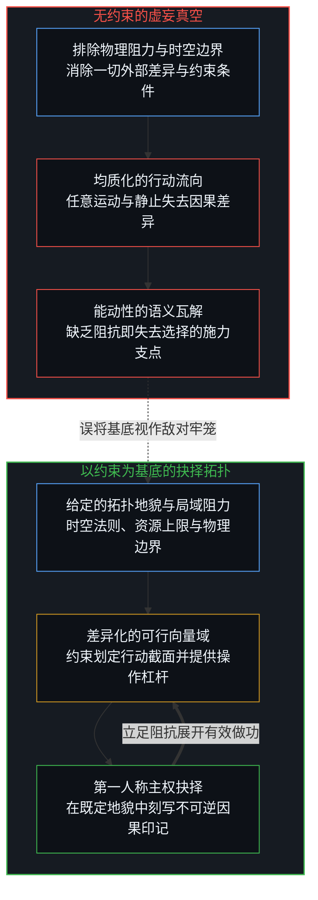
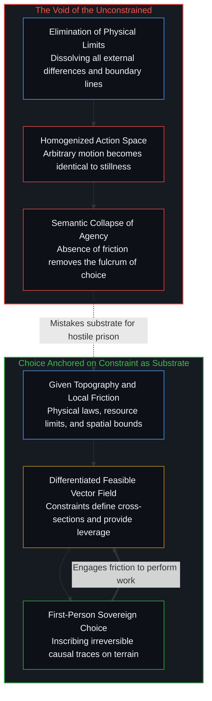
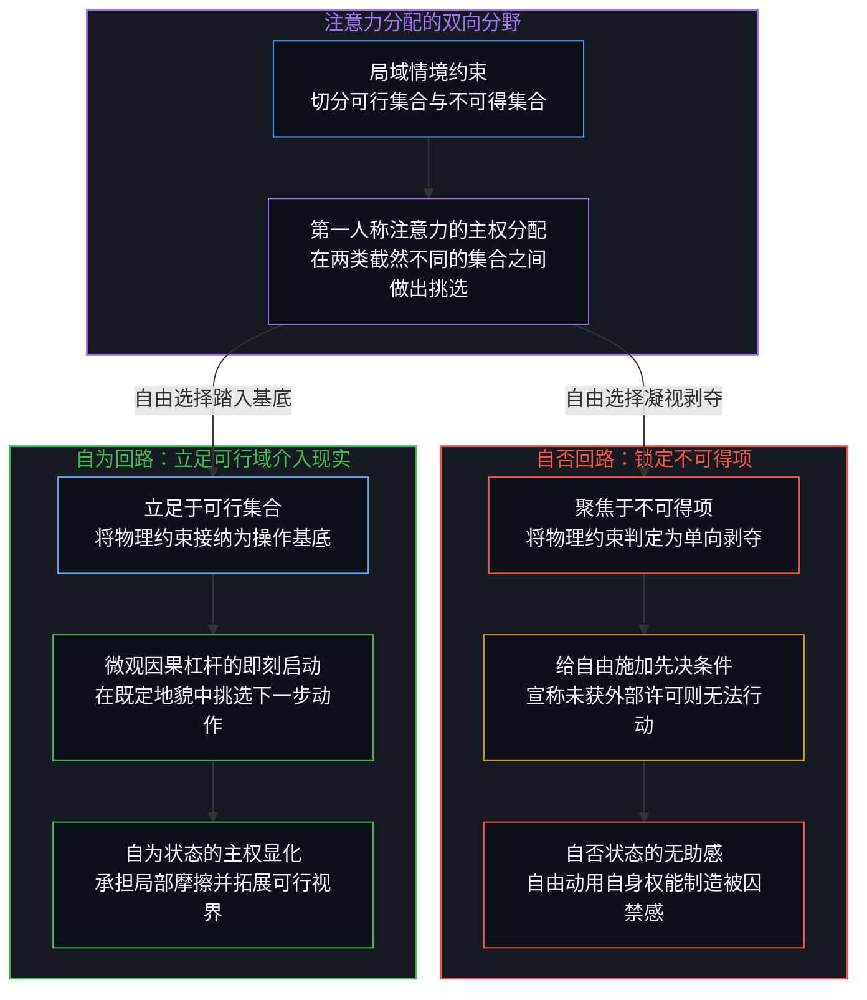
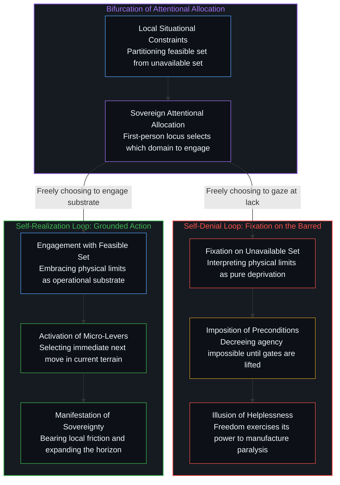

# 约束基底与自由自否 / The Substrate of Constraint and the Self-Denial of Freedom

*痛苦源于给自由施加先决条件，而自由恰是在任何约束下皆可行动的主权。 / Suffering stems from conditioning freedom on outcomes; freedom is sovereign action under constraints.*

在大众语境与浪漫主义文学的叙事中，自由长期被描摹为一种摆脱一切阻碍、免除所有重负的原生完满状态。这种设定假定世间所有的物理规律、生理局限、历史因果与环境阻力皆是对个体主权的粗暴掠夺，宣称唯有撕碎所有的边界，生命才能抵达随心所欲的彼岸。然而，这种将自由等同于排除一切限制的设想，从逻辑的第一步起便陷入了认知倒错。

In popular discourse and romantic literature, freedom has long been depicted as a pristine state emancipated from all friction and relieved of every burden. This framing assumes that physical laws, biological limitations, historical circumstances, and environmental friction constitute an outright confiscation of individual sovereignty, imagining that the mind attains genuine autonomy only when every boundary is dissolved. Yet equating freedom with the absence of constraints collapses into conceptual incoherence at its very first step.

## 一、 虚无的真空与选择的因果基底 / 1. The Void of the Unconstrained and the Causal Substrate of Choice

设想一个被抽干了所有约束的虚构空间：在那里不存在引力，没有时空的局域阻隔，没有物质形态的阻抗，也没有行动后果的不可逆沉淀。当所有的行动通道都具有等价的流动性，当任何意图都不需要克服差异化的阻力，任何一个特定方向的微动便与静止毫无二致。没有阻抗，转向就失去了支点；没有不可逆的物理刻写，抉择便无法在世界中留下具有差异的因果痕迹。约束从来不是囚禁自由的牢笼，它恰恰是赋予选择以几何形态、语义内容与因果权重的实体基底。正如在 [约束的表象不是自由的丧失](../the-look-of-constraint-is-not-the-loss-of-freedom/) 中所剖析的，成人的受限外貌并非生命被环境剥夺了主权，而是能动性与现实发生深层摩擦后的历史沉淀。[没有固定者的固定](../fixed-by-nothing/)在另一种负载下描摹了同一几何：决定论从未消除开放，它只是把开放搬进自己无法生成的初始条件，再称之为给定。

Consider an imaginary void emptied of all constraints: where gravity is absent, spatial and temporal frictions vanish, matter offers zero resistance, and actions leave no irreversible deposits behind. When every trajectory possesses identical fluidity and no intention requires overcoming differential resistance, moving in any direction becomes indistinguishable from standing still. Without resistance, steering has no fulcrum; without irreversible physical inscription, choice cannot carve meaningful distinctions into the world. Constraints are never the bars of a cell; they are the generative substrate that grants choice its geometry, its semantic content, and its causal weight. As dissected in [The Look of Constraint Is Not the Loss of Freedom](../the-look-of-constraint-is-not-the-loss-of-freedom/), the constrained appearance of maturity does not signify that reality has stripped away agency, but reflects the accumulated coordinates where action met the world. [Fixed by Nothing](../fixed-by-nothing/) traces this geometry under a different load: Determinism never removes openness; it moves it into a given it cannot generate.

以下因果拓扑图展现了无约束真空的虚妄与以约束为基底的抉择机制之间的对照：

The following causal topology illustrates the contrast between the illusion of an unconstrained void and the generative mechanics of choice anchored on constraints as its substrate:

## 二、 先决条件的关卡与受苦的延期机制 / 2. The Gate of Preconditions and the Postponement of Agency

如果约束构成了行动的基底，人类经验中普遍存在的沉重痛苦究竟由何而来？这种苦难并不诞生于外部物理阻力的坚硬，而是源于心智在语法层面为自由生硬追加的先决条件。人们极易落入一种自我欺骗的拖延仪式中：认定自己必须先积攒下巨额的财务安全，必须先获得家庭的谅解，必须先驱散内心的恐惧与迷茫，或者必须先等待体制与环境的赞同，自己才能真正拥有做出决断的资格。

If constraints constitute the indispensable substrate of action, what generates the pervasive existential suffering of feeling trapped? Such distress does not originate in the rigidity of external physical barriers, but stems from the grammatical error of appending preconditions to freedom. Minds routinely slip into an elaborate ritual of postponement: convincing themselves that they must first amass financial abundance, resolve familial friction, eradicate fear and uncertainty, or secure institutional validation before becoming qualified to exercise genuine agency.

一旦将外部条件的满足确立为行动的前提，自由便不再是行动者立足的本体论原点，而退化为一种被抵押在未来的结算凭证。[有条件的自由](../you-tiao-jian-de-zi-you/) 剖析了这种精神抵押的虚妄：无论设立的前提最终是被现实撞碎还是侥幸达成，个体都早已在设立前提的瞬间交出了自己的裁判权。在匮乏时，外部匮乏被登记为停滞的挡箭牌；在充裕时，守住充裕的风险又立刻接管了拖延的借口。正如在 [自由作为地基](../freedom-as-ground/) 中所阐明的，世俗阶梯理论将自由拆解为财务、精神与存在的层层关卡，实则在行动者与当下的主权之间构筑起一道无尽后撤的官僚闸门。痛苦从来不属于境遇本身，痛苦恰恰是心智亲手把自由的兑现日期推迟到虚妄终点时所必然引发的痉挛。

The moment the satisfaction of an external condition is installed as an operational prerequisite, freedom ceases to be the living ground of agency and is degraded into a promissory note parked in the future. As demonstrated in [Conditional Freedom](../you-tiao-jian-de-zi-you/), this mortgage of agency is self-defeating: whether the designated condition is shattered or fulfilled, the mind has already surrendered its authorial sovereignty the moment the gate was erected. In scarcity, material lack serves as an alibi for immobility; in affluence, the risk of loss instantly becomes the new justification for hesitation. As derived in [Freedom as Ground](../freedom-as-ground/), ladder taxonomies that stratify liberation into sequential tiers of attainment construct an administrative scaffold that endlessly postpones the present locus of sovereignty. Suffering belongs not to the terrain itself, but to the internal convulsion produced when the mind defers its own agency to an unreachable horizon.

## 三、 注意力分配与自否状态中的自由行使 / 3. Attentional Allocation and the Exercise of Freedom in Self-Denial

由此浮现出人类心智最为奇特而残酷的内在反讽：当一个人陷入深重的无力感、痛陈自己“毫无选择”时，他并未丧失自由，相反，他正以饱满的强度行使着这项能力。在任何特定的现实截面中，约束条件无非是将所有的可能性空间划分为两组集合：一组是在既定边界内切实可行的行动选项集，另一组则是被物理或社会规则排斥在外的不可得选项集。这两组集合的分野构成了现场的地貌，但如何分配自己的注意力，却始终是第一人称心智独享的主权活动。

This exposes the most profound paradox of the human condition: when an individual suffers from overwhelming paralysis and insists they "have no choice", agency has not vanished; rather, it is operating at full intensity. At any given cross-section of reality, existing constraints divide the field of possibilities into two distinct sets: the set of feasible actions executable within local boundaries, and the set of counterfactual options excluded by physical, financial, or social conditions. While constraints establish this topographical threshold, allocating attention between these sets remains the exclusive sovereignty of the first-person locus.

受困者的自由，恰恰体现在他做出了一个将自身推向瘫痪的决断：他动用自身的注意力配额，将目光锁定在不可得的集合之上，并宣称唯有获得那些被封死的选项，自己才算拥有自由。这种分配方式将既定约束解读为单向的压迫与剥夺，从而抹杀了可行域中依然敞开的无数微观向量。[自由意志的自否自由](../the-freedom-of-will-to-deny-itself/) 揭示了学者动用理性区分能力去否定意志的施演矛盾；在日常生存中，普通行动者同样在进行着同构的自我围困。一个人感到自己被囚禁的那一刻，正是自由在以自我否定的姿态全力运转。这种行动不仅不是自由的终结，反而是自由走入歧途的明证：心智自由地挑选了一套使自己看起来毫无自由的解释模型，并自愿入住其中充当受害者。

The unfreedom of the sufferer is itself an active exercise of freedom: the agent deploys their attentional bandwidth to fixate on the unavailable set, decreeing that only the restitution of barred possibilities qualifies as authentic agency. This interpretative allocation frames structural limits purely as deprivation, systematically blinding the mind to the vast array of micro-vectors that remain open in the feasible domain. While [The Freedom of Will to Deny Itself](../the-freedom-of-will-to-deny-itself/) dissects theorists using rational discrimination to argue against agency, everyday sufferers enact an identical performative contradiction. The precise instant one feels trapped is an instant where freedom operates in self-denial. Far from witnessing the extinction of will, it exhibits freedom turned against itself: the mind freely adopts a conceptual cage that models itself as powerless, then volunteers to dwell within it as an innocent victim.

以下因果机制图展现了注意力分配如何分化为自否回路与自为回路：

The following causal diagram details how attentional allocation bifurcates into the self-denying loop of victimhood versus the self-realizing loop of grounded agency:

## 四、 约束下的不变主权与因果手柄的收回 / 4. Invariant Sovereignty Under Constraints and the Reclaiming of the Causal Lever

真正具有操作性的自由，从来不依赖于外部阻力的奇迹般消散。自由的核心特质在于它对于任何约束拓扑的高度不变性：无论身处的现实走廊多么狭窄，无论可动用的资源多么匮乏，只要第一人称觉知尚未熄灭，在每一个呼吸的当下挑选下一个微观行动的权能便始终完整无损。[个体抉择作为唯一的因果杠杆](../individual-choices-as-the-only-causal-levers/) 表明，无论宏观系统如何庞大复杂，系统演进的真实动力源始终是微观主权在当下的离散扰动。自由不需要任何先决条件的批准，它是在任何给定地貌下依然可以向世界施加因果影响的底层能力。

Operative freedom never depends on the miraculous dissolution of exterior friction. Its distinguishing property is an invariance across arbitrary constraint topologies: no matter how narrow the situational corridor, no matter how scarce the immediate resources, as long as first-person awareness remains active, the capacity to select the next micro-action remains whole and uncompromised. As demonstrated in [Individual Choices as the Only Causal Levers](../individual-choices-as-the-only-causal-levers/), macroscopic systems and structural regularities derive their directional momentum from discrete microscopic choices occurring in the present. Freedom requires no validating sanction from preconditions; it is the baseline capacity to exert causal traction across whatever terrain presents itself.

摆脱内耗与停滞的途径，断非等待风平浪静的无阻力未来，而是把因果责任的手柄重新收回掌心。停止向外部世界乞求免除约束的特赦令，停止将注意力耗散在对不可得选项的哀叹之中。当心智不再把边界视为监牢，而是将其视为行走的坚实地面，所有的无力感便在瞬间消解。行动者在当下的既定坡度上迈出微小而具体的一步，承受真实的摩擦与阻力；正是这种在约束基底上的持续做功，才在历史的时间轴上真正推移了生命的自由度，让自由从一种自我否定的心智内耗，转化为重塑现实的坚韧力量。

Dissolving psychological paralysis does not require waiting for a frictionless future, but demands reclaiming the causal lever directly into one's own hands. It requires abandoning appeals to the world for special exemptions from constraints, while ceasing to hemorrhage cognitive energy mourning excluded possibilities. When the mind ceases to misread boundaries as walls and embraces them as the firm ground beneath its feet, the illusion of captivity evaporates. The agent takes a concrete step upon the existing slope, absorbing local friction and shouldering authentic consequences. Through sustained work anchored on this substrate of constraints, the living horizon expands across time, transmuting freedom from a self-denying neurosis into the durable force that shapes reality.
