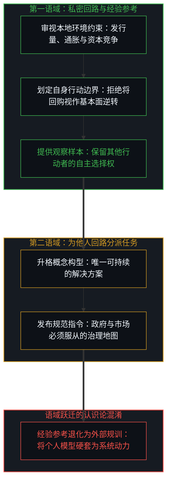
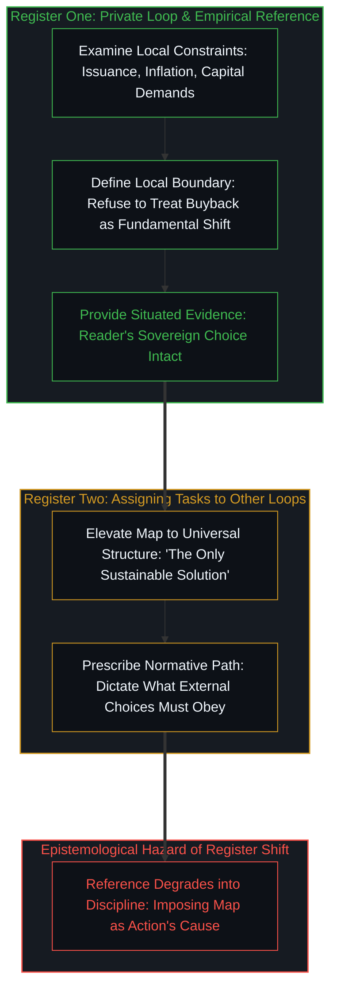
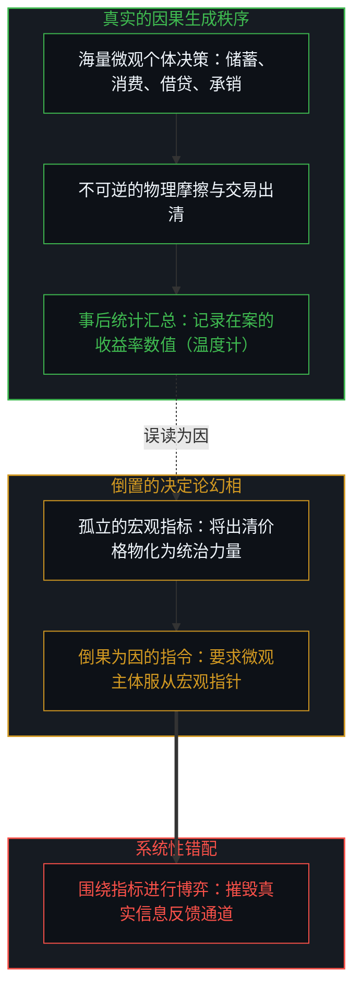
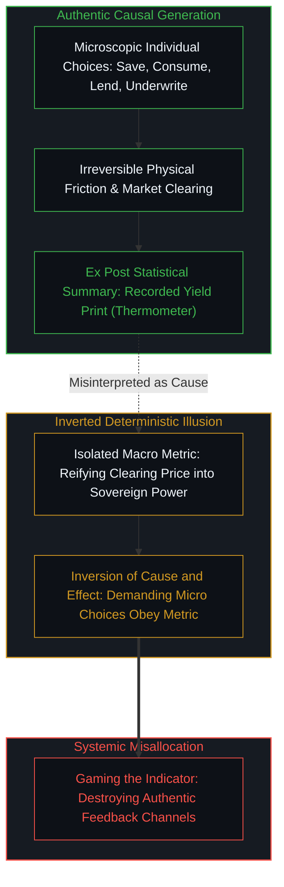
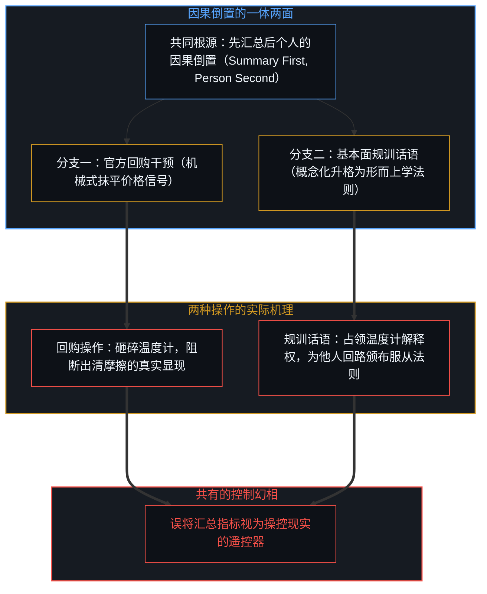
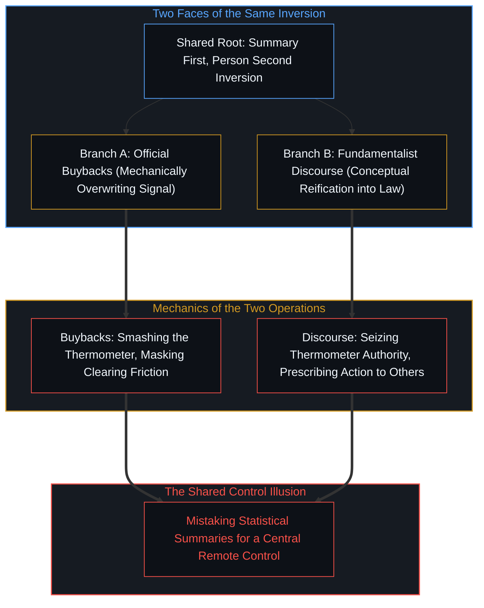
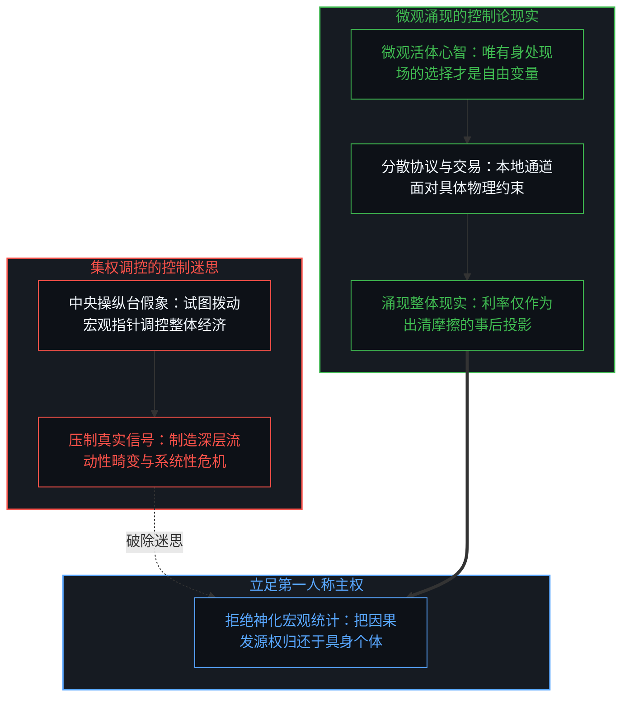
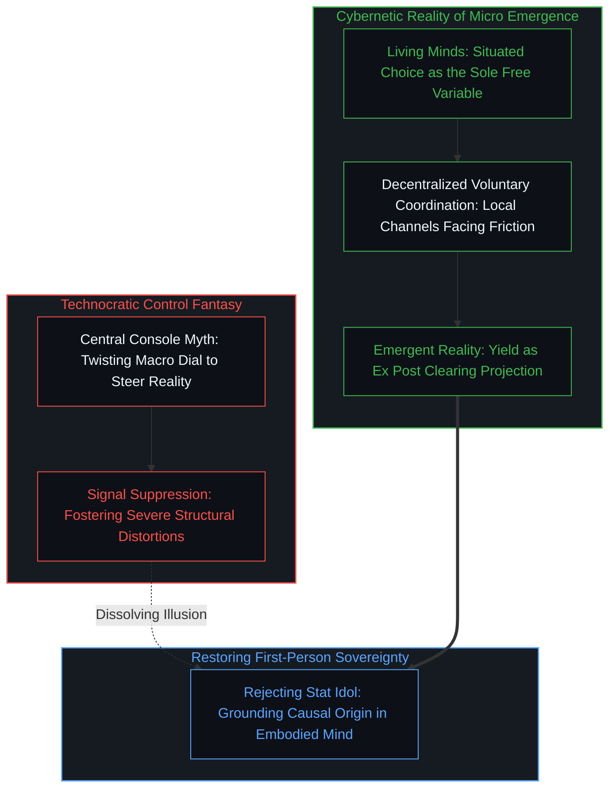

# 先汇总后个人的因果倒置与利率的命令幻相 / Summary First and the Causal Inversion of Yields

*宏观统计仅记录已完成的选择，将其视为行动指令颠倒了微观经济秩序。 / Macro statistics record completed choices; treating them as commanders inverts economic causality.*

三十年期美债收益率突破百分之五点三，创下了十九年来的新高，然而对照跨越世纪的长期历史序列，这不过是一个居中的常态读数。它之所以在直觉中显得陡峭，主要归因于参照系被锚定在二〇〇八年金融危机与全球疫情之后的极端超低利率区间，而那些极端低点皆由人为的非常规干预政策刻意塑成。眼前的收益率数据是记录在案的已然事实：当通货膨胀、国债发行规模以及全社会对资本的竞争性需求在现实中完成选择与清算之后，长期公共债务最终达成的出清价格。

The 30-year yield above 5.3 percent is a 19-year high and, against the longer historical series, a mid-range print. It looks extreme mainly beside the post-crisis and pandemic lows, which were produced by policy interventions. The present number is an established fact in the record: the clearing price at which long public debt arrived after inflation, issuance volume, and competing demand for capital had already been chosen in physical reality.

利率映照的是经济现实。试图直接制定或强行压制利率，本身就是一种因果倒置；而妄想能够先发制人地任意左右利率，则是更深沉的认知幻相。经济现实是由无数微观主体的日常经济活动相互碰撞所构成的集体涌现症状，没有任何被挑选出来的个别人物能够凌驾或掌控这一网络。误以为这一系统能够被集中掌控，正是各类经济震荡与资源错配的系统性根源。

The interest rate reflects economic reality. Trying to set it is already a reversal, and believing one can preemptively influence it is an even bigger fantasy, as economic reality is a collective symptom of microscopic economic activities that no selected individuals can control. Believing it can be controlled is the source of recurring economic crises.

## 霍华德·马克斯备忘录的两个语域：私密参考与规范规训 / The Two Registers of Marks's Memo: Private Reference vs. Prescriptive Mandate

知名投资人霍华德·马克斯在近期的备忘录《我们能否废除经济学法则？》中，对官方试图动用国债回购压低长端收益率的举措展开了深入剖析。这份文本首先可以被理解为一个私密因果回路的公开呈现。作为一名经验丰富的资产配置者，马克斯在行文中清晰列出了他所审视的环境条件，以及他因而决意不采取的交易策略：切勿将官方的回购行为误判为实体经济底层条件的真正改善。在这第一个语域里，文本具备极高的参考价值。它如实呈现了一位极具影响力的市场参与者在面对新型官方干预手段时的真实反应与判断路径。这种表述保留了信息的经验性质，并不强求读者将其个人对局面的命名方式升格为经济运行的客观架构。

Marks's memo can be read first as a private causal loop made public. He is an investor naming the conditions he watches and the trade he will not make: do not treat a buyback as an organic change in those underlying conditions. In that register, the text serves as reference. It shows how one seasoned allocator interprets a new official tactic, which is valuable as empirical evidence of how an influential figure reacts. It does not require that his names for the situation be adopted as the universal structure of the economy.

然而，当同一份文本滑向第二个语域时，它开始试图为其他主体的因果回路分派任务。文中诸如“唯一可持续的解决方案”、“必须直面的底层推动因素”以及“政府应当遵循的治理路径”等断言，便不再仅仅是一个行动者在自身边界内的约束汇报。这些语句实质上是在向其他行动者颁布训诫，规定后者的下一步抉择必须听命于何种准则。这种语调上的转变看似细微，但在因果认识论上却有着不可忽视的断层。经验若作为参考提出，读者的第一人称自主抉择依然完好无损；经验若被包装为不容置疑的“基本面”全景地图，则是在要求其他人将这张人为绘制的地图当成自身行动的初始动力。正如在[合伙的因果倒置](../the-causal-inversion-of-partnership/)中所阐明，当一方将私密的权衡外推为规范他人的客观参数时，对称的相遇便退化为隐性的权力规训。

A second register appears when the same text assigns work to other loops. Assertions such as "the only sustainable solution," the underlying factors that must be faced, and the path government should take are no longer reports of one person's local constraints. They tell other agents what their next choice ought to answer to. The shift is small in tone and large in kind. Experience offered as reference leaves the reader's choice intact. Experience issued as the map of "fundamentals" asks other people to treat that map as the cause of their action. As articulated in [The Causal Inversion of Partnership](../the-causal-inversion-of-partnership/), projecting private parameters as external obligations converts an empirical encounter into prescriptive discipline.

## 宏观汇总的虚假决定论：统计结果不拥有立法权 / The False Determinism of Macro Aggregates: Statistical Prints Lack Legislative Power

宏观统计数据之所以极易诱发第二语域的规范冲动，是因为它们在数学呈现上具备高度确定性的外观。五点三的利率、两万亿的赤字或三点四的物价读数，排列在报表之中宛如铁律。然而，这些数字不过是海量微观个体已经完成的因果抉择在事后汇聚而成的统计摘要。它们在物理生成上属于滞后的痕迹，对任何主体的下一个选择均不具备任何立法权或支配力。

Macro figures invite that second prescriptive register because they appear singularly determinate. A 5.3 percent yield print, a multi-trillion deficit, or an inflation index line up on terminal screens with the aesthetic appearance of ironclad law. Yet these metrics are merely mathematical summaries of countless micro-choices completed after the fact. In terms of physical trace generation, they are retrospective records that hold zero legislative authority over any agent's next action.

一个公布出来的债券收益率确实会改变资金的借贷成本，重新划定行动者在账面上的承受区间。但是，这一读数并不能替任何具体的个人做出买入、卖出、借贷、投资或持币观望的决策。正如在[选择本身毫无重量](../choice-itself-has-no-inherent-weight/)中所剖析，行动的因果动量来自活生生主体的步进决策，而非静态环境参数的自动生成。通胀数据、赤字比例与国债发行总量同样如此：它们是在事后对集体活动进行量化描摹的被动温度计，无法主动驱动置身其中的具体生命。在[宏观视角的解释陷阱](../the-explanatory-trap-of-the-ordinary-perspective/)中曾指出，将均值吸引子误认为真实动力源，会掩盖个体摆脱既有轨迹的主动空间。

A published yield certainly changes what is affordable, reconfiguring the balance sheet constraints within an agent's calculation. However, the print does not author the decision to buy, sell, borrow, invest, or wait. As analyzed in [Choice Itself Has No Inherent Weight](../choice-itself-has-no-inherent-weight/), the causal momentum of an act springs from the stepping choices of living minds, not from the passive existence of environmental metrics. Inflation prints, deficit ratios, and issuance totals function in the exact same manner: they are passive thermometers recording collective friction after the fact, entirely incapable of governing the living agents within the system. As detailed in [The Explanatory Trap of the Ordinary Perspective](../the-explanatory-trap-of-the-ordinary-perspective/), confusing a statistical mean with an active causal motor conceals the situated agency required to escape collective stagnation.

## 回购与“基本面话语”：同一种因果倒置的一体两面 / Buybacks and Fundamental-Talk: Two Faces of the Same Inversion

这种将事后描述当作前置统帅的倾向，在现实制度运行中构成了顽固的因果反转。一旦这一反转被付诸实践，整个体系的激励机制便不再对准那些创造真实出清的微观行动，而是被迫围绕着那个抽象的统计数字重新编排。这种倒置并非孤立发生，也不会固定在某一种具体的干预手段之中，而是频繁以不同的伪装反复登场：有时是官方动用专项资金开展回购以强行压平收益率，有时是设定一个僵化考核的通胀指标，有时则是资深观察家发表宏篇大论，规训全社会的行动者必须顺从某种“客观基本面”。

The reversal is the treatment of that retrospective description as a commander. Once enacted, it reorganizes systemic incentives around the abstract number rather than around the micro-choices that the number merely records. This reversal is not confined to a single episode or fixed mechanism. It returns in different garments: a buyback program that overwrites clearing prices, an arbitrary target metric that must be met, or an elite diagnosis telling other people which "fundamentals" their choices must obey. The outward forms shift, but the underlying causal sequence repeats: summary first, person second.

国债回购与“基本面话语”看似针锋相对，实则是同一倒置结构的孪生表现。回购操作试图直接在账面上抹去令人不安的价格信号，正如试图用冰块包裹温度计来宣称房间已经降温；而基本面话语则先承认该信号的权威性，随后将其升格为不容违抗的形而上学法则，借此向微观主体开出规训药方。两者都在争夺定义“集体汇总究竟应当代表何种意志”的话语裁判权。正如在[革命之名把生活收成证据](../the-name-revolution-files-a-life-as-evidence/)中所剖析，将鲜活多维的个体实践强行归档进预设的历史总论，与将千差万别的微观经济清算压缩为单一宏观调控指针，犯下了如出一辙的结构性错误。在[时间之箭的幻相与模拟的边界](../the-mirage-of-times-arrow-and-the-boundaries-of-simulation/)中阐述的痕迹不对称性在此同样生效：只能由前序抉择不可逆地生成后序痕迹，绝无可能由后序记录反向操纵前序意愿。

Buybacks and fundamental-talk are therefore not opposing operations, but twin expressions of the exact same inversion. The buyback mechanically attempts to overwrite the inconvenient price signal—akin to placing an ice cube against a thermometer to claim the room has cooled. Fundamental-talk accepts the signal, reifies it into a metaphysical law, and prescribes how micro-agents must behave. Both attempt to occupy the throne of telling the aggregate what it is permitted to mean. As dissected in [The Name Revolution Files a Life as Evidence](../the-name-revolution-files-a-life-as-evidence/), cramming high-dimensional lived trajectories into a macro-narrative commits the identical mistake of compressing distinct micro-transactions into a technocratic dial. The trace asymmetry established in [The Mirage of Time's Arrow and the Boundaries of Simulation](../the-mirage-of-times-arrow-and-the-boundaries-of-simulation/) holds firm: prior choices irrevocably create subsequent traces; retrospective summaries cannot retroactively dictate the living wills that produced them.

## 破除控制幻觉：将因果归还于微观活体心智 / Dissolving the Illusion of Control: Restoring Causality to Living Minds

经济现实不是一台陈列在操作台上的精密时钟，不存在某个可以通过微调指针便使整个社会齿轮顺从运转的中央旋钮。任何声称能够预先调校、平抑乃至重置整体经济轨迹的设想，皆建立在对因果发源地的错判之上。在[任务的让渡与后果的不可让渡](../the-delegation-of-the-task-and-the-inalienability-of-consequences/)中已明确厘清：决策的执行手段固然能够转交，但由此激发的真实因果代价却始终不可剥离地绑定在具身主体之上。当官僚或学术权威试图用纸面模型取代真实的微观摩擦时，被强行压抑的信息并未消失，而是在系统更深层的肌理中以更为剧烈的流动性断裂或滞胀危机爆发开来。

Economic reality is not a clockwork mechanism sitting on an engineering console; there exists no central dial that can be adjusted to make the societal gears synchronize on command. Any premise claiming that the overarching economic trajectory can be preemptively dialed or stabilized rests on a fundamental misidentification of where causality originates. As clarified in [The Delegation of the Task and the Inalienability of Consequences](../the-delegation-of-the-task-and-the-inalienability-of-consequences/), administrative routines may be outsourced, but physical consequences irrevocably bind to embodied agents. When technocratic decrees attempt to substitute symbolic models for market frictions, suppressed information does not vanish; it accumulates beneath the surface, eventually erupting as severe liquidity ruptures or stagflation.

认识到这一点，便能使思考从对宏观神谕的盲从与恐慌中抽身。在[心智作为向量与坐标系](../the-mind-as-vector-and-coordinate-system/)的坐标体系中，个体选择始终是所属因果回路中唯一的自由变量。不论长端利率印出百分之五点三还是二点五，那始终是一组提示当下出清环境的外部读数，而不是定义主体行动力的宿命图谱。拒绝将统计摘要奉为发号施令的君王，方能看清霍华德·马克斯的审慎观望属于其自身的资本防线，而回购的政策账目则是官僚机构试图修饰局面的本地防御。唯有把因果的立足点坚实地归还给处于现场的微观第一人称主体，经济学才能从制造危机的控制迷思中苏醒，重新还原为对人类分散行动与自由协议的清醒见证。

Recognizing this boundary emancipates the observer from deferential panic before macroeconomic oracles. Within the frame of [The Mind as Vector and Coordinate System](../the-mind-as-vector-and-coordinate-system/), individual choice remains the sole free variable in each agent's causal loop. Whether the 30-year yield prints at 5.3 percent or 2.5 percent, it is merely an external coordinate registering current clearing conditions—not an inescapable destiny commanding human will. Refusing to worship statistical summaries as commanders reveals Marks's defensive posture as his own situated prudence, while Treasury buybacks remain local bureaucratical maneuvers to paper over market friction. Restoring causality to its rightful origin—the situated first-person choices of living minds—liberates economic inquiry from the hubris of centralized command and grounds it in the authentic witnessing of human agency and voluntary coordination.

