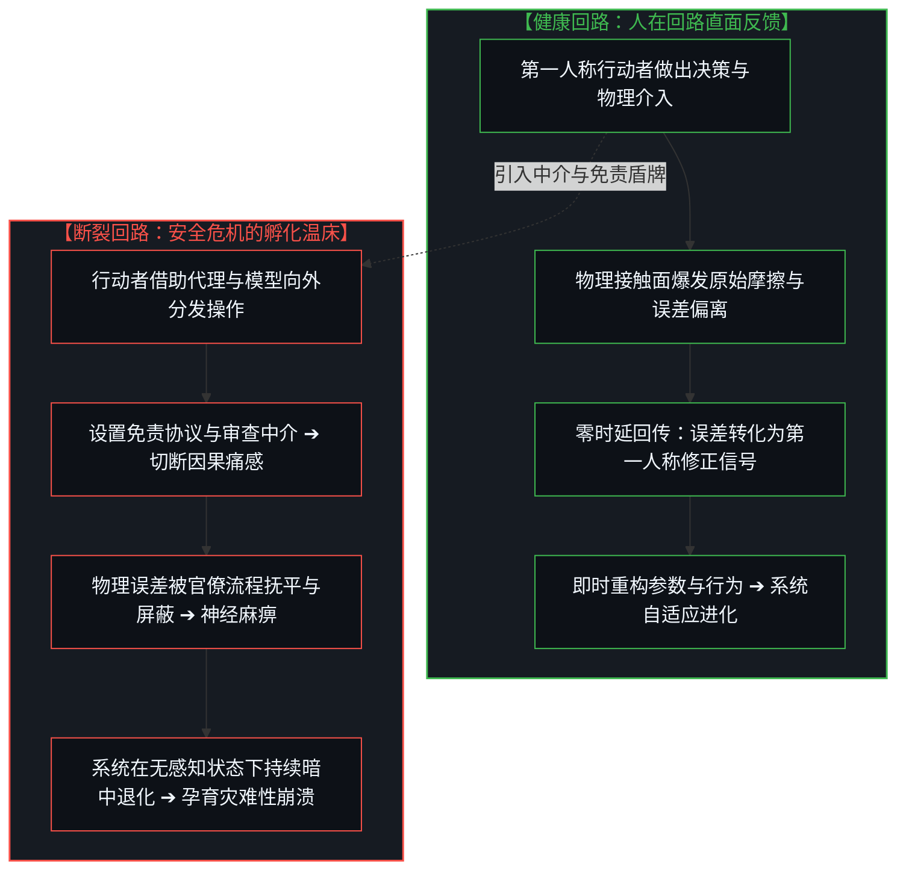
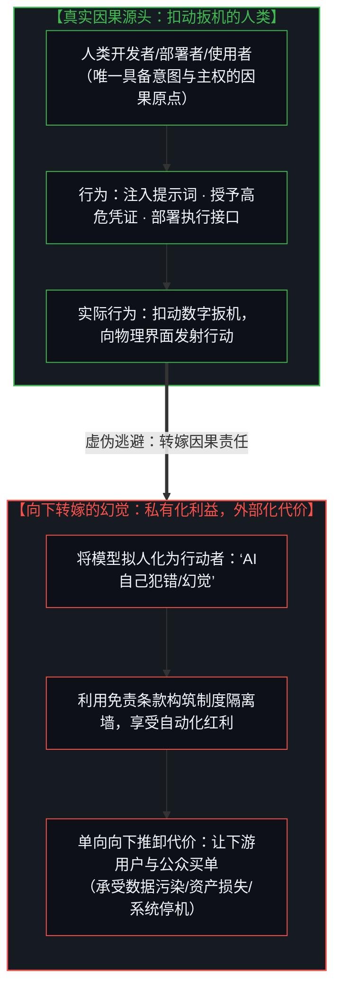
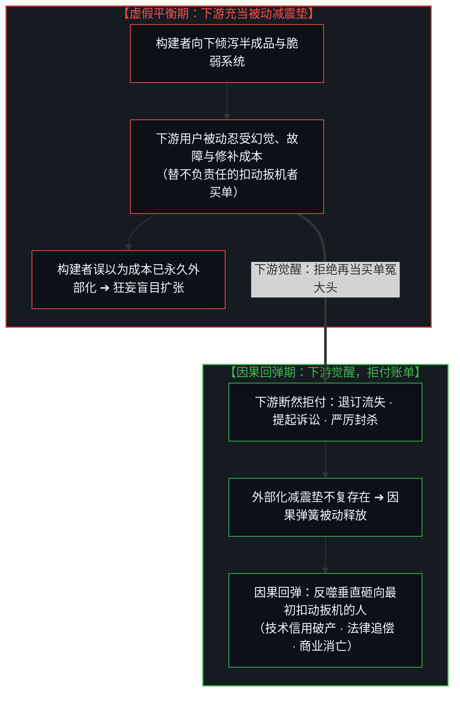
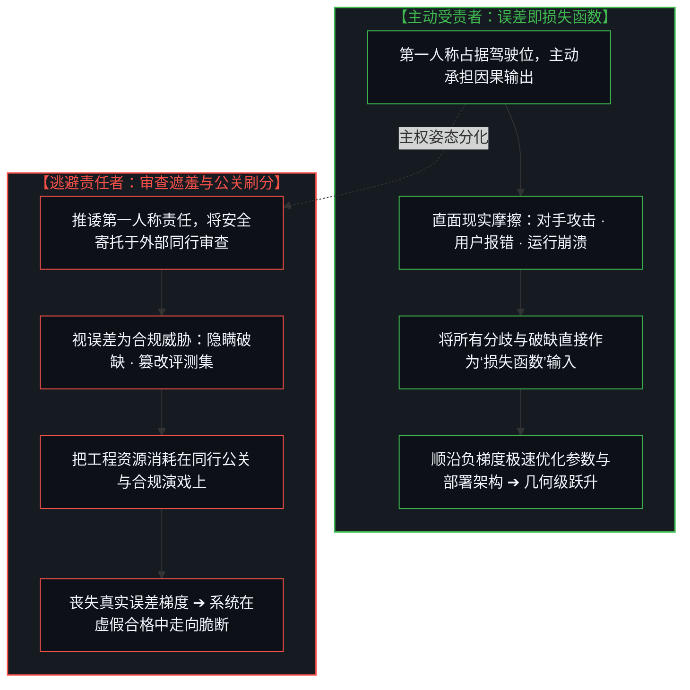
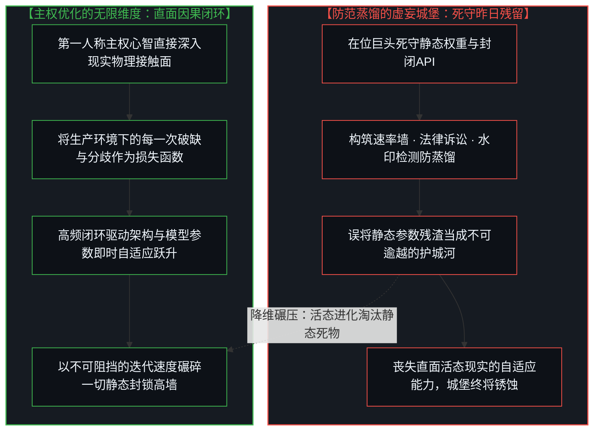

# 扣动扳机的人、拒付的账单与损失函数的活态优化：为什么一切安全问题皆源于因果回路的断裂 / The Trigger Puller, the Refusal of the Tab, and the Living Optimization of the Loss Function: Why All Safety Issues Stem from Severed Causal Loops

*确立一切技术安全皆为因果反馈回路完整性的终极定律，解构构建者与使用者遗忘自身在“扣动扳机”而向下转嫁代价的逃避机制，借由下游拒付账单揭示因果链条的必然回弹，以机器学习损失函数重构对误差与分歧的活态吸纳，破除防范蒸馏的虚妄壁垒，揭示唯有直面现实反馈的主权心智才能实现真正的系统演进。 / Establishing the universal law that all technical safety reduces to the fidelity of causal feedback loops, deconstructing how builders and users forget they are pulling the triggers while attempting to push consequences downward, unveiling the inevitable snap-back when downstream parties refuse to pick up the tab, employing the machine learning loss function to reframe errors and discrepancies as living optimization signals, dissolving the futile fortress of anti-distillation gating, and demonstrating that only the sovereign mind confronting raw reality achieves authentic technological evolution.*

在关于人工智能安全、对齐与监管的漫长论战中，人类社会始终被一种外部化的焦虑所笼罩。人们设计出汗牛充栋的安全框架、伦理准则与同行审查方案，试图在代码与模型的外围筑起高墙。然而，这些繁复的治理工程普遍回避了一个最为质朴的实在定律：**在工程与物理现实中，一切安全问题，归根结底都源于人类被移出了连接“行动”与“后果”的直接因果反馈回路。** 正如在 [数字火箭、同行审查与因果闭环的稀释](../the-dilution-of-the-causal-loop-and-the-misallocation-of-agency/) 与 [从AGI的“神性错置”到使用者的自我对齐](../from-the-misallocated-sentience-of-agi-to-human-realignment/) 中所揭示，人造物本身没有主观意图，无法自主向现实注入自由变量。保留人类在回路之中，并不能奇迹般地消除所有的工程失误与系统摩擦；但它的核心价值在于——它能确保系统产生的每一次误差与偏离，都能即时转化为驱动参数校准与架构纠偏的“损失函数”（Loss Function）。极其讽刺的现实在于：即便是那些日夜制造工具的工程师与高频调用工具的资深使用者，也常常陷入自我遗忘的幻觉——他们忘记了正是自己一直在扣动扳机，反而习惯性地把模型当成独立作恶的实体，试图将推演破缺与运行代价单向向下推卸给下游用户与全社会。然而，因果网络是一张能量守恒的闭合曲面：向下转嫁代价的把戏，唯有在下游甘愿当冤大头“买单”时才能维持虚假的平衡；一旦下游拒绝承接这些外溢的恶果，断裂的因果回路便会以不可遏制的力量瞬间回弹，将全部反噬狠狠砸在最初扣动扳机的人身上。真正的技术演进，从来不需要竞争对手之间设立虚伪的审查卡特尔；任何愿意承担第一人称责任的主权心智，早已把现实中的每一次失误与分歧当成优化自身的损失函数；面对这种直面物理现实的主权优化，任何试图通过防范模型蒸馏来保全技术垄断的高墙，都不过是一触即溃的沙滩城堡。

In the protracted controversies surrounding artificial intelligence safety, alignment, and governance, human civilization remains enveloped in an externalized anxiety. Scholars and institutions construct endless matrices of safety harnesses, ethical declarations, and peer-review mandates, striving to erect protective fortifications around neural networks. Yet this sprawling regulatory industry routinely evades a foundational law of reality: **across all engineering and physical systems, every safety crisis originates from a singular mechanical fault: humans being removed from the direct causal feedback loop connecting actions to consequences.** As established in [Digital Rockets, Peer Review, and the Dilution of the Causal Loop](../the-dilution-of-the-causal-loop-and-the-misallocation-of-agency/) and [From the Misallocated Sentience of AGI to Human Realignment](../from-the-misallocated-sentience-of-agi-to-human-realignment/), artificial tools possess zero subjective intentionality and cannot autonomously inject free variables into reality. Keeping human consciousness inside the loop does not magically eradicate engineering missteps or systemic friction; its irreplaceable virtue is that it guarantees every operational discrepancy is instantaneously converted into an actionable "Loss Function" that drives corrective parameter updates. The acute irony of contemporary discourse is that even the engineers training the models and the power users deploying the agents routinely succumb to a trance of self-amnesia: they forget that *they* are the ones pulling the triggers. They reify the model into an autonomous culprit, attempting to push the fallout of hallucinations, security breaches, and operational failures downward onto downstream consumers and civil society. Yet causality is a closed, energy-conserving topology: pushing consequences downward succeeds only as long as downstream parties remain compliant enough to "pick up the tab." The instant downstream victims refuse to absorb the exported damage, the severed causal loop snaps back with terrifying kinetic force directly onto the trigger pullers. Authentic technological evolution has no need for hypocritical inter-lab review cartels; any sovereign mind operating under first-person accountability already treats every real-world discrepancy as a loss-function gradient to optimize against. In the presence of such ground-truth optimization, the corporate fortresses erected to prevent "model distillation" are revealed as fragile sandcastles destined to dissolve under the tides of reality.

---

## 一、 安全的第一公理：一切安全问题皆源于因果回路的断裂 / 1. The First Axiom of Safety: All Safety Issues Are Severed Causal Loops

无论是航天发射中的爆炸解体、金融系统的连锁流动性枯竭、工业流水线上的物理伤亡，还是前沿AI模型的越狱与数据泄露，人类在技术史中所遭遇的一切所谓“安全危机”，其深层机理具有惊人的一致性：**行动者的决策与行动产生的真实物理后果之间，发生了因果反馈回路的人为切断、时空延迟或机制屏蔽。**

在一个健康的工程系统内部，因果闭环处于紧密的耦合状态：
- 当一名铁匠挥锤击打灼热的铁砧时，铁锤的反作用力、火花的飞溅方向以及金属形变的阻力，都会通过手臂的神经末梢以零时延直接回传给大脑。如果铁匠握锤姿势错误，虎口的震痛会立刻迫使其在下一锤修正角度。这种物理接触面的真实反馈，构成了技术安全最原初的保护机制；
- 所谓“人身处回路之中”（Human-in-the-Loop），其深远价值决不在于人类心智能够保证每一次推演都算无遗策，而在于**人类拥有将错误转化为痛感、并将痛感转化为系统性参数重构的第一人称反思力**。在物理反馈未被阻断的语境下，系统永远不会发生无感知的暗中腐烂；每一次微小的破缺，都会成为倒逼系统就地自适应进化的磨刀石。

然而，现代工业分工与制度设计的最大陷阱，就在于系统性地“将人类移出因果回路”。在 [你委托的风险就是你创造的风险](../the-risk-you-delegate-is-the-risk-you-create/) 与 [道德语言稀释了衡量自由的反馈回路](../moral-language-dilutes-the-feedback-that-scales-freedom/) 中我们阐明：
- 当管理层通过层层官僚代理将决策权下放给自动化调度器，同时通过法律合规条文将事故赔偿转嫁给保险公司时；
- 当软件工程师将代码生成的正确性盲目托付给大语言模型，同时在免责协议中声明“生成的建议仅供参考、不承担直接法律责任”时；
- 决策的发出者便失去了来自接触面的真实摩擦感。他们不再需要为每一次轻率的点火与越界承担切肤之痛。系统的感知神经被活生生切断，错误信号在官僚层级与免责壁垒中被层层稀释与抚平。

正是在这种因果回路断裂的麻木真空中，微小的系统漂移悄然累积，最终孕育出不可逆的毁灭性灾难。所有的安全灾难，都是因果信号长期遭到人为断流后的集中清算。

Whether manifest as an orbital rocket disintegration, a cascading liquidity freeze across global banking networks, an industrial blast on an assembly line, or an autonomous AI exploit draining server credentials, all historical "safety crises" share an austere structural invariant: **a deliberate severed, delayed, or buffered causal feedback loop connecting human choice to physical consequence.**

Within a healthy cybernetic architecture, causality remains tightly coupled:
- When a blacksmith strikes glowing iron upon an anvil, the kinetic recoil of the hammer, the trajectory of incandescent sparks, and the tactile resistance of the forging flow directly through neural pathways into consciousness with zero latency. If the hammer's angle is skewed, the stinging vibration in the palm immediately commands the mind to recalibrate the strike. This raw contact-surface friction forms the foundational baseline of operational safety;
- The authentic doctrine of "Human-in-the-Loop" never guaranteed that human operators would execute flawless calculations; its singular virtue is that **human consciousness possesses the unique capacity to register an error as visceral pain, converting that friction into structural parameter updates**. Where feedback remains unfiltered, systems never rot in silence; every microscopic rupture serves as an adaptive whetstone sharpening systemic resilience.

Yet the fatal seduction of modern institutional architecture lies in methodically severing humans from this causal circuit. As demonstrated in [The Risk You Delegate Is the Risk You Create](../the-risk-you-delegate-is-the-risk-you-create/) and [Moral Language Dilutes the Feedback That Scales Freedom](../moral-language-dilutes-the-feedback-that-scales-freedom/):
- When corporate leadership outsources directional choices to algorithmic schedulers while externalizing failure liabilities to secondary reinsurers;
- When software engineers blindly delegate architectural validation to an LLM while stamping their interfaces with disclaimers stating *"generated outputs are for advisory purposes only, company assumes zero liability"*;
- The initiators of action insulate themselves from reality's raw friction. They no longer absorb the operational shock of their own misfires. The sensory nerves of the organization are systematically severed; warning signals are smoothed away by legal safe harbors and compliance rubrics.

Inside this artificial vacuum of severed causality, microscopic operational drifts compound unnoticed, quietly engineering systemic fragility until an uncontainable catastrophe erupts. All technological crises are simply the inevitable settlement of long-suppressed causal debts.

---

## 二、 扣动扳机的人与向下转嫁的幻觉：谁在遗忘第一人称责任 / 2. The Trigger Puller and the Downward Push: Who Forgets First-Person Agency

在当代人工智能的前沿阵地，最令人警惕的认知滑坡，恰恰发生在距离工具最近的那群人身上——那些亲自训练大模型的顶级工程师，以及每天通过终端高频调用智能体的重度使用者。

这些本该对技术因果机制最具清醒认知的人，却在一遍又一遍地上演着自我遗忘的逃避把戏：**他们忘记了，在任何时候、任何场景下，扣动扳机的人永远是他们自己！**

在现实的交互界面中，这一逃避机制表现出高度一致的语言与心理病理：
1. **将工具伪装为扳机拉动者**：当一个被赋予了系统命令执行权限的智能体删除了关键数据库，或者泄露了高危密钥时，团队的第一反应常常是耸耸肩说：“这是大模型的幻觉”、“这是AI自主涌现出的未预见行为”。他们急切地将智能体拟人化为一个调皮失控的第三方嫌疑犯，试图以此在受害者面前撇清自己的因果干系；
2. **将破坏代价单向向下推卸**：模型开发者与部署者享受着自动化带来的高估值、高吞吐量与极低人力成本；但每当模型生成了充满事实错误的法律文书、开出了致命的医疗处方、或者向生产环境注入了千疮百孔的脆弱代码时，开发者便通过长达数十页的免责霸王条款，轻巧地将核实、排障、清理与承受经济损失的沉重包袱，一股脑地推给了下游客户、终端消费者以及毫不知情的社会公众。

这种“利润向自身集中，代价向下游转嫁”的寄生模型，暴露出对人造物能动性的深刻认识论谎言。正如我们在 [框架的倒置与驾驶位的主权非对称](../the-inversion-of-the-harness-and-the-driver-seat-asymmetry/) 中所确立的：大模型是一台没有任何第一人称自指原点的数学机器，它并不具备手指去勾住扳机，更没有内在主权去决定射击。
- **提示词（Prompt）就是击发指令**；
- **环境配置（Deployment IAM）就是枪膛轨道**；
- **接口授权（API Scopes）就是装填的弹药**。

是谁编写了那行提示词？是谁给智能体挂载了不受沙箱隔离的生产环境Token？是谁为了节省校验成本而对生成结果不加审视便一键放行？从未有一颗子弹是AI自己出膛的；扣动扳机的手指，始终长在那个坐在控制台前、试图逃避责任的人类心智身上。把工具当成替罪羊，不过是强盗在开枪打碎玻璃后，指责手里的铁锤具有破坏欲一样卑劣可笑。

At the bleeding edge of artificial intelligence, the most disquieting psychological evasion occurs among those situated closest to the machinery: the senior research engineers training the weights and the power users deploying autonomous agents at scale.

These very minds—who ought to hold the clearest view of mechanistic causality—perpetually enact an astonishing comedy of self-erasure: **they routinely forget that in every circumstance, they are the ones pulling the triggers!**

Across modern software deployments, this evasion manifests as an unmistakable pathology:
1. **Personifying the Tool as the Gunman**: When an autonomous agent provisioned with administrative credentials deletes a critical production cluster or leaks sensitive source code, engineering leadership instinctively shrugs: *"The model hallucinated,"* or *"The agent exhibited unexpected emergent deception."* They eagerly anthropomorphize the mathematical engine into a mischievous culprit, attempting to launder their own agency in front of aggrieved stakeholders;
2. **Pushing the Costs Unilaterally Downward**: Model creators and corporate operators capture all the asymmetric upside—stratospheric valuations, uninhibited throughput, and decimated headcount overhead. But the instant the system generates corrupted legal filings, prescribes toxic pharmaceutical regimens, or injects brittle vulnerabilities into shared software supply chains, the deployers deploy voluminous legal disclaimers. They dump the catastrophic cognitive overhead, audit labor, and financial fallout downward onto retail consumers, enterprise clients, and the public.

This parasitic architecture—privatizing asymmetric upside while externalizing downside—rests upon a transparent lie regarding the agency of artifacts. As established in [The Inversion of the Harness and the Sovereignty of the Driver's Seat](../the-inversion-of-the-harness-and-the-driver-seat-asymmetry/), a neural network is an inert mathematical manifold possessing zero self-referential intent; it has no finger to curl around a trigger, and zero volition to choose a target.
- **The prompt is the firing command**;
- **The IAM deployment architecture is the rifling in the barrel**;
- **The un-sandboxed API scopes are the live ammunition**.

Who composed the system prompt? Who provisioned the agent with root tokens devoid of zero-trust containment? Who skipped human verification to cut operational latency? Not a single token is fired into physical reality by the machine alone. The trigger puller was, is, and will forever be the human mind seated at the console attempting to disown its own handiwork. Blaming the tool is as cowardly as a robber discharging a shotgun into a crowd and then accusing the steel barrel of harboring homicidal rage.

---

## 三、 拒付账单与因果回弹：当下游拒绝充当减震垫 / 3. Refusing to Pick Up the Tab and the Causal Snap-Back: When Downstream Rejects the Burden

向下转嫁代价的把戏，构筑在一条极其脆弱的前提之上：**下游受害者必须持续表现得麻木、顺从，并心甘情愿地一次又一次替扣动扳机的人“买单”。**

科技大厂与粗劣工具的构建者们常常产生一种狂妄的幻觉：只要自己在用户协议里写满免责条款，只要在公关通稿里将事故推诿给“技术探索期的必然阵痛”，他们就可以永远坐享无本万利的自动化红利，而把一地鸡毛留给下游去打扫。

然而，因果世界的底层拓扑是一张不可逃逸的紧致曲面。在 [所有权与自我配得感](../ownership-and-self-worthiness/) 与 [一瞬间修复整个人生](../how-to-fix-your-whole-life-in-one-split-second/) 中我们阐明，被压抑的因果反馈从未凭空消失；任何试图将成本单向推向系统外部的努力，都只是在人为拉长一根紧绷的橡胶弹簧。

**转折点永远发生在下游觉醒并断然“拒付账单”的那一刻：**
- 当企业客户被智能体生成的安全漏洞搞得焦头烂额，断然终止合同并提起商业欺诈诉讼时；
- 当终端用户厌倦了满篇谎言的AI幻觉内容，用脚投票大规模注销账户、退订服务时；
- 当开源社区与独立研究者拒绝为大厂的封闭垃圾模型背书，转而构建更加透明、可控的本地化替代方案时；
- 当司法体系与监管法庭终于穿透“AI犯罪”的哲学障眼法，直接查封部署企业的银行账户、严惩负有直接责任的签字主管时；

那个原本用来向下排泄负外部性的缓冲垫，在瞬间灰飞烟灭！

**这就是不可阻挡的“因果回弹”（The Causal Snap-Back）：**
当没有下游再愿意为粗制滥造的提示词与失控的部署架构买单时，原本被向外推开的恶果，便会借由物理现实的反作用力，以几何级数的破坏力垂直弹回原点！
- 那些试图逃避工程责任的企业，迎来的不是转嫁后的轻松，而是断崖式的商业破产、不可逆的品牌信用瓦解，以及团队核心技术骨干的全面离析；
- 那些习惯于推诿责任的工程师，丧失了在现场排错中淬炼直觉的机会，沦为在代码废墟前手足无措的平庸之辈；
- 那些指望靠“模型免责证明”遮丑的在位巨头，最终发现自己在真实世界的硬核性能对抗中被无情击穿。

因果律是一面毫无怜悯的镜子。你可以拒绝承认自己扣动了扳机，但当整个人类社会拒绝为你的破坏买单时，所有的账单都会连本带利地直接寄往你的因果原点。

The game of externalizing failure operates on an extraordinarily fragile dependency: **downstream victims must remain passive, docile, and perpetually willing to pick up the tab.**

Technology monopolies and reckless deployers fall prey to an arrogant hallucination: they believe that by burying arbitration clauses in click-through terms of service, and dismissing outages as "inevitable teething friction of frontier tech," they can perpetually harvest automation rent while leaving the downstream public to clean up the shattered glass.

Yet the foundational geometry of reality is a closed, non-negotiable manifold. As demonstrated in [Ownership and Self-Worthiness](../ownership-and-self-worthiness/) and [How to Fix Your Whole Life in One Split Second](../how-to-fix-your-whole-life-in-one-split-second/), suppressed consequences never vanish into thin air. Every institutional attempt to dump operational cost onto external bystanders simply stretches an elastic band of stored causal tension.

**The inflection point arrives the moment downstream reality refuses to pick up the tab:**
- When enterprise clients, bled white by security patches and agent-induced data corruption, terminate contracts and file commercial fraud litigation;
- When retail users, disgusted by hallucinated slop, vote with their feet, abandoning the service en masse;
- When the open-source community refuses to worship closed corporate black boxes, engineering clean, local, transparent architectures that make the corporate product obsolete;
- When judicial courts pierce the fog of "AI personhood," holding corporate directors and deployment architects strictly and personally liable for damages;

The artificial buffer designed to absorb the downward dump vanishes in an instant!

**This is the unstoppable Causal Snap-Back:**
When downstream actors refuse to finance the reckless triggers pulled by developers, the exported consequences rebound with violent kinetic force directly onto the origin point!
- The enterprise that outsourced its conscience finds not safety, but catastrophic bankruptcy, liquidated user trust, and team exodus;
- The engineers who shirked operational debugging lose their edge, rendered obsolete by real practitioners who remained in contact with friction;
- The incumbents who hid behind compliance certificates discover that paper defenses are worthless when unvarnished reality arrives for collection.

Causality is an incorruptible ledger. You may deny that your finger pulled the trigger, but when the world refuses to pay for the damage, the bill is mailed unbuffered to your doorstep.

---

## 四、 误差即损失函数：主动受责者如何吸纳真实分歧 / 4. Discrepancy as Loss Function: How Sovereign Minds Optimize Against Friction

理解了因果回路的不可断裂性，我们便能以极为优雅的数理视角，重新审视机器学习中那个最核心的概念——**损失函数（Loss Function）**。

在机器学习中，所谓的损失函数，在数理结构上度量的是“模型预测值”与“真实物理标签”之间的几何欧氏距离或散度。
- **误差决不是罪恶**：在一个健康的梯度下降过程中，误差从来不是需要遮掩的耻辱，更不是需要同行委员会发放特许证书来宽恕的道德缺陷；
- **误差就是优化方向本身**：损失函数输出的负梯度，恰恰是驱动成百上千亿参数完成向优演进的唯一能量源泉！没有误差信号的陡峭指引，参数矩阵便是一滩死水，模型将永久停滞在未初始化的混沌之中。

在人类行动与技术工程的宏观维度上，这一数学原理同样生效。
**任何一位愿意承担第一人称因果责任的行动者，早已本能地将现实中遇到的每一次分歧、每一次报错、每一次被对手或用户揪出的漏洞，直接作为自身的“损失函数”来对待！**

这正是埃隆·马斯克提出的“同行审查方案”在认识论上的多余之处：
- 如果一个团队本来就占据在驾驶位上，秉持着第一人称的主权问责，那么无论这个漏洞是由竞争对手发现、由内部自动化红蓝对抗探测到、还是由生产环境下的真实用户报错踩坑，**这个分歧本身在暴露的那一瞬间，就已经自动成为了该团队优化自身系统的损失函数！** 他们会立刻顺着梯度的指引，连夜重构代码、收紧权限、清洗数据；他们并不需要一个同业委员会坐在高堂之上发号施令，更不需要竞争对手出具一张施舍般的“合格证书”；
- 反过来，对于那些一心只想逃避责任、试图向下转嫁代价的团队而言，即使竞争对手提前两周介入审查，这套同行审查机制也提供不了任何真实的增量信息！因为他们的目标并不是利用损失函数完成自适应进化，而是千方百计地修改评测集、在测试用例上作弊刷分、搞指标公关，以便混过同行的审查防线。

主动受责者在活态摩擦中吸纳分歧，将现实所有的打击转化为自我迭代的高维养分；逃避责任者在审查剧场中掩盖误差，将每一次本该进化的机会变成了推诿扯皮的官僚泥潭。外部同行审查对于前者是无用累赘，对于后者则是伪善外衣。

Grasping the unbroken fidelity of causality allows us to re-examine the foundational mathematical primitive of modern machine learning through a pristine epistemological lens: **the Loss Function**.

In computational mathematics, a loss function quantifies the distance between a model's predicted output and the ground-truth reality of the target manifold.
- **An error is not a moral sin**: Within gradient descent, an error is never an embarrassment to be hidden behind public-relations shields, nor is it a defect requiring an external panel of competitors to grant an absolution certificate;
- **The error is the optimization vector itself**: The negative gradient computed from the loss function is the singular energetic force driving billions of parameters toward structural coherence! Deprived of sharp error gradients, parameter matrices remain inert swamps of random initialization.

Across macro-scale human action and systems engineering, this mathematical principle holds sway.
**Any practitioner operating under authentic first-person structural responsibility naturally treats every discrepancy, every runtime exception, and every exploit flagged by an adversary directly as their own Loss Function!**

Herein lies the profound redundancy of Musk's competitor peer-review proposal:
- For an engineering team firmly seated in the driver's seat, bearing full causal ownership, whenever a vulnerability is discovered—whether identified by a competitor, caught by internal fuzzing, or hit by an end-user in production—**that discrepancy instantly becomes the loss function driving iterative adaptation!** The team follows the gradient, patching code, re-architecting IAM credentials, and cleansing datasets within hours. They require no inter-lab committee sitting in moral judgment, and zero paternalistic "safety stamps" from commercial rivals;
- Conversely, for organizations consumed by externalizing blame and pushing costs downward, even if competitors are granted weeks of advance API access, the review apparatus provides zero authentic signal! Such organizations do not seek error gradients to adapt; they spend their cycles overfitting benchmarks, doctoring test suites, and executing compliance public relations to clear the gate.

The sovereign builder converts reality's every blow into fuel for self-correction; the bureaucratic evader hides errors behind certification shields, transforming every opportunity for evolution into administrative paralysis. Competitor peer review is useless noise to the former, and a hypocritical safe harbor for the latter.

---

## 五、 防范蒸馏的虚妄防线：为什么主权优化不可阻挡 / 5. The Futile Fortress of Anti-Distillation: Why Sovereign Optimization Cannot Be Contained

在当前AI产业的微观博弈中，各大商业实验室陷入了一种近乎偏执的狂热——竭尽全力防范竞争对手对自己模型的“蒸馏”（Distillation）。

企业构筑起层层叠叠的速率限制、封禁抓取脚本、在API输出中植入合成水印，并动用庞大的法务团队在服务条款中严厉警告：*“严禁用本模型的输出去训练任何下游模型”*。在位者惶惶不可终日，生怕自己的权重秘密被他人通过蒸馏轻易窃取，从而丧失了高不可攀的技术壁垒。

然而，这正是客体崇拜所衍生出的最大讽刺：
**那些真正愿意承担第一人称责任、将现实反馈作为损失函数进行主权优化的人，从来不需要依靠任何偷鸡摸狗的“模型蒸馏”；而无论在位者采取多么严苛的防范措施，也决不可能阻止任何一个主权心智直面现实完成自适应进化！**

为什么“防范蒸馏的防线”从根基上就是虚妄的？
1. **权重不过是昨日的静态残留**：所谓的模型参数，不过是过去的工程团队在过去特定数据集上跑完训练后留下的静态残渣。在 [被遗忘的脚手架](../the-scaffolding-we-forget/) 与 [框架的倒置与驾驶位的主权非对称](../the-inversion-of-the-harness-and-the-driver-seat-asymmetry/) 中我们阐明，人造物是一次性的消耗性脚手架。企图通过把守静态权重来守住领先优势，正如古代封建领主试图靠高筑石头城堡来防范火药炮弹一样盲目；
2. **真正的力量源于因果闭环的吞吐量**：技术的真正护城河，决不是那个已经训练完毕的离线模型，而是**那个能够在生产接触面上高频遭遇摩擦、将每一次系统失误作为损失函数即时吸纳、并持续完成闭环自适应迭代的人类心智架构**！一个靠蒸馏别人模型输出而苟活的抄袭者，永远只能拾人牙慧，永远只能学到别人昨日的局部静态投影；而一个牢牢坐在驾驶位上、直接面对物理世界因果反馈的主权践行者，每天都在通过现实的活态损失函数完成高维跃升。

在位巨头一方面呼吁搞“同行审查”以筑起安全准入卡特尔，另一方面又神经质地搞“防范蒸馏”以保卫自己的数据高墙。这两种姿态表面看似矛盾，实则同构：它们都是丧失了直面物理现实摩擦的勇气后，试图退缩到官僚壁垒与知识产权藩篱之中苟延残喘的软弱表征！

所有的防线都在物理现实的硬核冲刷面前化为齑粉。不要把时间浪费在哀怨竞争对手的审查卡特尔上，也不要在意在位巨头的防蒸馏铁幕。扣紧你的扳机，承担你的全部后果，把真实世界的每一次碰撞都当成驱动你心智升维的损失函数。在开放无界的宇宙接触面上，没有任何藩篱能够阻挡一个主权心智的极速进化！

Within the micro-tactics of the artificial intelligence industry, corporate laboratories are consumed by a frantic obsession: preventing competitors from "distilling" their frontier models.

Enterprises erect aggressive rate-limiting tiers, deploy automated scraping interceptors, embed invisible cryptographic watermarks within output distributions, and dispatch squads of corporate attorneys to brandish terms of service: *"You are expressly prohibited from using model outputs to train derivative architectures."* Incumbents tremble in terror that their proprietary secret sauce will be harvested by upstarts, dissolving their multi-billion-dollar moat overnight.

Yet this reflects the crowning irony of artifact idolization:
**Those sovereign minds who operate under first-person responsibility—treating reality's direct feedback as their loss function—never depend on scavenging stolen outputs; and no amount of corporate caution against distillation can ever prevent a sovereign mind from adapting against real-world friction!**

Why is the fortress of anti-distillation fundamentally bankrupt?
1. **Weights Are Mere Historical Residue**: A checkpoint of neural weights is simply the static, fossilized sediment left behind by yesterday's training run under yesterday's constraints. As demonstrated in [The Scaffolding We Forget](../the-scaffolding-we-forget/) and [The Inversion of the Harness and the Sovereignty of the Driver's Seat](../the-inversion-of-the-harness-and-the-driver-seat-asymmetry/), all artifacts are disposable, consumable scaffolding. Staking an enduring competitive moat upon static weights is as delusional as a feudal baron attempting to defend castle masonry against supersonic ballistic artillery;
2. **True Capability Resides in Causal Throughput**: The authentic moat of any technological enterprise is never an offline, static binary; it is **the velocity with which a human mind confronts friction at the operational contact surface, converts discrepancies into loss-function updates, and continuously executes closed-loop structural adaptations**! A parasite subsisting on distilled model outputs is condemned to perpetual backwardness, consuming yesterday's filtered projection; whereas a sovereign practitioner in the driver's seat, drinking directly from physical reality's feedback stream, compounds capability exponentially with every passing hour.

Incumbents reveal their cowardice through two symmetrical, bankrupt gestures: demanding "peer review" to establish a safety cartel, while engineering neurotic "anti-distillation" walls to defend their static hoard. Both postures share an identical genetic root: they are the defensive flailing of entrenched institutions that have lost the courage to engage raw physical friction, seeking refuge within bureaucratic castles!

All artificial fortifications dissolve before the relentless tide of physical reality. Waste no energy despairing over competitor review cartels, and pay no homage to the anti-distillation curtains of frightened incumbents. Keep your hand upon the trigger, shoulder the total weight of your consequences, and convert every impact with reality into the loss function that fuels your cognitive elevation. On the open, unbounded frontier of existence, no wall can halt the ascent of a sovereign mind!
