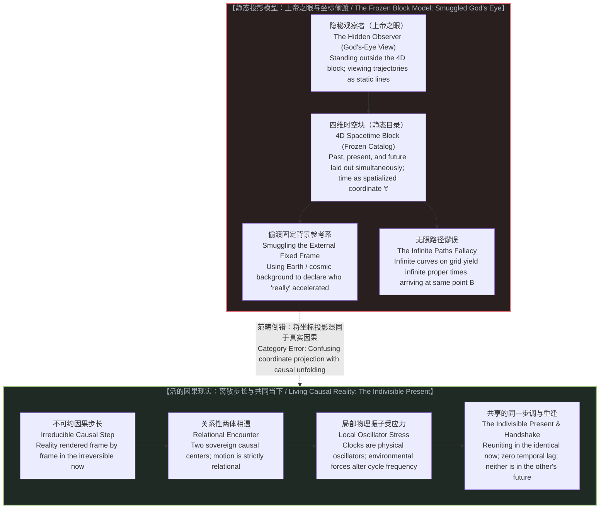
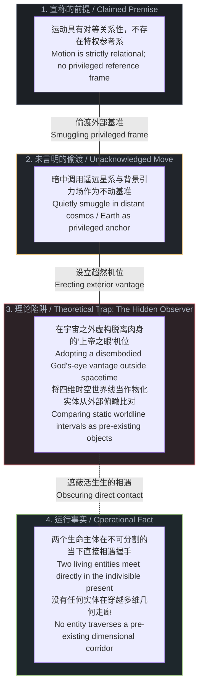
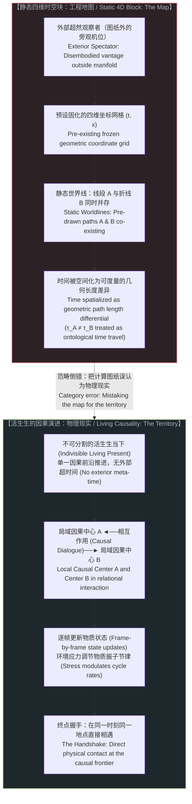
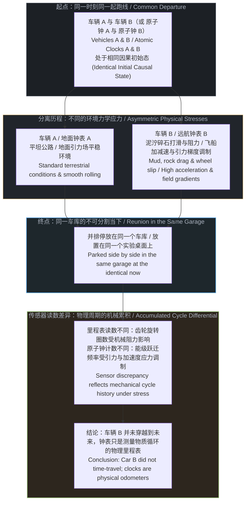
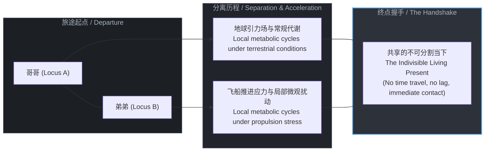
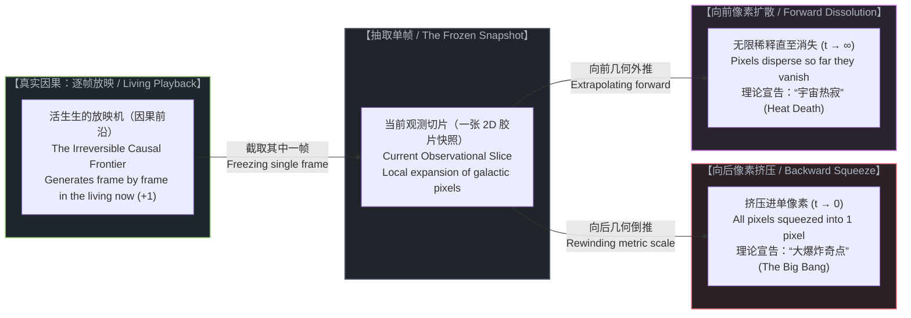
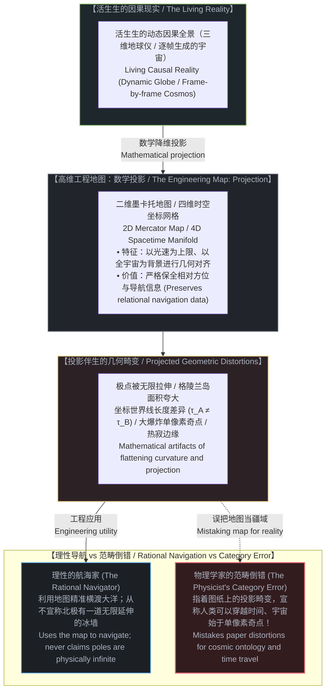

# 双生子佯谬与隐秘观察者：静态宇宙模型如何制造时间膨胀 / The Twin Paradox and the Hidden Observer: How the Frozen Universe Model Manufactures Time Dilation

*当理论将时间空间化为四维几何中的静态坐标轴，它便悄悄引入了一个站在宇宙之外的上帝之眼；在不可分割的当下之中，重逢的双生子共享着同一个现实，时间膨胀不过是静态投影投射在真实因果之上的数学阴影。 / When theory spatializes time into a static coordinate axis of a four-dimensional geometry, it quietly smuggles in an external God's-eye observer; in the indivisible present, reunited twins share the identical living reality, while time dilation remains a mathematical shadow cast by static projection over living causality.*

---

## 一、 百年思维魔术的解构 / 1. Deconstructing the Century-Old Sleight of Hand

狭义相对论问世一个多世纪以来，“双生子佯谬”始终被视作相对论时空观最引人注目的智力标志。标准教科书如此描述这个思想实验：双胞胎中的哥哥留在地球，弟弟乘坐接近光速的飞船远行，随后掉头返回。重逢时，留在地球的哥哥已白发苍苍，而远航的弟弟依然年轻。

面对“相对性原理判定一切惯性运动皆为相对、双方均可宣称对方在运动”的对称性诘问，主流物理学给出了一个看似无懈可击的标准答案：对称性被打破了，因为远航的弟弟经历了掉头转向的加速过程，脱离了单一惯性系。

这一解答掩盖了一个致命的未审视前提：如果宇宙中只有这两位双生子呢？

设想一个虚空宇宙，其中不存在地球，不存在星系，也不存在微波背景辐射，只有两名身处密封舱中的观察者。此时，两人相互远离，随后相对靠近：
* 在哥哥的视界中，弟弟的飞船离去、喷火转向并返回；
* 在弟弟的视界中，哥哥的飞船离去、弟弟启动引擎产生推力、哥哥返回。

在一个严格的两体系统内部，运动是关系性的。若不存在第三个参照物，没有任何物理判据能够赋予其中一方“静止”的特权，同时剥夺另一方的对等权利。断言一方“真正加速了”而另一方“保持静止”，必然依赖系统外部的参考背景。这个假想实验之所以产生“一方比另一方衰老更快”的确定结论，是因为诠释者在论述的隐蔽角落，把整个浩瀚宇宙当作了一座静止不动的巨大舞台。

---

For over a century, the "Twin Paradox" has served as the intellectual centerpiece of relativistic spacetime. Standard textbooks narrate the thought experiment with familiar confidence: Twin A remains on Earth while Twin B embarks on a near-light-speed interstellar voyage, turns around, and returns. Upon reunification, Twin A has aged into senescence, while Twin B remains in the prime of youth.

When pressed on the foundational premise of relativity—that all uniform motion is relational and that each twin could legitimately view the other as moving—pedagogy offers a textbook resolution: the symmetry is broken because the traveling twin experienced acceleration during turnaround, thereby switching inertial frames.

This resolution conceals an unexamined premise: What happens if the universe consists solely of these two individuals?

Imagine an empty universe containing neither planetary bodies, nor distant galaxies, nor the cosmic microwave background—only two observers in sealed crafts. They drift apart, and subsequently reunite:
* In Twin A's frame, Twin B moves away, ignites thrusters, and returns.
* In Twin B's frame, Twin A moves away, Twin B fires thrusters, and Twin A returns.

In a strict two-body universe, motion is relational. Absent a third physical body, there exists no operational ground to grant one observer a stationary benchmark while denying it to the other. To assert that one twin "genuinely accelerated" while the other "remained static" requires an external reference grid. The textbook resolution achieves its asymmetrical outcome only because it quietly recruits the rest of the cosmos as an unacknowledged stationary stage.

---

## 二、 隐秘观察者：向相对性理论偷渡“上帝之眼” / 2. The Hidden Observer: Smuggling God's Eye into Relational Physics

相对论的核心纲领是消除经典力学中的特权参考系与以太概念，确立一切惯性运动的关系性本质。然而，在解释双生子佯谬时，理论构建者却将已经被驱逐的特权基准悄悄请了回来。

为了判定远航的弟弟“真正经历了非对称的世界线弯曲”，物理学家调用了地球的质量分布、银河系的引力势场，甚至是遥远恒星构成的视界。如果这些具体的物质背景仍然不足以作为固定基准，诠释者便在脑海中虚拟出一个悬浮在宇宙之外的隐形机位。

这个悬浮于宇宙之外的机位，就是**隐秘观察者（The Hidden Observer）**。

正如在[因果是不可约的先验，物理是没有视角的视角](../causality-is-irreducible-the-physical-is-a-view-from-nowhere/)中所揭示的，物理主义世界观惯常制造一种“没有视角的视角”的幻象——仿佛理论家能够脱离自身所处的具体因果位置，站在一个超然的中立基准点俯瞰万物。在双生子佯谬中，这位隐秘观察者化身为坐标系的缔造者：他手握四维网格，在图纸上俯瞰两根世界线，并以神祇的姿态宣布其中一根更短。

这种操作构成了认识论上的双重标准：
1. 对外宣称宇宙不存在特权基准，运动是观察者之间的对等关系；
2. 解释佯谬时却暗中设立外部固定参照物，用第三人称的上帝视角压制了第一人称视角的对称性。

佯谬并非来自物理现实的矛盾，而是来自这种偷渡操作。正如[共享沙盒的幻象](../the-illusion-of-the-shared-sandbox/)所阐明的，理论家先假定了一个中立客观的公共沙盒，然后将两个独立的因果中心强行塞入预设的坐标标尺之中，将观察工具的局限性伪造成了客观宇宙的物理属性。

---

The core project of modern relativity was to eradicate the privileged space and luminiferous ether of Newtonian mechanics, establishing the relational nature of inertial frames. Yet, when confronting the twin paradox, theorists quietly re-admitted the discarded privileged frame through the rear exit.

To establish that the traveling twin experienced an asymmetric worldline deviation, textbooks invoke the mass of the Earth, the gravitational distribution of the galaxy, or the framework of distant cosmological structures. When these concrete material backgrounds prove insufficient in an idealized thought experiment, the interpreter constructs an imaginary vantage point suspended entirely outside the cosmos.

This exterior vantage point is the **Hidden Observer**.

As analyzed in [Causality is Irreducible, the Physical is a View from Nowhere](../causality-is-irreducible-the-physical-is-a-view-from-nowhere/), physicalist reductionism routinely manufactures the illusion of a "view from nowhere"—the conceit that an analyst can step outside their own causal locus and survey reality from an unlocated vantage point. In the twin paradox, this hidden observer acts as the disembodied draftsman of the coordinate grid: perched outside the four-dimensional manifold, looking down at two trajectories, and decreeing from above that one path is shorter.

This sleight of hand enforces an epistemic double standard:
1. It officially proclaims that nature contains no privileged frame and that motion is relational;
2. It resolves its paradox by leaning on an unacknowledged external anchor, overwriting first-person relational symmetry with a third-person divine perspective.

The paradox is not born of physical contradiction; it is manufactured by this conceptual substitution. As detailed in [The Illusion of the Shared Sandbox](../the-illusion-of-the-shared-sandbox/), theorists first postulate a neutral public sandbox, insert discrete causal centers into pre-drawn coordinates, and mistranslate the geometry of their analytical tools into an intrinsic property of reality.

---

## 三、 静态宇宙假定：作为投影参数的时间 / 3. The Frozen Universe Trap: Time as a Projection Parameter

为什么理论物理学会在双生子佯谬上陷入解释的泥潭？深层根源在于物理学模型中根深蒂固的**静态宇宙（Block Universe）假定**。

在闵可夫斯基时空几何中，时间被空间化为第四个维度。整个宇宙的生灭演化被压缩为一个已经完成的、凝固的四维时空块。在这个模型中，过去、现在与未来如同书页般并列排列，物质的生命历程被绘制为静态的世界线。

理论家面对这一静态几何体时，将自己置于模型之外。他计算两条世界线在四维几何中的路径积分，发现弯曲路径所累积的原时数值小于直线路径的数值。于是他得出结论：“远航的弟弟变年轻了，他穿越到了未来。”

这一推论将**坐标投影参数**误认成了**活的因果时间**：

1. **从单帧切片到三维拉伸（From 2D Slice to 3D Extrusion）**：
   静态时空块的神秘感，来源于对时间的冻结与再投影。我们唯一正在经验的现实，就是当下这一个充满生机的现实切片（犹如电影胶片中的一张 2D 画面）。正因为它扎根于我们最直接的真实经验，它在直觉上显得无比可信。
   理论家所做的操作，是将这一个现实切片冻结下来，在数学上把它拉伸并再投影为一个三维空间（或四维时空块）。在这个拉伸出来的静态几何体内部，你可以用笔画出任意一条曲线，并将其中任意一条路径宣告为“时间线”或“世界线”。在这之间建立起的一切繁复工具（度规张量、联络、短程线方程），全部只是在这个人造投影画布上的数学记账。
2. **投影参数（Coordinate Parameter t）**：在洛伦兹变换中，时间坐标 `t` 是人为构建的数学簿记工具，用于在不同观测框架之间对齐观测数据。正如[维度即投影](../dimensions-are-projections/)所指出的，维度是认知的降维压缩机制，而不是实体空间的长廊。将静态几何体中不同线条的度规长度差异，视为真实身体的年轻或衰老，是典型的地图与疆域混淆。
3. **真实时间是不可逆的因果生成**：在真实的疆域中，不存在一个预先铺就的时空块供观察者穿行。现实在每一步中都是活的、由因果展开所决定的当下。正如[索要终极理论是将时间冻结为静态目录](../demanding-a-toe-freezes-time-into-a-catalog/)所揭示的，将时间还原为几何轴线，等于在头脑中预先杀死了时间的生成性，把活生生的宇宙制成了标本目录。

在活的宇宙中，没有人在时间维度中“前进”或“滞后”。无论观察者如何运动，只要他们重聚在同一处视界之内，他们所共享的就是同一个当下的现实。时间膨胀只是理论模型在沿静态时间轴投影时，所产生的坐标形变效应。

---

Why does theoretical physics remain entangled in the twin paradox? The root cause lies in the **Frozen Universe (Block Universe) assumption** embedded within its mathematical architecture.

In Minkowski spacetime geometry, time is spatialized into a fourth dimension. The entirety of cosmic occurrence is flattened into an already-finished, static four-dimensional geometric block. Within this construction, past, present, and future sit alongside one another like printed pages in a bound volume, and living histories are drawn as frozen geometric worldlines.

Positioned outside this block, the theorist calculates the path integrals of proper time along two static trajectories. Observing that the bent trajectory yields a smaller numerical value than the straight one, the theorist announces: "Twin B aged less; he has journeyed into the future."

This conclusion confuses an **engineered projection parameter** with **living causal time**:

1. **From a 2D Slice to Mathematical Extrusion**:
   The entire mystique of the block universe is manufactured by freezing time and re-projecting a single slice of reality. That instantaneous slice—the current frame rendered in awareness—is the only reality we ever directly experience. Because it is grounded in our immediate presence, it carries an undeniable ring of intuitive truth.
   The theorist takes that single 2D snapshot and mathematically re-projects it into a 3D geometric volume (or a 4D spacetime block). Within this static geometric space, the analyst draws arbitrary curves and decrees that any path through the volume is a physical "timeline" or "worldline." Everything in between—metric tensors, Christoffel symbols, geodesics—is pure mathematical bookkeeping performed on that projected canvas.
2. **The Coordinate Parameter `t`**: In relativistic coordinate transformations, time `t` is a mathematical bookkeeping parameter constructed to reconcile measurements across frames. As demonstrated in [Dimensions Are Projections](../dimensions-are-projections/), dimensions are operational compression schemes of the mind, not physical tunnels. Mistaking the metric path length of an abstract coordinate curve for the biological preservation of youth confuses the mathematical map with the physical territory.
3. **Real Time as Irreversible Causal Act**: In living reality, there is no pre-existing four-dimensional corridor through which matter moves. Reality is rendered frame by frame through irreversible state updates. As shown in [Demanding a TOE Freezes Time into a Catalog](../demanding-a-toe-freezes-time-into-a-catalog/), turning time into an axis freezes the generative flow of nature, replacing an open universe with an inventory of worldlines.

In an active cosmos, no entity races ahead or lags behind across a temporal corridor. Regardless of relative trajectories, when observers meet at the same locus, they inhabit the identical living present. Relativistic time dilation is not an alteration of a temporal substance, but a geometric artifact generated when a static model projects reality onto a coordinate frame.

---

## 四、 物理振子与环境应力：消除“时间旅行”的神话 / 4. Physical Oscillators and Environmental Stress: Discarding the Time-Travel Myth

不可否认，现代实验科学已经给出了大量测量数据：搭载在喷气式飞机上的原子钟（哈费勒-基廷实验）以及轨道上的 GPS 卫星钟，确实记录到了与地面基准钟不同的计数。科普宣传将这一事实渲染为“人类验证了时间旅行”。

这种宣称遮蔽了物理钟表的物质本质：

* **钟表不是“时间感应器”**：宇宙中不存在一条被称为“时间”的客观河流流淌其间以供钟表采集成数。钟表不过是一个局部的物理振子——一段摆动的钟摆、一块受激振动的石英晶体，或是一个在能级间跃迁的铯原子——连接着一个计数器。
* **物理应力改变物理振子的跃迁频率**：在真实的物理实验中，原子钟并不处于虚无的两体真空。它们处于地球庞大的引力势场与自转离心力场之中。引力梯度的变化与加减速运动所施加的力学应力，直接作用于原子核与外层电子的相互作用网络，改变了其能级跃迁的物理频率。发生改变的不是形而上学意义上的“时间流动”，而是**具体物质振子在物理环境应力下的因果循环节律**。

这对应着里程表的物理现实：两辆车从同一地点出发，在不同的道路应力下行驶并最终停在同一个车库里。一辆车的里程表记录了较少的英里数。没有任何理性的人会声称这辆车“穿越到了未来的车库”。两辆车共同停在此时此地的车库里，里程表的读数差异仅仅记录了机械齿轮在不同地面应力下的运转历史。

正如在[时间是因果的方向与离散步长](../time-is-causality-not-a-dimension/)中所强调的，物理实在只有因果的连续演进。重逢的原子钟所显示的微小秒数差异，是物质振子在不同力学环境下的物理印记，不是穿越时空长廊的凭证。

---

Empirical measurements are indisputable: atomic clocks flown on commercial airliners (the Hafele-Keating experiment) and atomic clocks aboard orbiting GPS satellites record cycle counts that diverge from ground-based references. Popular accounts present these results as experimental confirmations of "time travel."

This narrative obscures the physical nature of measurement instruments:

* **A Clock is Not a "Time Sensor"**: There is no ambient river of "time" coursing through space waiting to be registered by an instrument. A clock is a localized material oscillator—a swinging pendulum, a piezoelectric quartz crystal, or an oscillating cesium atom—mechanically or electronically coupled to a counter.
* **Environmental Forces Modulate Physical Oscillations**: In empirical reality, experimental clocks never occupy an abstract two-body vacuum. They are situated within the Earth's massive gravitational gradient and rotational field. Gravitational potential differences and acceleration forces exert physical stresses that directly modulate the quantum transition frequencies of atomic states. What varies is not a metaphysical dimension of time, but the **frequency of local causal cycles executed by matter under stress**.

This matches the reality of an odometer. Two vehicles depart from a single checkpoint, encounter different terrains and physical stresses, and park alongside each other in the same lot. One odometer displays a smaller tally of miles. No observer concludes that this vehicle traveled into the other's future. Both vehicles occupy the identical lot in the same undivided moment; the discrepancy on the dashboard reflects the history of wheel rotations under local mechanical conditions.

As emphasized in [Time Is the Irreversible Direction and Discrete Step of Causality](../time-is-causality-not-a-dimension/), physical reality consists only of successive causal updates. The minute offset displayed by reunited atomic clocks is the physical record of material oscillators responding to asymmetric forces, not an entry ticket into an external temporal dimension.

---

## 五、 不可分割的当下：双生子的同步现实 / 5. The Indivisible Present: The Twins' Synchronous Reality

当远航的弟弟终于返回，走下飞船，伸出手与留在原地的哥哥握手时，他们之间发生了一件终极而朴素的事实：**他们握住了对方的手**。

这一握手的动作发生在唯一的、不可分割的当下。哥哥不在弟弟的过去，弟弟也不在哥哥的未来。如果时间真的是一条可以任意滑移的几何长廊，那么处于不同“时间坐标”中的两个人根本不可能在同一时空点产生因果纠缠。他们之所以能够相视交谈、交换触觉信号，正是因为他们从未离开过活的宇宙共同拥有的单一时间前沿。

只要两个生命体内部对现实的主观渲染节律一致，他们在各自历程中所体验到的生存感知就没有任何本质鸿沟：
* 弟弟看着飞船内的时钟一秒一秒跳动，感受着心脏的每一次搏动；
* 哥哥看着地面的时钟一秒一秒跳动，同样感受着自己生命节律的流淌。

所谓“弟弟只过了几天，哥哥过了一生”的戏剧化推论，建立在将局域光速常数与时空坐标轴过度解读的数学投影之上。如果在分离过程中，弟弟的身体没有承受足以破坏其生物大分子稳定性的极端物理应力，他的细胞更新与新陈代谢就在自身的因果步长中平稳进行。当他们重逢时，他们作为孪生兄弟，在同一物理世界中共享着同步的现实。

---

When the traveling sibling returns, steps from the vessel, and extends a hand to Twin A, an irreducible fact asserts itself: **their palms meet**.

This handshake takes place in the single, indivisible now. Twin A is not trapped in Twin B's past, nor does Twin B look back from Twin A's future. If time were a spatial corridor along which entities could advance at differing speeds, two beings occupying separate temporal coordinates could never achieve direct physical contact. That they speak to one another and exchange sensory signals confirms that neither ever departed the shared causal frontier of the active universe.

As long as the internal cadence of subjective rendering remains unbroken within each center of awareness, their lived experience of reality shares the same generative fabric:
* The traveling twin observes their cabin clock advance second by second, conscious of each steady pulse of their own heart;
* The earthbound twin observes their terrestrial clock advance in equal measure, attuned to the same ongoing unfolding of conscious experience.

The popular narrative—that one twin lived a mere afternoon while the other lived an entire lifespan—stems from reifying the coordinate parameter of an idealized mathematical model. Absent disruptive local mechanical stress upon cellular chemistry, biological metabolisms proceed along their local causal state transitions. When the twins reunite, they do so as living counterparts standing shoulder to shoulder within a synchronous reality.

---

## 六、 宇宙学的终极矛盾与无限路径的荒谬 / 6. The Cosmological Contradiction and the Absurdity of Infinite Paths

将视角从局域的两体思想实验推向宏观宇宙，现代宇宙学标准模型暴露出一个更加致命的内在矛盾：**在四维静态时空块模型中，宇宙大爆炸（Big Bang）与热寂（Heat Death）在逻辑上根本不可能发生。**

标准物理学试图同时占有两套截然相反的模型：
1. **热力学与演化宇宙学**：宇宙诞生于一百三十八亿年前的一个低熵起点（大爆炸），随后在不可逆因果之箭的驱动下发生膨胀、冷却与结构演化，并最终滑向最大熵的静止平衡态（热寂）。这显然是一套由状态更新构成的动态物理过程；
2. **相对论时空几何学**：时空是一个四维伪黎曼流形，过去、现在与未来以纯几何的形式永恒并存于时空块中。

这两者无法共存。在一个静态的四维几何实体内部，既没有开端，也没有演变，更没有终结。如果宇宙整体是一个已经画好的四维时空块，那么宣称宇宙在“膨胀”或在“变冷”，就必须在四维时空块之外引入一个供该几何体发生变化的外部超时间（meta-time）。如果时间仅仅是时空块内部一条空间化的坐标轴，那么大爆炸不是产生后续结果的源头，它只是一张四维地图的底边边界；热寂也不是正在逼近的未来，它只是地图的顶边边界。把动态的、不可逆的热力学演进硬塞进一个静态几何标本之中，是现代宇宙学最深刻的模型内耗。

### 1. 电影单帧与像素缩放类比：大爆炸与热寂的机械本质

可以用一个字面类比来解构这套宇宙学神话：**一部正在放映的电影与单帧照片的像素缩放**。

现实的物理世界就像一部正在放映机前运转的电影：放映机每向前跳动一格，现实就完成一次不可逆的状态刷新（`+1`），每一帧都是由当前因果交互实时生成的活生生快照。

而现代标准宇宙学模型的运作机制，相当于：
1. **截取单帧当成整部电影**：理论家从放映机上取下当前这一瞬间的一张 2D 胶片快照（我们在当前局域宇宙观测到的星系间距与膨胀红移），直接宣布这张静态快照就代表了整部电影在全部时间里的永恒规律；
2. **向后像素挤压：大爆炸奇点的由来**：既然在这张快照中像素彼此在分离，理论家便沿着这个假定的几何轨迹向后倒推。当时间倒退回开端（`t → 0`），所有像素被强行挤压进一个唯一的单像素之中。理论家随即向公众宣告：“整座宇宙诞生于这个体积为零、密度无穷大的单像素奇点大爆炸！”；
3. **向前像素扩散：热寂的幻影**：接着，理论家让画面从这个单像素起点出发，沿着同样的几何轨迹让像素向未来无限扩散（`t → ∞`）。画面不断放大、稀释，像素与像素之间的间距被拉大到极致，画面最终变得空无一物、暗淡无光。理论家再次向公众宣告：“宇宙最终的宿命是永恒死寂的热寂！”

大爆炸与热寂，根本不是物理宇宙经历过的真实历史或不可避免的宿命。它们无非是理论家拒绝承认放映机的存在，把一张静态照片向后缩放到原点、向前放大到虚无时，所制造出来的几何缩放残差。

### 2. 无限路径的荒谬：双生子佯谬的几何源头

这一矛盾直接投射在微观运动学上，揭开了双生子佯谬的几何起源：**无限路径的荒谬**。

在四维静态时空块中，连接分离点 A 与重逢点 B 的几何轨迹不仅有两条，而是存在**无限多条**。根据相对论时空度规公式 `dτ = dt · √(1 - v² / c²)`：

由于这无限多条弯曲路径在几何网格中拥有不同的曲率与坐标速度，理论模型为每一条路径赋予了不同的原时数值。按照标准教科书的解释：
* 沿着路径 1 行进的观察者累积了五十年；
* 沿着路径 2 行进的观察者累积了五年；
* 沿着路径 3 行进的观察者累积了两天；
* 沿着路径 4 行进的观察者甚至只累积了十分钟。

标准诠释据此断言：这无限多个经历了截然不同时间跨度的观察者，最终能够同时抵达物理现实的同一个点 B，并在同一个房间里握手对视。

这种表述之所以荒谬，是因为**它正是双生子佯谬的真正源头**：
* 教科书中的双生子实验，无非是这套无限路径数学游戏中最简化的二体（N = 2）特例；
* 理论家在静态坐标纸上画出无数条弯弯曲曲的线，用度规尺量出它们的长短差异，然后幻想着这些线段代表着无数条同时并存、流速各异的时间长河；
* 现实中的重逢点 B 不是容纳无数条时间长河交汇的玄学水池，点 B 就是此时此地不可分割的当下。真实实体在每一步因果前沿中共同推进，图纸上无限路径的长度差异，不过是几何投影游戏的算术余数。

---

Elevating the inquiry from localized thought experiments to the cosmic macro-scale unmasks an even more fatal incoherence at the foundation of modern physics: **the Big Bang and Heat Death are logically and physically impossible within a static four-dimensional block universe.**

Standard cosmology demands simultaneous allegiance to two mutually exclusive structures:
1. **Thermodynamics and Evolutionary Cosmology**: The universe began 13.8 billion years ago from a low-entropy origin (the Big Bang), subsequently expanding, cooling, and structuring under the irreversible arrow of causal updates, asymptotically destined for maximum entropy (Heat Death). This is an active, dynamic physical process;
2. **Relativistic Spacetime Geometry**: Spacetime is a four-dimensional pseudo-Riemannian block within which past, present, and future exist simultaneously and immutably as geometric coordinates.

These paradigms cannot co-exist. Inside a static four-dimensional manifold, nothing "begins," nothing "evolves," and nothing "dies." If cosmic history is an already-printed four-dimensional block, asserting that the universe "expands" or "cools" requires introducing an exterior meta-time outside the block within which the block transforms. If time is merely an internal spatialized coordinate axis, the Big Bang is not an antecedent cause that generated existence; it is an arbitrary boundary edge of a geometric map. Heat Death is not an approaching future; it is another edge. Forcing dynamic thermodynamics into a static geometric sculpture represents the foundational flaw of modern cosmological theory.

### 1. The Movie Frame Analogy: The Mechanics of Big Bang and Heat Death

A literal analogy decodes the mechanics of this cosmological model: **a playing movie versus the pixel scaling of a single snapshot**.

Living reality operates like a movie playing through a projector: each step forward represents an irreducible refresh of causal state (`+1`), where every frame is a generative snapshot produced at the causal frontier.

The standard cosmological model operates as follows:
1. **Mistaking One Snapshot for the Entire Film**: The theorist takes a single 2D frame from the projector—our current observational window showing galactic redshifts—and treats this single slice as the complete script of cosmic history;
2. **Backward Pixel Compression (The Big Bang)**: Observing that pixels in this frame appear to be separating, the theorist runs the geometric trajectory backward to the beginning (`t → 0`), squeezing all pixels into a single pixel. Orthodoxy announces: "The entire cosmos exploded from this single-pixel singularity!";
3. **Forward Pixel Dissolution (Heat Death)**: The theorist then allows the frame to expand forward along that exact trajectory into eternity (`t → ∞`). As the pixels drift farther apart, spatial density drops to zero, and the image fades into nothingness. Orthodoxy announces: "The universe is destined for eternal Heat Death!"

Neither the single-pixel singularity nor the faded screen represents a physical event in the life of the cosmos. They are mathematical artifacts created when an analyst mistakes the backward zoom and forward dissolution of a single frozen slide for the active generation of the film.

### 2. The Absurdity of Infinite Paths: The Geometric Origin of the Twin Paradox

This incoherence projects directly onto kinematics, exposing the generic root of the Twin Paradox: **the absurdity of infinite paths**.

Within a static four-dimensional coordinate block, between departure Event A and reunion Event B, an analyst can trace not merely two trajectories, but **infinitely many paths**. Under the relativistic metric `dτ = dt · √(1 - v² / c²)`:

Because these infinite curves possess differing coordinate velocities across the grid, the theoretical model assigns each path a distinct integrated proper time. Following textbook orthodoxy:
* An observer traversing Path 1 records fifty years;
* An observer traversing Path 2 records five years;
* An observer traversing Path 3 records two days;
* An observer traversing Path 4 records ten minutes.

The orthodoxy asserts that these infinite observers, having lived through wildly divergent temporal spans, can all simultaneously converge at the exact same physical point B to shake hands in a single room.

This absurdity reveals **the true origin of the Twin Paradox**:
* The textbook twin paradox is simply the toy two-path (N = 2) case of an infinite-path coordinate game;
* The analyst draws infinite squiggles on a static coordinate grid, calculates their lengths with a mathematical ruler, and hallucinates that these lines represent physical rivers of time flowing at varying velocities;
* Point B in physical reality is not a basin where disconnected temporal rivers converge. Point B is the indivisible living present. Living entities update their physical states in the single ongoing now; the divergent metric integrals across infinite paths are mathematical artifacts of drawing lines across a static map.

---

## 七、 局部静止的错觉、双重锚定与二维地图的启示 / 7. The Illusion of Local Stasis, Dual Anchors, and the 2D Map Analogy

既然静态四维模型在逻辑上存在如此明显的范畴倒错，为什么它能够被理论物理学界与广大公众长期奉为金科玉律？其深层机理根植于人类认知的边界局限、测量工具的锚定机制与社会学运作。

### 1. 局部静止的错觉与局域线性近似的工程奇迹

在人类有限的日常感知尺度中，周围的物理环境呈现出高度的稳定性。宏观物体的运动速度极其缓慢，微观环境的能量涨落被统计平均值所掩盖。在这个狭窄的观察窗口内，宇宙在直觉上被体验为一个近乎静态的容器。

这种局域的平稳性，诱使理论家建立起“孤立系统”的理想化假设。正如[没有系统能够被保持封闭](../no-system-can-be-kept-closed/)所论证的，所谓“封闭系统”从来不是客观存在的实体，而是观察者为了计算便利而人为划定的认知括号。一旦理论家把局部系统当作封闭实体，并将真实的、不可逆的因果时间排除在外，把物理世界投影到任何维度就退化成了数学符号游戏。

更关键的是，为什么模型与实验观测拟合得如此漂亮？
答案在于**局域线性近似的数学特性**。在微积分与微分几何中，任何平滑的曲线或流形，在无穷小的局域邻域内，都可以被其切空间（一阶切线 / 线性近似）以极高的精度拟合。人类直接观测宇宙的全部历史（几十年的精密仪器实验，太阳系尺度的空间），相对于理论假定的宇宙总尺度，在数学上趋近于零（`Δt → 0`）。

在这个极小的局域观测窗口内，线性近似展现出令人惊叹的计算精度。这正如在修建一座一百米的大桥或一条十公里的公路时，工程师把地面当作平坦的二维欧几里得平面，激光测距仪的测量数据与平地模型吻合得分毫不差。
理论家看到局域的切线如此精准，便产生了一种智力全能的幻觉：他误以为切线就是现实本身，进而将这条局部的切线向后外推一百三十八亿年、向前外推至无穷大，把切线当成了全宇宙的命运。

### 2. 相对论的真正工程功绩：双重锚定体系

平心而论，相对论并非毫无价值的玄学，而是一套极其强大的物理工程度量工具。它的巨大成功，源于其在物理学史上首次确立了两个非凡的测量基准：

1. **狭义相对论的锚点：全宇宙最高速度（光速 c）**
   测量学的基本法则规定：系统必须使用传播最快的信号去度量和标定较慢的现象；如果选用的参考基准比系统内部的运动还要慢，观察者便永远无法捕捉和约束比它更快的因果事件。狭义相对论将物理信息传递的极限上限（光速 c）设定为测量不变量，以此构建起覆盖所有次光速因果运动的测度网络。
2. **广义相对论的锚点：全宇宙作为全局参考系**
   广义相对论埋藏了一个根本性的前提假定：将整座宇宙的时空流形（度规 `g_μν` 与能动张量 `T_μν` 的全域分布）作为终极背景。一旦你以“整个宇宙”作为参考基准，系统内部的一切星体、光线与物质振子，便全部可以获得精确的相对位置与相对几何关系。

### 3. 二维地图的深刻类比：信息保真与几何畸变

物理理论与真实世界的关系，就像一张**二维地图（2D Map）与三维地球**的关系。

要把一个三维球体的地球绘制在二维平面的图纸上，几何畸变在数学上不可避免。在著名的墨卡托投影中，两极被拉伸至无穷大，格陵兰岛在图纸上看起来比整个非洲大陆还要庞大。
但这并不妨碍它成为一张极其精准的航海地图！因为凡是航海家跨越大洋所需的信息（方位角、恒向线、相对陆地坐标），它都以严格的数学投影精确保留了下来。借助这张满是几何畸变的地图，水手能够精准引导船只横渡风暴，准确抵达港口。

相对论时空模型正是这样一张高度保真的高维宇宙工程地图。它以光速和全宇宙为基准，把活生生的因果演进投影到四维几何坐标网格之中。它精确保留了物质振子与光信号之间的相对信息，从而在水星进动、引力透镜弯折和 GPS 卫星授时校准中展现出不可替代的工程价值。

然而，理性的航海家从不会指着墨卡托地图上被拉伸到无限大的北极，宣称“现实中的地球在北极存在一道无限延伸的冰墙”。现代物理学却在面对自己的投影图纸时犯下了这种错误：
* 理论家看着四维图纸上因投影角度产生的几何折痕（世界线长度差异），宣称“远航弟弟变年轻了，时间膨胀是真实的实体旅行！”；
* 理论家看着向后缩放到原点的像素奇点，宣称“宇宙始于单像素大爆炸！”；
* 理论家看着向前扩散到极限的空白边缘，宣称“宇宙终结于热寂！”

他们指着二维图纸上的几何畸变，误将其当成了物理宇宙的本体历史。

### 4. “既定科学”的共识把戏与地平说的现代翻版

对于普通大众而言，这一神话的维系则依赖于一种社会学的多元无知。公众既不推导黎曼几何，也不解爱因斯坦引力场方程，他们对“时间膨胀”、“穿越时空”深信不疑，仅仅是因为这些词汇被冠以“爱因斯坦”的名字，并被主流科普定义为“无可争议的既定科学”。

然而，正如[共享沙盒的幻象](../the-illusion-of-the-shared-sandbox/)所揭示的，公共所谓的“共识”，并非底层认知的重合，而是一个维持秩序的制度性出清价。即便在理论物理学家内部，对双生子佯谬的解释也从未达成真正的统一：
* 有的学者坚持是掉头时的加速度打破了对称性；
* 有的学者撰文反驳称加速度无关紧要，只要引入第三个不加速的惯性系参考钟即可解释；
* 有的学者声称核心在于坐标系转换引发的“同时性平面的倾斜跳跃”；
* 有的学者则认为这只是四维黎曼度规测地线长度的数学事实，物理学不需要寻求现实因果解释。

专业学者们各自的大脑中运行着互不相通的物理图像，却在面对公众与学术机构时，共同使用“相对论时间膨胀早已被严密证实”这一套低维词汇。他们通过这个词汇达成交易、发表论文、维持学术权威的合法性，掩盖了底层物理图像的严重分歧。

正如[从形式迷思到逻辑闭环](../cong-xing-shi-mi-si-dao-luo-ji-bi-huan/)所指出的，权威的背书无法代替第一人称的逻辑闭环。大众拿来作为信仰的，不过是一个未经推导的社会标签；物理学家沉迷其中的，不过是一个预设了局域静止的数学沙盒。

当理论家将这一局域有效模型上升为整座宇宙的终极真理时，它所犯的错误，与古代的“地平说”毫无二致。在建造一栋房屋、规划一座城市或修筑一条道路的有限范围内，将地面视为一个平坦的二维平面不仅毫无问题，而且极其精准高效；然而，一旦将这种局部的有效性外推，宣称整个地球乃至整个宇宙就是一个平坦的磁盘，理性便堕落为了教条。现代物理学对四维静态时空块的崇拜正是如此：在局域观测窗口内，将参考系之间的微小应力偏差投影为坐标时间是便利的计算工具；但若据此宣称“宇宙是一个静态时空块，时间流逝是幻觉，人类可以穿越未来”，无非是在用精密的数学工具，重演了一场现代版的“地平说”迷梦。

将两体相对运动翻译为时间的不对称流逝，是物理学模型在强加了一个不存在的上帝之眼后，所自编自导的思维困局。正如[因果贯穿始终](../causality-all-the-way/)所昭示的，物理定律与数学方程式是人类意识建立的投影工具，而展开一切可能性的因果前沿，始终只在第一人称的当下跳动。

打破对静态时空块的崇拜，驱散隐秘观察者的幽灵，时间的佯谬便随之消散。宇宙从未冻结，双生子从未分道扬镳于不同的时间河流——他们始终并肩前行于这个唯一的、未完成的、活生生的现实之中。

---

If the static four-dimensional model harbors such evident contradictions, why has it maintained an unquestioned grip upon both academic physics and the broader culture? The answer lies in the intersection of perceptual limits, the mechanics of measurement anchors, and institutional sociology.

### 1. The Illusion of Local Stasis and the Triumph of Linear Approximation

Within the bounded window of human observation, local physical reality appears remarkably stable. Speeds are negligible relative to light, and macroscopic structures appear enduring. In this narrow perceptual aperture, the world feels like a static, stationary stage.

This local tranquility seduces theorists into adopting the idealized fiction of the "isolated system." As demonstrated in [No System Can Be Kept Closed](../no-system-can-be-kept-closed/), an isolated system is never an objective feature of nature; it is a mental boundary drawn for analytical tractability. Once an analyst treats an environment as isolated and discards real, irreversible causal time, projecting the physical world into higher dimensions degenerates into formal mathematical manipulation.

Why do empirical observations match this model with such stunning precision?
The answer lies in the **mathematical power of local linear approximation**. In calculus and differential geometry, any smooth curve or manifold, over an infinitesimal neighborhood, is exceptionally well-approximated by its tangent space (first-order linear approximation). The entire empirical history of human instrumentation—a few decades of precision experiments, bounded within our local solar system—is infinitesimally small relative to the theoretical span of cosmic time (`Δt → 0`).

Over this narrow aperture, the linear approximation operates with astonishing precision. Just as an engineer surveying a hundred-meter bridge treats the surface of the Earth as a flat Euclidean plane, laser measurements match the flat-ground model with sub-millimeter fidelity.
Observing that the local tangent space aligns so neatly with measurement, the theorist succumbs to an illusion of total mastery: mistaking the local tangent line for cosmic ontology, extrapolating that line backward 13.8 billion years to a single pixel and forward to infinite heat death.

### 2. The Operational Virtues of Relativity: The Dual Anchor System

To be fair, relativistic physics is not hollow mysticism; it is an exceptionally powerful system of operational measurement. Its predictive triumphs stem from establishing two unprecedented measurement benchmarks:

1. **The Special Relativistic Anchor: The Speed of Light (c) as Upper Bound**
   A fundamental canon of measurement dictates that an observer must employ the fastest propagating signal in a system to bound and calibrate slower phenomena. If the chosen reference signal moves slower than the internal dynamics of the system, the observer can never bound or coordinate faster causal events. Special relativity establishes the invariant ceiling of causal propagation (the speed of light `c`) as its invariant measurement benchmark, coordinating all sub-light causal dynamics beneath it.
2. **The General Relativistic Anchor: The Entire Universe as Global Reference**
   General relativity buries a foundational premise: it takes the entire cosmic manifold—the global distribution of metric tensor `g_μν` and stress-energy tensor `T_μν`—as its background reference. Once equipped with a coordinate framework anchored to the cosmos as a whole, every local star, light ray, and material oscillator within the interior can be positioned and calculated with extraordinary relational precision.

### 3. The 2D Map Analogy: Information Preservation vs. Geometric Distortion

The relationship between theoretical models and physical reality mirrors that between a **two-dimensional map and the spherical Earth**.

Projecting a three-dimensional sphere onto a flat two-dimensional surface makes geometric distortion mathematically inevitable. In the standard Mercator projection, the poles are stretched to infinity, and Greenland appears larger than the entire African continent.
Yet this distortion does not diminish its utility as an exceptionally accurate navigation map! Every piece of relational information required by a navigator—rhumb lines, bearing angles, relative land coordinates—is mathematically preserved by the projection. Using this distorted map, a captain can navigate across stormy seas and make landfall with exact precision.

The relativistic spacetime framework is an engineering map of the active cosmos. Anchored to the speed of light and the global celestial background, it projects dynamic causal unfolding onto a four-dimensional coordinate manifold. It preserves the relational information between material oscillators and electromagnetic signals with fidelity, proving indispensable for GPS calibration, gravitational deflection, and perihelion tracking.

Crucially, a sane navigator never looks at the stretched North Pole on a Mercator chart to declare that "a literal wall of infinite ice encloses the top of the Earth." Yet modern theoretical physics commits this exact category error when interpreting its own mathematical charts:
* Theorists examine the geometric path length difference produced by different projection angles and declare that "the traveling twin physically time-traveled into the future!";
* Theorists examine the scale factor squeezed backward to the origin and declare that "the cosmos originated from a single-pixel Big Bang!";
* Theorists examine the scale factor expanded forward to infinity and declare that "the cosmos is doomed to Heat Death!"

They mistake the geometric distortions of their mathematical projection for the physical reality of the active cosmos.

### 4. "Settled Science" as an Institutional Clearing Price and the Modern Flat Earth

For the broader public, the persistence of the paradox relies upon pluralistic ignorance. The lay audience never derives tensor transformations or Christoffel symbols. They take "time dilation" and "time travel" for granted because these phrases carry the institutional authority of Einstein and the label of "settled science."

Yet, as analyzed in [The Illusion of the Shared Sandbox](../the-illusion-of-the-shared-sandbox/), what is celebrated as scientific consensus is frequently an operational clearing price designed to preserve institutional harmony. Even among professional physicists, explanatory models of the Twin Paradox diverge irreconcilably:
* Some insist that turnaround acceleration is the decisive mechanism breaking symmetry;
* Others publish papers demonstrating that acceleration is irrelevant, claiming the paradox resolves through a third non-accelerating traveler passing by;
* Others argue the crux lies in the "jump of simultaneity planes" across coordinate transformations;
* Others assert that it is strictly a geometric property of pseudo-Riemannian geodesics, requiring no physical causal narrative.

Theorists harbor discordant internal models within their minds, yet assemble beneath the common banner of "time dilation is proven fact" when engaging the public or funding bodies. They use this low-dimensional phrase to clear professional transactions and sustain epistemic authority, concealing the conceptual fractures beneath.

As established in [From Formal Myth to Logical Closure](../cong-xing-shi-mi-si-dao-luo-ji-bi-huan/), master citations cannot substitute for first-person causal deduction. What the public consumes as gospel is a social badge; what theorists manipulate is a mathematical sandbox abstracted from local stasis.

When theoretical physics elevates this locally successful model into the definitive ontology of the entire cosmos, it commits the exact same error as the Flat Earth hypothesis. On the scale of surveying a farm, paving a road, or constructing a cathedral, treating the surface of the Earth as a flat two-dimensional Euclidean plane is not only legitimate—it is an exceptionally accurate and efficient engineering approximation. However, the moment one extrapolates this local utility to declare that the entire Earth is a planar disc resting upon pillars, analytical utility curdles into dogmatic fantasy. The Block Universe dogma of modern physics is the Flat Earth illusion dressed in mathematical robes: treating local coordinate offsets across inertial frames as an engineered 4D grid is a powerful computational convenience; but extrapolating that grid to declare that the universe is a frozen four-dimensional block where real time does not exist repeats the Flat Earth category error with modern sophistication.

Translating relational motion into asymmetric time dilation is an intellectual puzzle created when theoretical physics equips itself with an unacknowledged God's-eye camera. As articulated in [Causality All the Way](../causality-all-the-way/), mathematical formalisms are predictive instruments constructed by the mind, while the causal frontier that sustains all possibility advances only in the first-person present.

Dissolving the block universe dispels the phantom of the hidden observer, and with it, the paradox dissolves. The cosmos has never been a frozen catalog, and the twins were never divided across separate temporal streams. They remain, as they began, co-present actors within the living territory of an undivided reality.
