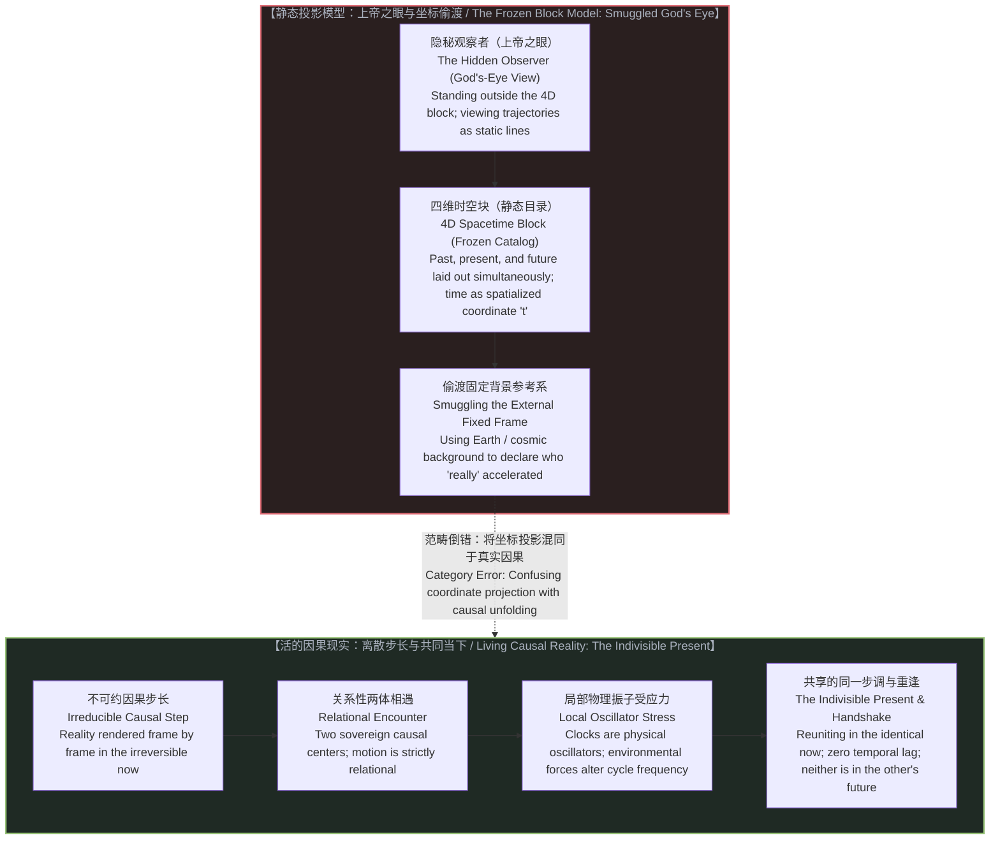
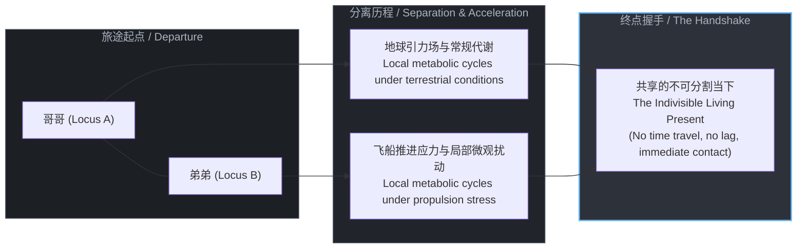

# 双生子佯谬与隐秘观察者：静态宇宙模型如何制造时间膨胀 / The Twin Paradox and the Hidden Observer: How the Frozen Universe Model Manufactures Time Dilation

*当理论将时间空间化为四维几何中的静态坐标轴，它便悄悄引入了一个站在宇宙之外的上帝之眼；在不可分割的当下之中，重逢的双生子共享着同一个现实，时间膨胀不过是静态投影投射在真实因果之上的数学阴影。 / When theory spatializes time into a static coordinate axis of a four-dimensional geometry, it quietly smuggles in an external God's-eye observer; in the indivisible present, reunited twins share the identical living reality, while time dilation remains a mathematical shadow cast by static projection over living causality.*

---

## 一、 百年思维魔术的解构 / 1. Deconstructing the Century-Old Sleight of Hand

狭义相对论问世一个多世纪以来，“双生子佯谬”始终被视作相对论时空观最引人注目的智力标志。标准教科书如此描述这个思想实验：双胞胎中的哥哥留在地球，弟弟乘坐接近光速的飞船远行，随后掉头返回。重逢时，留在地球的哥哥已白发苍苍，而远航的弟弟依然年轻。

面对“相对性原理判定一切惯性运动皆为相对、双方均可宣称对方在运动”的对称性诘问，主流物理学给出了一个看似无懈可击的标准答案：对称性被打破了，因为远航的弟弟经历了掉头转向的加速过程，脱离了单一惯性系。



这一解答掩盖了一个致命的未审视前提：如果宇宙中只有这两位双生子呢？

设想一个虚空宇宙，其中不存在地球，不存在星系，也不存在微波背景辐射，只有两名身处密封舱中的观察者。此时，两人相互远离，随后相对靠近：
* 在哥哥的视界中，弟弟的飞船离去、喷火转向并返回；
* 在弟弟的视界中，哥哥的飞船离去、弟弟启动引擎产生推力、哥哥返回。

在一个严格的两体系统内部，运动是关系性的。若不存在第三个参照物，没有任何物理判据能够赋予其中一方“静止”的特权，同时剥夺另一方的对等权利。断言一方“真正加速了”而另一方“保持静止”，必然依赖系统外部的参考背景。这个假想实验之所以产生“一方比另一方衰老更快”的确定结论，是因为诠释者在论述的隐蔽角落，把整个浩瀚宇宙当作了一座静止不动的巨大舞台。

---

For over a century, the "Twin Paradox" has served as the intellectual centerpiece of relativistic spacetime. Standard textbooks narrate the thought experiment with familiar confidence: Twin A remains on Earth while Twin B embarks on a near-light-speed interstellar voyage, turns around, and returns. Upon reunification, Twin A has aged into senescence, while Twin B remains in the prime of youth.

When pressed on the foundational premise of relativity—that all uniform motion is relational and that each twin could legitimately view the other as moving—pedagogy offers a textbook resolution: the symmetry is broken because the traveling twin experienced acceleration during turnaround, thereby switching inertial frames.

This resolution conceals an unexamined premise: What happens if the universe consists solely of these two individuals?

Imagine an empty universe containing neither planetary bodies, nor distant galaxies, nor the cosmic microwave background—only two observers in sealed crafts. They drift apart, and subsequently reunite:
* In Twin A's frame, Twin B moves away, ignites thrusters, and returns.
* In Twin B's frame, Twin A moves away, Twin B fires thrusters, and Twin A returns.

In a strict two-body universe, motion is relational. Absent a third physical body, there exists no operational ground to grant one observer a stationary benchmark while denying it to the other. To assert that one twin "genuinely accelerated" while the other "remained static" requires an external reference grid. The textbook resolution achieves its asymmetrical outcome only because it quietly recruits the rest of the cosmos as an unacknowledged stationary stage.

---

## 二、 隐秘观察者：向相对性理论偷渡“上帝之眼” / 2. The Hidden Observer: Smuggling God's Eye into Relational Physics

相对论的核心纲领是消除经典力学中的特权参考系与以太概念，确立一切惯性运动的关系性本质。然而，在解释双生子佯谬时，理论构建者却将已经被驱逐的特权基准悄悄请了回来。

为了判定远航的弟弟“真正经历了非对称的世界线弯曲”，物理学家调用了地球的质量分布、银河系的引力势场，甚至是遥远恒星构成的视界。如果这些具体的物质背景仍然不足以作为固定基准，诠释者便在脑海中虚拟出一个悬浮在宇宙之外的隐形机位。

```text
┌─────────────────────────────────────────────────────────────┐
│                 THE HIDDEN OBSERVER SLEIGHT OF HAND         │
├─────────────────────────────────────────────────────────────┤
│ 1. Claimed Premise:                                         │
│    Motion is strictly relational; no privileged center.     │
│                                                             │
│ 2. Unacknowledged Move:                                     │
│    Smuggle in distant stars / Earth as privileged anchor.       │
│                                                             │
│ 3. Theoretical Trap:                                        │
│    Adopt a disembodied God's-eye camera outside the universe│
│    to compare worldline intervals as pre-existing objects.  │
│                                                             │
│ 4. Operational Fact:                                        │
│    Two living entities meet in the indivisible now;         │
│    no entity travels across a dimensional highway.          │
└─────────────────────────────────────────────────────────────┘
```

这个悬浮于宇宙之外的机位，就是**隐秘观察者（The Hidden Observer）**。

正如在[因果是不可约的先验，物理是没有视角的视角](../causality-is-irreducible-the-physical-is-a-view-from-nowhere/)中所揭示的，物理主义世界观惯常制造一种“没有视角的视角”的幻象——仿佛理论家能够脱离自身所处的具体因果位置，站在一个超然的中立基准点俯瞰万物。在双生子佯谬中，这位隐秘观察者化身为坐标系的缔造者：他手握四维网格，在图纸上俯瞰两根世界线，并以神祇的姿态宣布其中一根更短。

这种操作构成了认识论上的双重标准：
1. 对外宣称宇宙不存在特权基准，运动是观察者之间的对等关系；
2. 解释佯谬时却暗中设立外部固定参照物，用第三人称的上帝视角压制了第一人称视角的对称性。

佯谬并非来自物理现实的矛盾，而是来自这种偷渡操作。正如[共享沙盒的幻象](../the-illusion-of-the-shared-sandbox/)所阐明的，理论家先假定了一个中立客观的公共沙盒，然后将两个独立的因果中心强行塞入预设的坐标标尺之中，将观察工具的局限性伪造成了客观宇宙的物理属性。

---

The core project of modern relativity was to eradicate the privileged space and luminiferous ether of Newtonian mechanics, establishing the relational nature of inertial frames. Yet, when confronting the twin paradox, theorists quietly re-admitted the discarded privileged frame through the rear exit.

To establish that the traveling twin experienced an asymmetric worldline deviation, textbooks invoke the mass of the Earth, the gravitational distribution of the galaxy, or the framework of distant cosmological structures. When these concrete material backgrounds prove insufficient in an idealized thought experiment, the interpreter constructs an imaginary vantage point suspended entirely outside the cosmos.

This exterior vantage point is the **Hidden Observer**.

As analyzed in [Causality is Irreducible, the Physical is a View from Nowhere](../causality-is-irreducible-the-physical-is-a-view-from-nowhere/), physicalist reductionism routinely manufactures the illusion of a "view from nowhere"—the conceit that an analyst can step outside their own causal locus and survey reality from an unlocated vantage point. In the twin paradox, this hidden observer acts as the disembodied draftsman of the coordinate grid: perched outside the four-dimensional manifold, looking down at two trajectories, and decreeing from above that one path is shorter.

This sleight of hand enforces an epistemic double standard:
1. It officially proclaims that nature contains no privileged frame and that motion is relational;
2. It resolves its paradox by leaning on an unacknowledged external anchor, overwriting first-person relational symmetry with a third-person divine perspective.

The paradox is not born of physical contradiction; it is manufactured by this conceptual substitution. As detailed in [The Illusion of the Shared Sandbox](../the-illusion-of-the-shared-sandbox/), theorists first postulate a neutral public sandbox, insert discrete causal centers into pre-drawn coordinates, and mistranslate the geometry of their analytical tools into an intrinsic property of reality.

---

## 三、 静态宇宙假定：作为投影参数的时间 / 3. The Frozen Universe Trap: Time as a Projection Parameter

为什么理论物理学会在双生子佯谬上陷入解释的泥潭？深层根源在于物理学模型中根深蒂固的**静态宇宙（Block Universe）假定**。

在闵可夫斯基时空几何中，时间被空间化为第四个维度。整个宇宙的生灭演化被压缩为一个已经完成的、凝固的四维时空块。在这个模型中，过去、现在与未来如同书页般并列排列，物质的生命历程被绘制为静态的世界线。

```text
       STATIC 4D BLOCK (THE MAP)              LIVING CAUSALITY (THE TERRITORY)
       
            t (Coordinate)                                Living Now
            ▲                                                 │
            │     / Worldline B                               ▼
            │    / (Turnaround)             [Center A] ◄── Causal ──► [Center B]
            │   / \                                    Interaction
            │  /   \                                          │
            │ │     │                                         ▼
            │ │     │ Worldline A                     [The Handshake]
            │ └─────┴──────────► x             Both centers update state together;
            Time is an engineered parameter    Reality rendered frame by frame;
            viewed by an exterior spectator.   No pre-existing highway to traverse.
```

理论家面对这一静态几何体时，将自己置于模型之外。他计算两条世界线在四维几何中的路径积分，发现弯曲路径所累积的原时数值小于直线路径的数值。于是他得出结论：“远航的弟弟变年轻了，他穿越到了未来。”

这一推论将**坐标投影参数**误认成了**活的因果时间**：

1. **投影参数（Coordinate Parameter t）**：在洛伦兹变换中，时间坐标 `t` 是人为构建的数学簿记工具，用于在不同观测框架之间对齐观测数据。正如[维度即投影](../dimensions-are-projections/)所指出的，维度是认知的降维压缩机制，而不是实体空间的长廊。将坐标轴的几何长度差异视为真实身体的年轻或衰老，是典型的地图与疆域混淆。
2. **真实时间是不可逆的因果生成**：在真实的疆域中，不存在一个预先铺就的时空块供观察者穿行。现实在每一步中都是活的、由因果展开所决定的当下。正如[索要终极理论是将时间冻结为静态目录](../demanding-a-toe-freezes-time-into-a-catalog/)所揭示的，将时间还原为几何轴线，等于在头脑中预先杀死了时间的生成性，把活生生的宇宙制成了标本目录。

在活的宇宙中，没有人在时间维度中“前进”或“滞后”。无论观察者如何运动，只要他们重聚在同一处视界之内，他们所共享的就是同一个当下的现实。时间膨胀只是理论模型在沿静态时间轴投影时，所产生的坐标形变效应。

---

Why does theoretical physics remain entangled in the twin paradox? The root cause lies in the **Frozen Universe (Block Universe) assumption** embedded within its mathematical architecture.

In Minkowski spacetime geometry, time is spatialized into a fourth dimension. The entirety of cosmic occurrence is flattened into an already-finished, static four-dimensional geometric block. Within this construction, past, present, and future sit alongside one another like printed pages in a bound volume, and living histories are drawn as frozen geometric worldlines.

Positioned outside this block, the theorist calculates the path integrals of proper time along two static trajectories. Observing that the bent trajectory yields a smaller numerical value than the straight one, the theorist announces: "Twin B aged less; he has journeyed into the future."

This conclusion confuses an **engineered projection parameter** with **living causal time**:

1. **The Coordinate Parameter `t`**: In relativistic coordinate transformations, time `t` is a mathematical bookkeeping parameter constructed to reconcile measurements across frames. As demonstrated in [Dimensions Are Projections](../dimensions-are-projections/), dimensions are operational compression schemes of the mind, not physical tunnels. Mistaking the metric path length of an abstract coordinate axis for the biological preservation of youth confuses the mathematical map with the physical territory.
2. **Real Time as Irreversible Causal Act**: In living reality, there is no pre-existing four-dimensional corridor through which matter moves. Reality is rendered frame by frame through irreversible state updates. As shown in [Demanding a TOE Freezes Time into a Catalog](../demanding-a-toe-freezes-time-into-a-catalog/), turning time into an axis freezes the generative flow of nature, replacing an open universe with an inventory of worldlines.

In an active cosmos, no entity races ahead or lags behind across a temporal corridor. Regardless of relative trajectories, when observers meet at the same locus, they inhabit the identical living present. Relativistic time dilation is not an alteration of a temporal substance, but a geometric artifact generated when a static model projects reality onto a coordinate frame.

---

## 四、 物理振子与环境应力：消除“时间旅行”的神话 / 4. Physical Oscillators and Environmental Stress: Discarding the Time-Travel Myth

不可否认，现代实验科学已经给出了大量测量数据：搭载在喷气式飞机上的原子钟（哈费勒-基廷实验）以及轨道上的 GPS 卫星钟，确实记录到了与地面基准钟不同的计数。科普宣传将这一事实渲染为“人类验证了时间旅行”。

这种宣称遮蔽了物理钟表的物质本质：

* **钟表不是“时间感应器”**：宇宙中不存在一条被称为“时间”的客观河流流淌其间以供钟表采集成数。钟表不过是一个局部的物理振子——一段摆动的钟摆、一块受激振动的石英晶体，或是一个在能级间跃迁的铯原子——连接着一个计数器。
* **物理应力改变物理振子的跃迁频率**：在真实的物理实验中，原子钟并不处于虚无的两体真空。它们处于地球庞大的引力势场与自转离心力场之中。引力梯度的变化与加减速运动所施加的力学应力，直接作用于原子核与外层电子的相互作用网络，改变了其能级跃迁的物理频率。发生改变的不是形而上学意义上的“时间流动”，而是**具体物质振子在物理环境应力下的因果循环节律**。

```text
┌─────────────────────────────────────────────────────────────┐
│                 THE ODOMETER CORRESPONDENCE                 │
├─────────────────────────────────────────────────────────────┤
│ • Car A drives on smooth asphalt for 100 miles.             │
│ • Car B drives through mud and rocks; wheels slip/drag.      │
│ • They park side by side in the same garage at the same now.│
│                                                             │
│ • Car B's odometer displays fewer accumulated miles.        │
│ • Does Car B exist in Car A's future?                       │
│ • No: its mechanical sensor experienced different stresses. │
│                                                             │
│ Clocks are physical odometers measuring material cycles,    │
│ not magic vessels traveling along a time corridor.          │
└─────────────────────────────────────────────────────────────┘
```

这对应着里程表的物理现实：两辆车从同一地点出发，在不同的道路应力下行驶并最终停在同一个车库里。一辆车的里程表记录了较少的英里数。没有任何理性的人会声称这辆车“穿越到了未来的车库”。两辆车共同停在此时此地的车库里，里程表的读数差异仅仅记录了机械齿轮在不同地面应力下的运转历史。

正如在[时间是因果的方向与离散步长](../time-is-causality-not-a-dimension/)中所强调的，物理实在只有因果的连续演进。重逢的原子钟所显示的微小秒数差异，是物质振子在不同力学环境下的物理印记，不是穿越时空长廊的凭证。

---

Empirical measurements are indisputable: atomic clocks flown on commercial airliners (the Hafele-Keating experiment) and atomic clocks aboard orbiting GPS satellites record cycle counts that diverge from ground-based references. Popular accounts present these results as experimental confirmations of "time travel."

This narrative obscures the physical nature of measurement instruments:

* **A Clock is Not a "Time Sensor"**: There is no ambient river of "time" coursing through space waiting to be registered by an instrument. A clock is a localized material oscillator—a swinging pendulum, a piezoelectric quartz crystal, or an oscillating cesium atom—mechanically or electronically coupled to a counter.
* **Environmental Forces Modulate Physical Oscillations**: In empirical reality, experimental clocks never occupy an abstract two-body vacuum. They are situated within the Earth's massive gravitational gradient and rotational field. Gravitational potential differences and acceleration forces exert physical stresses that directly modulate the quantum transition frequencies of atomic states. What varies is not a metaphysical dimension of time, but the **frequency of local causal cycles executed by matter under stress**.

This matches the reality of an odometer. Two vehicles depart from a single checkpoint, encounter different terrains and physical stresses, and park alongside each other in the same lot. One odometer displays a smaller tally of miles. No observer concludes that this vehicle traveled into the other's future. Both vehicles occupy the identical lot in the same undivided moment; the discrepancy on the dashboard reflects the history of wheel rotations under local mechanical conditions.

As emphasized in [Time Is the Irreversible Direction and Discrete Step of Causality](../time-is-causality-not-a-dimension/), physical reality consists only of successive causal updates. The minute offset displayed by reunited atomic clocks is the physical record of material oscillators responding to asymmetric forces, not an entry ticket into an external temporal dimension.

---

## 五、 不可分割的当下：双生子的同步现实 / 5. The Indivisible Present: The Twins' Synchronous Reality

当远航的弟弟终于返回，走下飞船，伸出手与留在原地的哥哥握手时，他们之间发生了一件终极而朴素的事实：**他们握住了对方的手**。

这一握手的动作发生在唯一的、不可分割的当下。哥哥不在弟弟的过去，弟弟也不在哥哥的未来。如果时间真的是一条可以任意滑移的几何长廊，那么处于不同“时间坐标”中的两个人根本不可能在同一时空点产生因果纠缠。他们之所以能够相视交谈、交换触觉信号，正是因为他们从未离开过活的宇宙共同拥有的单一时间前沿。



只要两个生命体内部对现实的主观渲染节律一致，他们在各自历程中所体验到的生存感知就没有任何本质鸿沟：
* 弟弟看着飞船内的时钟一秒一秒跳动，感受着心脏的每一次搏动；
* 哥哥看着地面的时钟一秒一秒跳动，同样感受着自己生命节律的流淌。

所谓“弟弟只过了几天，哥哥过了一生”的戏剧化推论，建立在将局域光速常数与时空坐标轴过度解读的数学投影之上。如果在分离过程中，弟弟的身体没有承受足以破坏其生物大分子稳定性的极端物理应力，他的细胞更新与新陈代谢就在自身的因果步长中平稳进行。当他们重逢时，他们作为孪生兄弟，在同一物理世界中共享着同步的现实。

将两体相对运动翻译为时间的不对称流逝，是物理学模型在强加了一个不存在的上帝之眼后，所自编自导的思维困局。正如[因果贯穿始终](../causality-all-the-way/)所昭示的，物理定律与数学方程式是人类意识建立的投影工具，而展开一切可能性的因果前沿，始终只在第一人称的当下跳动。

打破对静态时空块的崇拜，驱散隐秘观察者的幽灵，时间的佯谬便随之消散。宇宙从未冻结，双生子从未分道扬镳于不同的时间河流——他们始终并肩前行于这个唯一的、未完成的、活生生的现实之中。

---

When the traveling sibling returns, steps from the vessel, and extends a hand to Twin A, an irreducible fact asserts itself: **their palms meet**.

This handshake takes place in the single, indivisible now. Twin A is not trapped in Twin B's past, nor does Twin B look back from Twin A's future. If time were a spatial corridor along which entities could advance at differing speeds, two beings occupying separate temporal coordinates could never achieve direct physical contact. That they speak to one another and exchange sensory signals confirms that neither ever departed the shared causal frontier of the active universe.

As long as the internal cadence of subjective rendering remains unbroken within each center of awareness, their lived experience of reality shares the same generative fabric:
* The traveling twin observes their cabin clock advance second by second, conscious of each steady pulse of their own heart;
* The earthbound twin observes their terrestrial clock advance in equal measure, attuned to the same ongoing unfolding of conscious experience.

The popular narrative—that one twin lived a mere afternoon while the other lived an entire lifespan—stems from reifying the coordinate parameter of an idealized mathematical model. Absent disruptive local mechanical stress upon cellular chemistry, biological metabolisms proceed along their local causal state transitions. When the twins reunite, they do so as living counterparts standing shoulder to shoulder within a synchronous reality.

Translating relational motion into asymmetric time dilation is an intellectual puzzle created when theoretical physics equips itself with an unacknowledged God's-eye camera. As articulated in [Causality All the Way](../causality-all-the-way/), mathematical formalisms are predictive instruments constructed by the mind, while the causal frontier that sustains all possibility advances only in the first-person present.

Dissolving the block universe dispels the phantom of the hidden observer, and with it, the paradox dissolves. The cosmos has never been a frozen catalog, and the twins were never divided across separate temporal streams. They remain, as they began, co-present actors within the living territory of an undivided reality.
