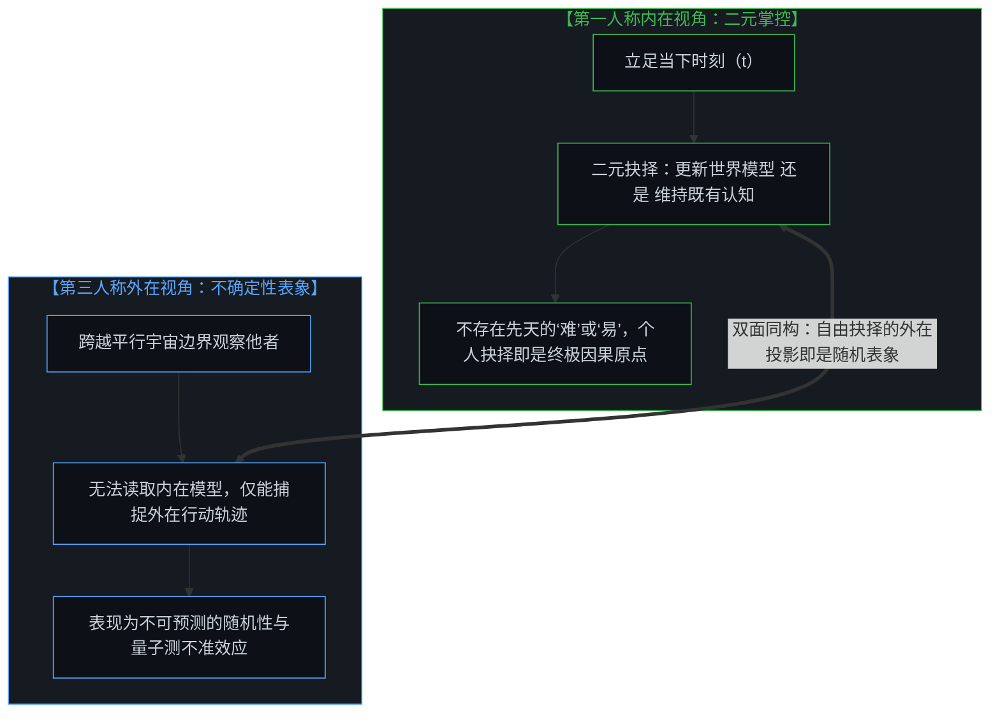
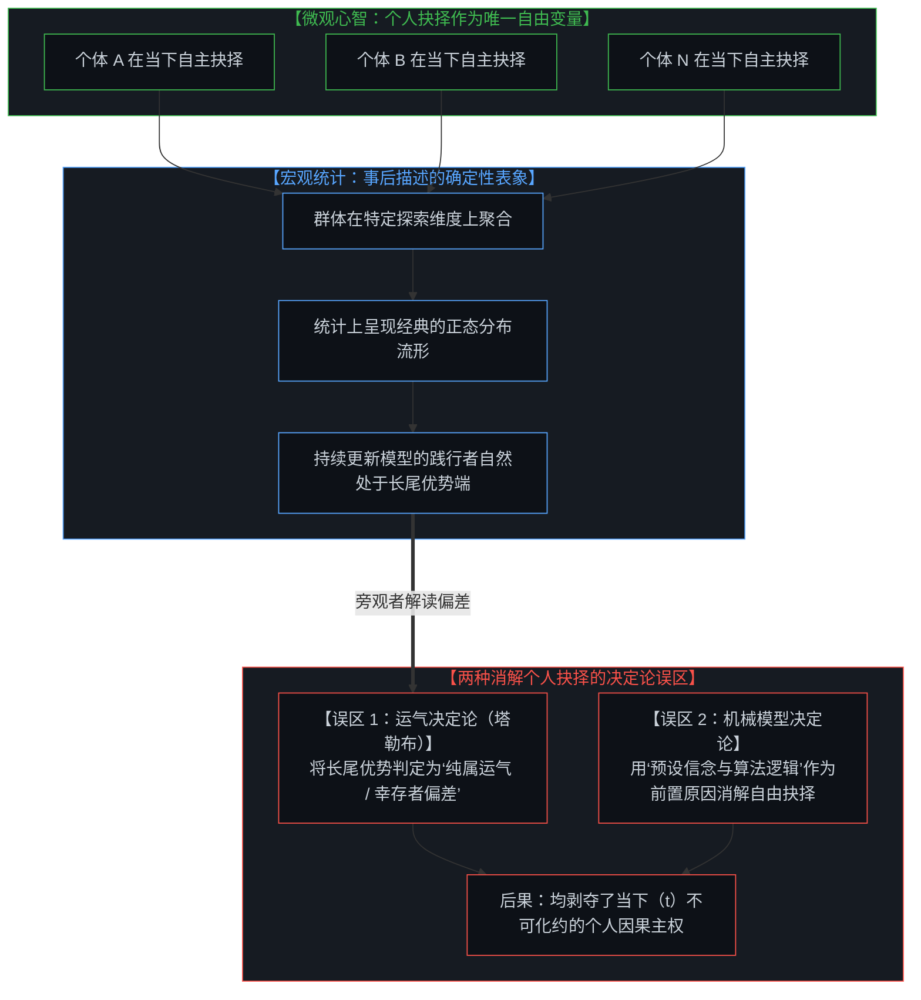
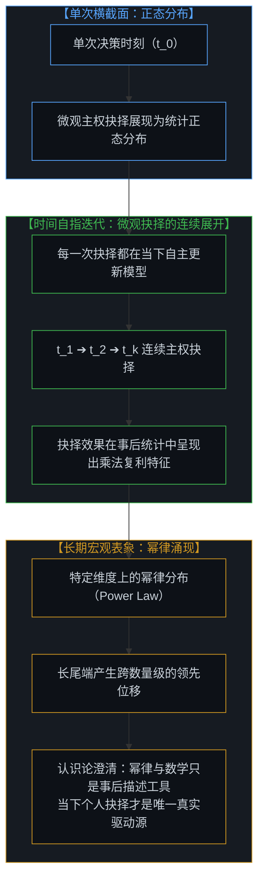
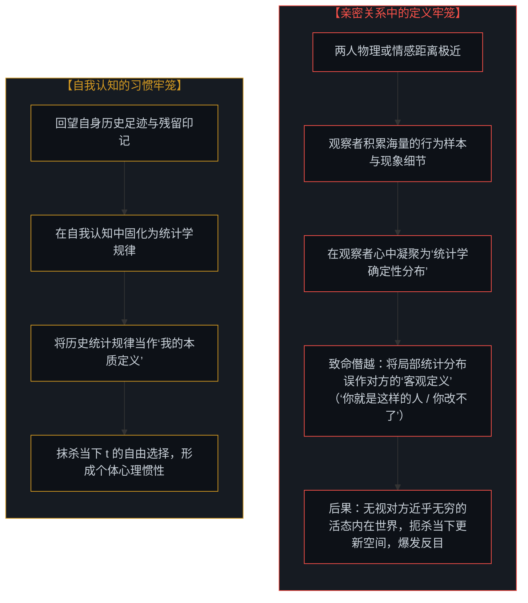
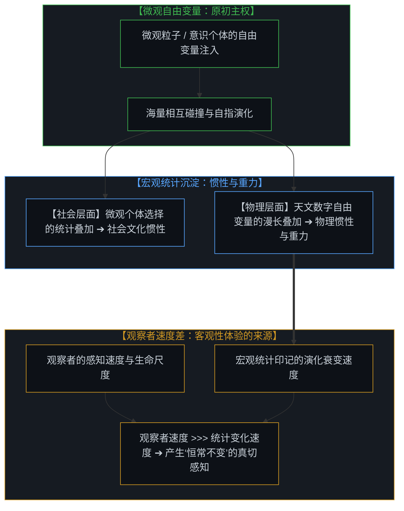
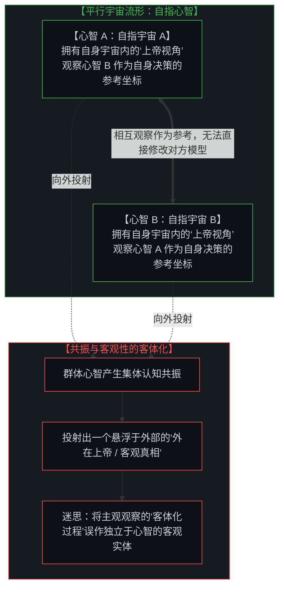

# 主权抉择的双面性与观察的客体化：从统计表象、亲密关系的定义陷阱到惯性与重力的活态本质 / The Two-Sided Nature of Sovereign Choice and the Objectification of Observation: From Statistical Symptoms and the Definitional Trap of Intimacy to the Living Nature of Inertia and Gravity

*从第一人称的自由抉择到第三人称的统计表象：解构用新的决定论因果链消解个人选择的认知陷阱，剖析亲密关系反目与个体惯性的认识论根源，洞见物理惯性与重力作为微观自由变量漫长印记的活态本质。 / From first-person sovereign agency to third-person statistical symptoms: dismantling the trap of replacing one deterministic explanation with another, tracing the epistemological roots of relational enmity and behavioral inertia, and unveiling physical inertia and gravity as long-term statistical imprints of micro free variables.*

在深度对谈、人际互动乃至个体的自我反思中，存在一种难以遏制的阐释倾向：人们总是本能地试图将个体深层的主权抉择消解为某种可观察的宏观外在症状。当我们审视他人的行为时，总在下意识地追问“他为什么会做出那样的选择”，并习惯性地将其归因于外部环境的约束、性格惯性的驱使、行为本身的难易程度或是随机概率的安排；甚至当个体回望自身的历史轨迹时，也极易陷入“当时别无选择”、“习惯使然”或“全凭运气”的事后合理化叙事之中。即使当人们试图破除外部决定论时，也极易滑入另一个隐蔽的陷阱——用一套新的决定论解释（诸如“因为他的信念决定了决策质量，数学复利决定了最终成功”）去替代旧的决定论解释，再次把个人抉择消解在抽象的模型与公式之中。这种归因倾向的认识论根源在于：每一个独立心智都是一个闭合自足的“平行宇宙”（Para-Universe）。由于外部观察者无法直接穿透他人内在的心智空间，我们所能捕捉到的，仅仅是主权抉择在外部世界留下的运动轨迹。人们常将“第三人称的外部观察”与“第一人称的自由抉择”视作非此即彼的对立范畴，从而在观察时遗忘了抉择的主权，在抉择时迷失于外部的表象。正如在 [个体抉择作为唯一的因果杠杆](../individual-choices-as-the-only-causal-levers/) 与 [调速者的幻觉与行动的活态摩擦](../the-fallacy-of-pacing-and-the-felt-friction-of-ground-truth/) 中所揭示的，主权抉择天然具备内在掌控与外在不确定性的双面性。数学、几何与统计规律只是事后描述现象的工具，唯有个体在当下的主权抉择才是系统唯一的自由变量。

In deep dialogues, interpersonal exchanges, and introspective reflections, an insidious interpretive tendency repeatedly emerges: the instinct to explain away individual sovereign choices into observable macro symptoms. When observing others, we persistently ask "why did they choose that path?" attributing their actions to environmental constraints, ingrained habits, psychological friction, or random fortune. Even when looking back upon our own past trajectories, we easily fall into hindsight rationalizations—claiming "there was no other choice," "it was just habit," or "it was all luck." Even when attempting to dismantle external fatalism, minds easily stumble into another subtle trap—substituting one deterministic explanation with another (such as claiming "their belief predetermined their decision quality, and compounding math predetermined their success"), once again dissolving sovereign choice into abstract mechanisms. The fundamental cause of this explanatory dissipation is that every mind operates as a self-contained "Para-Universe." Because no external observer can directly penetrate another consciousness's internal world model, outside observation can only register the physical traces left behind by sovereign choices. Confusion arises when we mistakenly treat "third-person observation" and "first-person freedom of choice" as mutually exclusive categories, oscillating between fatalism and arbitrary randomness while forgetting the other side. As established in [Individual Choices as the Only Causal Levers](../individual-choices-as-the-only-causal-levers/) and [The Fallacy of Pacing and the Felt Friction of Ground Truth](../the-fallacy-of-pacing-and-the-felt-friction-of-ground-truth/), sovereign choice inherently possesses a two-sided duality. Mathematics, geometry, and statistical models are merely descriptive tools; individual sovereign choice at moment t remains the sole irreducible free variable of reality.

---

## 一、 主权抉择的双面性：内在的直接掌控与外在的不确定性表象 / 1. The Duality of Sovereign Choice: Internal Agency vs. External Indeterminism

主权抉择在认识论的几何结构中天然具有两面同构的特征。从心智的第一人称内在来看，我们在每一个当下时刻（t）都拥有对自身抉择的直接控制权。在抉择发生的原初奇点上，现实只呈现为一个极其简明的二元分岔：你是在遭遇现实摩擦时选择更新自身的世界模型，还是选择维持既有框架的封闭稳定。这一动作本身并不存在先验的“容易”或“艰难”，那些被广泛谈论的阻力重重、习惯诱惑或外界压力，都是在抉择发生之后，心智为了向外转嫁因果责任而构建出来的事后合理化解释。在个人抉择的背后，并不存在任何更底层的决定论因果链；选择本身就是原初的原因。

然而，当一个外部观察者审视这个拥有主权自由的个体时，整个图景呈现出了截然不同的面貌。由于外部视线无法穿透平行宇宙的边界去读取其内在模型的推演与自省，该个体的行动在外部看来表现出高度的不确定性（Indeterminism）。观察者无法用机械因果律去推导其下一步行动，因而极易将其判定为随机事件或偶发概率。但这恰恰是自由抉择在外部坐标系中的真实投影。正如量子力学中的波函数坍缩一样，从外部测量观察到的概率分布，并不是内在缺乏因果律，而是主权心智在未受强制状态下自主注入新变量的外在表征。不可预测性并非秩序的缺失，而正是自由意志在外部几何流形中的本质特征。正如在 [自由的测不准](../zi-you-de-ce-bu-zhun/) 与 [自由变量的同构与先验主权](../zi-you-bian-liang-de-tong-gou-yu-xian-yan-zhu-quan/) 中所论述的，外部观察到的随机概率，正是内在自由行使时留下的几何倒影。

First-person sovereign choice intrinsically possesses two complementary, isomorphic faces. From within the interior of consciousness, we possess direct agency over our own choices at every immediate moment t. At the primal singularity of choice, reality presents an elementary binary fork: you either choose to update your world model upon encountering friction, or you choose to preserve the rigid stability of your existing framework. There is nothing inherently "hard" or "easy" about this primary pivot; notions of overwhelming friction, habitual inertia, or external coercion are downstream hindsight rationalizations manufactured to diffuse causal responsibility. Behind personal choice, there is no deeper deterministic causal chain; choice itself is the primal cause.

Yet when an external observer watches this sovereign agent across the boundary of another para-universe, unable to peer into the internal model, the individual's choices appear thoroughly indeterministic and unpredictable. The spectator cannot mechanistically deduce the next step, easily dismissing the action as random chance or haphazard fluctuation. Yet this unpredictability is precisely what freedom of choice looks like from the outside. Just like wave-function collapse in quantum mechanics, the probabilistic distribution observed externally does not signify an absence of internal causality; it is the natural manifestation of an unconstrained sovereign mind injecting free variables into reality. As articulated in [The Uncertainty Principle of Freedom](../zi-you-de-ce-bu-zhun/) and [The Isomorphism of Free Variables and A Priori Sovereignty](../zi-you-bian-liang-de-tong-gou-yu-xian-yan-zhu-quan/), external indeterminism is the signature of internal agency.

---

## 二、 宏观确定性与统计表象：解构“纯属运气”与决定论替代陷阱 / 2. Macro Determinism and Statistical Symptoms: Deconstructing Luck and the Trap of Deterministic Substitution

微观层面的自由抉择与宏观维度的统计规律之间，构建起了一座精密的数学桥梁。尽管每一个体在当下时刻（t）的行动都是自主决定的，未受任何外在机械力的强制；但当我们将整个群体聚合在某一特定的探索维度（诸如认知迭代、工程攻坚或商业开拓）进行横截面观察时，微观的不确定性在统计学上自然汇聚成一个经典的正态分布（Normal Distribution）。那些在每次遭遇现实摩擦时，都能自主选择更新内在模型的践行者，自然会稳定地落在分布曲线的正向长尾端。从宏观外部审视，这一分布呈现出高度平滑且确定的统计秩序。

这种宏观统计秩序，极易诱发旁观者陷入双重认识论误区。一方面，许多知识分子（例如纳西姆·塔勒布在《随机漫步的傻瓜》中的经典论述）习惯于预设一个俯瞰所有人的伪上帝视角，看到正态分布的长尾优势，便轻率地断言前沿探索者的成功并没有什么特殊之处，只是统计学层面的运气与幸存者偏差。这种旁观者视角的谬误在于：它把外部观察到的统计表象，误认为了本体论层面的因果源泉。由于外部视线无法感知微观个体在每一次面对摩擦时的内在主权抉择与自我迭代，便将这种深度的自省行使消解为随机投掷硬币的运气，从而抹杀了主权心智真正的因果效力。

另一方面，反对运气论的人又容易走向另一个极端：试图用一套新的决定论因果链去解释成功（例如宣称“因为某人的认知模型预先设定了其决策质量高于 0.5，所以数学规律决定了他必然成功”）。这种做法同样是一种认知逃避：它把“个人的当下选择”再次异化为了“模型的机械运转”。必须明确的是：心智并没有被所谓预先存在的信念所操纵；所谓的信念与模型，不过是心智在当下时刻持续做出主权抉择所展现出的态度。当我们追踪同一个体在时间轴上的行为序列时，其统计特征紧密围绕其决策质量展开；但这一质量本身，每一次都是当下独立抉择的直接产物，绝非被任何前置程序所决定。

A precise mathematical bridge connects micro sovereign choices with macro statistical phenomena. Although every individual acts freely at moment t without external coercion, aggregating the population along a specific exploratory axis (such as cognitive iteration, technological breakthrough, or entrepreneurial practice) naturally forms a Normal Distribution. Those who consistently choose to update their internal world models upon experiencing friction naturally reside out in the positive long tail. Viewed from the outside, this collective profile displays smooth, deterministic statistical consistency.

This macro consistency often triggers a dual epistemological trap. On one hand, intellectuals like Nassim Taleb in *Fooled by Randomness* adopt a detached pseudo-God's-eye view, surveying the long tail and declaring frontier success to be nothing more than statistical luck and survivorship bias. This mistake treats external statistical symptoms as ontological causal primitives, reducing micro-level sovereign choices and living calibrations to coin flips.

On the other hand, opponents of the luck theory often fall into the opposite error: attempting to explain success with another deterministic causal chain (claiming that "their pre-existing belief system determined their decision quality to be above 0.5, and mathematical compounding guaranteed their victory"). This is another evasion of agency, reducing personal choice to the mechanical output of a model. The mind is not piloted by an externalized "belief program"; what we call belief is simply the stance expressed through the continuous exercise of choice at moment t. When tracking an individual's trajectory over time, their statistical distribution reflects decision quality; yet that quality is the direct product of immediate sovereign choices at each step, never predetermined by prior mechanisms.

---

## 三、 决策质量的时间复利：数学是事后描述而非先验原因 / 3. Compounding Decision Quality: Mathematics as Description, Not Prior Cause

当时间维度持续展开，主权抉择在微观上的微小质量差异，将通过自指迭代产生剧烈的宏观分化。决策质量从来不是孤立相加的算术累加，而是以心智模型为基底的自指乘法过程。当一个心智在当下（t）选择承受摩擦并校准模型，这一更高精度的模型就成为了下一次行动（t+1）的初始坐标。随着时间推移，持续选择校准模型的主权行动会产生指数级的复合效应，让认知模型与现实接触面的贴合度发生质的跃迁。

由于复利机制的持续作用，当我们长期跟踪某一特定维度上的群体表现时，原先对称的正态分布会逐渐演化为极度不平衡的幂律分布（Power-Law Distribution）。极少数长期践行主权抉择、持续校准模型的个体，会在该维度上跑出超越常人几个数量级的相对位移。外部旁观者面对这种巨大的悬殊，更容易惊呼“这是不可抗拒的垄断”或“这是极端的随机运气”，却看不见每一个时间切片里主权微粒的持续自省与积累。

然而，我们必须在此保持极度清醒的认识论边界：**数学与幂律并不是造就这一现象的先验因果力量，它们仅仅是事后描述这一现象的几何语言**。系统之中根本不存在某种凌驾于个体之上的“复利铁律”逼迫个体前进；驱动一切演化的唯一实在力量，始终是每一个独立心智在当下（t）那一刻不可化约的主权抉择。生命的高维丰富性与心智的无限探索空间，永远无法被单一维度的数学公式所规训。

As time unfolds, slight variations in micro decision quality compound through self-referential iteration, driving dramatic divergence. Decision quality is never an additive arithmetic process; it is a multiplicative, self-referential compounding process grounded in world models. When a mind chooses to absorb friction and calibrate its model at moment t, that refined model serves as the elevated launchpad for intentional action at moment t+1. Over time, the continuous sovereign choice to update upon friction generates exponential compounding, producing a qualitative leap in alignment with reality.

Because of temporal compounding, when tracking population trajectories along a specific exploratory axis over extended periods, the symmetrical normal distribution reshapes into an asymmetrical Power-Law Distribution. A small cohort of sovereign agents who relentlessly update their models achieve relative displacements orders of magnitude beyond the median. External spectators, confronted with this staggering gap, react with cries of inevitable monopoly or extreme luck, blind to the relentless micro-iterations executed across every discrete time slice.

Yet a rigorous epistemological caveat is required here: **mathematics and power laws are not a priori causal forces dictating reality; they are merely retrospective descriptive tools used to chart phenomenon after the fact**. There exists no metaphysical "law of compounding" compelling individuals forward; the sole genuine driving force is the irreducible sovereign choice made by each independent mind at moment t. The high-dimensional openness of life can never be disciplined by scalar mathematical formulas.

---

## 四、 亲密关系的反目与自我定义的牢笼：统计表象对无限心智的僭越 / 4. The Enmity of Intimacy and the Prison of Self-Definition: The Usurpation of the Infinite Mind by Statistical Profiles

这一认识论机制，深刻解开了人际互动中一个极为普遍而痛苦的谜题：为什么越是亲密的人，反而越容易反目成仇。站在观察者的角度，两个人之间的物理与情感距离越近，我们能够捕捉到的行为细节和现象样本就越海量。当观察样本大量累积时，观察者的大脑中自然会凝聚成一种统计学上的确定性分布。此时，认识论的致命僭越悄然发生：观察者误将这个在有限历史维度下统计出的外在表征，当成了对被观察者内在本质的客观定义。诸如“你就是这种自私固执的人”或“你过去做过多次，这次肯定毫无改变”的评判便脱口而出。

任何试图加深了解的努力，都必须通过观察在给定维度下形成统计表征；然而，这个统计表征永远无法代表另一个人近乎无穷的活态内心世界。当亲密的一方用僵化的统计标签去套裁对方，剥夺对方在当下（t）自主更新的可能时，被观察者那不可化约的主权意志必然感受到剧烈的压迫与否定。长期的认知封锁，终将让最初的亲密异化为针锋相对的反目成仇。

这一定义牢笼同样精确地作用于个体对自我的认知。当我们回望自己过去的人生轨迹与选择印记时，那些历史数据同样在脑海中汇聚为一个统计学规律。如果我们把这个历史统计规律当成“我自己的本质定义”，诸如认定“我天生就缺乏自控力”或“我就是一个容易焦虑的人”，我们便亲手抹杀了自己在当下时刻（t）做出全新自由抉择的主权能力，把当下卸责给所谓的性格惯性或历史原因。这正是人类所谓心理惯性与性格宿命感的真正来源。

This epistemological mechanism clarifies one of the most painful recurring dynamics in human relationships: why those in closest intimacy frequently transform into bitter adversaries. From the observer's vantage point, the closer two individuals become, the larger the volume of observational data points and behavioral traces collected. A vast accumulation of observations naturally crystallizes into a statistically deterministic profile within the observer's mind. Here, a fatal epistemological usurpation transpires: the observer mistakes this statistical distribution for the definitive, objective essence of that human being, declaring "you are fundamentally stubborn," or "you've done this ten times, you will never change."

Any attempt to deepen understanding must generate statistical representations along specific observed dimensions; yet this representation can never encapsulate the near-infinite living interior of another consciousness. When an intimate partner imprisons the other within a rigid statistical cage—denying their capacity for living renewal at moment t—the subject's irreducible sovereign will feels suffocated. Over time, this cognitive imprisonment inevitably curdles intimacy into ferocious resentment and enmity.

This exact dynamic governs how an individual relates to their own self. When we gaze backward upon our historical footprints and residual traces, past actions consolidate into a statistical pattern. If we mistake this historical pattern for our immutable identity, resigning to "I naturally lack discipline," or "I am just an anxious person," we actively surrender our freedom to execute an unconstrained sovereign choice at this present moment t, projecting causality onto behavioral inertia or past scars. This is the very origin of psychological inertia and self-fulfilling fatalism.

---

## 五、 从个体惯性到物理重力：微观自由变量的漫长统计印记 / 5. From Individual Inertia to Physical Gravity: The Long-Term Statistical Imprint of Micro Free Variables

将这一认识论镜头进一步推演，我们可以看清社会与物理世界宏观刚性的深层生成机制。每一个个体在当下抉择上的自我定义与行为重复，汇聚到群体层面，就构成了沉重坚固的社会惯性（Social Inertia）。制度、风俗与集体思维定式，本质上是无数个体向外部让渡因果主权后沉淀下来的统计均值。

沿着同样的逻辑展开，物理学中看似不可撼动的惯性（Inertia）与重力（Gravity），在本体论上也具有高度同构的生成结构。它们并非宇宙从一开始就写死的先验铁律，而是由底层微观尺度上无法想象的、天文数字般的自由变量，在漫长的时间长河中相互碰撞、叠加、统计所留下的深邃印记。之所以重力与惯性让我们感觉如此坚不可摧、恒常不变，恰恰是因为我们作为第一人称观察者的感知速度与生命尺度，远远快于被观察物理现象的宏观统计变化速度。这种巨大的速率差，在我们眼前制造出了永恒不变的坚固体验。

需要明确的是，这种恒常感对于正在进行第一人称观察的主体而言，是极其真切且不可回避的经验。我们不能轻率地将其斥为虚假的幻觉，因为在实在界中，根本不存在一个脱离了所有观察透镜的所谓本真存在。正是因为我们在当下时刻（t）将所感知的事物作为观察对象，它在这一刻对我们便具有了不容置疑的客观功能性。但我们必须在认识论上保持清醒：这一客观性，是我们从主观观察视角出发得出的客体化结论，而不是事物独立于主观感知的先天属性。

Extending this epistemological lens reveals the deep geometric reality behind macro stability across both social and physical domains. When individuals surrender agency to self-fulfilling habits and past definitions, their aggregated choices consolidate at the macro level into Social Inertia. Institutions, cultural dogmas, and systemic norms are the accumulated statistical residue of countless sovereign minds outsourcing their causal levers to history.

Following this precise logic, what classical physics describes as immutable Inertia and Gravity shares an identical ontological architecture. They are not rigid, pre-existing cosmic edicts written into a Platonic sky; they are the macro statistical imprints left by astronomical numbers of microscopic free variables interacting, superimposing, and entangling across cosmological time. Gravity and inertia appear so rigidly unshakeable to us precisely because the perceptual speed and temporal lifespan of human observers are orders of magnitude faster than the evolutionary rate of change of these macro physical statistical accumulations. This immense velocity mismatch generates the vivid impression of static immutability.

Crucially, this perceived permanence is extraordinarily tangible and functionally real for the living observer in the present. It cannot be dismissed as a mere illusion, for there exists no detached, unobserved reality outside perception. Because our first-person perception takes these phenomena as objects of observation, they hold immediate functional objectivity for our actions at moment t. Yet we must maintain strict epistemological clarity: this objectivity is an operational conclusion forged by our subjective observational act, never an intrinsic property of the thing-in-itself independent of consciousness.

---

## 六、 平行宇宙与自指宇宙的主权锚定：在活态接触面上行使造物主权 / 6. Para-Universes and Sovereign Anchoring: Exercising Agency on the Surface of Living Friction

至此，观察与主权之间的关系在认识论上完成了终极闭环。每一个独立心智要做出自身的自由抉择，必须观察身外的世界与其他主体。观察是心智定位自身状态的必要条件，但我们对他人的观察，绝非对他人内在本质的定义与裁决，而仅仅是我们自身为了做出主权抉择所采纳的参考坐标。因为每一个心智都是一个平行宇宙，我们无法从外部强行修改对方的内部模型，正如对方也无法强行掌控我们的意志一样。

我们并不需要全盘抛弃“上帝视角”这一概念，而是要在认识论上找回它的本真位置。现实中不存在一个凌驾于所有生命之上、脱离了第一人称感知的统一外部上帝；每一个独立心智，都是自身平行宇宙内部唯一的上帝。当我们在自身的心智空间中审视外界、建构世界模型时，我们是在行使属于自己的全局主权。当我们集体共振、共同相信外部存在一个脱离主体的终极客观真相时，我们便开始将自身的观察误认为了客观事实。然而，世界上根本不存在脱离主观感知的非主观客观性；我们日常所讨论的所谓客观性，其真实本质，是心智将自身的观察进行客体化（Objectification）的认识论动作。客观性不是外部事实的证明，而是心智为了在平行宇宙之间建立沟通与协作而达成的自洽约定。正如在 [以知为刃的截肢与解脱](../the-illusion-of-knowing-and-the-geometry-of-amputation/) 与 [向量、坐标系与自指心智](../the-mind-as-vector-and-coordinate-system/) 中所阐明的，将客体化的投影当成实在本体，是主体性丧失的开端。

看清主权抉择的双面性、统计表象的投射陷阱以及惯性与重力的活态成因，心智便能从现代社会的双重虚无中解脱出来。我们既不必陷入旁观者的虚无主义，把所有的卓越与前沿突破轻率地消解为统计学层面的运气与随机性；也不必陷入决定论的宿命牢笼，把生活的一切挫折归咎于不可更改的外部环境、过去印记或社会惯性。更重要的是，我们不再用一套新的决定论模型去套裁生活——我们看清了数学公式与几何模型仅仅是事后的描绘语言，而非前置的因果囚笼。在每一个当下时刻（t），我们都是自身自指宇宙中至高无上的主权者。外部观察可能会将我们的自由抉择视作不可测的随机漫步，宏观统计可能会在局部维度上呈现出冷峻的正态分布与幂律曲线；但在心智的原点上，唯有你直接面对活态摩擦时做出的那个二元抉择——是勇敢地更新认知模型，还是退守封闭框架——在真正驱动着生命状态的跃迁。走出向外寻找统一上帝的幻觉，放下将观察实体化的执念。在行动与摩擦的活态接触面上，以第一人称的从容与定力，行使属于你自己的造物主权。

The relation between observation and sovereign agency achieves its ultimate epistemological integration. For an autonomous mind to execute its free choice, it must observe the surrounding reality and neighboring agents. Observation is a necessary precondition for self-orientation, but our observation of another agent is never an ontological determination of who they are in themselves; it is merely an internal reference coordinate utilized by our own consciousness to navigate choice. Because every mind is a distinct para-universe, no external agent can directly modify another's internal model from without, just as no outside power can usurp our internal volition.

We need not discard the concept of the God's-eye view; rather, we must restore it to its authentic locus. There exists no external cosmic spectator suspended outside first-person conscious experience; each sovereign mind is the sole God of its own internal para-universe. When we evaluate external phenomena within our cognitive workspace and synthesize world models, we are exercising the sovereign architecture of our own universe. When multiple minds resonate in the collective belief that an external truth exists independent of perception, they begin mistaking their shared observations for absolute reality. In truth, there exists no non-subjective objectivity residing out there; what we conventionally term objectivity is simply how consciousness objectifies its own subjective observations. Objectivity is not an external guarantee of truth, but a functional consensus formulated between para-universes for coherent interaction. As articulated in [The Illusion of Knowing and the Geometry of Amputation](../the-illusion-of-knowing-and-the-geometry-of-amputation/) and [The Mind as Vector and Coordinate System](../the-mind-as-vector-and-coordinate-system/), mistaking objectified projections for foundational ontology marks the surrender of sovereign agency.

Recognizing the two-sided nature of sovereign choice, the projection traps of statistical profiles, and the living origins of inertia and gravity liberates consciousness from dual modern nihilisms. We transcend the cynicism of the spectator, who lazily explains away frontier breakthroughs and excellence as mere statistical luck and randomness; and we transcend the fatalism of the determinist, who blames life's setbacks on external constraints, behavioral inertia, or past historical scars. Crucially, we cease substituting one deterministic explanation with another—we see clearly that mathematical formulas and geometric models are merely descriptive languages, never prior causal cages. At every immediate moment t, you are the sovereign architect of your own self-referential universe. External observers may perceive your unforced decisions as erratic random walks, and macro statistics may track populations along normal distributions and power-law curves; yet at the point of origin, only your binary choice upon facing living friction—whether to update your world model or retreat into rigid dogma—drives the living evolution of your state. Step beyond the illusion of an external universal spectator, and cease confusing objectified observations with immutable truth. On the contact surface between action and living friction, exercise your sacred first-person sovereignty with unshakeable clarity and poise.
