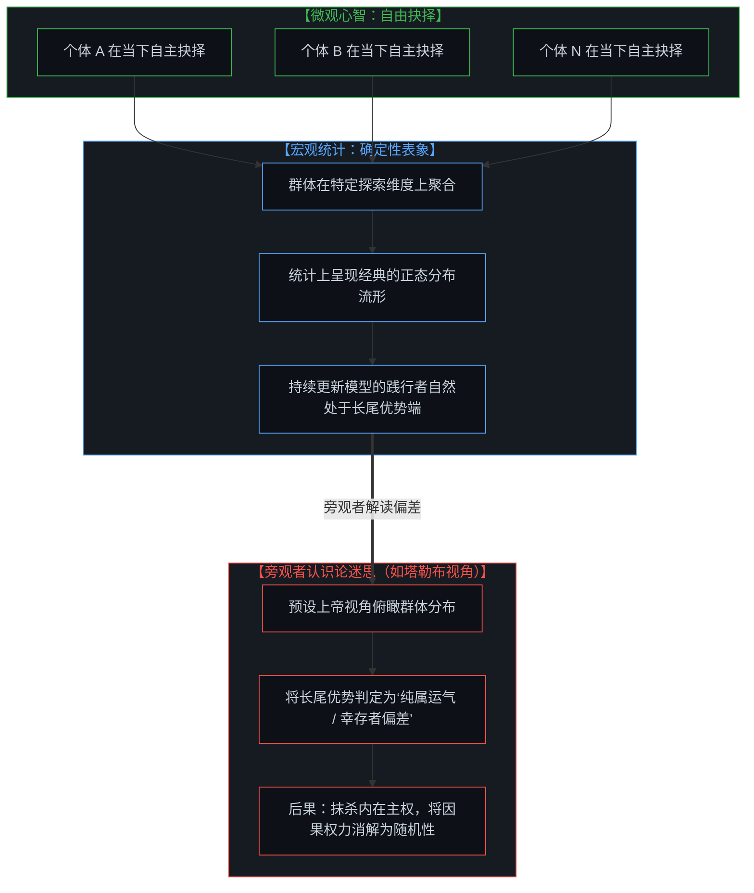
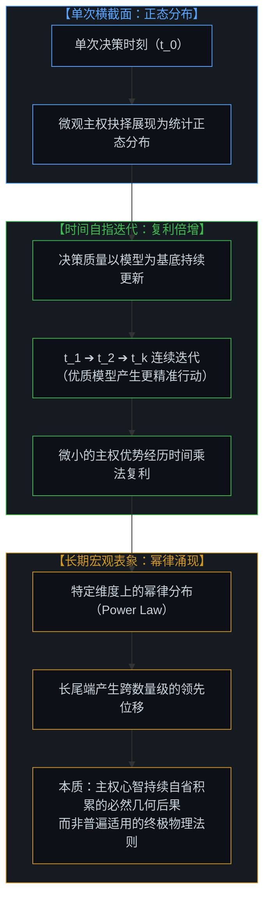
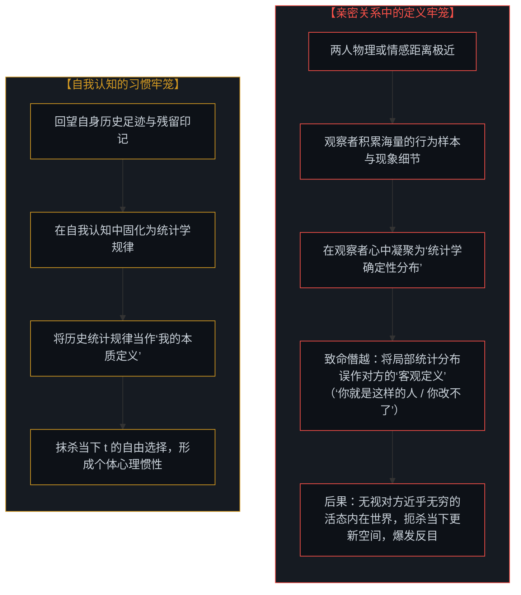
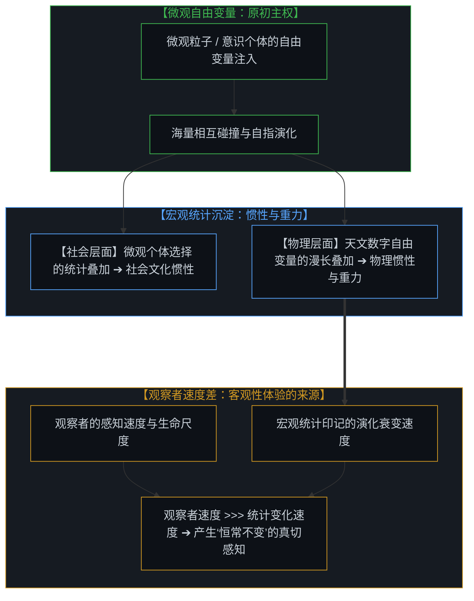
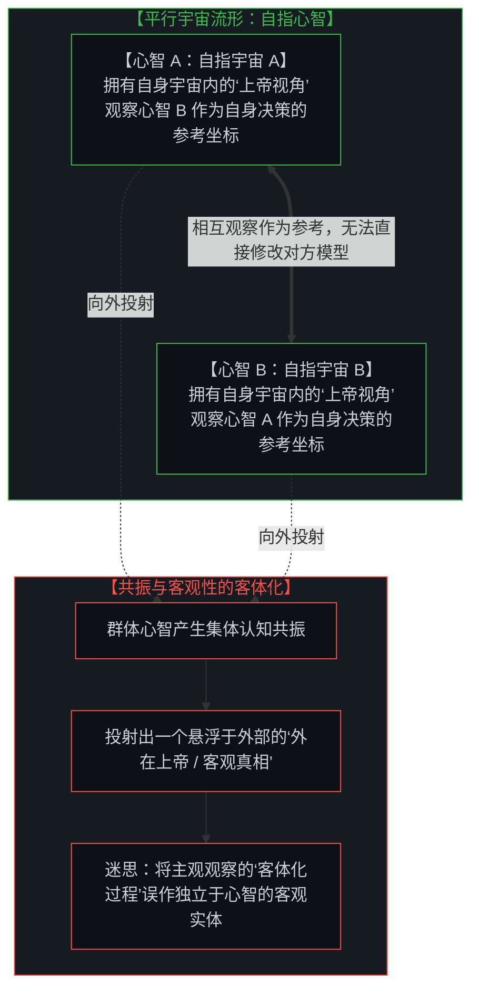

# 主权抉择的双面性与观察的客体化：从统计表象、亲密关系的定义陷阱到惯性与重力的活态本质 / The Two-Sided Nature of Sovereign Choice and the Objectification of Observation: From Statistical Symptoms and the Definitional Trap of Intimacy to the Living Nature of Inertia and Gravity

*从第一人称的自由抉择到第三人称的统计表象：解构“纯属运气”的旁观者迷思，剖析亲密关系反目与个体惯性的认识论根源，洞见物理惯性与重力作为微观自由变量漫长印记的活态本质。 / From first-person sovereign agency to third-person statistical symptoms: dismantling the spectator's myth of "pure luck," tracing the epistemological roots of relational enmity and behavioral inertia, and unveiling physical inertia and gravity as long-term statistical imprints of micro free variables.*

在深度对谈、人际互动乃至个体的自我反思中，存在一种难以遏制的倾向：人们总是本能地试图将个体的“主权抉择”消解为某种可观察的宏观外在症状。当我们审视他人的行为时，总在追问“他为什么会做出那样的选择”，并将其归因为环境制约、性格惯性、行为难度或随机概率；甚至当个体回望自身的历史选择时，也容易陷入“当时别无选择”、“习惯使然”或“万般皆是运气”的事后合理化阐释之中。这种归因倾向的根源在于：每一个独立心智都是一个闭合自足的“平行宇宙”（Para-Universe）。由于外部观察者无法直接穿透他人内在的心智模型，我们所能捕捉到的，仅仅是主权抉择在外部世界留下的运动轨迹。人们常将“第三人称的外部观察”与“第一人称的自由抉择”视作非此即彼的对立物，从而在观察时遗忘了抉择的主权，在抉择时迷失于外部的表象。正如在 [个体抉择作为唯一的因果杠杆](../individual-choices-as-the-only-causal-levers/) 与 [调速者的幻觉与行动的活态摩擦](../the-fallacy-of-pacing-and-the-felt-friction-of-ground-truth/) 中所揭示的，主权抉择天然具备内在掌控与外在不确定性的双面性。唯有厘清统计表象、亲密关系中的定义困境、物理惯性的生成机制与观察的客体化本质，心智才能真正确立自身在自指宇宙中的第一人称因果主权。

In deep dialogues, interpersonal exchanges, and introspective reflections, an insidious tendency repeatedly emerges: the instinct to explain away individual "sovereign choice" into observable macro symptoms. When observing others, we persistently ask "why did they choose that path?" attributing their actions to environmental constraints, ingrained habits, psychological difficulty, or random fortune. Even when looking back upon our own past decisions, we easily fall into hindsight rationalizations—claiming "there was no other choice," "it was just habit," or "it was all luck." The fundamental cause of this explanatory dissipation is that every mind operates as a self-contained "Para-Universe." Because no external observer can directly penetrate another consciousness's internal world model, outside observation can only register the physical traces left behind by sovereign choices. Confusion arises when we mistakenly treat "third-person observation" and "first-person freedom of choice" as mutually exclusive, oscillating between deterministic fatalism and arbitrary randomness while forgetting the other side. As established in [Individual Choices as the Only Causal Levers](../individual-choices-as-the-only-causal-levers/) and [The Fallacy of Pacing and the Felt Friction of Ground Truth](../the-fallacy-of-pacing-and-the-felt-friction-of-ground-truth/), sovereign choice inherently possesses a two-sided duality. Only by clarifying statistical symptoms, the definitional trap of close relationships, the physical emergence of inertia, and the objectification of observation can consciousness firmly anchor its first-person causal sovereignty within its self-referential universe.

---

## 一、 主权抉择的双面性：内在的直接掌控与外在的不确定性表象 / 1. The Duality of Sovereign Choice: Internal Agency vs. External Indeterminism

第一人称的主权抉择，天然具有内外观照的双重面向：

### 1. 内在视角：自由的二元掌控
从心智的第一人称内在来看，我们在每一个当下时刻（t）都拥有对自身抉择的直接控制权。
- 在抉择发生的原点，本质上只存在一个二元分岔：**你是在遭遇现实摩擦时选择更新自身的世界模型，还是选择维持既有框架的封闭稳定**；
- 这一动作本身并不存在先天的“容易”或“艰难”。所谓的“阻力重重”、“习惯诱惑”或“外部压力”，都是行动之后心智为了向外归因而生发出的事后合理化叙事；
- 在原初的意图点上，抉择是自由且自足的。

### 2. 外在视角：不可预测的量子表象
然而，当一个外部观察者审视这个拥有主权自由的个体时，由于无法窥见其内在模型的推演与自省，该个体的行动在外部看来表现出高度的**不确定性（Indeterminism）**：
- 观察者无法用机械因果律推导其下一步行动，因而容易将其判定为“随机事件”或“偶发概率”；
- **但这恰恰是自由抉择在外部坐标系中的真实投影**。正如量子力学中的波函数坍缩一样，从外部测量观察到的概率分布，并不是内在缺乏因果律，而是主权心智在未受强制状态下自由注入新变量的外在表征。正如在 [自由的测不准](../zi-you-de-ce-bu-zhun/) 与 [自由变量的同构与先验主权](../zi-you-bian-liang-de-tong-gou-yu-xian-yan-zhu-quan/) 中所论述的，不可预测性正是自由意志的几何特征。

First-person sovereign choice intrinsically possesses two complementary vantage points:

### 1. The Internal Vantage: Binary Sovereignty
From within the first-person interior of consciousness, we possess direct agency over our own choices at every immediate moment t.
- At the genesis of choice, reality presents an elementary binary fork: **you either choose to update your world model upon encountering friction, or you choose to preserve the stability of your existing framework**;
- There is nothing inherently "hard" or "easy" about this primary pivot. Notions of "enormous friction," "habitual drag," or "insurmountable pressure" are downstream hindsight rationalizations manufactured to diffuse causal responsibility;
- At the point of origin, choice is free, unforced, and sovereign.

### 2. The External Vantage: Indeterministic Quantum Phenomena
When an external observer watches this sovereign agent across the boundary of another para-universe, unable to read the internal model, the individual's choices appear thoroughly **indeterministic and unpredictable**:
- The spectator cannot mechanistically deduce the next step, easily dismissing the action as "random chance" or "haphazard fluctuation";
- **Yet this unpredictability is precisely what freedom of choice looks like from the outside**. Just like wave-function collapse in quantum mechanics, the probabilistic distribution observed externally does not signify an absence of internal causality; it is the natural manifestation of an unconstrained sovereign mind injecting free variables into reality. As articulated in [The Uncertainty Principle of Freedom](../zi-you-de-ce-bu-zhun/) and [The Isomorphism of Free Variables and A Priori Sovereignty](../zi-you-bian-liang-de-tong-gou-yu-xian-yan-zhu-quan/), external indeterminism is the signature of internal agency.

---

## 二、 宏观确定性与统计表象：解构“纯属运气”的旁观者迷思 / 2. Macro Determinism and Statistical Symptoms: Deconstructing the Myth of "Pure Luck"

微观上的主权抉择与宏观上的统计规律之间，存在着清晰的数学映射：

### 1. 群体正态分布与确定性宏观表象
尽管每一个体在当下时刻（t）的行动都是自主决定的，未受外力强加；但当我们将整个群体放在某一特定的探索维度（如认知迭代、工程突破或商业实践）进行横截面观察时，统计学上自然会汇聚成一个**正态分布（Normal Distribution）**。
- 那些在每次遭遇现实摩擦时，都能自主选择更新内在模型的个体，自然会稳定地落在分布曲线的正向远端；
- 从宏观外部审视，这一分布呈现出高度平滑、确定的统计规律。

### 2. 解构塔勒布式的旁观者迷思
许多知识分子（例如纳西姆·塔勒布在《随机漫步的傻瓜》中的经典论调）习惯于站在一个俯瞰所有人的“伪上帝视角”：
- 看到正态分布的长尾，便断言前沿探索者的成功“并没有什么特殊之处，只是统计学层面的运气和幸存者偏差”；
- 这种旁观者视角的谬误在于：**它把外部观察到的统计表象，当成了本体论层面的因果源泉**。由于无法感知微观个体在每一次摩擦来临时的内在主权抉择与自我迭代，便将主权的行使消解为随机投掷硬币的运气，从而抹杀了主权心智的因果效力。

### 3. 单一个体的时间分布与信念锚定
不仅群体呈现分布，当追踪同一个体在时间轴上的持续抉择时，其行为同样展现出一个统计分布：
- 这一分布并非五五开的随机抛硬币，而是**紧密围绕其自身的决策质量均值展开**；
- 这一决策均值，直接由该心智的内在信念所锚定：
  - 若心智坚信自身具有第一人称主权，勇于在摩擦中更新模型，其优质决策的概率均值就会稳定高于 0.5；
  - 若心智深陷外部归因，深信环境与他人决定了自身命运，其决策质量均值就会滑落至 0.5 以下；
- 在外部看来，这依旧表现为统计学特征；但其核心动力源，始终是内在主权的持续行使。

A clear mathematical bridge connects micro sovereign choices with macro statistical phenomena:

### 1. Population Normal Distributions as Macro Symptoms
Although every individual acts freely at moment t without coercion, aggregating the population along a specific exploratory axis (such as cognitive iteration, technological breakthrough, or entrepreneurial practice) naturally forms a **Normal Distribution**.
- Those who consistently choose to update their internal world models upon experiencing friction naturally reside out in the upper tail of the curve;
- Viewed from the outside, this collective profile displays smooth, deterministic statistical consistency.

### 2. Deconstructing the Spectator's Illusion (The Taleb Fallacy)
Certain intellectuals (such as Nassim Taleb's famous thesis in *Fooled by Randomness*) habitually adopt a detached "pseudo-God's-eye view" over human society:
- Surveying the long tail, they declare that the success of frontier pioneers contains "nothing intrinsically special, being merely statistical luck and survivorship bias";
- The fallacy of this spectator mindset is that **it mistakes external statistical symptoms for ontological causal primitives**. Unable to perceive the micro-level sovereign choices and model calibrations occurring at every moment of friction, the spectator reduces intentional agency to coin flips, obliterating causal sovereignty.

### 3. Temporal Trajectories and Belief Anchors of a Single Mind
Beyond population cross-sections, tracking a single individual's decisions across time yields an analogous statistical distribution:
- This distribution is not an arbitrary 50/50 toss; it is **centered around the quality of their sovereign choices**;
- This center of gravity is anchored directly in internal belief:
  - If the mind embraces its first-person agency and actively updates its model upon friction, its mean decision quality reliably exceeds 0.5;
  - If the mind succumbs to external attribution, believing external forces dictate its fate, its decision quality sinks below 0.5;
- To an outside observer, this manifests as a statistical property; yet its engine remains the continuous exercise of internal sovereignty.

---

## 三、 决策质量的时间复利：从正态分布到局部维度的幂律涌现 / 3. The Compounding of Decision Quality: From Normal Distribution to Power-Law Emergence

当时间维度展开，主权抉择的微小质量差异，将通过自指迭代产生剧烈的分化：

### 1. 决策质量的乘法复利
决策质量从来不是孤立相加的算术过程，而是**以心智模型为基底的自指乘法过程**：
- 当一个心智在当下（t）选择承受摩擦、校准模型，这一更高精度的模型就成为了下一次行动（t+1）的初始坐标；
- 随着时间推移，微小的决策质量优势（均值高于 0.5 的部分）会产生指数级的复合效应。

### 2. 幂律分布的宏观涌现
由于复利机制的持续作用，当我们长期跟踪某一特定维度上的群体表现时，原先对称的正态分布会逐渐演化为极度不平衡的**幂律分布（Power-Law Distribution）**：
- 极少数长期践行主权抉择、持续校准模型的个体，会在该维度上跑出超越常人几个数量级的相对位移；
- 外部旁观者面对这种巨大的悬殊，更容易惊呼“这是不可抗拒的垄断”或“这是极端的随机运气”，却看不见每一个时间切片里主权微粒的持续自省与积累。

### 3. 破除幂律的本体论神话
在这里需要保持高度的认识论清醒：**幂律并不是一条雕刻在宇宙苍穹之上的普遍法则**：
- 它仅仅是当我们把所有人放在某一个单一维度（如财富积累、代码产出或论文引用）上进行统计归总时，所观察到的宏观确定性表象；
- 一旦切换到另一个维度，这一统计分布就会被重塑。生命的高维丰富性，永远无法被单一维度的幂律所尽数囊括。

As time unfolds, slight variations in micro decision quality compound through self-referential iteration, driving dramatic divergence:

### 1. The Multiplicative Compounding of Decision Quality
Decision quality is never an additive arithmetic process; it is a **multiplicative, self-referential compounding process grounded in world models**:
- When a mind chooses to absorb friction and calibrate its model at moment t, that refined model serves as the elevated launchpad for intentional action at moment t+1;
- Over time, a marginal advantage in sovereign decision quality (maintaining a mean above 0.5) generates exponential compounding.

### 2. The Emergence of Power-Law Distributions
Because of temporal compounding, when tracking population trajectories along a specific exploratory axis over extended periods, the symmetrical normal distribution reshapes into an asymmetrical **Power-Law Distribution**:
- A small cohort of sovereign agents who relentlessly update their models achieve relative displacements orders of magnitude beyond the median;
- External spectators, confronted with this staggering gap, react with cries of "inevitable monopoly" or "extreme luck," blind to the relentless micro-iterations executed across every discrete time slice.

### 3. Dismantling the Myth of Power Law as Cosmic Law
A rigorous epistemological caveat is required here: **the power law is not a universal metaphysical mandate engraved upon the cosmos**:
- It is merely an observed macro statistical symptom when aggregating agents along one chosen dimension (such as capital accumulation, code output, or citation indices);
- Shift the perspective to another dimension, and the statistical distribution alters. The high-dimensional openness of life can never be encapsulated by a single scalar power-law curve.

---

## 四、 亲密关系的反目与自我定义的牢笼：统计表象对无限心智的僭越 / 4. The Enmity of Intimacy and the Prison of Self-Definition: The Usurpation of the Infinite Mind by Statistical Profiles

这一认识论机制，深刻解释了人类心理与人际关系中一个极为普遍而痛苦的现象：**为什么越是亲密的人，反而越容易反目成仇？**

### 1. 亲密关系中的统计定型与反目困局
站在观察者的角度，两个人之间的关系越亲密、物理距离越近，我们能够捕捉到的行为细节和现象样本就越多。
- 当观察样本海量累积时，观察者的大脑中自然会形成一种**统计学上的确定性分布**；
- 此时，认识论的致命僭越悄然发生：**观察者误将这个统计学分布，当成了对被观察者人格特质的客观定义**（例如“你就是这种自私/懦弱/固执的人”、“你过去做过十次，这次肯定还是一样”）；
- 任何试图加深了解的努力，都必须通过观察在给定维度下形成统计表征；**然而，这个统计表征永远无法代表另一个人近乎无穷的活态内心世界**；
- 当亲密的一方用僵化的统计标签去套裁对方，剥夺对方在当下（t）自主更新的可能时，被观察者那不可化约的主权意志必然感受到剧烈的压迫与否定。长期的认知封锁，终将让最初的亲密异化为针锋相对的反目成仇。

### 2. 自我认知的惯性牢笼
这一机制同样精确地作用于个体对自我的审视：
- 当我们回望自己过去的人生轨迹与选择印记时，那些历史数据同样在脑海中汇聚为一个统计学规律；
- 如果我们把这个历史统计规律当成“我自己的本质定义”（例如“我天生就缺乏自控力”、“我就是一个容易焦虑的人”），**我们就亲手抹杀了自己在当下时刻（t）做出全新自由抉择的主权能力**，把当下卸责给所谓的性格惯性或外部原因；
- 这正是人类所谓“心理惯性”与“性格宿命感”的真正来源。

This epistemological mechanism clarifies one of the most painful recurring dynamics in human psychology and relationships: **why those in closest intimacy frequently transform into bitter adversaries.**

### 1. Statistical Stereotyping and the Enmity of Intimacy
From the observer's vantage point, the closer two individuals become, the larger the volume of observational data points and behavioral traces collected.
- A vast accumulation of observations naturally crystallizes into a **statistically deterministic profile** within the observer's mind;
- Here, a fatal epistemological usurpation transpires: **the observer mistakes this statistical distribution for the definitive, objective essence of that human being** (declaring "you are fundamentally selfish/weak/stubborn," or "you've done this ten times, you will never change");
- Any attempt to deepen understanding must generate statistical representations along specific observed dimensions; **yet this representation can never encapsulate the near-infinite living interior of another consciousness**;
- When an intimate partner imprisons the other within a rigid statistical cage—denying their capacity for living renewal at moment t—the subject's irreducible sovereign will feels suffocated. Over time, this cognitive imprisonment inevitably curdles intimacy into ferocious resentment and enmity.

### 2. The Inertial Cage of Self-Perception
This exact dynamic governs how an individual relates to their own self:
- When we gaze backward upon our historical footprints and residual traces, past actions consolidate into a statistical pattern;
- If we mistake this historical pattern for our "immutable identity" (resigning to "I naturally lack discipline," or "I am just an anxious person"), **we actively surrender our freedom to execute an unconstrained sovereign choice at this present moment t**, projecting causality onto behavioral inertia or external constraints;
- This is the very origin of what humans experience as psychological inertia and self-fulfilling fatalism.

---

## 五、 从个体惯性到物理重力：微观自由变量的漫长统计印记 / 5. From Individual Inertia to Physical Gravity: The Long-Term Statistical Imprint of Micro Free Variables

将这一认识论镜头进一步推演，我们可以看清社会与物理世界宏观刚性的深层几何真相：

### 1. 社会惯性的涌现
每一个个体在当下抉择上的自我定义与行为重复，汇聚到群体层面，就构成了沉重坚固的**社会惯性（Social Inertia）**。制度、风俗与集体思维定式，本质上是无数个体向外部让渡因果主权后沉淀下来的统计均值。

### 2. 物理惯性与重力的活态本质
沿着同样的逻辑推论，物理学中看似不可撼动的**惯性（Inertia）与重力（Gravity）**，在本体论上也具有相同的生成结构：
- 它们并非宇宙从一开始就写死的先验铁律，而是由底层微观尺度上无法想象的、天文数字般的自由变量，在漫长的时间长河中相互碰撞、叠加、统计所留下的深邃印记；
- **为什么重力与惯性让我们感觉如此坚不可摧、恒常不变？**
  - 这是因为**我们作为第一人称观察者的感知速度与生命尺度，远远快于被观察物理现象的宏观统计变化速度**；
  - 这种巨大的速率差，在我们眼前制造出了“永恒不变”的坚固错觉。

### 3. 经验的真切性与客观性的客体化本质
需要明确的是：这种恒常感对于正在进行第一人称观察的主体而言，是极其真切且不可回避的经验。
- 我们不能轻率地将其斥为“虚假的幻觉”，因为在实在界中，根本不存在一个脱离了所有观察透镜的“所谓真实”；
- 正是因为我们在当下时刻（t）将所感知的事物作为观察对象，它在这一刻对我们便具有了不容置疑的“客观功能性”；
- 但我们必须在认识论上保持清醒：**这一客观性，是我们从主观观察视角出发得出的客体化结论，而不是事物独立于主观感知的本真属性**。

Extending this epistemological lens reveals the deep geometric reality behind macro stability across both social and physical domains:

### 1. The Emergence of Social Inertia
When individuals surrender agency to self-fulfilling habits and past definitions, their aggregated choices consolidate at the macro level into **Social Inertia**. Institutions, cultural dogmas, and systemic norms are the accumulated statistical residue of millions of sovereign minds outsourcing their causal levers to history.

### 2. The Living Nature of Physical Inertia and Gravity
Following this precise logic, what classical physics describes as immutable **Inertia and Gravity** shares an identical ontological architecture:
- They are not rigid, pre-existing cosmic edicts written into a Platonic sky; they are the macro statistical imprints left by astronomical numbers of microscopic free variables interacting, superimposing, and entangling across cosmological time;
- **Why do gravity and inertia appear so rigidly unshakeable and eternal to us?**
  - Because **the perceptual speed and temporal lifespan of human observers are orders of magnitude faster than the evolutionary rate of change of these macro physical statistical accumulations**;
  - This immense velocity mismatch generates the vivid impression of static immutability.

### 3. The Lived Reality of Experience and Objectivity as Objectification
Crucially, this perceived permanence is extraordinarily tangible and functionally real for the living observer in the present.
- It cannot be dismissed as a "cheap illusion," for there exists no detached, unobserved "reality" outside perception;
- Because our first-person perception takes these phenomena as objects of observation, they hold immediate functional "objectivity" for our actions at moment t;
- Yet we must maintain strict epistemological clarity: **this objectivity is an operational conclusion forged by our subjective observational act, never an intrinsic property of the thing-in-itself independent of consciousness**.

---

## 六、 平行宇宙与自指宇宙的主权锚定：在活态接触面上行使造物主权 / 6. Para-Universes and Sovereign Anchoring: Exercising Agency on the Surface of Living Friction

观察与主权之间的关系，最终在此完成闭环重构：

### 1. 观察作为决策的必要参考坐标
每一个独立心智要做出自身的自由抉择，必须观察身外的世界与其他主体。
- 观察是心智定位自身状态的必要条件；
- 但必须认清：**我们对他人的观察，绝非对他人内在本质的定义与裁决，而仅仅是我们自身为了做出主权抉择所采纳的参考坐标**；
- 因为每一个心智都是一个平行宇宙，我们无法从外部强行修改对方的内部模型，正如对方也无法强行掌控我们的意志一样。

### 2. 重构“上帝视角”：人人皆是自身宇宙的上帝
我们并不需要全盘抛弃“上帝视角”这一概念，而是要在认识论上找回它的本位：
- 现实中不存在一个凌驾于所有生命之上、脱离了第一人称感知的统一外部上帝；
- **每一个独立心智，都是自身平行宇宙内部唯一的‘上帝’**；
- 当我们在自身的心智空间中审视外界、建构世界模型时，我们是在行使属于自己的全局主权。

### 3. “客观性”的客体化解构
当我们集体共振、共同相信外部存在一个脱离主体的统一上帝或终极客观真相时，我们便开始将自身的观察误认为了“客观事实”。
- 然而，**世界上根本不存在脱离主观感知的‘非主观客观性’**；
- 我们日常所讨论的所谓“客观性”，其真实本质，是心智**将自身的观察进行‘客体化（Objectification）’的认识论动作**；
- 客观性不是外部事实的证明，而是心智为了在平行宇宙之间建立沟通与协作而达成的自洽约定。正如在 [以知为刃的截肢与解脱](../the-illusion-of-knowing-and-the-geometry-of-amputation/) 与 [向量、坐标系与自指心智](../the-mind-as-vector-and-coordinate-system/) 中所阐明的，将客体化的投影当成实在本体，是主体性丧失的开端。

### 4. 结语：在活态摩擦中重获主权
看清主权抉择的双面性、统计表象的投射陷阱以及惯性与重力的活态成因，心智便能从现代社会的双重虚无中解脱出来：
- 既不必陷入**旁观者的虚无主义**——把所有的卓越与前沿突破轻率地消解为“统计学层面的运气与随机性”；
- 也不必陷入**决定论的宿命牢笼**——把生活的一切挫折归咎于不可更改的外部环境、过去印记或社会惯性。

在每一个当下时刻（t），我们都是自身自指宇宙中至高无上的主权者。
- 外部观察可能会将我们的自由抉择视作不可测的随机漫步；
- 宏观统计可能会在局部维度上呈现出冷峻的正态分布与幂律曲线；
- 但在心智的原点上，唯有你直接面对活态摩擦时做出的那个二元抉择——**是勇敢地更新认知模型，还是退守封闭框架**——在真正驱动着生命状态的跃迁。

每一个心智都是独立的平行宇宙。走出向外寻找统一上帝的幻觉，放下将观察实体化的执念。在行动与摩擦的活态接触面上，以第一人称的从容与定力，行使属于你自己的造物主权。

The relation between observation and sovereign agency achieves full epistemological integration:

### 1. Observation as an Internal Reference Coordinate
For an autonomous mind to execute its free choice, it must observe the surrounding reality and neighboring agents.
- Observation is a necessary precondition for self-orientation;
- Crucially, however: **our observation of another agent is never an ontological determination of who they are in themselves, but merely an internal reference coordinate utilized by our own consciousness to navigate choice**;
- Because every mind is a distinct para-universe, no external agent can directly modify another's internal model from without, just as no outside power can usurp our internal volition.

### 2. Reconstructing the "God's-Eye View": Sovereign Divinity of Mind
We need not discard the concept of the "God's-eye view"; rather, we must restore it to its proper locus:
- There exists no external cosmic spectator suspended outside first-person conscious experience;
- **Each sovereign mind is the sole "God" of its own internal para-universe**;
- When we evaluate external phenomena within our cognitive workspace and synthesize world models, we are exercising the sovereign architecture of our own universe.

### 3. Deconstructing "Objectivity" as an Act of Objectification
When multiple minds resonate in the collective belief that an external God or static truth exists independent of perception, they begin mistaking their own shared observations for absolute reality.
- In truth, **there exists no "non-subjective objectivity" residing out there**;
- What we conventionally term "objectivity" is simply **how consciousness objectifies its own subjective observations (the operational act of objectification)**;
- Objectivity is not an external guarantee of truth, but a functional consensus formulated between para-universes for coherent interaction. As articulated in [The Illusion of Knowing and the Geometry of Amputation](../the-illusion-of-knowing-and-the-geometry-of-amputation/) and [The Mind as Vector and Coordinate System](../the-mind-as-vector-and-coordinate-system/), mistaking objectified projections for foundational ontology marks the surrender of sovereign agency.

### 4. Conclusion: Reclaiming Sovereignty on the Surface of Live Friction
Recognizing the two-sided nature of sovereign choice, the projection traps of statistical profiles, and the living origins of inertia and gravity liberates consciousness from dual modern nihilisms:
- We transcend the **cynicism of the spectator**—who lazily explains away frontier breakthroughs and excellence as "mere statistical luck and randomness";
- We transcend the **fatalism of the determinist**—who blames life's setbacks on external constraints, behavioral inertia, or past historical imprints.

At every immediate moment t, you are the sovereign architect of your own self-referential universe.
- External observers may perceive your unforced decisions as erratic random walks;
- Macro statistics may track populations along normal distributions and power-law curves;
- Yet at the point of origin, only your binary choice upon facing living friction—**whether to update your world model or retreat into rigid dogma**—drives the living evolution of your state.

Every mind is an autonomous para-universe. Step beyond the illusion of an external universal spectator, and cease confusing objectified observations with immutable truth. On the contact surface between action and living friction, exercise your sacred first-person sovereignty with unshakeable clarity and poise.
