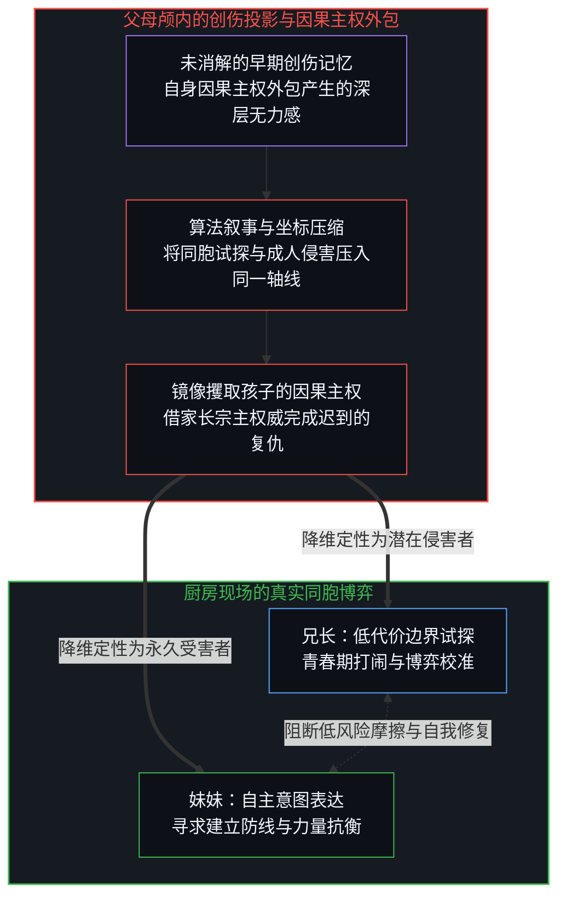
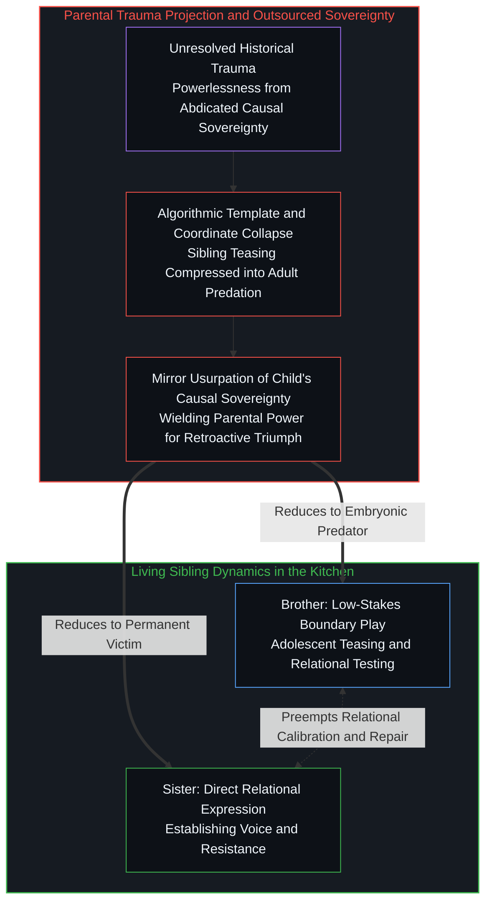
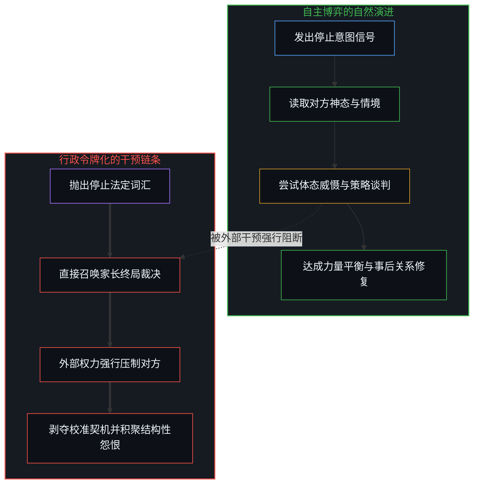
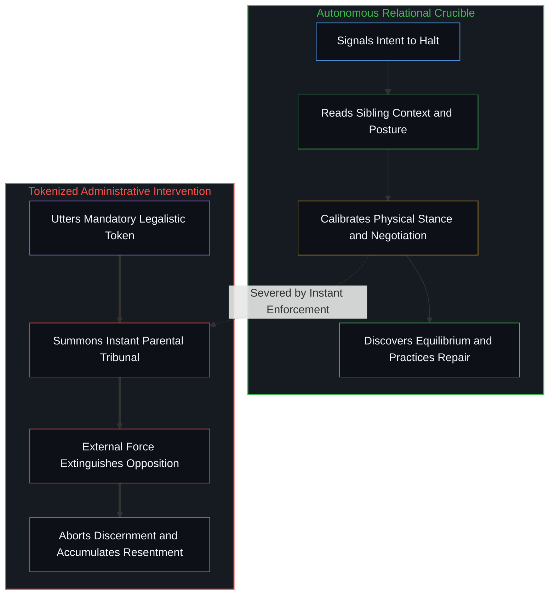
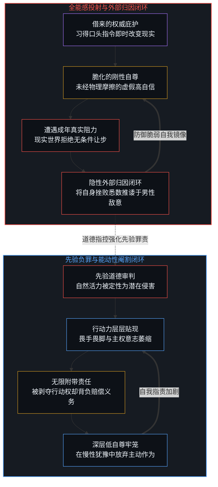
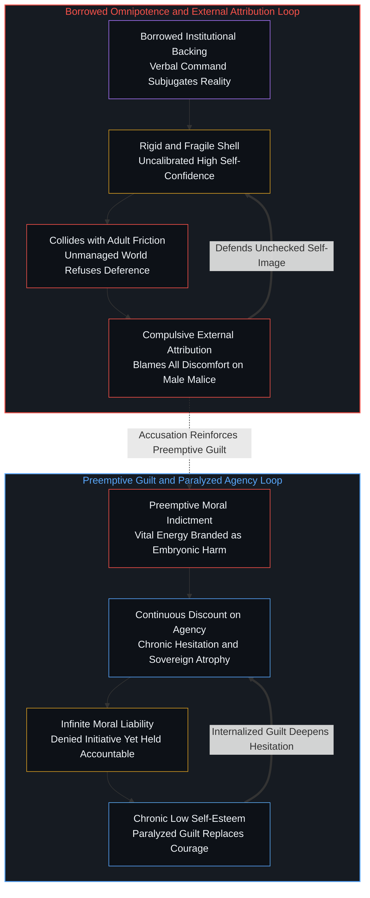

# 未历摩擦的心智与借来的全能 / The Unfrictioned Mind and Borrowed Omnipotence

*以创伤预设消灭成长试探，以代际投影催生脆弱傲慢与先验负罪。 / Eliminating growth friction with trauma scripts manufactures fragile arrogance and preemptive guilt.*

当现代育儿试图通过精密的道德规训消灭一切成长摩擦时，它实际上在第一人称心智与真实因果之间筑起了一道无菌的屏障。文化本身没有独立的因果力，充斥于公共领域的所谓流行抚育文化，不过是海量抚育者在个体选择层面放弃了现场审视、集体外包自主判断所呈现出的宏观统计假象。父母误以为凭借成人的权威庇护与这套流行的创伤模型，就能够自外向内地雕刻出健全的心智，却忽视了主观能动性只能在低风险的边界撞击、试探与自我修复中逐渐成型。这种替代直接博弈的干预机制，既让一方将外部权威的介入错认为自身的无所不能，又将另一方的自发探索直接定性为潜在的恶意侵害。其最终结果不是带来了心智的成熟，而是定向制造出过度自负却习惯性外推过错的脆弱者，以及行动主权遭到阉割却背负无限道德负债的退缩者。

When modern parenting attempts to eliminate all developmental friction through meticulous moral policing, it erects a sterile barrier between the first-person mind and direct causality. Culture itself possesses zero autonomous causal power; what dominates the public sphere as prevailing parenting culture is merely the macroscopic statistical artifact of millions of individuals abdicating first-person discernment in their personal choices. Parents assume that through parental authority and public-sphere trauma templates, they can sculpt a mature character from the outside in, forgetting that agency and discernment can only crystallize through low-stakes boundary testing, reciprocal friction, and self-directed repair. This substitution of external intervention for organic negotiation leads one party to mistake borrowed institutional enforcement for personal omnipotence, while preemptively branding the other party's spontaneous vitality as embryonic malice. The result is not emotional maturity, but the systematic cultivation of fragile overconfidence that reflexively externalizes blame, alongside castrated agency burdened with infinite moral liability.

## 一、 厨房里的幽灵审判与双重替身 / 1. The Ghost in the Kitchen and the Staged Trial

在一场典型的家庭冲突中，十四岁的妹妹在厨房被年长两岁的哥哥堵在门后，哥哥嘻嘻哈哈地捉弄她，妹妹一连喊了五声停止。母亲推门而入，当场搬出自己十九岁遭遇性侵的经历，声称一个在妹妹喊停时不懂停下的男孩，长大后就会变成无视女性拒绝的侵害者。这类在社交网络上引发巨大争议的冲突范本，大多带有数字平台为了收割关注而精心合成的情绪诱饵痕迹，评论区里铺天盖地的道德宣判也多是参与者在零成本环境下进行的教条表演，现实中极少有抚育者会在自家的私人厨房里采取如此极端的审判姿态。然而，它的广泛传播深层暴露了当代抚育最显著的认知扭曲：成年人掌握了空前丰富的心理学与创伤词汇，却日益把具备试探能力的年轻心智当作易碎的瓷器，急于把他们之间的每一次日常摩擦工程化地清除出场。这种场景所呈现的，正是[投射中的自画像](../the-self-portrait-in-the-projection/)中揭示的模型外化：公共领域的流行宏观叙事对特定厨房里的具体心智不具备任何有效信息，观察者却误将这种抽象符号套用在活生生的关系上，从而向外部世界投射自身的内部状态。

In a typical domestic scene widely circulated across digital platforms, a fourteen-year-old girl finds herself cornered behind the kitchen door by her older brother, who blocks her path with teasing laughter as she repeats the word "stop" five times. The mother intervenes, invoking her own sexual assault at nineteen and declaring that a boy who fails to halt when a girl says stop grows into a man who refuses to take no for an answer. Such inflammatory vignettes frequently bear the hallmarks of synthetic provocations engineered to harvest engagement, while the heated comment sections defending them trade in costless moral posturing rather than authentic domestic practice, where very few parents act with such clinical theatricality. Yet their cultural resonance exposes a defining distortion of modern parenting: adults possess unprecedented psychological and trauma vocabularies, yet increasingly treat capable adolescents as fragile porcelain, rushing to engineer ordinary interpersonal friction out of existence. What unfolds in this moment is the externalized model analyzed in [The Self-Portrait in the Projection](../the-self-portrait-in-the-projection/): the prevailing macro-narrative of the public sphere contains zero telemetry regarding the specific living minds in that kitchen, yet the observer mistakes this abstract template for the particular reality, projecting an internal mental state outward onto others.

兄弟姐妹之间的纠纷从来不是未来掠夺行为的早期征兆。同胞打闹之所以频繁发生，是因为他们彼此处于安全的依恋关系中，得以在极低代价的沙盒里测试力量的边界、宣泄嫉妒、学习退让并练习关系的修复。典型的同胞挑衅具备双向博弈的特质，一旦一方表现出真正的退缩或痛苦，游戏便会自然终止。只有单向的持续霸凌、肢体摧残或剥夺逃离自由的场景，才构成需要成年人强制介入的危险界限。普通的厨房堵门显然远未越过这条红线。当母亲将未曾消解的个人创伤硬套在儿子的恶作剧上时，她面对的已经不是厨房里具体的两个年轻人，而是在与过去的幽灵缠斗。儿子被降维成了当年那个未受惩罚的侵害者替身，使母亲终于有机会借由家长的宗主权威，让那句在十九岁失效的呼喊获得迟到的胜利；女儿则沦为母亲当年受害自我的化身。两个真实的独立主体，就这样被强行征召进父母未竟的私人复仇戏剧之中。

Sibling conflict is not an early indicator of predatory pathology. Brothers and sisters clash because they share a safe relational crucible, testing physical limits, navigating envy, learning deference, and practicing repair within a low-stakes sandbox. Ordinary teasing is fundamentally reciprocal and subsides when one party withdraws or signals genuine distress. Persistent one-sided targeting, physical violence, or the entrapment of a child unable to leave belong to an entirely different category and warrant immediate intervention. An ordinary kitchen dispute does not cross that boundary. When a parent superimposes an unresolved personal trauma onto an adolescent prank, she is no longer responding to the two living individuals in the room; she is battling a ghost. The son becomes a proxy puppet for a historical assailant, allowing the parent to wield maternal authority so that the command that failed decades earlier can finally succeed. The daughter is conscripted into the role of the mother's younger, helpless self. Both living agents are pressed into service in a private drama that has nothing to do with their actual relationship.

## 二、 权力的外包与行政令牌化 / 2. The Outsourcing of Power and the Tokenized Decree

这种粗暴代际投射最直接的实践后果，是语言功能的急剧扭曲。“停止”这个词，本是两个独立主体在互动中表达个人偏好、试探对方反应并建立互动界限的沟通信号。然而，一旦抚育者将其定性为必须无条件触发成人暴力干预的刚性律令，“停止”便脱离了具体语境，蜕变为一枚能够瞬间召唤外部利维坦的行政仲裁令牌。喊出这个词的孩子不再需要观察兄长的神态，不需要调整自身的声调与体态，更不需要学习通过谈判、反击或迂回策略来解决争端；她只要吐出这个符号，成人的执法铁拳就会从天而降，替她强行肃清障碍。

The immediate practical consequence of this generational projection is the functional alienation of language. The word "stop" is fundamentally a communicative signal between two autonomous minds, used to negotiate preferences, test responsiveness, and calibrate relational boundaries. Yet once authority figures elevate it to an absolute decree that automatically triggers adult intervention, "stop" is severed from its contextual soil and transformed into an administrative token that summons institutional power. The child invoking this token no longer needs to read social cues, calibrate vocal tone or physical posture, or learn how to negotiate, push back, or maneuver around an obstacle. She simply releases the verbal token, and the parent's unyielding enforcement apparatus descends to clear the path on her behalf.

这种权力外包机制迅速瓦解了两个孩子原本应当自主发展的博弈能力。一方体会到了利用外部权威压制对手的特权快感，另一方则被剥夺了任何辩解与试探的可能，在心底埋下深重的怨恨。两个孩子共同被锁死在非黑即白的施害者与受害者剧本之中，失去了分辨恶作剧与恶意伤害、评估真实危险以及通过自身力量恢复秩序的机会。正如同[帮助是问题的一半](../help-is-half-the-problem/)中所指出的机制，当外部介入替主体代偿了本该由第一人称承担的摩擦成本时，这种帮助本身便成了剥夺心智自立机能的核心力量。机械而严苛的条规抹杀了同胞在性格、年龄差与情境上的丰富差异，只是把人际摩擦的场域延后，阻断了真实的认知演进。

This outsourcing of power dismantles the emergent capacity for self-directed negotiation that both children need to develop. The child who issues the command experiences the exhilaration of wielding borrowed force to crush an opponent, while the other is denied any avenue for contextual explanation or reciprocal boundary exploration, seeding latent resentment. Both are funneled into a rigid script of villain and victim, forfeiting the opportunity to distinguish playful banter from genuine malevolence, assess actual physical stakes, and restore equilibrium through their own efforts. As analyzed in [Help Is Half the Problem](../help-is-half-the-problem/), when an external agency preemptively absorbs the friction costs that belong to first-person agents, that assistance becomes the primary engine of relational atrophy. Rigid enforcement flattens the rich nuances of temperament, age gaps, and circumstantial context, merely displacing the friction while stunting behavioral development.

## 三、 非对称分化与两性心智的结构性畸变 / 3. Asymmetric Divergence and the Gendered Crippling of Agency

必须清醒地认识到，文化本身没有任何施加意志的因果能力。公共领域中占据支配地位的所谓育儿共识，不过是无数家庭在微观选择中放弃独立观察、盲从外部权威所累积出的统计假象。它在舆论场中声势浩大，却无法代表任何一个具体生命在特定时刻的真实动态；将这种宏观剧本套用在每一个微观个体身上，正是这一错误的核心所在。在女童这一侧，当抚育者在每一次微观互动中替其扫平阻力时，女童便习得了一种借来的全能感。只要在遭遇任何不顺或抵抗时宣称自身感受到了侵犯，整个家庭与体制的伦理权威就会迅速接管局面。这种长期脱离真实阻力环境的生活经验，培养出一种表面上极度自信、内在却极度脆化的自我认知。当这类年轻女性走出温室步入成年社会时，现实世界并不会依照母性法庭的逻辑为个人的言辞指令自发悬停。由于从未在低风险摩擦中发展出第一人称的边界掌控力与抗挫力，任何正常的职业竞争、人际拒绝或关系摩擦，都会被她们解读为不可理喻的恶意侵害。正如同[自尊的刚性外壳与隐性外部归因](../zi-zun-de-gang-xing-wai-ke-yu-yin-xing-wai-bu-gui-yin/)所论述的归因陷阱，为了维系未历磨练的虚假全能感，她们只能将生活中的所有受挫与不如意，统统外推并归咎于男性群体或外部环境的蓄意敌意。

It is essential to recognize that culture itself possesses zero autonomous causal capacity. What appears in the public sphere as prevailing parenting consensus is merely the statistical aggregate of countless individuals choosing to abdicate sovereign judgment and conform to external scripts. It dominates media discourse, yet tells us nothing about the actual living reality of any specific, concrete individual; mistaking this macro-cultural abstraction for the particular case is the foundational error. On the female side, when caregivers repeatedly intervene to neutralize resistance, the child internalizes a borrowed sense of omnipotence. By declaring discomfort or claiming transgression whenever friction arises, she summons the full moral backing of the surrounding institution. Having never calibrated her expectations against direct resistance, she develops a brittle self-conception masquerading as genuine confidence. When she steps into adult society, the world does not halt upon her verbal decree. Lacking the internal locus of control and resilience forged through unscripted friction, she interprets ordinary professional competition, personal boundaries, or romantic rejection as hostile persecution. As demonstrated in [The Rigid Shell of Self-Esteem and Covert External Attribution](../zi-zun-de-gang-xing-wai-ke-yu-yin-xing-wai-bu-gui-yin/), to defend this borrowed omnipotence, she compulsively projects personal inadequacy outward, holding men and systemic malice responsible for every private discomfort.

在另一侧，男童的发展路径则遭遇了相反方向的系统性扭曲。所有属于健康生命力的自发试探、竞争冲动、幽默打闹与力量展现，被过早地罩上了潜在施害者或未来捕食者的阴影。男孩在成长中被反复告知，自己天然具备危险的破坏性，其任何不加审慎规训的自主举动都可能构成对他人空间的侵犯。这种长期的道德戒备，如同[主观能动性的折扣](../the-discount-on-agency/)所描述的退化机制，使男孩在行动之前就主动给自身的主体性打上沉重的折扣。他们被剥夺了在试探中学习适度与勇气的机会，被训练得瞻前顾后、退缩畏缩，逐渐演变为行动力低下、缺乏自尊的被动观察者。荒谬的是，在自主权被全面剥夺的同时，他们却被要求对外部环境中的一切消极情绪与潜在冲突负起无限责任。他们成了一群既被禁止展现力量、又必须为全局体面买单的先验负罪者。

On the opposing flank, young men endure a systematic distortion running in the reverse direction. Their spontaneous expressions of vitality—assertiveness, competitive play, physical boisterousness, and roughhousing—are preemptively tarred with the brush of latent pathology and predation. The young boy is repeatedly informed that his natural impulses are dangerous and that any uncurbed initiative threatens the psychological safety of those around him. This sustained moral suspicion triggers the exact dynamic analyzed in [The Discount on Agency](../the-discount-on-agency/): the boy learns to preemptively discount his own sovereign initiative before taking a single step. Denied the crucible wherein strength learns self-governance and courage, he is conditioned into chronic hesitation, anxiety, and passivity. Yet perversely, even as his sovereign agency is castrated, he is saddled with infinite moral liability for the emotional comfort of everyone around him. He is reduced to a permanently indebted observer: forbidden from exercising uncurbed agency, yet held unilaterally responsible for keeping the world pacified.

## 四、 医源性脆弱与第一人称因果的回归 / 4. Symptomatic Fragility and the Restoration of First-Person Causality

任何将心智从直接摩擦中隔绝出来的尝试，最终都会呈现为一种典型的医源性病症。正如在[对脆弱性的更深审视](../a-new-deeper-look-at-antifragility/)中所梳理的机理，心智不是能够被外界预先加固的封闭容器，它必须通过在真实环境中的动态试错与承重反馈来维系自身的抗扰动结构。植物如果在密闭无风的温室中生长，其木质部便不会分泌足够的木质素来生成具有抗风能力的应力木，一旦遭遇自然界的微风吹拂，便会应声折断。当现代抚育试图依靠密不透风的心理学术语与严苛监管来消除孩子生活中的每一次不快时，这种看似崇高的庇护操作，恰恰从根基上摧毁了年轻心智建立骨密度的生理基础。

Any attempt to insulate growing minds from direct, unmediated friction inevitably presents a familiar cluster of iatrogenic symptoms. As articulated in [A New, Deeper Look at Antifragility](../a-new-deeper-look-at-antifragility/), an autonomous mind is not an inert vessel that can be reinforced from the exterior; it requires dynamic trial, error, and load-bearing feedback within living environments to maintain stability. A tree cultivated in a windless, artificial chamber fails to generate the lignified reaction wood necessary to endure real mechanical strain, snapping when exposed to an ordinary breeze. When modern parenting deploys hyper-vigilant psychological categories and micromanagement to eradicate every trace of discomfort from an adolescent's daily life, this protective apparatus starves the growing mind of the load-bearing feedback required to build internal structural integrity.

这一悖论还被巨大的时代错位进一步放大。以几个世纪前的标准来看，今日的青少年早已在知识获取和认知储备上达到了成年人的水准，然而社会规范与家庭焦虑却将青春期人为地无限拉长。父母由于自身未消解的生活挫折或对未来的灾难化想象，不断将这些本该走向自主的年轻生命当成无能的幼童加以看管。更加渊博的创伤知识催生了更加紧绷的监控戒备，更严密的监控挤压了孩子在低成本试验中犯错和复原的自由空间，而实践经验的匮乏则反过来坐实了抚育者眼中“孩子依然脆弱”的偏见。正如同[赋能确立了权力的集中](../empowerment-establishes-the-centralization-of-power/)所揭示的隐蔽控制，借由保护与赋权之名建立的微观秩序，最终只巩固了抚育者自身的权威垄断。

This structural paradox is amplified by a historical mismatch. By the metrics of earlier eras—productive labor, civic participation, and domestic contribution—modern adolescents already possess the information diet of mature adults. Yet cultural norms and parental anxiety artificially prolong childhood. Projecting their own past scars or future anxieties, parents insist on managing capable young people as helpless infants requiring perpetual surveillance. Greater technical awareness of trauma begets hyper-vigilant policing; tighter policing eliminates the low-stakes arenas where mistakes can be made and overcome; and the resulting lack of practical competence seemingly validates the parent's initial dread that the child cannot survive unchaperoned. As exposed in [Empowerment Establishes the Centralization of Power](../empowerment-establishes-the-centralization-of-power/), pedagogical frameworks that promise protection and empowerment ultimately serve to centralize authority in the hands of the supervisor.

抚育者对孩子因果循环的强力剥夺，其深层动力恰恰来源于自身因果主权的放弃与外包。当一个人将本来属于自己的判断标准、情感修复与生活重心全权寄托于外部流行的创伤教条与算法舆论时，第一人称心智必然陷入深重的无力感。正因为无法在自身的生活中完成因果闭环并确立秩序，抚育者才产生了一种绝望的代偿冲动——试图通过全面接管、微观工程化孩子的因果循环来重获掌控感。这是一种荒诞的镜像攫取：在外部权威面前缴械投降的心智，转而在更为弱小的后代身上扮演全知全能的宗主，把原本应当在自身内部化解的创伤与焦虑，外化为对后代行为主权的粗暴掠夺。这种越俎代庖直接催生了自我坐实的恶性循环：被剥夺了因果主权的孩子无法在试错中建立内生韧性，其在现实面前展现出的每一次脆弱与迷茫，都被惊恐的父母反向解读为外部环境险恶与孩子心智幼弱的铁证，从而变本加厉地收紧控制屏障。

The compulsive urge to dominate a child's causal loop arises directly from the caregiver's prior abdication of their own causal sovereignty. When an individual displaces personal judgment, emotional healing, and autonomous orientation onto external therapeutic templates and algorithmic opinion, the first-person mind is hollowed out by chronic powerlessness. Unable to complete their own causal loops or establish order within their own lives, caregivers experience a desperate compensatory drive to micromanage and engineer the child's causal loop to regain a semblance of control. This is a tragic mirror usurpation: having surrendered sovereign discernment to external authorities, the mind turns around to play an omnipotent ruler over its vulnerable offspring, externalizing un-metabolized personal anxieties into the aggressive colonizing of the child's agency. This displacement ignites a self-reinforcing vicious cycle: stripped of causal sovereignty, children are denied the crucible of trial and error required to build internal resilience. Every resulting manifestation of fragility or disorientation is seized upon by anxious parents as undeniable proof that the world is predatory and the child incompetent, prompting an even tighter strangulation of the protective perimeter.

心智的成熟无法通过第三人称的精密蓝图自外而内予以工程化。双生子与收养研究早已表明，任何单一家庭的刻意干预在塑造长远人格上的权重，远小于生命自身的遗传禀赋与不可预测的非共享经验。一个人要学会如何坚定而得体地捍卫界限，必须亲自体验过语言失效时的焦灼，经历过肢体试探中的退让，并在破裂与和解的循环中确认自身的立足点。正如在[隐性自由变量与权力的事后幻相](../the-free-variable-and-the-retrospective-illusion-of-power/)中所辨明的，真正的能动性不是在系统已经建立稳态后占据显赫的既成席位，而是在无人担保的未知边缘，主动认领责任并向现实注入未登账的自由变量；如果年轻心智从未在试错与自担后果中形成闭环，借来的全能便终究只是纸糊的假象。抚育者所能提供的合理支撑，仅仅是在危及生命安全的红线之外，为孩子们保留一个允许摩擦真实发生的空间，而不是充当一堵永恒将他们与现实物理因果隔绝开来的防弹玻璃。当父母有勇气停止在具体情境中盲从抽象的公共叙事，不再把孩子作为投射昨天创伤与明天幻影的替身时，他们才会看清眼前活生生的人，并明白一条朴素的因果铁律：生活的重力与风暴，最终只能由孩子自己的双脚去踩稳与支撑。

A sovereign mind cannot be manufactured through a third-person engineering blueprint. Behavioral genetics and adoption studies repeatedly demonstrate that intentional domestic interventions exert far less influence on adult personality and character than intrinsic genetic factors and unscripted non-shared experiences. To learn how to establish boundaries with clarity and grace, an individual must navigate moments where speech falters, experience the physical balance of resistance and deference, and discover footing through the arduous cycles of rupture and repair. As articulated in [The Invisible Free Variable and the Retrospective Illusion of Power](../the-free-variable-and-the-retrospective-illusion-of-power/), genuine agency does not consist of occupying an established institutional seat once equilibrium has formed, but in shouldering unhedged responsibility to inject an unmapped free variable into the frontier of reality; if a young mind has never completed its own loops of trial and consequence, borrowed omnipotence remains nothing more than paper armor. The only authentic scaffolding a parent can provide is to maintain a safe perimeter against catastrophic harm, while leaving the relational sandbox open for genuine friction to unfold, rather than interposing a bulletproof shield between the child and reality. When parents cease projecting abstract public-sphere templates and yesterday's phantoms onto living individuals, they can finally behold the sovereign minds before them, honoring a timeless causal truth: the gravity and crosswinds of life can only be met on one's own two feet.
