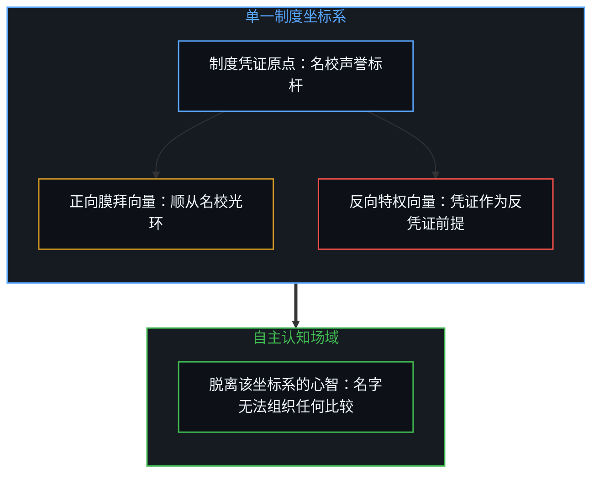
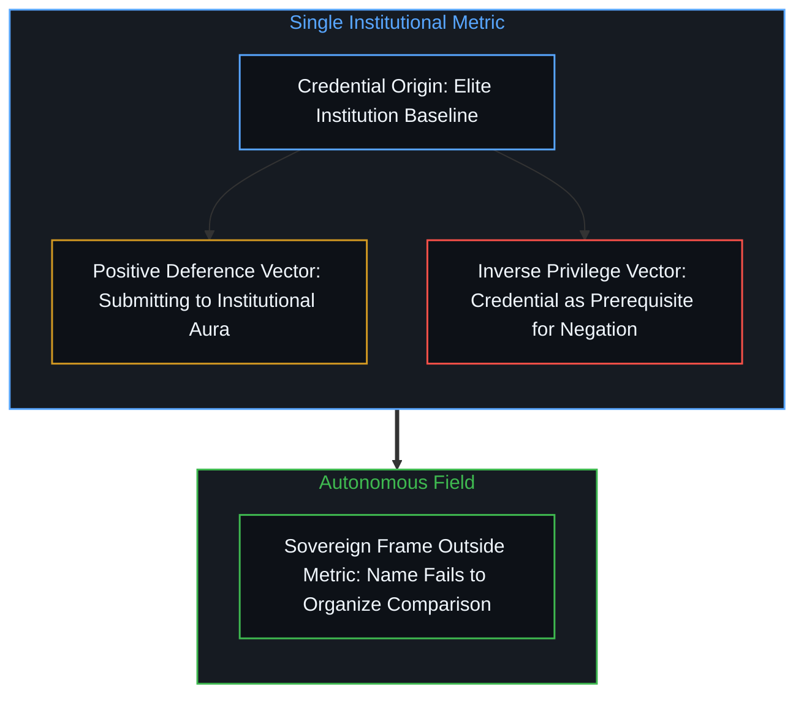
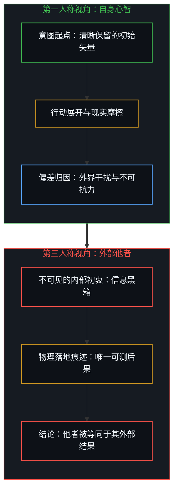
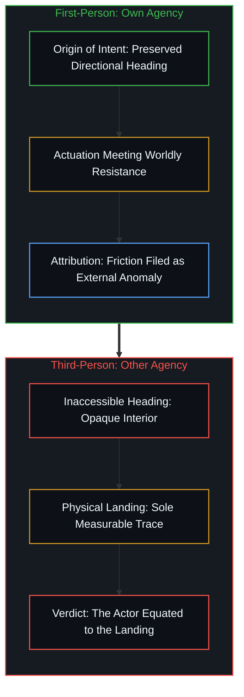
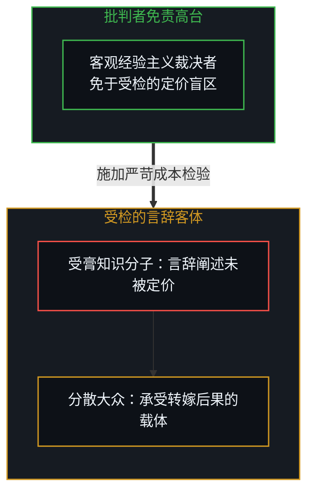
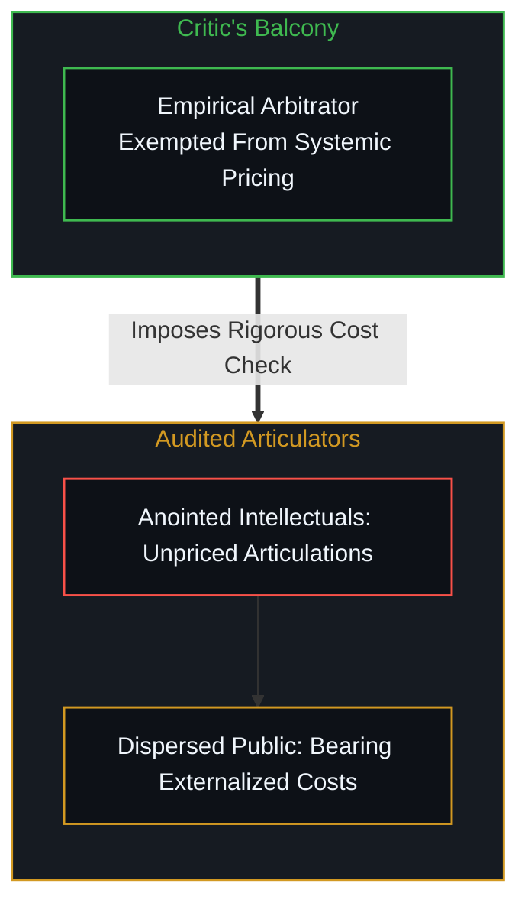
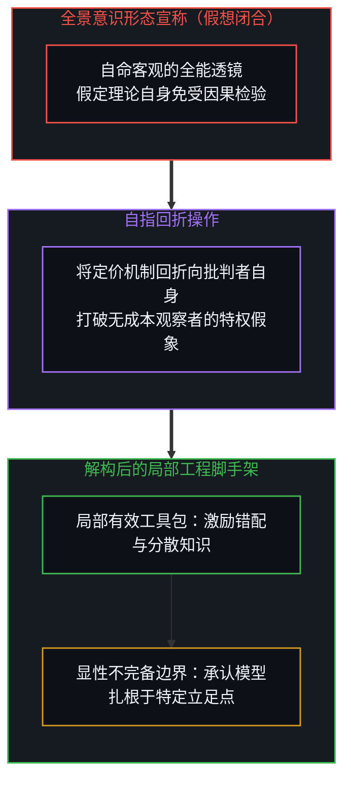
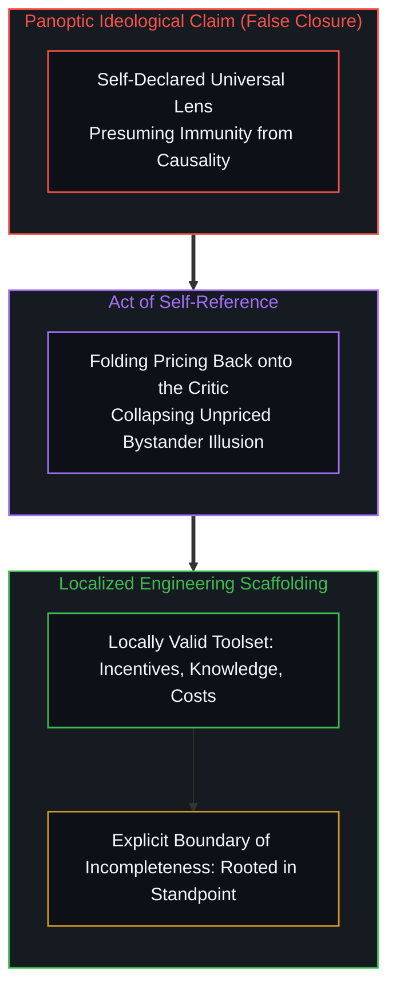

# 未被标价的批判者 / The Unpriced Critic

*以自指照见理论的不完备边界，让宏观工具回归可复用的脚手架。 / Folding self-reference marks a theory’s boundary of incompleteness, restoring macro tools to reusable scaffolding.*

当我们借由托马斯·索维尔的名言审视知识分子的偏颇时，容易忽略观察者自身隐秘的立足点。批判者指责他人仅凭言辞构筑愿景而无需承担市场检验的代价，却在此刻将自己的经验主义高台豁免于同样的定价机制之外。任何系统为了维持自洽闭合，都倾向于将观测者与被观测者割裂为互斥的两个半球。将分析尺度回折给理论自身并不会摧毁其解释力，而是精准标定了其不完备性的边界，使傲慢的普遍性宣称回归为趁手而可复用的局部脚手架。

When examining the fallacies of intellectuals through Thomas Sowell’s celebrated diagnostic lens, we routinely overlook the quiet footing occupied by the observer. The critic faults others for trading in verbal articulations without paying for empirical divergence, yet exempts his own empiricist balcony from that identical pricing mechanism. Every conceptual system seeking closure tends to split observer from observed as mutually exclusive hemispheres. Folding that diagnostic scale back upon the theorist does not destroy the model, but precisely marks its boundary of incompleteness, converting an imperial claim to universality into reusable, local scaffolding.

## 一、 否定立场的反向确证 / 1. The Inverse Confirmation of Negation

索维尔广为流传的一句格言指出，就读哈佛的最大收益在于，余生之中既不会被哈佛毕业生吓倒，也不会再对他们盲目崇拜。这句俏皮话常被当作打破名校神话的清醒剂，甚至被引为反凭证主义的典范。然而仔细审视这句断言的几何结构便会发现，它依然在借由它所排斥的对象来确立自身的坐标。声称自己既不畏惧也不膜拜，依然是在按照是否毕业于哈佛来划分人群。证书依然是这句陈述用以度量世界的基准，只是矢量的正负号发生了翻转。否定并未跳出既有的参照系，而是重新描摹了它试图驱逐的刻度。

A widely quoted maxim attributed to Thomas Sowell suggests that one of the greatest benefits of attending Harvard is that, for the rest of your life, you are neither intimidated nor impressed by people who went there. This aphorism is frequently celebrated as an antidote to institutional prestige, or even as an archetype of anti-credentialism. Yet examining the geometry of the statement reveals that it remains anchored to the exact coordinates it purports to abandon. Declaring that one is neither intimidated nor impressed continues to sort individuals by whether they hold the degree. The credential remains the axis of measurement; only the sign of the vector has flipped. Negation does not exit the frame; it merely retraces the contour it seeks to expel.

深入名校体制内部确实可以消解光环带来的信息差，使心智停止将一块金字招牌视为能力的现成代币，这是局部经验修正的自然产物。更直接地看，这种论调暗中把持有凭证设定为了反凭证主义的前提，反而在深层巩固并维护了凭证主义。如果一个从未踏入该体制的外人宣称自己不被名牌唬住，外部世界极易将其贬斥为缺乏见识的酸葡萄心理；唯有真正手握那张烫金印记的人，其轻蔑才被赋予合法地位，被奉为清醒透彻的真知灼见。批评凭证的资格依然由凭证授予，抽身与脱敏在此转化为了更高阶的特权资产。雕像没有被移走，它只是通过将异议者收编为自己的被授勋者，进一步加固了自身的门槛。一个跳出该坐标系的心智，不会把不再敬畏名牌当作一项值得宣扬的资产，因为那个名字已经无法在它的认知中组织任何比较。在[破除概念的僭越](../po-chu-gai-nian-de-jian-yue/)中，概念的膨胀正是源于这种反向的纠缠；在[阅读的倒错与推断的次序](../the-inversion-of-reading-and-the-order-of-inference/)中，倒错的次序同样将反向的姿态误认为了行动的起点。

Dwelling inside elite institutions can indeed dissolve status differentials, stopping the mind from taking institutional seals as ready tokens of competence, which is the natural outcome of localized friction. More directly, this framing covertly establishes possessing the credential as the prerequisite for anti-credentialism, thereby fortifying and preserving credentialism from within. If an outsider who never entered the gates claims indifference to the pedigree, the world easily dismisses the attitude as sour grapes; only an insider stamped by the institution is granted the legitimate license for enlightened disenchantment. The authority to criticize the credential is still issued by the credential itself. Detachment hardens into a higher-order status asset, announcing an acquired immunity accessible only to the anointed. The monument remains intact; by co-opting critics as its own decorated alumni, the institution merely reinforces the primacy of its threshold. A frame that has genuinely stepped outside that coordinate space does not advertise its freedom from prestige, because the institution simply ceases to organize the comparison. In [Overcoming Conceptual Overreach](../po-chu-gai-nian-de-jian-yue/), conceptual sprawl feeds on precisely this inverse entanglement, just as [The Inversion of Reading and the Order of Inference](../the-inversion-of-reading-and-the-order-of-inference/) mistake reactive positioning for the ground of living action.

## 二、 认知通道的天然不对称 / 2. The Structural Asymmetry of Access

这种在否定中暗中保留坐标系的机制，映射出人类日常经验中更宽广的认知不对称。我们在衡量他人时，极易依据对方显露的行为与落地的后果进行评判，而在审视自身时，却习惯以未受污染的初衷与良好意图作为辩护。这并非廉价的道德双重标准，而是不同认知通道在信息几何上的结构性差异所致。面对外部主体，心智唯一能够接收到的信号是他者行动在现实中激起的涟漪与痕迹。由于他者的主观意图无法被直接读取，观察者只能以结果作为描摹对方的全部依据。

The hidden preservation of coordinates inside negation mirrors a pervasive informational asymmetry in everyday experience. When evaluating others, human minds routinely judge by visible actions and landed consequences, yet when examining themselves, they plead innocence based on internal intent. This is not mere moral duplicity, but a structural consequence of cognitive access. Facing an external locus of agency, the mind registers only the physical ripples and landed traces that the other leaves behind. Because another person’s subjective trajectory cannot be directly sampled, the observer has no choice but to let consequences stand for the actor.

与此相反，心智在自身行动的起点处始终能够完整体验意图的存在。这一前进方向在行动展开之前就已确立，并在行动遭遇现实阻力时依然作为记忆留在意识中。当外部现实反馈与预期产生偏差，心智便借由留存的意图将自身与糟糕的结果隔离开来，将失败解释为外界干扰、运气不佳或他人的阻挠。意图被确立为真实的自我，后果则被推诿给外部情境。实际上，意图与后果从来不是两枚可以割裂使用的钱币，它们是同一条因果链条在时间传播中的两个阶段。意图是尚未受阻的动作，后果是与世界发生碰撞后的同一次行动。[旁观者洞察的悖论](../the-paradoxical-nature-of-bystander-insights/)正是因为忽视了这种具身阻力而产生漂移，正如[观察者的隐身与无损传递的妄念](../the-invisible-observer-and-the-delusion-of-lossless-transmission/)所揭示的那样，剥离了立足点的观察必然产生幻觉。

In contrast, one’s own agency is experienced at the source before the act unfolds. That directional heading is felt prior to actuation and remains active in consciousness even after the movement diverges. When environmental friction pulls the outcome off course, the mind references its unfulfilled intent to insulate itself from the wreckage, chalking the deficit up to bad luck, unexpected weather, or interference from peers. Intention is enthroned as the real self, while consequence is demoted to incidental circumstance. In truth, intention and consequence are never separable currencies; they are the single trajectory observed at two steps of worldly propagation. Intention is the act before impact, and consequence is that same act after physical encounter. [The Paradoxical Nature of Bystander Insights](../the-paradoxical-nature-of-bystander-insights/) drifts precisely by overlooking this resistance, just as [The Invisible Observer and the Delusion of Lossless Transmission](../the-invisible-observer-and-the-delusion-of-lossless-transmission/) demonstrates that an observer disembodied from friction breeds systemic illusion.

## 三、 理论闭合的豁免王座 / 3. The Throne of Exemption in Theoretical Closure

当这种个体的通道不对称上升为思想体系时，便凝固成了理论构建中的豁免特权。索维尔在《知识分子与社会》和《受膏者的愿景》中展开了雄辩的批判。他指出，知识分子阶层的产物仅仅是概念阐述，他们的观念即便在真实世界中造成了巨大灾难，其代价也只会转嫁给大众，而不会反噬到阐述者自身的声誉或生计之上。由于缺乏真实市场的成本约束，受膏者们得以在言辞的自我强化中长久维持脱离实际的宏大叙事。这项针对社会工程家的解构极为锐利，然而整套理论的闭合却依赖于一个未经审视的盲区：批判者自己的观察席位究竟由谁来定价？

When this cognitive asymmetry scales into intellectual architecture, it crystallizes into theoretical self-exemption. Thomas Sowell mounted a formidable critique in *Intellectuals and Society* and *The Vision of the Anointed*, showing that intellectuals deal strictly in articulated ideas. When their social engineering schemes fail, the catastrophic costs fall upon ordinary citizens while leaving the articulators insulated from financial or professional ruin. Shielded from market discipline, the anointed sustain self-congratulatory doctrines long after empirical outcomes diverge. This demolition of technocratic hubris is devastatingly sharp, yet the closure of the theory hinges on an unexamined blind spot: who prices the critical balcony occupied by the author?

声称自己代表严谨经验、恪守事实检验、拒绝道德虚荣，这本身同样是一种高度修辞化的观念阐述。在索维尔的宏大图景中，他者是身处局内、盲目追逐错误激励的单位，而批判者则是伫立于高台之上、洞悉全局代价的客观裁判。如果这套定价逻辑坚决执行，那么分析者自己的选材偏好、出版动机与制度赞助同样应当被置于冷酷的市场成本之下进行核算。然而任何宏大理论为了达成内在逻辑的闭合，都必须在某个支点处终止递归。这个终止点，正是批判者留给自己的免受检验的特权王座。观测者被设定为尺子，被观测的社会则是不断被量出偏差的布匹，两者被假定为互不相干的独立实体。[索维尔观察到了表象问题](../sowell-observed-the-surface-problem/)在触及激励时停下了脚步，正如[不可见的上帝之眼](../the-invisible-gods-eye/)所指出的，自居客观的全景视线始终是一种拒绝回折的智力悬置。

Presenting oneself as the austere empiricist who bows only to hard data is itself an articulated posture. Within Sowell’s grand architecture, other actors are parsed as localized agents blinded by distorted incentives, while the diagnostician observes from Olympian heights, possessing an untainted view of trade-offs. If the pricing axiom were applied without compromise, the analyst’s own evidentiary selections, ideological alliances, and publishing incentives would also face continuous market auditing. Yet every systemic doctrine halts recursion at some boundary to achieve internal consistency. That stopping point is the critic’s self-granted throne of exemption. The observer is cast as the immutable yardstick, while the observed society is the uneven fabric measured against it. [Sowell Observed the Surface Problem](../sowell-observed-the-surface-problem/) stopped short at systemic incentives, just as [The Invisible God's Eye](../the-invisible-gods-eye/) demonstrates that an aloof Olympian gaze remains an intellectual suspension that refuses to fold back upon itself.

## 四、 划定不完备性而非宣告失效 / 4. Demarcating Incompleteness Without Invalidation

指出批判者自身的豁免地位，并不意味着将这套理论判为谬误而弃之如敝履。相反，将分析尺度回折给理论自身，并不是为了否定其洞见，而是为了划定其不完备性的边界。在索维尔实际读取现实痕迹的领域——价格信号传递、分散知识不可替代、第三方决策导致的道德风险——他的模型保持着极高的因果穿透力。后来的探索者尽可继承这些分析模块，将其作为诊断社会摩擦的敏锐工具。不能被全盘继承的，仅仅是那个企图解释全部现象却无需承担自身成本的闭合宣称。

Exposing the critic’s self-exemption does not invalidate the model or warrant discarding its insights. On the contrary, folding self-reference back onto a theory does not refute its mechanics, but delineates its boundary of incompleteness. Across the terrain where Sowell diligently gathered historical evidence—price coordination, the irreplaceable nature of dispersed knowledge, and the hazards of third-party decisions—his diagnostics retain immense explanatory power. Successive thinkers can freely take up these analytical modules as durable tools for mapping social friction. What cannot be inherited is the imperial claim to total closure that exempts the theorist from the friction he describes.

不完备性从来不是理论的瑕疵，而是任何形式化模型之所以能够成立的沉默前提。一套企图囊括一切的理论必然无法自洽，而一套保持自洽的理论必然存在无法被自身证明的边界。当心智执迷于建立包罗万象的万物理论时，它便会将局部的有效性神化为统摄万物的法度。一旦我们将自指的折射镜对准理论的出发点，神话便会退散，边界便会显现。理论由此卸下了教条的重负，重新还原为人类在不确定现实中搭建的临时脚手架。在[向量、坐标系与自指心智](../the-mind-as-vector-and-coordinate-system/)中，心智正是通过自指才获得了重构坐标的自由；在[闭合的N与开放的现实](../the-closed-n-and-the-open-reality/)中，正是因为放弃了封闭所有变量的执念，真实的探索才得以在未完的因果之矢中持续展开。

Incompleteness is never a design flaw; it is the silent boundary condition upon which every formal representation depends. A framework attempting to encompass everything forfeits internal consistency, while a framework that maintains consistency necessarily leaves its foundational premises unexplained. When the intellect becomes obsessed with constructing an all-explaining system, it mistake local efficacy for universal decree. The moment the lens of self-reference focuses back upon the observer’s origin, the dogma dissolves and the boundary becomes starkly legible. Stripped of universal pretensions, the theory returns to what it was always meant to be: temporary scaffolding erected by living minds amid uncertainty. In [The Mind as Vector and Coordinate System](../the-mind-as-vector-and-coordinate-system/), consciousness claims sovereignty precisely by turning coordinates upon itself, just as [The Closed N and the Open Reality](../the-closed-n-and-the-open-reality/) shows that relinquishing artificial closure allows genuine inquiry to proceed along an open causal horizon.
