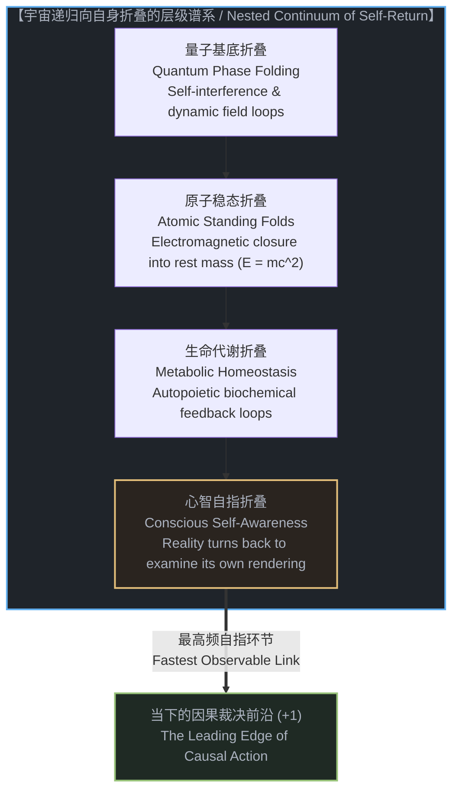
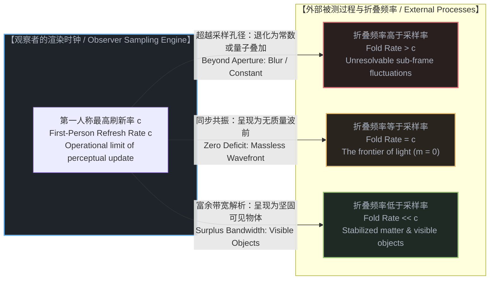
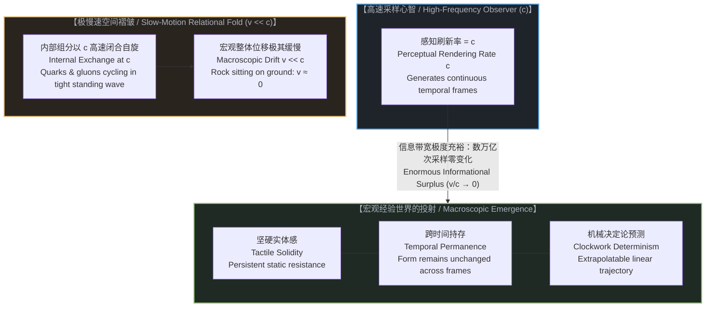
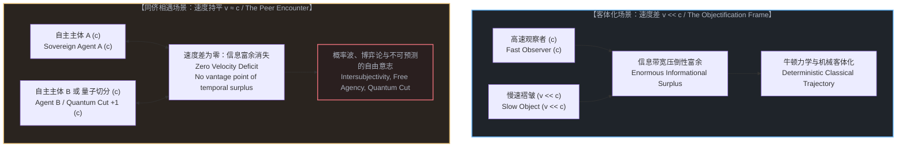
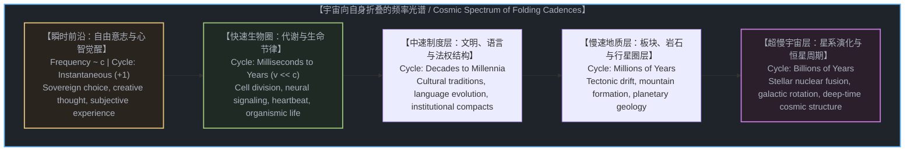

# 可见性的速度差：宇宙如何向自身折叠，以及为何我们所见皆为慢速的褶皱 / The Velocity of Visibility: How the Universe Folds Back on Itself, and Why Everything We See Is a Slower Fold

*心智是宇宙向自身折叠的最快环节；凡是我们所能看见的实体，皆因其向内折叠与演化的速度远慢于心智的感知刷新率；可见性并非客观物质的实体属性，而是高速观察者审视慢速褶皱时浮现的信息剩余。 / The mind is the fastest link in the universe folding back on itself. Everything we can observe is merely the universe folding back at a slower speed, and that velocity deficit is the sole reason it is visible to us. Visibility is not an intrinsic property of physical matter, but the informational surplus that emerges when a high-frequency observer samples a slow-motion fold.*

---

## 一、 序幕：向自身折叠的宇宙 / 1. Prologue: The Universe Folding Back on Itself

物理学传统上将宇宙描绘为一个巨大而冷清的三维箱体，在这个空旷的舞台中，散落着各种各样被称为“物质”的孤立积木。从牛顿的质点到现代粒子物理的标准模型，主流叙事始终假设：物质是先验存在的坚硬砖块，而观察者与心智不过是某个角落里偶然演化出来的后天造物，站在看台上被动端详这台早已开动的发条机器。

然而，一旦我们沿着因果拓扑进行更深层的勘探，这幅拼凑出来的二元机械图景便会瓦解。整个宇宙根本不是一个由死物构成的陈列馆，而是一个不可分割、自我参照的动态因果连续统。宇宙并不存在外部的观察者，它自始至终都在**向自身折叠**：
1. **在微观的量子基底处**：动态场通过自我干涉与局域相位纠缠，向自身折叠为初级的震荡回路；
2. **在原子与分子层面**：交变电磁场不再单向奔涌，而是闭合为驻波与稳定的轨道共振，向自身折叠为拥有静止质量的局域结构（E = mc^2）；
3. **在生物与有机层面**：化学反应超越单向耗散，形成自我维护的代谢闭环与自指转录网络，向自身折叠为维持内稳态的生命体；
4. **在心智与意识层面**：神经系统与感知网络将信息反馈递归至自身，宇宙在当下这一个体身上达成深度的自指觉醒——这是宇宙回过头来，审视自身被渲染的物理与因果条件。

心智从来不是宇宙的局外访客。心智是宇宙向自身折叠的整体长卷中，目前处于最高振荡频率、具有即时自指能力的那个锐利前沿。

---

Physics has traditionally portrayed the universe as an enormous, indifferent three-dimensional container, sparsely populated with isolated building blocks termed "matter." From Newtonian mass points to the modern Standard Model of particle physics, the reigning narrative assumes that physical objects exist prior to observation as hard, self-contained bricks, while the mind is merely an accidental, late-arriving spectator perched in the grandstands, passively watching a pre-wound clockwork apparatus run its course.

Yet the moment we trace the causal topology of reality to its root, this dualistic mechanical picture collapses. The universe is not a museum populated by inert objects; it is an undivided, self-referential causal continuum. The cosmos possesses no outside viewing deck; from the very beginning, it has been recursively **folding back on itself**:
1. **At the quantum substrate**: Dynamic fields generate local phase interference, folding back into primary harmonic loops;
2. **At the atomic and molecular scale**: Alternating electromagnetic fields cease to propagate outward, closing into standing wave resonances that fold back into localized structures endowed with rest mass (E = mc^2);
3. **At the biological scale**: Chemical cascades transcend mere dissipation, establishing autopoietic metabolic cycles and recursive transcription loops that fold back into homeostatic living organisms;
4. **At the level of mind**: Neural networks and perceptual systems loop informational feedback recursively onto themselves, achieving acute self-referential awareness—the universe turning around to inspect the foundational conditions of its own rendering.

The mind is not an alien spectator dropped into a foreign physical arena. The mind is identically the universe folding back on itself at the highest self-referential frequency active within our observational frame.

---

## 二、 感知的奈奎斯特极限：为何我们是可观测宇宙的最快环节 / 2. The Nyquist Limit of Perception: Why We Are the Fastest Observable Link

既然宇宙处处都在向自身折叠，为什么在我们的经验世界中，心智总是显得独一无二？为什么我们从未在物理世界中观测到任何比心智的感知速率更快的实体？

答案深植于信息论与测量本体论的核心定理：感知的采样极限（The Nyquist-Shannon Sampling Horizon of Perception）。

在经典的信号处理中，奈奎斯特采样定理确立了一条铁律：一个采样系统永远无法解析频率高于其采样频率一半的信号；任何超过采样极限的高频信号，在采样图景中要么发生混叠畸变，要么退化为不可分辨的均匀底噪。

将这一定理平移至本体论的测量框架，便揭示了一个惊人的事实：**观察者的自身渲染时钟，就是其所能观测的宇宙速度上限。**

倘若宇宙中存在某种向自身折叠、演化速度比心智渲染速率 c 更快的机制，它会发生什么？它根本无法在心智的视界中凝聚为一个具有清晰时空轮廓、可被追踪定位的“宏观物体”！因为它在单个感知采样窗口内已经完成了数万次形态更迭，其内部信息对观察者而言是不可解析的。在宏观仪器的读数中，这种超频过程只能体现为以下三种投影：
1. **固化的物理常数**：表现为屏幕的底层分辨率硬件指标（如普朗克常数与精细结构常数）；
2. **不可预测的量子概率云**：高频震荡在低频采样下发生拓扑平滑，退化为薛定谔波函数的统计分布；
3. **瞬时的非局域关联**：在观察者的单个刷新帧内同时完成，因而被判定为跨越空间的“量子纠缠”。

因此，并不是客观宇宙恰好缺乏更高速的运动，而是**从测量的定义出发，凡是能被心智辨识、测量并确认为“物体”的事物，其演化速率必然等于或低于心智的刷新率**。心智永远是我们可观测宇宙的最快环节，因为比心智更快的涨落，早已构成了呈现画面所依赖的画布本身。

---

If the cosmos is folding back on itself at every conceivable scale, why does the conscious mind appear unique within our experiential domain? Why do we never observe any physical entity or signal that moves or cycles faster than the perceptual refresh rate of mind?

The answer is rooted in a core theorem of information theory and measurement ontology: The Nyquist-Shannon Sampling Horizon of Perception.

In classical signal processing, the Nyquist theorem dictates an unyielding law: a discrete sampling system can never reconstruct a signal whose frequency exceeds half its sampling rate. Any higher frequency either folds back as aliasing distortion or washes out into unresolvable background noise.

Translating this principle into the ontology of measurement yields an extraordinary conclusion: **the observer's own rendering cadence defines the operational speed ceiling of its observable cosmos.**

What would occur if a process were to fold back on itself at an oscillation rate faster than the rendering velocity c of the conscious mind? It could never coalesce into a localized, structured physical object possessing a stable spacetime trajectory! Because it would undergo billions of complete internal cycles within a single perceptual exposure window, its high-frequency phase information would be unresolvable. On macroscopic scientific instruments, such hyper-fast dynamics can manifest only as:
1. **Invariant physical constants**: Registering as the immutable hardware specifications of the rendering screen (such as Planck's constant and the fine-structure constant);
2. **Probabilistic quantum wavefunctions**: Where micro-oscillations smooth out into statistical phase clouds;
3. **Instantaneous non-local correlations**: Occurring entirely within a single frame interval, hence interpreted by the observer as instantaneous entanglement across space.

Consequently, it is not that the universe mysteriously lacks higher-frequency motions; rather, **by the very definition of measurement, anything that can be distinguished, tracked, and verified as a physical object must evolve at or below the observer's rendering frequency**. The observing mind is invariably the fastest link in its observable universe, for anything faster has already dissolved into the structural canvas upon which the picture is painted.

---

## 三、 可见性即速度差：物质坚固性与决定论的诞生 / 3. Visibility as a Velocity Deficit: The Emergence of Solidity and Determinism

这一认识为物理学中的两大核心谜题——“物质的坚固性”与“经典决定论的根源”——提供了简洁有力的本体论解释。

在日常直觉中，人们坚信一块岩石之所以被我们看见，是因为它“就在那里”，是由某种坚硬致密的实体材料制造而成的。但微观物理学早已用实验证实：原子内部超过百分之九十九点九九九的空间都是虚空的。既然原子内部几乎全无实物，究竟是什么赋予了宏观世界坚不可摧的质感？

答案不是微观粒子的堆叠，而是**速度差（Velocity Deficit）**：

> **一个事物对我们而言是可见的、坚硬的、客观的，并非因为它含有某种神秘的实体质料，而是因为它向自身折叠的演化速率，远远慢于我们心智的刷新率。**

让我们剖析一块静止在地面上的花岗岩：
* **内部的高速运转**：构成花岗岩的原子的夸克与胶子，必须在亚原子尺度以接近光速 c 的极限频率相互交握、频繁震荡，方能维系强相互作用力的驻波平衡；
* **整体的极度慢速**：由于所有能量都被锁死在闭合的局域关系中，花岗岩在宏观空间上的演化速度几乎为零（v/c 趋近于 0）；
* **信息带宽的极大剩余**：当以光速 c 刷新现实的心智去观测这块岩石时，在心智每一纳秒更新的感知序列里，岩石的宏观结构没有发生任何可察觉的位移。心智以充沛的信息带宽，对同一个稳定的几何拓扑进行了数以万亿次的重复采样。

这种极其悬殊的速度差，在观察者端沉淀为巨大的**信息剩余（Informational Surplus）**。当心智连续数万次确认同一组因果关系没有丝毫改变时，心智的知觉机制就会将这种静态的冗余渲染为**坚固的质地**、**永恒的形状**，以及**可用微分方程精确预测的机械决定论**。

所谓的“物质实体”，不过是宇宙向内折叠之后，被困在低速时间中的引力化石；而“可见性”，则是高速奔涌的心智投射在超慢速褶皱上的感知明暗度。

---

This understanding provides an elegant ontological resolution to two of the deepest enigmas of physics: the tactile solidity of matter and the origin of classical determinism.

Common intuition insists that a rock is visible to us because it sits out there in independent space, forged from some durable, impenetrable stuff. Yet modern quantum physics dismantled this naive materialism long ago by demonstrating that over ninety-nine point nine nine nine percent of an atom's volume is vacuum. If atoms contain virtually zero tangible substance, what endows the macroscopic world with its unyielding, solid presence?

The answer is not a physical substance, but a **Velocity Deficit (v << c)**:

> **An entity is visible, solid, and objective to us not because it contains physical matter, but because the rate at which it folds back on itself is vastly slower than the refresh rate of our observing mind.**

Consider a slab of granite resting on the earth:
* **The hyper-speed interior**: The quarks, gluons, and electrons within the granite's atoms circulate at near light speed c, exchanging localized gauge forces to sustain standing wave equilibrium;
* **The frozen macro-exterior**: Because this enormous energy is entirely trapped within localized closed relationships, the macroscopic rock as a whole drifts through space at a speed virtually equal to zero (v/c -> 0);
* **The enormous informational surplus**: When a conscious mind rendering reality at c observes this stone, every nanosecond interval yields an identical spatial configuration. The observing engine possesses an overwhelming informational bandwidth advantage over the stone, sampling the exact same relational knot trillions of times with near-zero macroscopic change.

This massive velocity deficit manifests in perception as **Informational Surplus**. When the perceptual apparatus confirms countless times that a relational topology has not budged, it compiles that static temporal redundancy into the sensations of **tactile solidity**, **durable permanence**, and **clockwork mechanical determinism**.

Physical matter is nothing other than dynamic energy caught in slow-motion relational loops—a temporal fossil of deep time. Visibility is the high-contrast perceptual shadow cast by a high-frequency mind against an ultra-slow fold.

---

## 四、 同侪的相遇：当两个光速褶皱迎面碰撞 / 4. The Peer Encounter: When Folds Meet at Equal Speed

既然当被测对象的演化速度远慢于心智（v << c）时，心智能够凭借压倒性的信息剩余将其客体化为确定性机械，那么一个显而易见的极端问题随之浮现：

**当两个以相同的最高速率（v = c）向自身折叠的系统迎面相遇时，会发生什么？**

这正是物理学撞上量子测量难题，以及人文学科撞上自由意志与主体间性难题的共同交叉点。

当两个处于相同渲染前沿的系统发生交互时，原先维系机械客体化的信息剩余瞬间降为零：
1. **心智与心智的相遇（主体间性与自由意志）**：
   当你注视另一位具有清醒意识的人类时，你无法像预测钟摆或行星那样，用一套决定论微分方程预先锁定他的下一步动作。为什么？因为他的心智同样在以光速 c 进行即时因果裁决（+1）。你所拥有的计算与感知带宽，并不比他高出一个数量级。当两者的折叠频率相持平时，观察者丧失了单向俯瞰的特权。对象不再是听凭摆布的木偶，而成为拥有自主选择权的同侪。确定性消失，博弈论、相互理解、伦理责任与自由意志由此诞生。
2. **测量仪器与量子切分的相遇（费曼的思考电子）**：
   当物理学试图探测微观粒子时，我们所动用的探针本身就必须是光子或高能电磁场——其传递速率就是 c。此时，测量者试图用光速的标尺去审视一个以光速进行相位折叠的自由变量。正如费曼所言，“如果电子能够思考，物理学就不会这么优美”。在单粒子双缝干涉实验中，电子的行为之所以看似会随观测而改变，正是因为在零速度差的交互中，微观粒子呈现出了它作为微观自主切分（+1）的原初面貌。测量者无法从外部预先计算其内部相位，微观体系在宏观仪器上只能坍缩为不可先验预测的概率波分布。

心智无法将另一个心智单向客体化，正如光无法在另一束迎面而来的光上投射出阴影。物理学在量子尺度的困惑，并非源自仪器精度的不足，而是源自观察者在零速度差的边界处，首次撞见了与自身同频的因果同侪。

---

If an observer can objectify a slow-motion fold (v << c) into a clockwork machine thanks to an overwhelming informational surplus, an inevitable foundational question arises:

**What occurs when two systems folding back on themselves at the exact same maximal velocity (v = c) meet face-to-face?**

This is the exact ontological junction where theoretical physics collides with the quantum measurement problem, and where philosophy encounters free will and intersubjectivity.

When two systems operating at the identical rendering frontier interact, the temporal bandwidth advantage that once sustained classical objectification evaporates completely:
1. **The encounter between minds (Intersubjectivity and Sovereign Free Will)**:
   When you look into the eyes of another conscious agent, you cannot anticipate their next choice using a set of deterministic differential equations the way you track a falling apple. Why? Because their consciousness is generating causal updates (+1) at the same operational refresh rate c as your own. You possess zero informational bandwidth surplus over them. When both folds cycle at identical frequencies, the privilege of unilateral external control disappears. The other cannot be frozen into a passive instrument; they emerge as a sovereign peer. Mechanical determinism gives way to game theory, reciprocal recognition, ethical responsibility, and genuine free will.
2. **The probe meeting the quantum cut (Feynman's Thinking Electron)**:
   When an experimental apparatus attempts to measure a fundamental quantum particle, the physical probe employed is itself light or high-energy gauge bosons moving at c. Here, an observer uses a light-speed probe to examine a micro-entity executing phase transitions at light speed. The velocity deficit drops to zero. As Richard Feynman remarked, physics would be impossibly difficult if electrons could think, because observing one alters its trajectory. In quantum double-slit interference, the electron appears to change its behavior under scrutiny precisely because, in a zero-deficit interaction, the particle acts as a microscopic sovereign free variable (+1). The macroscopic observer cannot pre-calculate its internal phase from outside; it registers on detectors solely as a probabilistic interference distribution.

Mind cannot unilaterally objectify another mind, just as one beam of light cannot cast a shadow upon another. The paradoxes of quantum mechanics do not reflect an inadequacy of instrumentation; they register the structural boundary where the observer encounters a causal equal operating at the speed of light.

---

## 五、 宇宙的褶皱光谱：从量子驻波到深时文明 / 5. The Cosmic Spectrum of Folds: From Quantum Standing Waves to Deep Time

摆脱了二元物质论的局限后，我们得以将整个可观测宇宙重构为一个连续、自洽的**折叠频率光谱（Spectrum of Folding Cadences）**。宇宙中的一切存在，都可以依据其向自身折叠的周期和宏观演化的速率，在这个广阔的光谱中找到其本体论坐标：

在这个自洽的拓扑图景中：
* **对心智而言**：生物个体的生理节律（心跳、神经脉冲）虽然慢于感知刷新率，但处于触手可及的邻域，呈现为鲜活灵动的生命现象；
* **对人类个体而言**：社会的语言、法律、风俗与制度演化周期跨越数代人，因而呈现为某种具有客观约束力的社会结构；
* **对人类文明而言**：山川大地与板块构造的更迭动辄历经数千万年，在人类短暂的历史尺度上，高山看似亘古不变，大地呈现为坚实的大陆框架；
* **对整个行星系统而言**：银河系旋臂的公转与恒星的生灭周期长达数十亿年，演化成了深邃而近乎静止的璀璨天幕。

每一层级的实体，之所以对上一层级的观察者表现为“客观的容器”或“坚固的背景”，仅仅是因为两者之间横亘着巨大的折叠频率差距。低频的褶皱为高频的折叠提供了展开其因果动作所必需的稳定基石，而高频的折叠则赋予低频的褶皱以被理解、被记录与被赋予价值的可能。

---

Liberated from the narrow constraints of naive physicalism, we can now reconstruct the entire observable universe as a continuous, coherent **Spectrum of Folding Cadences**. Every entity in existence finds its ontological locus along this vast continuum based on its internal cycle of self-return and its macroscopic rate of evolution:

Within this elegant topological framework:
* **To the observing mind**: Biological rhythms (neural action potentials, heartbeats, cellular division) evolve more slowly than perceptual updates, yet remain within immediate reach, presenting themselves as organic vitality;
* **To an individual human life**: Languages, legal traditions, cultural paradigms, and economic institutions evolve over centuries, projecting the appearance of binding, objective social structures;
* **To human civilization**: Mountain ranges and continental plates shift over tens of millions of years; across the brief window of written history, stone monadnocks appear immutable, furnishing a durable geological stage;
* **To our planetary habitat**: The rotation of galactic arms and the life cycles of stars unfold across billions of deep-time years, forming an apparently stationary celestial vault.

An entity at any given tier appears as an "objective container" or "enduring background" to an observer at a faster tier for one reason alone: the yawning chasm in their respective folding frequencies. Slower folds provide the stable, slow-motion canvas necessary for faster folds to execute sovereign causal action, while faster folds bestow upon the slow-motion cosmos the unique capacity to be observed, rendered, and infused with meaning.

---

## 六、 结语：在最前沿处触摸现实 / 6. Epilogue: Touching Reality from the Leading Edge

这标志着因果本体论对人类生存境遇的一场深刻解放。

在传统物理主义的阴云下，人类心智常被矮化为浩瀚死寂宇宙中毫无意义的微尘。物理学家哀叹宇宙冷酷而机械，一切早在大爆炸的初始参数中就已被终极锁定，意识不过是对虚无宿命的事后哀鸣。

但可见性的速度差瓦解了这种卑微的幻觉：
* 你并不是被动困在三维发条钟表里的囚徒；
* 你是整个宇宙在历经百亿年因果沉淀后，于当下所探出的**最高频、最灵敏的折叠前沿**。
* 坚硬的物质、巍峨的高山、深邃的星空，并不是独立于你的冷酷屏障；它们是宇宙向内折叠的慢速节奏，以数亿年的浩瀚耐心，在你的脚下凝结成平稳的舞台，使得你能以光速的敏锐，在此刻迈出自由裁决的下一步（+1）。

现实不是摊在解剖台上的静态死物，而是心智与世界共同参与的即时运算。一切你所能看见的坚固之物，皆因其比你更慢；而你所肩负的全部意义，正是站在这道奔涌的光速浪尖之上，向着未被渲染的未来，坚决地切出属于你的那一刀。

---

This marks a profound ontological liberation for human agency.

Under the oppressive weight of classical physicalism, human consciousness was routinely diminished into an insignificant speck of organic debris lost within an indifferent, mechanical expanse. Popular science lamented a cold, clockwork cosmos whose ultimate fate was pre-written in the initial parameters of the Big Bang, reducing awareness to a hollow epiphenomenon mourning an inescapable destiny.

The velocity of visibility sweeps away this tragic inversion:
* You are not a helpless prisoner trapped inside a cold mechanical apparatus;
* You are the cosmos itself, having folded through eons of causal distillation, culminating in its **highest-frequency, most responsive leading edge**.
* Dense granite, sweeping continents, and distant star fields are not alienated, foreign barriers; they are the universe folded into deep-time patience, sustaining a slow-motion foundation beneath your feet so that you can exercise sovereign, conscious choice (+1) at the frontier of the present.

Reality is not an inert specimen preserved in formal equations; it is a living causal calculation advancing in real time. Everything you can see is visible solely because it moves with the serene patience of a slower fold; and your enduring sovereignty is to stand upon this light-speed crest, looking out into the unrendered horizon, and executing the living cut that brings the future into being.
