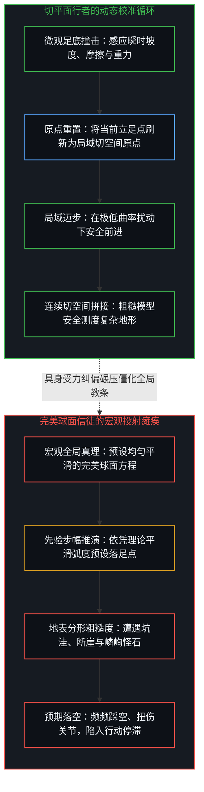
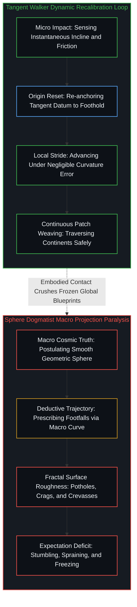
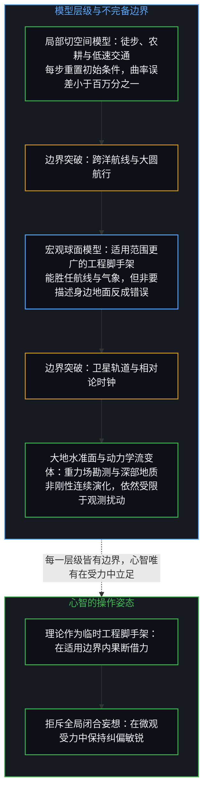
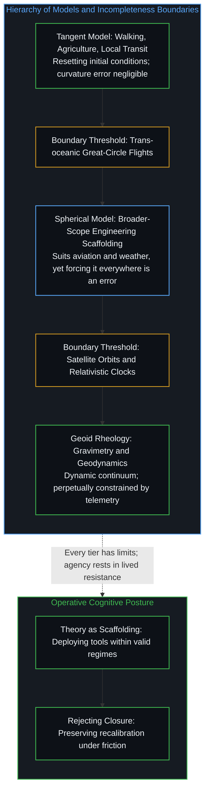

# 切平面的行者与完美球面的踩空者 / The Walking Tangent and the Stumbling Sphere

*微观受力中持续重置初始条件，胜过执迷宏观平滑曲率的瘫痪模型。 / Continuous recalibration under lived friction surpasses frozen models fixated on smooth curvature.*

无论是描述为理想平面还是完美球面，都是与粗糙现实并不吻合的人造模型。球面模型能够容纳范围更广的宏观应用，却并不代表它在任何场景下都更为准确；在我们绝大部分日常生活中，毫无必要借用球面模型来描述身旁的地面，非要拿球面统摄一切反而是一种认知谬误。平面模型唯有在描述超长距离或整个行星时才显得荒谬，而在近身受力的尺度上，它是最自然的一阶近似。只要在具身受力中持续校准基准，局部模型便足以支撑行者丈量大地；相反，若将宏观平滑曲率僵化为微观落脚的教条，反而会导致频频踩空。知识的生命力从来不在于抽象图景的闭合，而在于具身接触中动态重置坐标的敏锐。

Describing the Earth as an immaculate plane or as an immaculate sphere produces idealized models that do not conform to coarse reality; the spherical model merely accommodates a broader scope of macroscopic applications, which by no means implies it is more accurate in every operational setting. Across the vast majority of daily life, there is neither need nor reason to invoke a spherical framework to describe the immediate ground, and insisting on applying the sphere to everything is itself an erroneous practice. A planar model appears absurd only when overextended to describe trans-oceanic distances or the planet as a whole, whereas at tactile micro-scales it serves as the most natural first-order approximation. So long as it continuously recalibrates its baseline against lived friction, a localized tangent model suffices to traverse vast terrain; conversely, dogmatic attachment to smooth macro-curvature precipitates incessant stumbling. The vitality of knowledge lies never in the aesthetic closure of abstract blueprints, but in the sensitivity to reset coordinates continuously under embodied contact.

## 一、 地平说行者的认识论之谜 / 1. The Epistemological Mystery of the Flat-Earth Walker

在现代文明的认知共识中，地平说的拥护者常被当作无知与反常识的靶子。观察者热衷于嘲弄这一假说在宇宙学尺度上的破产，却极少审视一个更为深刻的行动现象：平面模型之所以看起来荒谬，仅仅是因为它被越界用来描述整个地球；但在绝大多数日常行走的场景中，大地本就是高度平坦的，地平模型在给定尺度下毫不荒谬，且展现出极高的实用性。即使一个人头脑中持有一套无法涵盖行星尺度的模型，他依然能够跨越山川、穿行都市，甚至周游世界，而从未从大地的边缘坠落深渊。从宏观推演的角度来看，一套在宇宙尺度上失效的模型理应使人在具体行动中处处碰壁；然而在现实中，行者在陆地步履与具身生产中并没有遇到阻碍。

In contemporary consensus, proponents of a flat earth are routinely targeted as emblems of stubborn ignorance. Observers relish ridiculing the planetary failure of the doctrine, yet rarely examine a far deeper operational reality: the flat model appears absurd only when overextended to describe the planet as a whole; across the vast majority of everyday terrestrial encounters, the ground is locally flat, rendering the model not absurd in the slightest, but exceptionally functional for its scale. Even an actor holding a model that fails at planetary horizons can hike across mountain ranges, commute through urban labyrinths, and circumnavigate continents without ever tumbling off the edge of the world. From a purely deductive standpoint, an error of cosmic scale ought to produce immediate operational failure; yet in ground reality, the terrestrial traveler steps across terrain with unhindered ease.

这一悖论揭示了人类行动与几何空间的尺度分层。在人体步幅与地表接触的微观尺度上，大地在数学上严格同胚于流形的局部切空间。相较于六千多千米的地球半径，人类几厘米到数公里的行动视野在曲率扰动上极其微弱。在局部切空间中将大地视作欧几里得平面，不仅不是致命的妄想，反而是极其高效的一阶线性近似。地平说的拥护者能够在空间中稳定推进，是因为他的生存活动被稳固约束在切空间的有效作用域之内。

This paradox illuminates the scale-dependent stratification between human movement and geometric space. At the microscopic scale of human strides and tactile contact, the terrain is mathematically homeomorphic to a local tangent space of a manifold. Compared to a planetary radius exceeding six thousand kilometers, human sensory horizons of a few meters to several kilometers exhibit negligible curvature perturbation. Treating the ground as a Euclidean plane within that localized patch is far from a fatal delusion; it constitutes an extraordinarily robust first-order linear approximation. The flat-earth traveler proceeds through physical geography because their bodily existence is naturally bounded within the tangent space’s domain of validity.

## 二、 初始条件的微观重置机制 / 2. Microscopic Recalibration of Initial Conditions

单纯拥有局部切空间的有效性，尚不足以解释漫长旅程中误差的非累积性。如果行者仅仅按照一张静态的平面地图进行开环航位推算，微小的角度偏差也会在数千公里后积聚为巨大的漂移，甚至将人引向悬崖。地平说信徒之所以从未走入死局，枢纽在于一套深植于具身感知之中的自适应校准循环：行者在每一次出发与迈步时，都根据地面反作用力重新刷新了初始条件。

Possessing local validity within a tangent space does not alone explain the non-accumulation of drift across prolonged journeys. If a traveler executed open-loop dead reckoning upon a static flat blueprint, microscopic angular errors would compound over thousands of kilometers into catastrophic divergence. The reason the flat-earth believer never marches into the void lies in an adaptive sensory feedback loop: with every single stride, the actor resets initial conditions against the normal force of the ground.

当靴底与岩石、泥土或碎石撞击的刹那，踝关节的偏转、前庭系统的倾角感应以及重力方向的垂直校准，瞬间完成了对当前接触面的微观勘测。在这个瞬间，心智将坐标原点与水平基线重置为脚下的立足点。换言之，一套理论只要允许其应用者在实体受力中对其初始参数进行务实修正，就能借助连续的切平面拼接，在适宜的边界内无限拓展其适用范围。行者并非行走在全局的平面上，而是行走在由千万个不断刷新的切空间编织而成的测地线上。在[路口的转向与地平说的行动悖论](../lu-kou-de-zhuan-xiang-yu-di-ping-shuo-de-xing-dong-bei-lun/)中，行者依靠的正是这种对脚下受力的敬畏；而在[向量、坐标系与自指心智](../the-mind-as-vector-and-coordinate-system/)中，心智通过不断平移自身坐标系的原点，获得了超越僵硬静态表象的机动自由。

The instant boot leather collides with stone, loam, or gravel, ankle torque, vestibular tilt sensors, and gravitational alignment immediately execute a microscopic survey of the contact patch. At that tactile microsecond, the mind re-anchors the coordinate origin and horizontal datum to the immediate foothold. A conceptual framework, however primitive its global tenets, can extend its functional horizon indefinitely so long as it permits practitioners to recalibrate boundary conditions against material resistance at every transition. The walker does not journey across an infinite Euclidean sheet; they advance along a geodesic woven from thousands of continuously refreshed tangent patches. In [Turning at the Crossroad and the Flat-Earth Action Paradox](../lu-kou-de-zhuan-xiang-yu-di-ping-shuo-de-xing-dong-bei-lun/), survival stems from deference to immediate ground contact, just as in [The Mind as Vector and Coordinate System](../the-mind-as-vector-and-coordinate-system/), the intellect secures dynamic sovereignty by translating the origin of its operational frame across successive encounters.

## 三、 完美球面的踩空陷阱 / 3. The Stumbling Trap of the Immaculate Sphere

反观那些手握宏观科学真理的纯理论信徒，容易跌入另一种更为隐蔽的认识论陷阱。地球是一个球体，这在宏观宇宙尺度上毫无疑问是极为优美的物理事实。然而，若将这一宏观曲率概念教条式地降格为微观步履的执行指令，行动者就会陷入寸步难行的困境。完美的几何球面意味着各向同性、曲率均一与表面无缝光滑；但现实中行者踩踏的大地，由风化的页岩、深浅莫测的沼泽、龟裂的硬土以及突兀的乱石构成。

Conversely, purists equipped with macroscopic scientific orthodoxy frequently stumble into a far more insidious trap. That the Earth is a sphere constitutes an empirically validated, cosmologically elegant fact. However, when an actor rigidifies this macro-geometric insight into a deterministic prescription for microscopic walking, action rapidly grinds to a halt. The immaculate geometric sphere implies smooth isotropy and uniform curvature; yet the ground confronting an embodied traveler consists of fractured shale, muddy sinkholes, jagged bedrock, and deceptive roots.

如果一个理论家坚信自己掌握了球面的宏观真相，并以此作为行走时的落脚预期，他就会要求脚下的每一步都严格符合均一平滑的几何弧度。当他迈出脚步时，他的心智预设地面会出现在理论计算的高度上；然而在微观地形中，地表的高度由复杂的地质分形与重力侵蚀决定。其结果必然是灾难性的：行者或者踏入预料之外的深沟而剧烈踩空，或者踢上高耸的岩石而折断趾骨。对宏观完美的教条式崇拜，非但没有赋予理论家更稳固的立足点，反而剥夺了神经系统感应微观粗糙度的机动性。在[未经自我审视的批判者](../the-unexamined-critic/)中，那种高踞看台俯瞰全局的傲慢，恰恰丧失了身处市场泥淖中承担微观受力的敏锐；而在[没有天才能够解决知识问题](../no-genius-can-solve-the-knowledge-problem/)中，全局统揽的狂妄预设必然在分散而异质的真实信息面前撞得粉碎。

If a dogmatist treats planetary curvature as an operative micro-template, expecting every forward stride to meet an immaculate mathematical contour, cognitive friction ensues. The mind calculates where the ground should arrive based on global equations; yet terrain elevations are shaped by fractal erosion and chaotic tectonic rifts. The consequence is continuous physical deficit: the theorist steps into empty air above an unforeseen ditch, or fractures an ankle against an anomalous boulder. Revering global precision blinds proprioception to localized roughness. In [The Unexamined Critic](../the-unexamined-critic/), spectator hubris perched above the stadium forfeits sensory attunement to market friction, just as in [No Genius Can Solve the Knowledge Problem](../no-genius-can-solve-the-knowledge-problem/), panoptic central planning fractures against the distributed heterogeneity of localized knowledge.

## 四、 局部有效性与不完备的边界 / 4. Tangent Approximation and Boundaries of Incompleteness

这是否意味着地平说是一套无需修正的真理？显然不是。切平面的有效性存在着严格且不可逾越的边界，这一边界标志着理论不完备性的位置。地平说行者能够在平原上健步如飞，并不意味着他的模型能够统摄所有的物理工程。当心智的任务从局域徒步迁移到跨洋航海、跨洲际航空调度、人造卫星入轨计算或全球定位系统的相对论时钟校准时，切平面的线性外推便会遭遇灾难性的断裂。

Does this imply that the flat-earth doctrine is a flawless philosophy? Manifestly not. The validity of a tangent approximation possesses precise, unyielding structural boundaries that demarcate its inherent incompleteness. That a walker thrives across local plains does not license the extrapolation of their model to all engineering domains. The moment an objective expands from terrestrial walking to trans-oceanic navigation, aviation routing, orbital mechanics, or satellite clock synchronization, linear planar projections break down completely.

在跨越数千公里的宏观任务中，地表的内在黎曼曲率无法再被局部的原点重置所吸收；黎曼曲率张量的非零特性导致了整体完整性的缺失，平行移动的向量在闭合路径上产生了无法消除的相位偏差。在此类高阶问题中，坚持地平说不仅不再是务实的简化，反而变成了致命的盲区。更深层次来讲，把地球描述成一个完美的平面或者一个完美的球面，都是与粗糙现实并不吻合的人造模型；球面模型之所以在科学实践中占据更核心的位置，只是因为它能够适应更多、更有效的实际应用，其有效应用范围更为广阔，但这并不代表它在任何情况下都是更为准确的模型。在我们绝大部分的日常生活中，无论匠人筑墙、修路还是普通人散步，我们既不需要、也毫无必要去引用球面模型来描述身旁的地面；非要拿球面去强行描述身边的一切，反而是一种脱离尺度的错误做法。事实上，即便把地球描绘为球体，它本身也依然只是一套处于特定尺度下的工程脚手架：在更精确的大地测量学中，地球是一个两极稍扁的旋转椭球体；在重力等势面测量中，它是一个凹凸不平的大地水准面；而在地幔对流与板块构造的动力学视角下，它是一个在时间中持续蠕变的非刚性流变体。

Across intercontinental horizons, the intrinsic Riemannian curvature of the surface can no longer be absorbed by localized origin resets; non-zero curvature tensors induce geometric holonomy, generating phase shifts that accumulate irreversibly over closed loops. In such macro-scale operations, clinging to a flat plane transforms from a pragmatic simplification into a catastrophic failure. At a deeper epistemological level, describing the Earth as an immaculate plane or as an immaculate sphere produces idealized models that fail to conform to coarse physical reality; the spherical model achieves prominence solely because it accommodates a wider, more effective domain of practical applications, yet having a broader scope does not make it a more accurate model under every circumstance. Across the overwhelming majority of daily life—carpentry, paving roads, or taking an evening stroll—human beings have neither the need nor the operational justification to invoke a spherical geometry to describe the immediate ground; insisting on using the sphere to describe everything is itself an erroneous practice. Even within macroscopic domains, the assertion that the Earth is a sphere remains a provisional scaffold: geodesy refines it into an oblate ellipsoid, gravimetry reveals an irregular geoid, and geodynamics exposes a convective rheological continuum.

每一个模型都在其特定的受力界面上充当脚手架；将其拔高为放之四海而皆准的客观实体，正是认识论僭越的根源。在[闭合的N与开放的现实](../the-closed-n-and-the-open-reality/)中，任何企图封闭变量的系统都会在现实的开放性面前显露残缺；而在[破除概念的僭越](../po-chu-gai-nian-de-jian-yue/)中，唯有剥离掉概念附加的神圣光环，心智才能看清模型不过是人造的认知探针。

Each model functions as engineering scaffolding across its specific interface; exalting any single tier into an all-encompassing cosmic decree is the taproot of epistemological overstep. In [The Closed N and the Open Reality](../the-closed-n-and-the-open-reality/), systems striving for analytical closure crack open against unfolding contingencies, just as in [Breaking Conceptual Overstep](../po-chu-gai-nian-de-jian-yue/), only stripping sacred pretenses from our vocabulary restores mental probes to their proper status as human artifacts.

## 五、 踏入泥泞的行动主权 / 5. Sovereign Action Stepping into the Mud

对行者而言，最危险的心智状态并非持有一套粗糙的局部理论，而是为了等待一套完美无瑕的全局理论而拒绝迈出当下的脚步。书斋中的哲学家可以坐在安乐椅上嘲笑行者的理论粗陋，但哲学家那张未经受力检验的精密地图，并不能帮他在荒野中避开深坑。当心智陷入对终极真理的病态依恋时，行动便会沦为空谈。

For an acting subject, the most paralyzing failure is not wielding a coarse, localized model, but refusing to take a step until an immaculate global doctrine descends from on high. The armchair philosopher comfortably mocks the intellectual crudity of the traveler, yet immaculate cosmological charts provide zero protection against jagged crevices in the wilderness. When consciousness succumbs to a neurotic addiction for finality, agency dissolves into endless debate.

人类心智普遍持有一种缺省的幻觉，预设有一个固定不变的客体静置在彼岸，等待着理论去揭示与“发现”。然而，生命永远无法跳离第一人称视角；心智所唤作现实的一切，无一不是自身认知框架对感知信号所作出的受力解释。每当我们言及现实，我们所触碰到的，仅仅是自身对世界的理解与具身感知之间爆发的动态摩擦。在感知之外，并不存在一个能够被确证的独立实体等待探索；所谓物理，不过是这种认知模型与未知阻力相互撞击时呈现出的宏观、可观测的受力图景。它既非现实本体，背后更没有一套静止不变的宇宙真相等待心智去封闭。在[模型永远无法成为第二重前沿](../the-model-never-becomes-a-second-edge/)中，认知模型不过是心智向外投射的残余表征，它从来无法代替第一人称心智去承受因果受力；唯有身处具体的接触之中，心智才能确证自身的存在。

Human consciousness habitually falls into a default illusion, presuming that a fixed, immutable reality lies waiting out there for theories to unveil and "discover." Yet living subjects can never step outside the first-person vantage point; everything the mind designates as reality is invariably an interpretative scaffolding projected by cognitive frameworks onto raw sensory feedback. Whenever we invoke the term reality, what we truly experience is nothing other than the dynamic friction ignited between our mental interpretations and immediate embodied perceptions. Beyond perceptual horizons, there is no determinable, standalone entity waiting to be uncovered; what we term physics is merely the macroscopic, observable phenomenon arising from the collision between cognitive models and physical resistance. Physics is neither reality itself, nor is there a static cosmic blueprint awaiting analytical closure. In [The Model Never Becomes a Second Edge](../the-model-never-becomes-a-second-edge/), cognitive models are merely residual traces projected by consciousness that can never supplant the first-person subject in absorbing causal resistance; only inside embodied contact does the acting mind confirm its ground.

真实的生存与创造从来不发生于光洁的象牙塔内，而发生于坑洼不平的粗糙地表。成熟的心智既不会将局部的切平面误认为全宇宙的真相，也不会让宏观球面的宏伟构想剥夺自己面对泥泞时的敏感。他握紧手中的临时工具，深知其不完备的边界所在；当脚掌踏向下一块湿滑的岩石时，他将所有的注意力交还给身体与石面撞击的震颤。初始条件在此刻被重新刷新，立足点在此刻被重新确立。在[成功的几何学：有限游戏陷阱](../the-geometry-of-success/)中，终点线的虚妄光环永远无法取代沿途对重力的抗衡；而在这一片起伏延展的广袤大地上，正是这些在微观受力中不断重置原点的坚实脚步，让生命得以穿透一切迷思，走出一条无可替代的真实道路。

Authentic creation never transpires upon frictionless marble; it unfolds across unyielding, fractured dirt. A sovereign intellect neither mistranslates a localized tangent patch into an eternal cosmic dogma, nor allows the grandeur of an immaculate sphere to numb its proprioception to the mud. The traveler grasps temporary tools with clarity, cognizant of their operational thresholds; as their sole descends onto the next slick stone, they focus entirely upon the shockwave of physical contact. Initial conditions refresh once more; the foothold anchors firmly in the present. In [The Geometry of Success](../the-geometry-of-success/), finish-line mirages never supplant the living counteraction against gravity; across this rugged, expanding terrain, it is the solid step resetting its origin under lived friction that pierces through intellectualist illusion, carving a singular path across the open earth.
