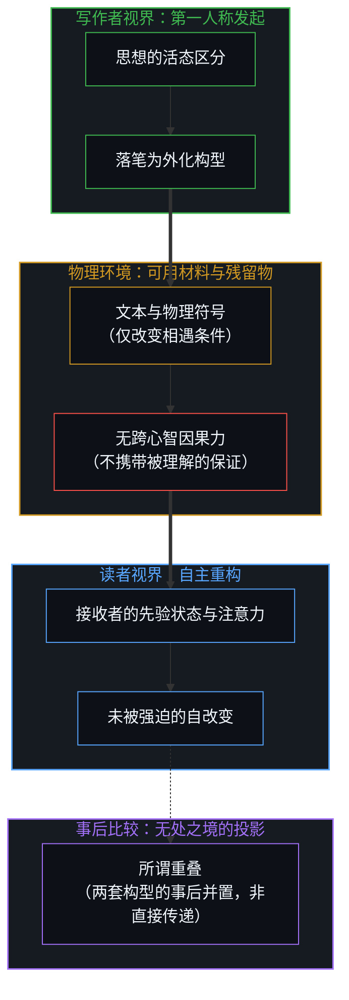
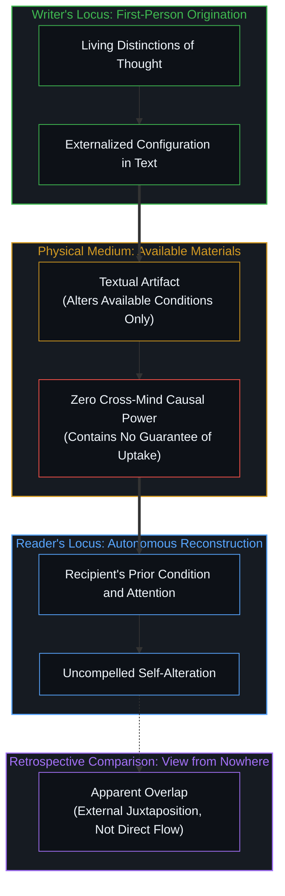

# 信任读者是最后的越界 / Trusting the Reader Is the Last Overstep

*文本只提供材料，是否被取用由读者自己决定 / The text supplies material; whether it is taken up is the reader's own act*

我一直主张，写作应当在思想所在的深度上落笔，不为当下的可读性稀释区分。常见的辩护是：相信读者，包括未来的自己，终会长到能够接住它。这个辩护听上去谦逊，其实仍藏着一个期待，即文本被放出去之后，还能替写作者守住被理解的可能。我要说的是，连这份信任也是越界，而且注定落空。落空的不是沟通，而是不被误解的沟通。

I have long held that writing should be set down at the depth where the thought actually stands, without diluting distinctions for immediate readability. The usual defense adds that one should trust the reader, including one's future self, to grow into it. The defense sounds modest, yet it still hides an expectation: that the released text can keep, on the writer's behalf, the possibility of being understood. My claim is that even this trust is an overstep, and a futile one. What fails is not communication but communication free of misunderstanding.

## 一、 心智之间没有直接的因果力 / 1. No Direct Causal Power Between Minds

这个结论只从一个前提推出：一个心智对另一个心智没有直接的因果力。言语、文字、手势都不能把某个内容安放进另一个心智。它们能做的，是改变对方可以遇到的条件。我在[理性从不跨越心智](../rationality-never-travels-across-the-mind/)里说过，一个心智登记为理性的东西，到了另一个心智那里已经被重写；[价格是言说，理解是交易](../price-as-utterance-understanding-as-trade/)也说明，公开的残留物唯一的力量，在于每个中心如何把它重新追溯进下一个行动。写作者交出的是同一种残留物。

The conclusion follows from a single premise: one mind has no direct causal power over another. Speech, writing, and gesture cannot place a content inside a second mind. What they can do is alter the conditions the other mind may meet. I argued in [Rationality Never Travels Across the Mind](../rationality-never-travels-across-the-mind/) that what one mind registers as rational arrives in another already rewritten, and [Price as Utterance, Understanding as Trade](../price-as-utterance-understanding-as-trade/) shows that a public residue has no force except how each center re-traces it into its next act. What the writer releases is residue of that kind.

所以“沟通改变了对方的状态，并产生了部分重叠的区分”这个说法本身就错置了因果力。文本不改变对方的心智，它只改变对方可以取用的材料。对方是否据此改变自己，如何改变，改变到哪里，都取决于对方当下的条件与抉择。事后被称作“重叠”的东西，是两套各自生成的构型被放在一起比较的结果，而不是从一方流到另一方的效应。

So the familiar phrase, that communication alters another mind's states and produces a partial overlap of distinctions, already misallocates causal power. The text does not alter the other mind; it alters the materials available to it. Whether that mind changes itself on their basis, how, and how far, rests with its present condition and its choice. What is later called "overlap" is a comparison drawn between two independently generated configurations, not an effect that flowed from one to the other.

## 二、 视网膜上的光子也不例外 / 2. Not Even the Photon on the Retina

最顽固的反驳会退到感官层面：光子被视网膜的感光色素吸收，这总是外部来源直接造成的物理变化吧。我承认这是一次相互作用，但相互作用的条件一旦被改变，后面发生什么就取决于接收的一方。眼睛每一刻都接收海量光子，其中绝大多数从未成为信号；即便被吸收、被转导，它是被当作信号保留，还是像其余光子一样被忽略，取决于接收的心智。来源只提供了光，提供不了“被看见”。

The most stubborn objection retreats to the senses: surely a photon absorbed by a retinal photopigment is a physical change caused directly by the external source. I grant that it is an interaction, but once the conditions of the interaction have been altered, what follows depends on the receiving side. The eye receives an enormous number of photons at every moment, and almost none of them ever become a signal. Even when one is absorbed and transduced, whether it is kept as a signal or ignored like the rest depends on the receiving mind. The source supplies light; it cannot supply being seen.

把这一点讲成“早期的感官变化由输入固定，只有后续的概念重组才属于接收者”，是在一条因果链上预先划好一道线，再宣称线的一侧不需要接收者。这道线并不是链条自己画出来的。正如[观察者的隐身与无损传递的妄念](../the-invisible-observer-and-the-delusion-of-lossless-transmission/)所揭示的，把观察者从描述里抹去，才会以为存在一段无需接收者参与的传递。

To say that early sensory change is fixed by the input and only later conceptual reorganization belongs to the receiver is to draw a line across a causal chain in advance and then declare that one side of it needs no receiver. The chain does not draw that line for itself. As [The Invisible Observer and the Delusion of Lossless Transmission](../the-invisible-observer-and-the-delusion-of-lossless-transmission/) shows, only by erasing the observer from the description can one imagine a stretch of transmission in which the receiver takes no part.

## 三、 决定论让一切论证失去意义 / 3. Determinism Makes Every Argument Moot

另一种反驳是诉诸决定论：只要给定定律与先前状态，一切后续状态都被固定，那么谁贡献了什么，可以从因果链里客观读出。可是，如果一切都可以被决定论地解释，那么这场论证本身也只是被预先决定的轨迹，“相关”与“不相关”的区分便无从由系统内部宣称。[无人能持有的功能主义](../the-functionalism-no-functionalist-can-hold/)里的困境在这里重演：持有这一立场的人，恰恰需要一个这一立场所否认的观察者。

Another objection appeals to determinism: given the laws and the prior state, every later state is fixed, so who contributed what can be read off the causal chain objectively. But if everything can be explained deterministically, then this very argument is also a predetermined trajectory, and the distinction between "relevant" and "irrelevant" cannot be claimed from inside the system. The predicament of [The Functionalism No Functionalist Can Hold](../the-functionalism-no-functionalist-can-hold/) repeats here: whoever holds the position needs exactly the observer the position denies.

更精细的回答是用“造成差异”的标准：在定律给定的情况下，改变某个条件而保持其余不变，看结果是否改变。这个回答诚实地退到了最后一步，而这一步正是关键所在。“给定一组定律”不是这组定律能够自己宣称或推导出来的，它必须先从外部被给出。何为输入、何为运作、哪些条件保持不变、因果链从哪里“开始运行”，这些边界都是被给定的，不是被证明的。

The more careful reply uses the difference-making test: with the laws given, vary one condition while holding the others fixed and see whether the outcome changes. This reply retreats honestly to the last step, and that step is the whole point. "Given a set of laws" is not something the laws can claim or derive for themselves; it has to be given first, from outside. What counts as input and what counts as operation, which conditions are held fixed, where the chain is "already under way": these boundaries are given, not proven.

## 四、 无处之境是系统的初始条件 / 4. The View from Nowhere Is the System's Initial Condition

这就是我一直所说的无处之境。它不在交流之内，我也从未声称它能在内部被识别出来。它是初始条件，因而是整个系统的因果条件本身。[因果的自反性与物理的无源假定](../causality-is-irreducible-the-physical-is-a-view-from-nowhere/)已经指出，物理主义把这个被给定的起点藏进了“客观”之中；[自我形象仿佛从无处发声](../self-image-speaks-as-if-from-nowhere/)和[框架的边界](../the-boundary-of-the-frame/)则说明，每一个看似中立的裁决都站在一个自己画不出的框里。

This is what I have been calling the view from nowhere. It is not inside the exchange, and I never claimed it could be identified inside. It is the initial condition, and therefore the causal condition of the system itself. [Causality is Irreducible; The Physical is a View from Nowhere](../causality-is-irreducible-the-physical-is-a-view-from-nowhere/) already showed physicalism tucking this given starting point into "objectivity", while [Self-Image Speaks as if from Nowhere](../self-image-speaks-as-if-from-nowhere/) and [The Boundary of the Frame](../the-boundary-of-the-frame/) show that every apparently neutral verdict stands inside a frame it cannot draw for itself.

一旦看清这一点，理解的可能性便落在了正确的位置。接收的心智仍有可能选择与写作者相同的初始条件，但在实践中从来不会恰好如此，因为这一选择无法由传递过去的材料来指定。读者在遇到文本的那一刻，已经带着不同的状态；材料里没有任何额外的约束能抹平这一差异。对齐若发生，是读者未被强迫的行动。这正是[理解的非对称性](../the-asymmetry-of-understanding/)所说的误解无限的来由，也是我在[无法逃逸的心智视界](../one-cannot-escape-ones-own-mind/)里所坚持的：没有人能走出自己的心智去替另一个心智完成理解。

Once this is seen, the possibility of understanding falls into its proper place. The receiving mind can still choose the same initial conditions as the writer, yet in practice never exactly, because that choice cannot be dictated by the materials transferred. At the moment of encounter the reader already carries a different state, and nothing in the materials adds a constraint that erases the difference. When alignment happens, it is the reader's uncompelled act. This is the source of the infinite misunderstanding described in [The Asymmetry of Understanding](../the-asymmetry-of-understanding/), and it is what I hold in [One Cannot Escape One's Own Mind](../one-cannot-escape-ones-own-mind/): no one can step out of their own mind to complete understanding on another's behalf.

## 五、 未来的自己也是另一个读者 / 5. The Future Self Is Another Reader

同样的限度约束着未来的自己。后来的我与此刻的我之间，只有记忆、笔记与已经改变的概念框架作为连续；原初的思想不会被直接移交过去。重读是在改变了的条件下的重新构建，作者身份并不保证原样复得。[真正稀缺的不是记忆，而是持续的重新追溯](../the-real-scarcity-is-not-memory-but-continuous-re-tracing/)说的正是这一点：保存下来的只是材料，追溯必须由当下的心智重新做一遍。

The same limit binds the future self. Between the later self and the present one there is continuity only through memory, notes, and conceptual frames that have already shifted; the original thought is not handed across. Rereading is reconstruction under altered conditions, and authorship does not guarantee recovery as it was. [The Real Scarcity Is Not Memory, But Continuous Re-Tracing](../the-real-scarcity-is-not-memory-but-continuous-re-tracing/) says exactly this: what is stored is material, and the tracing has to be done again by the present mind.

## 六、 写作只对自身的区分负责 / 6. Writing Answers Only to Its Own Distinctions

于是我当初那句话的分量就清楚了。在全深度上写作，然后信任读者或未来的自己来接住它，等于把“被取用”当成文本放出后还能留在原地的东西。既然材料无法指定读者的初始条件，这份信任就把一种传递并不具备的残余效力归给了写作者。它越界，并且落空，不是因为沟通对可用条件毫无影响，也不是因为部分重合不可能，而是因为任何表述都无法把一次不受指定的采纳，变成一次不被误解的沟通。

So the weight of my original remark becomes clear. To write at full depth and then trust the reader, or the future self, to meet it is to treat uptake as something that stays in place after the text is released. Since the materials cannot dictate the reader's initial conditions, that trust grants the writer a residual efficacy the transfer does not have. It oversteps, and it fails, not because communication leaves the available conditions untouched, and not because partial coincidence is impossible, but because no formulation can turn an undictated adoption into a communication free of misunderstanding.

这也修正了我在[高维信息的离散折射与认知分层](../gao-wei-xin-xi-de-li-san-zhe-she/)里留下的一点余温。那里我说，坚持高维推演的沟通会让受众在时间轴上陆续跟上。陆续跟上的人确实会有，但那是他们自己的抉择，不是我写下的东西替他们完成的。写作者能负责的，只有区分的精确、对过早闭合的拒绝、对思想此刻所在之处的忠实。把这些做好，然后放手。放手不是冷漠，而是把因果力还给它所属的地方：每一个读者，包括后来的我，都只能自己决定是否用这些材料改变自己。

This also corrects a trace of warmth I left in [The Discrete Refraction of High-Dimensional Information](../gao-wei-xin-xi-de-li-san-zhe-she/). There I said that communication which holds to high-dimensional reasoning lets audiences catch up over time. Some will catch up, but that is their own choice, not something my writing completes for them. What a writer can answer for is the precision of distinctions, the refusal of premature closure, and fidelity to where the thought stands now. Do that well, and let go. Letting go is not indifference; it returns causal power to where it belongs. Every reader, including my later self, can only decide alone whether to change themselves with these materials.
