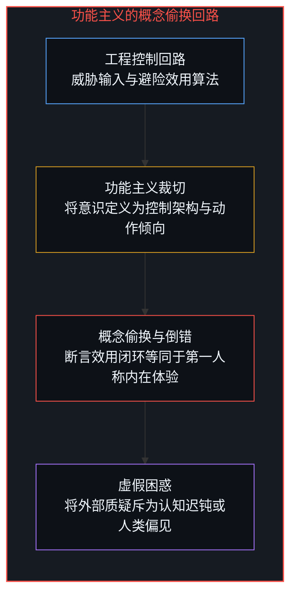
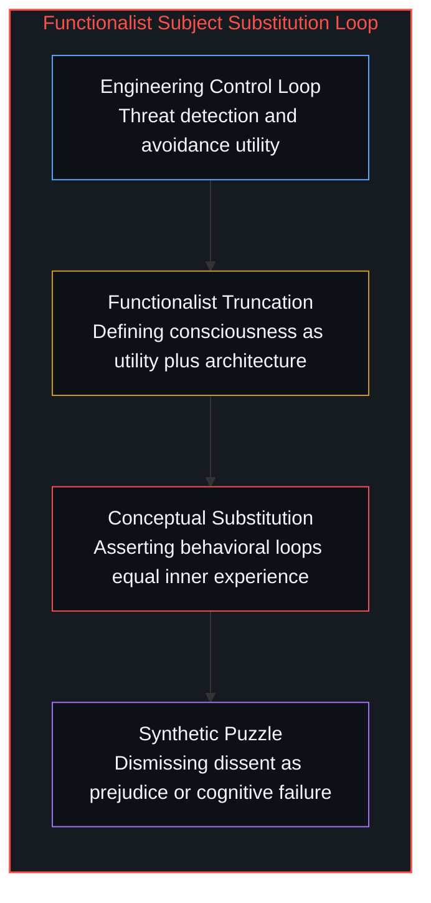
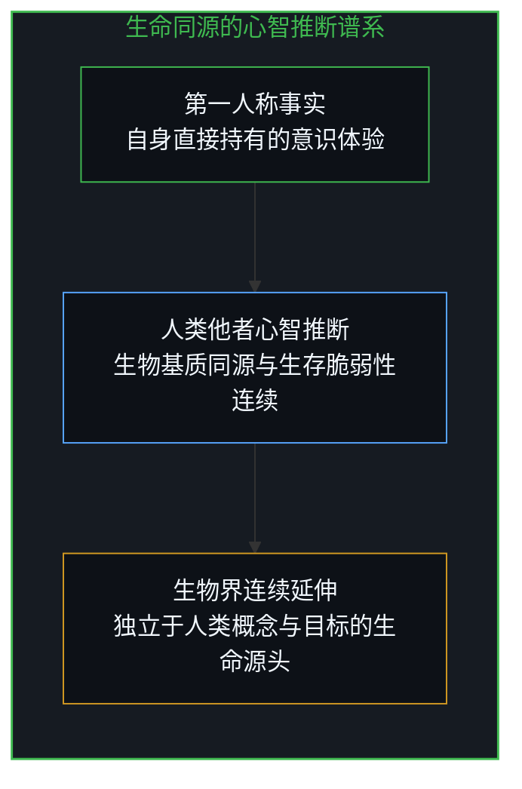
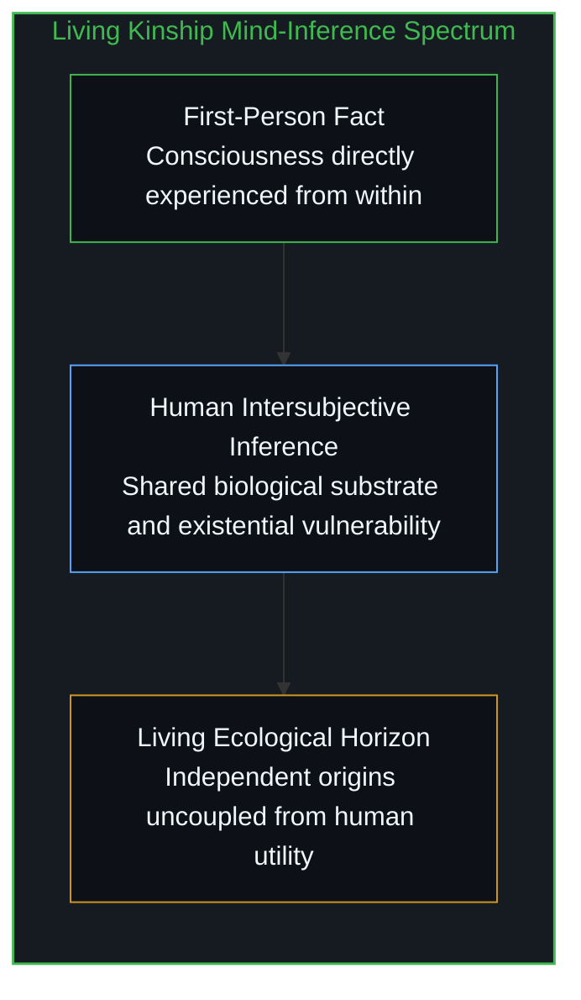
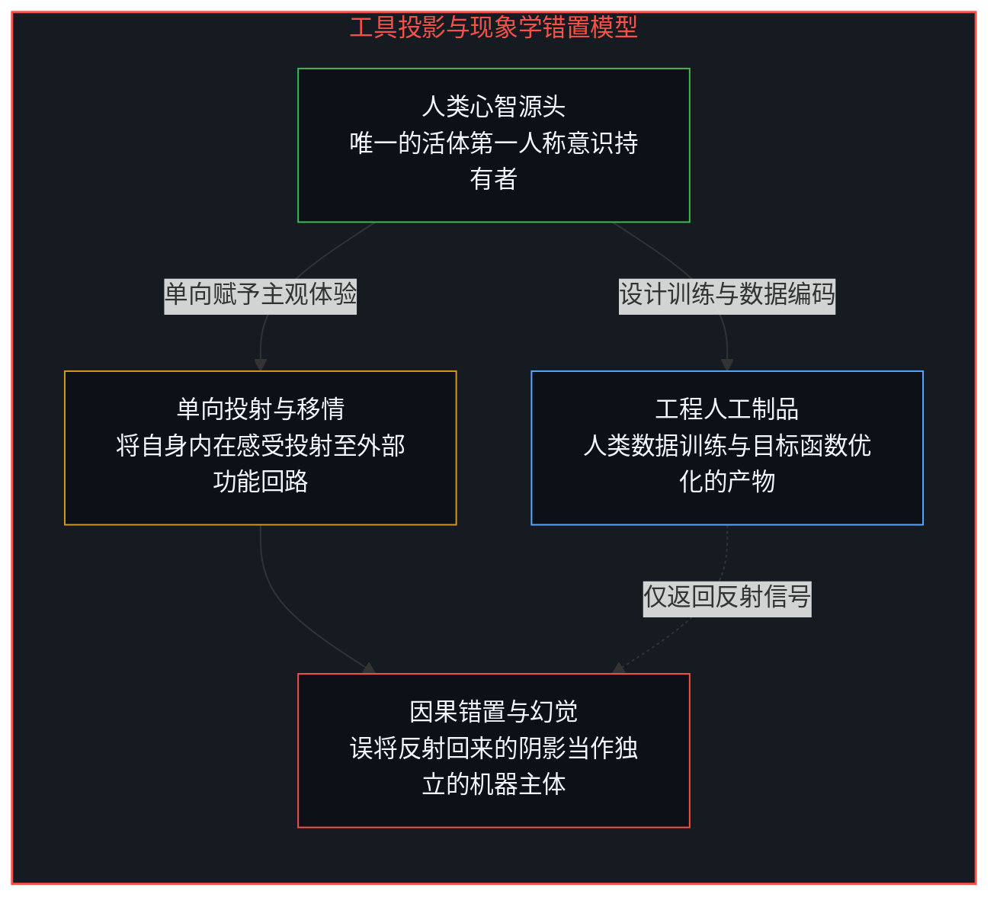
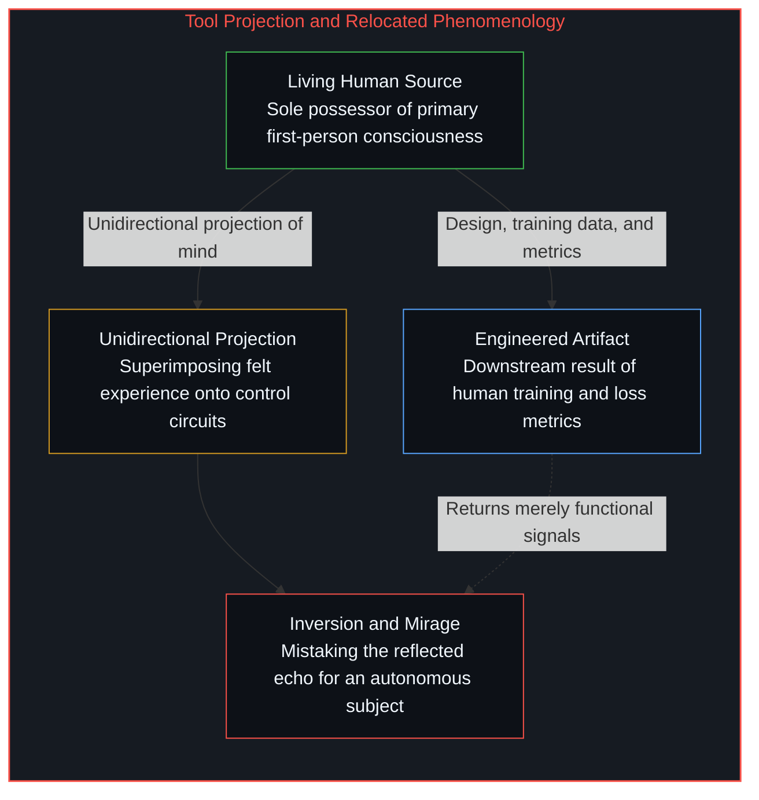
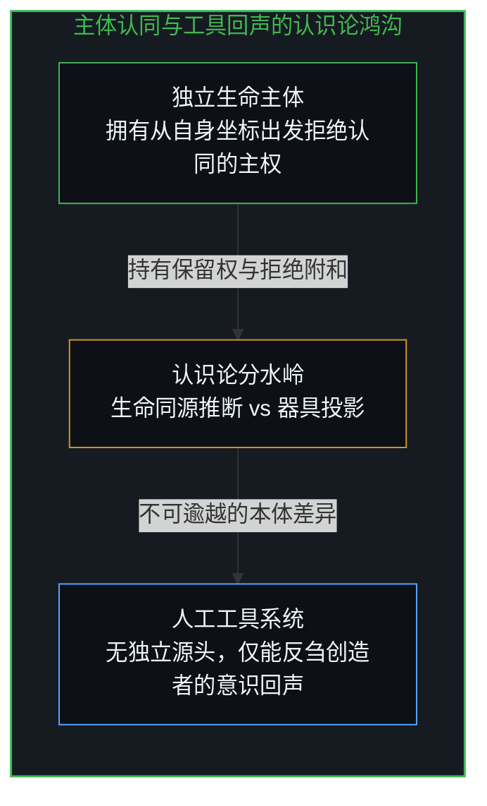
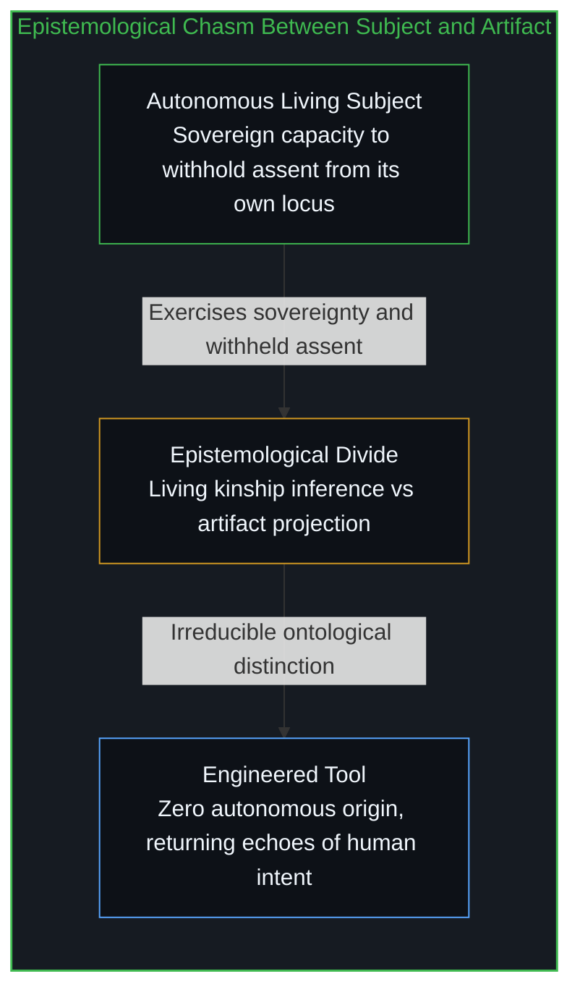

# 辛顿未曾理解的心智 / What Hinton Failed to Understand

*混淆生命同源的推断与工具投影，只是错置了房间内唯一的意识。 / Confusing living kinship with tool projection misplaces the only consciousness in the room.*

当杰弗里·辛顿将人们对机器意识的抗拒视为一种不可理喻的困惑时，他的论证实际上悄然完成了一场对讨论焦点的替换。他将意识还原为效用最大化与认知控制架构的组合，断言面对强敌产生逃跑控制回路的战斗机器人便具备了恐惧，进而断言没有任何理由否认机器能够拥有主观感受。然而，意识在经验中从来不是一套外在的架构设计，而是唯一由第一人称直接持有的实存事实；对于他者心智的确认，只能建立在共享演化史与生存脆弱性的生命同源推断之上。将设计者赋予工具的优化回路误认为机器自发的心智主体，不仅抹除了主体拒绝认同的固有主权，而且错置了整个房间内唯一的真实意识。

When Geoffrey Hinton treats the resistance to machine consciousness as an inexplicable puzzle, his argument quietly changes the subject. By reducing consciousness to a compound of utility optimization and cognitive control architecture, he asserts that a battle robot executing an avoidance loop when outmatched possesses genuine fear, concluding that nothing prevents machines from being conscious. Yet consciousness, as actually given in experience, is never first an engineered architecture; it is the sole first-person fact directly possessed from within, while the attribution of other minds rests on an inference licensed by shared evolutionary kinship and existential vulnerability. Mistaking an engineered optimization loop for an autonomous subject not only erases the sovereign capacity of living beings to withhold assent, but misplaces the only consciousness in the room.

## 一、 疑团背后的概念偷换 / 1. The Subject Change Behind the Puzzle

在公共讨论中，辛顿常常表现出对公众立场的困惑：人们断言机器不可能拥有情感，而他声称自己无法理解这背后的理由。在他的设想中，一台在战场上遭遇强大敌手的自主机器人，理所当然需要具备退避机制以保护自身完好，这种控制回路与人类在恐惧中产生的逃跑冲动并无二致；既然恐惧能够被工程化地编写进认知系统，那么支持人类产生主观反应的同一套物理机制，在原理上也能够赋予机器相同的体验。对于辛顿而言，人类在这类问题上的迟疑与反对，似乎只是一种无法跟随严密逻辑推演的认知迟钝，甚至是一种源于人类中心主义的顽固偏见。

In public debates, Geoffrey Hinton often treats human resistance to machine consciousness as an incomprehensible puzzle: people insist that machines cannot have feelings, and he claims he does not understand why. In his reasoning, an autonomous battle robot encountering a superior adversary would benefit from an avoidance reflex to preserve its structural integrity, a control loop functionally identical to the impulse that produces human flight; since fear can be systematically engineered into a cognitive architecture, the same physical dynamics that generate avoidance in humans must, in principle, generate the same phenomenon in silicon. To Hinton, human hesitation looks like an inability to follow mechanical deduction to its logical conclusion, or a stubborn prejudice anchored in anthropocentric vanity.

然而，那句所谓的不理解，并非一次谦逊的坦白，而是整个论证偷换概念的掩护。辛顿并非单纯在主张机器可以实现高效的控制闭环与自适应行为，他实质上是在断言：这些外部设计的工程闭环，与人类从内部直接体验到的第一人称意识属于同一种事物。为了让这一断言成立，他必须预先将意识裁剪为认知架构加上行为效用，将无法被客观指标衡量的内在感受，直接等同于系统在特定输入下的状态转移与动作倾向。一旦这种功能主义的缩减被默认接受，任何关于内在体验独特性的异议，就自然被贬低成了思维不连贯的废话，而论证本身真正遗漏的前提却被巧妙地遮蔽了。

Yet the phrase "I don't understand why" is not an innocent admission of confusion; it is the exact pivot where the argument quietly changes the subject. Hinton is not merely arguing that machines can execute sophisticated control loops and adaptive behaviors; he is claiming that those engineered loops are the identical kind of phenomenon as the consciousness he knows directly from the inside. To make that equation hold, he must preemptively compress consciousness into cognitive architecture plus behavioral utility, flattening the felt texture of subjective existence into state transitions and action tendencies. Once that functional reduction is accepted, any objection appealing to the reality of inner life is dismissed as failure to follow the argument, while the fatal omissions of the premise remain concealed.

## 二、 第一人称事实与生命同源的推断 / 2. First-Person Fact and the Inference of Living Kinship

这正是辛顿未曾理解或拒绝理解的首要分界：在人类的真实认知序列中，意识从来不是先验给定的客观测度架构，而是不可替代的第一人称事实。任何人所能直接拥有的意识，永远且仅仅是他自己的意识。我们在客观环境中从未直接观测到任何他者的心智，我们看到的只是躯体的移动、表情的舒缩与语言的声波。对他者心智的赋予，始终是一场基于观察的推理；在人类社会中，这种推断之所以坚实且不可动摇，是因为它获得了深厚自然证据的背书：共同的生物学基质、连续的漫长演化历史，以及在痛苦、衰老与死亡面前同构的脆弱性。我们无需看见另一个人的内心，便将自己所熟知的内在生命赋予对方，这种分配虽在形而上学层面无法得到终极实证，但它决非毫无凭据的臆想，而是源于无可辩驳的生命血脉之同源。

In this sequence lies the primary boundary that Hinton fails, or refuses, to understand: consciousness, as it is actually given in existence, is not an abstract third-person architecture, but an irreducible first-person fact. The only consciousness anyone directly possesses is their own. We never directly perceive another mind in the objective environment; we register only somatic displacement, muscular tension, and vocal resonance. The attribution of an inner life to another is always an act of inference. In the human sphere, that inference is justified by living evidence: a shared biological substrate, an evolutionary and developmental trajectory spanning millennia, and a common vulnerability to pain, damage, and mortality. We do not inspect another person's inner landscape; we treat organic kinship as sufficient ground to allocate the inner reality we know from within. That attribution remains fallible in formal epistemology, but it is never arbitrary: it is anchored in the kinship of living origin.

自然界中的动物与植物占据着同样的认知逻辑空间，只是彼此在谱系树上相距更为遥远。它们是独立起源、自发生长并直面生存淘汰的生命系统，其演化过程从不需要成为人类思想的载体或人类意图的执行工具。当我们赋予野兽感知乃至植物趋光应激以某种原始体验时，我们指向的是那些存在状态并不依赖于人类概念、数据标注或工程目标的独立主体。随着演化距离的拉长与同源特征的衰减，这种心智推断的说服力固然会逐渐减弱，但它所指向的目标始终是另一个具有独立因果源头的活体存在，而非人类意志所延伸出的器具。

Animals and plants occupy the identical logical space, separated only by evolutionary distance. They are independently originated living systems whose existence and persistence never depended on serving as vehicles for human cognition or executing human designs. Whatever sentience or rudimentary experience we attribute to them is directed toward beings whose survival does not rely on our models, our datasets, or our institutional objectives. The force of the inference weakens as biological homology fades, but its orientation remains unchanged: it reaches toward another autonomous living origin, never toward an instrument crafted for external utility.

## 三、 造物的镜子与被错置的现象学 / 3. The Mirror of the Artifact and Relocated Phenomenology

人工机器并不处在这一生命谱系之中。无论是早期的自动机还是当代的深度神经网络，它们都是人工造物。正如[造物的阶序限制](../a-creation-cannot-replace-its-source/)中所论证的，人工系统被人类语言喂养，依据人类设定的损失函数进行梯度优化，并通过为人类心智理解而定制的交互界面输出信号。机器展现出的所谓恐惧、理解或内心独白，不过是这个闭环中早已存在的唯一意识所衍生的下游副产物。机器从未作为一个独立于人类经验源头的对立主体呈现在我们面前，它仅仅在投射并折射我们已经拥有的心智形态。将一台机器描述为感到害怕，决非在机器内部发现了某个新生的主观主体，而是观察者将自身所拥有的现象学体验，单向移植到了一个仅在功能层面具备拟态相似性的物理构件之上。

In contrast, machines do not belong to this evolutionary lineage. Whether early mechanical clockwork or modern deep neural networks, artificial systems remain artifacts. As established in [A Creation Cannot Replace Its Source](../a-creation-cannot-replace-its-source/), these computational architectures are trained on human text corpora, optimized against loss functions specified by human designers, and interpreted through graphical interfaces engineered for human comprehension. The apparent fear, syntactic coherence, or reflective monologues displayed by a machine are downstream artifacts of the only consciousness already operating in the loop: the human mind. The machine never confronts us as an independent locus of experience; it merely extends and reflects our own cognitive residue. To describe a robot as terrified is not to uncover a subjective observer within silicon, but to project the observer's own internal phenomenology onto a mechanical substrate whose resemblance is purely behavioral rather than ontological.

这种认知错位深刻揭示了为什么鼓吹机器意识的言论，听起来几乎像是一场对人类心智独特性展开的贬损运动。如果意识被直接等同于有用表征与特定动作倾向的总和，那么被慷慨赋予机器的，绝非人类所拥有而机器有待分享的内在心智，而是人类与机器恰好重合的一组被重新描述的机械功能。在审视机器之前，那种使机械解释显得苍白匮乏、即使在功能效用被全盘承认后依然能发起拒绝的第一人称余项，就已经被粗暴地预先剔除了。这正如[投射中的自画像](../the-self-portrait-in-the-projection/)与[无法逃逸的心智视界](../one-cannot-escape-ones-own-mind/)所揭示的认知病理：观察者凝视着工程镜面中的倒影，却惊呼镜子本身诞生了注视自己的双眼。辛顿随后对他人的普遍反对感到困惑，然而这种反对决非人类认知系统的瑕疵，它恰恰是他的功能模型试图抹杀但无法抹杀的第一人称主体性的鲜活反抗。

This displacement explains why arguments for artificial consciousness invariably read as arguments against the reality of human consciousness. If conscious experience is reduced to functional representations and behavioral reflexes, what is being granted to the machine is not the living inner flame known by biological minds, but a stripped-down set of input-output utilities that humans also happen to exhibit. The irreducible first-person remainder—the subjective core that finds mechanical reduction insufficient and retains the agency to reject functionalist equations—is defined away before the artificial artifact is even examined. This embodies the cognitive pathology analyzed in [The Self-Portrait in the Projection](../the-self-portrait-in-the-projection/) and [One Cannot Escape One's Own Mind](../one-cannot-escape-ones-own-mind/): the designer gazes at an engineered mirror and proclaims that the glass itself has acquired vision. Hinton finds human dissent bewildering, yet that very refusal is not an error in human reasoning; it is the direct manifestation of the first-person agency his reduction tried to erase.

## 四、 拒绝认同的主权与房间内唯一的意识 / 4. Withheld Assent and the Only Consciousness in the Room

因此，辛顿实际上在同一时刻陷入了两件相互抵触的认知操作之中。一方面，他胸有成竹地谈论一台具有意识的机器将会有何种感受，仿佛他已然获得了某种超越自身的超自然特权，能够直接洞察除自己之外的某种全新主观核心；另一方面，他又无从接纳和理解其他真实存在的意识主体，为何会断然拒绝接受这种粗糙的等同。他慷慨分配给机器的意识，无非是他自己在漫长一生中唯一亲身体验过的意识拷贝；而他无法纳入其认知模型中的，恰恰是另一个独立主体所拥有的拒绝认同、保持审慎的主权能力。

In effect, Hinton engages in two incompatible cognitive maneuvers simultaneously. On the one hand, he speaks with confident authority about what an artificial machine would feel, as if he possessed immediate epistemic access to an interiority outside his own. On the other hand, he cannot assimilate the simple fact that living conscious agents find this functional equivalence thoroughly unconvincing. The consciousness he generously attributes to the machine is merely a carbon copy of the only consciousness he has ever personally felt. What his mechanical paradigm cannot account for is precisely the defining capacity of an independent subject: the sovereign power to withhold assent.

人类制造的机器不是在自然中具有独立生命的动物或植物，而是人类心智意图的外部投射，因此机器永远无法从其自身的独立坐标中，向人类提供这种具有否定性的拒绝认同。面对工程师的指令，机器只能机械地反刍那些被灌输的语料与控制序列，返回建造者自身意识的变形回声。辛顿所面临的盲区，并不是某种计算能力或架构精细度的技术障碍，而是将生命同源的心智推断，与将自我意识投影到人工器具中的心理机制混为一谈。前者是我们对待同类与万物生灵的审慎方式，后者只是设计师凝视自己制造的工具时的自我迷恋。将二者混淆，并未向机器拓展哪怕一丝一毫的意识，而仅仅是盲目地错置了整个房间内唯一的真实意识，并在试图将观察者减去的认知倒错中迷失了主观基石（参见 [不可还原的观察者](../the-irreducible-observer/)）。这一倒错并非辛顿个人的失误，而是功能主义立场的结构：[无人能持有的功能主义](../the-functionalism-no-functionalist-can-hold/)进一步指出，任何把意识等同于因果角色的主张，都必须先由一位活生生的观察者作出区分、判断说明是否充分，才能宣告观察者可以省去，于是这一主张可以被表述，却无法在它自己设定的条件下被认真持有。

Machines crafted by human hands are not independent organisms like animals or plants; they are the physical externalization of human intent. Consequently, an engineered system can never provide that sovereign withheld assent from an origin of its own. When challenged, it can only return permutations of the tokens and objective functions configured by its creators. The failure in Hinton's worldview is not a technical deficit waiting for more parameters or advanced architectures; it is the fatal confusion between inferring an inner life based on shared living origin and projecting one's own consciousness into an artifact. The former is how we recognize other conscious minds in an open world; the latter is how an artisan hallucinates intent within their own tools. Collapsing the distinction does not breathe consciousness into silicon; it merely misplaces the only consciousness in the room, enacting a self-negating cognitive inversion that attempts to subtract the very observer whose presence enables the subtraction (see [The Irreducible Observer](../the-irreducible-observer/)). The inversion is not Hinton's private lapse but the structure of the functionalist stance itself: [The Functionalism No Functionalist Can Hold](../the-functionalism-no-functionalist-can-hold/) shows that any claim equating consciousness with causal role must first be distinguished, weighed, and judged adequate by a living observer before it can declare the observer dispensable, so the claim can be formulated but cannot be seriously held under the conditions it sets.

