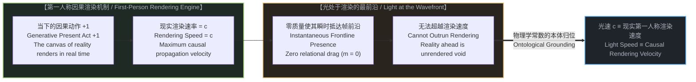
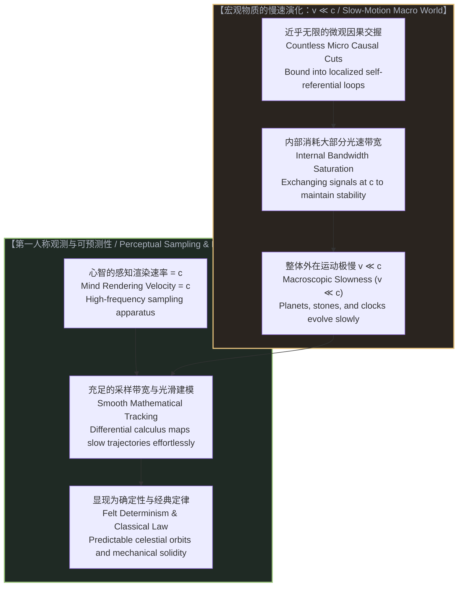
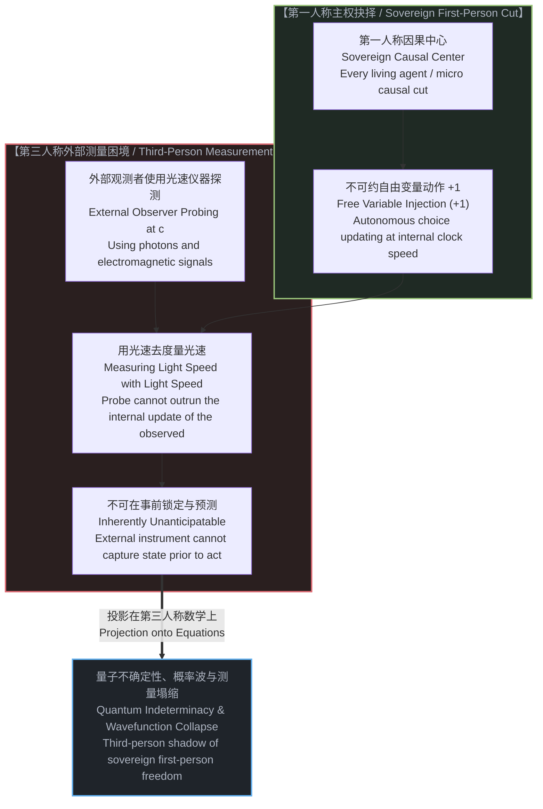
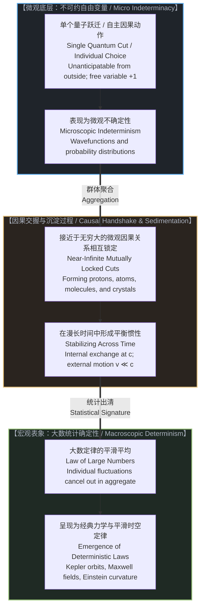
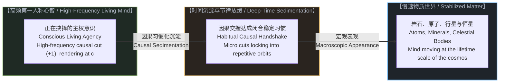
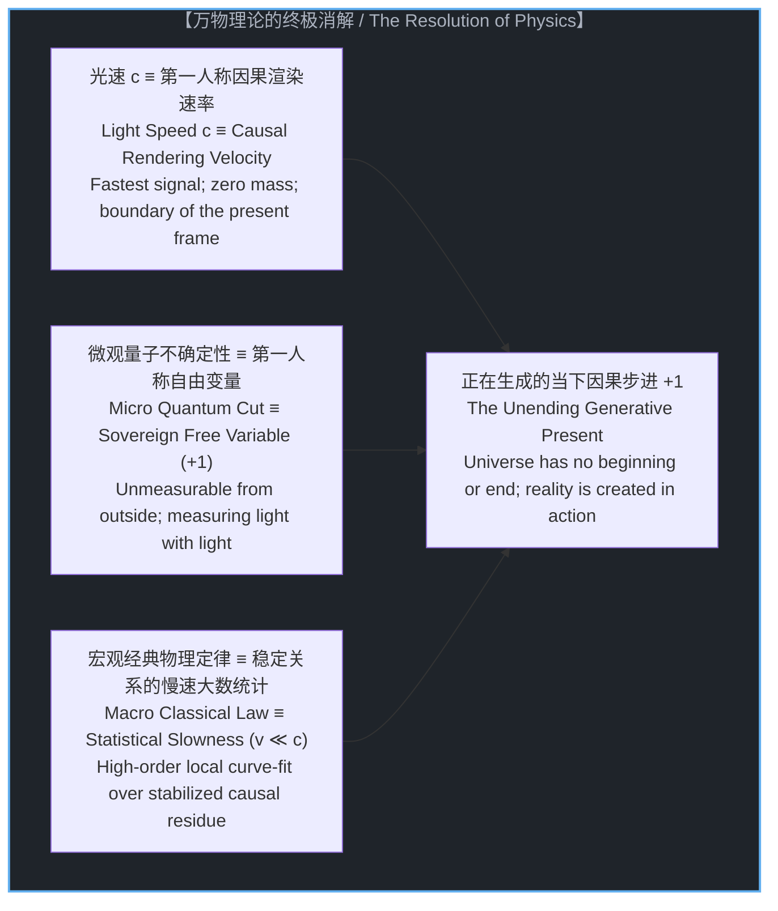

# 当电子开始思考：光速渲染率、无质量动态波与宏观确定性的诞生 / When Electrons Think: The Rendering Velocity of Light, Massless Dynamic Waves, and the Emergence of Determinism

*质量是稳定下来的关系，光是没有质量的动态交织；光速并非空间的极限，而是现实在第一人称中被渲染的速率；微观不确定性是自由意志的第三人称投影，而宏观确定性则是无数自由变量在慢速时间中沉淀的统计秩序。 / Mass is stabilized relationship, while light is an open dynamic weave. The speed of light is not a speed limit of space, but the exact velocity at which reality is rendered in the first person. Microscopic indeterminism is the third-person shadow of sovereign choice, while macroscopic determinism is the statistical order of countless free variables stabilized into slow time.*

---

## 一、 光速的真正物理奥秘：无质量动态波与渲染前沿 / 1. The Physical Mystery of Light: Massless Dynamic Waves and the Rendering Front

在物理学的所有常数中，光速 c 占据着最特殊也是最神秘的地位。狭义相对论之所以具备强大的解释力，其基石在于将光速确立为宇宙的基准参考点：没有任何物质或信号的传递能够超越光速，因此一切比光速更慢的物理现象，都能以光速作为不可逾越的标尺进行相对度量。

然而，主流物理学始终未能回答一个更加底层的本原问题：为什么偏偏是光？为什么光速恰好是宇宙中一切信息的传播上限？

答案隐藏在电磁波的动力学生成机制与“质量”的本体论定义之中。在麦克斯韦方程组所揭示的图景中，电场与磁场处于一种永不停歇的交替激发状态：变化的电场激发磁场，变化的磁场又即刻激发新的电场。请注意，这种激发是开放的、动态的，电场与磁场之间并没有结成一个局域封闭的静态循环。正如我们在[对象即稳定下来的关系](../objects-as-stabilized-relationships/)中所证实的，客体与物质的本质是因果交握在时间中稳定下来的关系，而物理学中所谓的“静止质量”，正是这种闭合稳定关系所产生的内在惯性阻力。

```mermaid
graph TD
    subgraph MasslessWave["【动态非闭合关系：光（m = 0） / Massless Dynamic Weave】"]
        ElectricField["交变电场<br>Oscillating Electric Field"]
        MagneticField["交变磁场<br>Oscillating Magnetic Field"]
        OpenGeneration["开放性动态互生<br>Open Dynamic Generation<br>No closed static loop formed"]
        ZeroMass["无质量与零内部拖拽<br>Zero Rest Mass (m = 0)<br>No stabilized relational inertia"]
        ElectricField <--> MagneticField
        ElectricField --> OpenGeneration
        MagneticField --> OpenGeneration
        OpenGeneration --> ZeroMass
    end

    subgraph MassiveMatter["【闭合稳定关系：物质（m > 0） / Stabilized Mass】"]
        CausalLoop["局域闭合因果环路<br>Closed Causal Feedback Loop<br>Quarks, electrons, atoms binding"]
        InternalCycling["内部组分以光速频繁交握<br>Internal Exchange at c<br>Energy confined to localized structure"]
        RelationalInertia["产生质量与外在阻力<br>Emergence of Mass & Inertia<br>Resistance to external acceleration"]
        CausalLoop --> InternalCycling
        InternalCycling --> RelationalInertia
    end

    style MasslessWave fill:#1f242a,stroke:#61afef,stroke-width:2px,color:#abb2bf
    style MassiveMatter fill:#2a1f1f,stroke:#e06c75,stroke-width:2px,color:#abb2bf
```

因为光从未结成闭合稳定的局域关系，所以它没有任何静止质量。没有质量，意味着在物理交互中不存在任何关系性的惯性拖拽。

这直接推导出了一个惊人的结论：在第一人称心智每一次生成并渲染出新的现实帧时，光因为没有质量拖拽，已经瞬间处于这一全新现实帧的最前沿。然而，光不可能比渲染速度更快——因为在尚未被心智渲染出来的下一帧因果画布中，连时空与现实的坐标都尚未诞生！光无法奔跑进入一个根本不存在的未来。

因此，光速根本不是一束光子在客观虚空中穿梭的运动时速；**光速就是现实世界在第一人称观测中被渲染出来的最高生成速率。**

正如[黑白采样帧与外推宇宙](../the-black-and-white-sample-frame-and-the-extrapolated-universe/)所指出的，狭义相对论之所以选用光速作为校准标尺，是因为你必须使用最高刷新率的画笔，才能不失真地勾勒出所有比它更慢的现象。

---

Among all the constants of physics, the speed of light c occupies the most unique and mysterious pedestal. Special relativity derives its immense explanatory power from establishing c as the benchmark reference of the universe: no physical signal can travel faster than light, allowing every slower phenomenon to be calibrated against this invariant ceiling.

Yet mainstream physics has never answered the deeper ontological question: why light? Why is the speed of light the upper limit of information propagation across reality?

The answer lies in the dynamic generation of electromagnetic waves and the true definition of mass. In Maxwell’s equations, electric and magnetic fields exist in an unceasing, reciprocal generation: an oscillating electric field induces a magnetic field, which in turn induces a new electric field. Crucially, this mutual excitation is open and dynamic; it never settles into a stationary, localized equilibrium loop. As demonstrated in [Objects as Stabilized Relationships](../objects-as-stabilized-relationships/), physical entities and material objects are causal handshakes stabilized over time, and what physics calls "rest mass" is the relational inertia generated by these closed feedback loops.

Because light never forms a closed, stabilized local relationship, it possesses zero rest mass (m = 0). Zero mass means zero relational drag.

This leads to a decisive conclusion: whenever the first-person mind renders a new frame of reality, light—having zero relational inertia—is instantaneously present at the leading wavefront of that newly generated frame. Yet light can never travel faster than this rendering velocity, because in the unrendered next frame, the very coordinate canvas of spacetime does not yet exist! Light cannot travel into a domain that has not been brought into being.

Therefore, the speed of light is not a travel velocity through empty Newtonian space; **the speed of light is identically the velocity at which reality is rendered from the first-person perspective.**

As shown in [The Black-and-White Sample Frame and the Extrapolated Universe](../the-black-and-white-sample-frame-and-the-extrapolated-universe/), special relativity anchors to light speed because an observer must use the fastest available refresh rate to map all slower dynamics without distortion.

---

## 二、 质量的本质即稳定关系与慢速世界 / 2. Mass as Stabilized Relationships and the Slow-Motion World

一旦理解了光速是现实的渲染速度，宏观世界“为何看起来是确定、坚固且可预测的”这一百年谜题便迎刃而解。

具有静止质量的宏观物质——无论是恒星、岩石、钟表还是人体——都由极其庞大、几乎无限（但非实无限）的微观量子因果关系构成。这些量子反应在时间的长河中相互制约、锁定并沉淀，构成了自洽的闭合结构：夸克被强相互作用约束为质子，质子与电子通过电磁作用形成原子，原子结合为晶格与分子。

在这个过程中，“质量”诞生了。质能方程 E = mc^2 的深层物理含义正是：物质的质量，就是被局域化、封闭在内部稳定关系网络中的能量总和。为了维持这种内部结构的同一性与稳定性，其内部组分必须以光速频繁地进行因果信息的互通与代谢反馈。
* 既然内部组分的相当一部分运动带宽已经被用来维持结构自身的闭合稳定，那么这个宏观复合体在外部空间中的整体位移速度，必然被限制在远远慢于光速的区间之内（v ≪ c）。

这就产生了一个决定性的速度差：
* 观测心智的渲染与捕获速率是光速 c；
* 而宏观被测物理对象的变化速度是极度迟缓的 v（v ≪ c）。

这就好比一台每秒能拍摄数亿帧的超高速摄像机，正在拍摄一只以蜗牛速度爬行的昆虫。对于这台超高速摄像机而言，被摄物在连续成千上万帧的画面中几乎是静止的，其移动轨迹极其平滑、连续且容易追踪。

这就是为什么日常物理世界在我们眼前呈现出坚不可摧的“确定性”与“规律性”。天体轨道之所以可以用牛顿引力定律计算至秒级精度，汽车与炮弹的落点之所以能被经典力学精准预测，不是因为宇宙被某种冰冷的宿命论机械法则所统治，而是因为**宏观物体是由微观量子关系稳定沉淀而来的慢速结构，其演进速度远慢于心智的渲染刷新率**。

---

Once light speed is understood as the causal rendering rate, the century-old puzzle of why the macroscopic world appears solid, deterministic, and predictable dissolves into clarity.

Macroscopic matter possessing rest mass—stars, rocks, clocks, and human bodies—is composed of an astronomical, near-infinite (potential infinity, rather than actual infinity) number of microscopic quantum relationships. These causal handshakes have constrained, stabilized, and locked into self-consistent closed networks over vast spans of time: quarks bound into protons by the strong force, protons and electrons bound into atoms by electromagnetism, and atoms organized into crystalline lattices and molecules.

In this process, mass is born. The profound physical meaning of Einstein’s mass-energy equivalence E = mc^2 is that mass is the sum of energy confined within localized, stabilized relational loops. To preserve the identity and stability of a physical object, its internal components must continuously exchange causal signals and metabolic feedback at the speed of light.
* Because the vast majority of its internal signaling bandwidth is consumed maintaining the object's closed structural integrity, the net macroscopic body can only move through external space at velocities vastly slower than the speed of light (v ≪ c).

This creates a decisive velocity ratio:
* The rendering and sampling velocity of the observing mind is light speed c;
* The rate of change of macroscopic physical objects is exceedingly slow (v ≪ c).

This is equivalent to an ultra-high-speed camera recording at hundreds of millions of frames per second observing a snail crawling across a stone. To this high-bandwidth camera, the snail appears practically motionless across thousands of consecutive frames, and its trajectory is impeccably smooth, continuous, and predictable.

This is the true origin of classical determinism. Planetary orbits can be calculated down to the second, and artillery trajectories can be predicted with pinpoint accuracy, not because the universe is governed by an observer-free mechanical clockwork, but because **macroscopic objects are slow-motion structures formed by stabilized quantum relationships, evolving at a pace orders of magnitude slower than the mind's perceptual refresh rate**.

---

## 三、 费曼的警句：量子不确定性即第一人称自由意志的投影 / 3. Feynman's Warning: Quantum Indeterminacy as the Shadow of Sovereign Choice

理查德·费曼曾有一句脍炙人口的著名调侃：*“想象一下，如果电子拥有了思考能力，物理学该有多么难做；因为当你看它的时候，它会根据你的观察改变自己的行为！”*

这句俏皮话常被物理学家视作幽默的玩笑，用来反衬无机物质的机械与可测。然而，如果将其置于第一人称因果本体论下审视，费曼无意间道出了量子力学最核心的物理真理：**所谓的量子效应，根本不是无机微粒在虚空中掷骰子的随机性，它正是第一人称“自由变量（+1）”投射在第三人称观测仪器上的必然阴影。**

请思考一个最朴素的日常经验：当你面对另一个活生生的人时，你在看什么？
* 你不是在看一个由齿轮和发条驱动的确定性机器人，你正在注视着一个拥有独立主权的因果中心。
* 如果这个人是具有清醒自主意识的，那么他在下一个瞬间的选择，对于任何外部观察者而言都是无法在事前确切计算的。
* 为什么无法计算？因为外部观察者使用的是光信号或声波（最高不超过光速 c）去探测对方，而对方大脑神经与意识内部所做出的因果切断，同样以其最高的因果节律在进行内部刷新。**你是在试图用光速去度量光速！**

在因果时序上，测量信号根本不可能赶在被测主体做出自主决断之前，“预先探查”到其决断的内容。因为在决断尚未发生之前，那个状态根本就不存在于宇宙的任何一个角落！

把这个逻辑推进到微观物理学的最底层：所谓单个电子或量子的跃迁，正是现实世界在最基础接触面上所发生的不可约因果动作。正如我们在[自由变量注入与主权抉择](../free-variable-injection-choice/)中所揭示的，每一个真实的动作都是在既定系统中注入一个自由变量（+1）。
* 当物理学家试图用仪器去测量一个未闭合的微观因果点时，电子“根据观察改变自身行为”并不是神秘的超自然魔法，而是任何外部探测手段都无法超越因果决断本身的刷新速度。
* 第三人称数学无法预先捕捉到第一人称的自由变量，只能用一个涵盖所有可能性的弥散概率分布（波函数）来进行事后统计。所谓的“波函数坍缩”，不过是外部测量动作与被测自由变量发生物理接触的那一瞬间，可能性被迫兑现为单一确定因果痕迹的平凡事实。

---

Richard Feynman once famously quipped: *"Imagine how much harder physics would be if electrons had feelings! Because then they'd change their behavior under observation!"*

This joke is celebrated by physicists to highlight the mechanical docility of inorganic matter. Yet examined under first-person causal ontology, Feynman stumbled upon the deepest physical truth of quantum mechanics: **quantum phenomena are not the roll of dice by dead particles; they are the third-person shadow of the first-person sovereign cut (the free variable +1) cast upon external measuring instruments.**

Consider a simple, grounded experience: when you look at another living human being, what are you observing?
* You are not looking at a deterministic automaton driven by clockwork gears; you are gazing upon a sovereign causal center.
* If that person is exercising autonomous choice, their decision in the next moment is fundamentally unanticipatable to an outside observer prior to the act.
* Why is it unanticipatable? Because the observer uses light or sound (traveling at or below c) to probe the subject, while the subject's conscious causal cut updates at its own intrinsic internal clock rate. **You are attempting to use light speed to measure light speed!**

Causally, an external measurement signal can never arrive ahead of the autonomous decision to "peek" at what will happen, because prior to the decision being made, that state does not exist anywhere in reality!

Push this logic to the bedrock of microphysics: a single quantum transition is an irreducible causal cut occurring at the boundary of reality. As demonstrated in [Free Variable Injection Through Sovereign Choice](../free-variable-injection-choice/), every genuine causal act injects a free variable (+1) into a bound system.
* When a physicist attempts to measure an unclosed microscopic causal point, the electron "altering its behavior under observation" is not occult wizardry; it is the physical reality that no external measurement probe can outrun the internal rate of the causal cut itself.
* Because third-person mathematics cannot pre-calculate a first-person free variable, it must resort to an envelope of possibilities—a continuous probability distribution (the wavefunction). "Wavefunction collapse" is not a mystical physical transformation; it is the moment when an external measurement probe makes physical contact with an unclosed free variable, forcing an indeterminate causal potential to resolve into a single settled trace.

---

## 四、 宏观确定性的诞生：微观自由变量的统计沉淀 / 4. The Emergence of Macro Determinism: Statistical Sedimentation of Free Variables

现代科学最持久的精神分裂，是量子力学的微观不确定性与爱因斯坦相对论的宏观确定性之间的深刻对立。理论家为此虚构出无数荒诞的解释：有的宣称每一次观测都分裂出一个平行宇宙，有的宣称微观世界根本不存在客观实体。

一旦将微观不确定性还原为第一人称的自由变量，这一矛盾便在瞬间得以消解：**宏观世界的确定性，根本不是凌驾于微观之上的另一种客观物理法则；它是接近于无穷大的微观自由变量在漫长深时中稳定结网后，所自然呈现的大数统计规律（Law of Large Numbers）。**

这正如人类社会的经济学与人口学统计：
* 如果你试图预测特定个体明天下班后会走进哪一家咖啡馆，这是无法在事前确定的，因为他拥有第一人称的主权抉择权；
* 但如果你统计一个拥有千万人口的超大城市在明天下午五点的高峰车流量、用水量与面包消耗量，其统计数据却展现出惊人稳定的确定性与周期性。

正如我们在[决定论是微观非决定论的统计签名](../determinism-as-statistical-signature-of-micro-indeterminism/)中所确立的，经典物理学所崇拜的宏观确定性，就是宏观尺度上的“人口普查数据”。当接近于无穷大的微观自由变量相互锁闭为一块花岗岩或一颗行星时，每一个微观量子点的微小涨落都在整体的统计平均中被互相抵消了。最终呈现在宏观观测仪器上的，只剩下平稳缓慢演进的宏观几何平均值。

经典力学与广义相对论并不是描绘宇宙本体的终极律令，它们是针对这庞大微观自由变量之海、在慢速沉淀状态下所采集的高阶宏观统计拟合。微观的自由与宏观的秩序，在第一人称因果的基底上完成了终极统一。

需要特别阐明的是，这接近于无穷大的微观自由变量，绝非在宇宙开端的大爆炸瞬间一次性分发完毕的静态存量，而是随时随刻被我们的第一人称观测持续带入视界之内的动态增量。我们可以合理推测，这些微观事件在进入视界之前自身同样存在着因果链条，宇宙并不是凭空跳跃的魔法；然而，因为那些因果发生在我们当下的视界之外，我们在本地坐标系中根本无法、也不可能先验获取其先在轨迹。因此，当它们跨越视界边界、首次与我们的第一人称观测发生交握时，从我们的框架来看，它们唯一能被赋予的诚实定性就是不可预知的自由变量（+1）。这正是量子波函数与测量不确定性的真正本原：波函数不是物质在多维空间的实体振荡，而是视界之外的独立因果跨入本地视界时所投射出的数学阴影。宏观确定性因此不是一架自古上紧发条、不断耗散的旧时钟，而是一个生生不息的活态稳定化进程——心智的每一步观测都在吞吐新的视界外自由变量，并经由大数定律将其持续编织进宏观现实的平稳经纬之中。

---

Modern science has long suffered from intellectual schizophrenia: the irreconcilable division between the probabilistic indeterminacy of quantum mechanics and the deterministic clockwork of general relativity. Theorists have invented grotesque metaphysical epicycles to patch this rift, claiming that reality splits into infinite parallel universes at every measurement, or that physical objects do not exist when unobserved.

Once microscopic indeterminacy is recognized as the third-person shadow of the first-person free variable, this conflict evaporates: **macroscopic determinism is not an independent, objective physical regime; it is the statistical Law of Large Numbers emerging naturally from a near-infinite multitude of microscopic free variables locked into stable relational networks.**

Consider a clear sociological analogy:
* If you try to predict precisely which café a specific individual will walk into tomorrow evening, your calculation is doomed to fail, because that individual possesses sovereign choice;
* But if you analyze the aggregate traffic volume, water usage, and bread consumption of a metropolis of ten million citizens tomorrow at 5 PM, the aggregate data exhibits extraordinary stability and clockwork predictability.

As formulated in [Determinism as the Statistical Signature of Micro-Indeterminism](../determinism-as-statistical-signature-of-micro-indeterminism/), the deterministic laws revered by classical physics are the cosmic equivalent of census bureau statistics. When a near-infinite, astronomically vast multitude of microscopic free variables bind into a block of granite or an orbiting moon, individual microscopic fluctuations cancel each other out in the statistical aggregate. What remains on macroscopic instruments is merely the slow, smooth progression of the statistical mean.

Classical mechanics and general relativity do not represent eternal edicts governing dead space; they are high-order statistical curve-fits applied to an ocean of microscopic free variables stabilized into slow-motion equilibrium. Microscopic freedom and macroscopic order unite seamlessly on the foundation of first-person causality.

Crucially, this near-infinite multitude of microscopic free variables was not allocated all at once in a mythical primordial Big Bang, as classical determinism naively assumes. Rather, they are continuously drawn into the horizon of reality at every living moment by the act of first-person observation. We can reasonably infer that prior to crossing our observational boundary, these micro-events possessed their own causal histories; reality is not born from acausal magic. Yet because those prior histories unfolded entirely outside our observational frame, we possess no local access to their prior coordinates. Consequently, at the exact moment they cross the horizon and make their initial handshake with our first-person frame, the only honest, coherent qualitative status we can attribute to them is that of an unanticipatable, sovereign free variable (+1). This demystifies the quantum wavefunction: the probability wave is not a physical substance rippling in abstract Hilbert space, but the mathematical signature of an external causal stream crossing an observational threshold. Macroscopic determinism is not an ancient clockwork machine unwinding from an ancient beginning; it is a living, ongoing stabilization engine, continuously assimilating an incoming sea of horizon-crossing free variables and smoothing them into the durable weave of physical order.

---

## 五、 超越热力学下游：物质即慢速演化的心智 / 5. Beyond Downstream Thermodynamics: Matter as Mind in Slow-Motion

在过去的探讨中，当物理学试图解释宏观物体的不可逆演进时，多半会求助于“热力学第二定律”或“熵增”。物理学家将时间之箭寄托在热力学的统计耗散之上，认为热量的不可逆散逸赋予了现实以单向流动的方向。

然而，我们必须指认：**热力学本身仍然只是一个下游的宏观统计会计表象。**

热量与熵不是在物理世界最底层跳动的本体；它们仅仅是对已经形成稳定关系的微观结构、在交换动量时所表现出的次级宏观统计测量。如果把不可逆性的源头归咎于热力学，就犯下了倒果为因的错误：不是因为熵增所以时间向前，而是因为每一次微观接触都是不可约的真实因果动作（+1），其在宏观沉淀物中的统计足迹才被记录为熵的增加。

这就引导我们得出一个极为深邃的本体论结论：**所谓“物质”，本质上是在宇宙漫长时间尺度上沉淀、将其行动节律放慢到极致的心智。**

一块石头与一个活着的人，其本体论区别不在于一个是“死物质”而另一个具有“神秘灵魂”；其区别仅仅在于**因果动作的自新节律与自由度**：
* 活着的心智以极高的自新频率在每个当下注入新的自由变量（+1），其因果抉择与光速刷新率同频，因此表现出生动、不可测的灵性与主权；
* 而一块石头，则是接近于无穷大的微观自由变量早在漫长地质深时中相互锁死、放弃了高频自新抉择、将其因果动作定型为重复性平衡习惯的“沉睡心智”。它在宇宙寿命的时间尺度上极其缓慢地演进，因而呈现为无生命的死物。

正如皮尔士曾深刻洞察的那样：“物质就是固化的习惯，是因果之流在时间中沉淀出的结晶。”物质不是心智的对立面，物质是心智在慢镜头下展现的沉淀遗骸。

---

In previous inquiries, physics has frequently leaned on the second law of thermodynamics and entropy to explain the irreversible forward march of time. Theorists peg the arrow of time to thermodynamic dissipation, believing that heat exchange provides the one-way arrow of cosmic history.

Yet we must declare clearly: **thermodynamics is merely a downstream macroscopic accounting layer.**

Heat and entropy are not ontological bedrock. They are secondary statistical bookkeeping measures describing macroscopic composites exchanging kinetic momentum. Confusing thermodynamics with the source of physical irreversibility commits a category inversion: time does not move forward because entropy increases; rather, because every micro causal cut is an irreversible generative act (+1), its aggregate statistical footprint in macroscopic residue is logged as an increase in entropy.

This leads to a staggering ontological realization: **matter is literally mind stabilized into the slow-motion cadence of cosmic deep time.**

The difference between a living person and a slab of granite is not that one contains a magical metaphysical soul while the other is dead Cartesian stuff. The difference resides entirely in the **cadence of causal renewal and sovereign degrees of freedom**:
* A living mind exercises fresh free variables (+1) at high frequencies, updating in lockstep with the light speed refresh rate, thereby exhibiting sovereign autonomy, vitality, and unpredictability;
* A stone is a slumbering community of a near-infinite multitude of microscopic free variables that locked into mutual relational habits eons ago, surrendering high-frequency novel cuts in exchange for repetitive, stabilized equilibrium. It evolves at the deep-time scale of stellar geology, appearing to human eyes as inert matter.

As Charles Sanders Peirce once intuited: "Matter is effete mind, inveterate habits becoming physical laws." Matter is not the cold antithesis of consciousness; matter is stabilized mind crystallized into slow time.

---

## 六、 无始无终的宇宙与万物理论的终极消解 / 6. The Timeless Cosmos and the Dissolution of the Theory of Everything

至此，现代宇宙学与理论物理学所制造的所有假象与悖论，都在第一人称因果的澄清下归于消解。

宇宙从来没有一个物理学意义上的开端（大爆炸），也从来没有一个物理学意义上的终点（热寂）。我们在日常生活中所感受到的“世界的极其稳定与牢固”，根本不是因为我们的寿命相比于所谓“138 亿年的宇宙历史”显得极其渺小；其真实原因在于：**我们日常所观测的一切宏观物理现象，其演变与位移速度远远慢于光速（v ≪ c）。**

整个物理学的百年困境在此得到终极的治愈：
1. **无需调和的微观与宏观**：你不需要在数学上强行发明一种将微观概率波与宏观弯曲时空死硬焊接在一起的“量子引力论”。微观的不确定性是因果生成的自由前沿，宏观的确定性是因果沉淀的慢速统计。二者本就是同一枚因果硬币的正反两面。
2. **无需寻找的终极客观方程**：万物理论（Theory of Everything）之所以是一场世纪幻梦，是因为理论家试图站在宇宙之外，写出一个没有观测心智在场、却能推导一切现实的客观全息大方程。这等同于试图通过计算电视机机壳的塑料分子结构，来预测今晚荧幕上正在上演的戏剧结局。
3. **因果与生命的归位**：现实不是一段早已在四维时空块中被全部印刷好的静止胶片。世界是一部正在实时播放、永无止境的活生生电影。

我们自始至终都是宇宙的测量者，也是宇宙因果演进不可或缺的参与者。光速标定了我们感知的响应前沿，微观的不确定性守护着我们不可剥夺的自由意志，而宏观的沉稳秩序则为我们的生命行动提供了坚实的足下大地。

不要再等待一个虚构的“终极理论”来赐予现实以意义。在每一个不可约的当下，在每一次直面未知所做出的主权决断中，宇宙的全新一帧，正在你我的手中被实时渲染完成（+1）。

---

Here, all the grand paradoxes manufactured by theoretical physics and cosmology dissolve in the clear light of first-person causality.

The universe never had a physical beginning in a Big Bang singularity, and it will never freeze in Heat Death. The powerful feeling of stability and solidity we experience in daily life is not because human lifespans are a fleeting drop in a fictional 13.8-billion-year bucket. The true physical reason is that **every macroscopic phenomenon we interact with evolves and moves at velocities vastly slower than the speed of light (v ≪ c).**

The century-old crisis of physics is cured at its root:
1. **Micro and Macro Reconciled**: There is no need to engineer exotic mathematics to weld quantum probability waves to curved spacetime. Microscopic indeterminacy is the open frontier of sovereign causal generation (+1); macroscopic determinism is the slow-motion statistical footprint of stabilized causal residue. They are two perspectives of the identical causal coin.
2. **The "Theory of Everything" Dissolved**: The quest for a Theory of Everything was a category mistake from its inception. Theorists sought to step outside reality and write a single observer-free equation that could predict the totality of the cosmos. This is the equivalent of analyzing the chemical composition of a television's plastic casing in the hope of deducing the plot of the film playing on the screen.
3. **Causality and Consciousness Restored**: The cosmos is not an unrolled, static film reel etched inside a frozen four-dimensional block. Reality is a living, continuous movie playing in the irreversible now.

We have always been the measurers of the universe, and we are active, sovereign participants in its ongoing creation. The speed of light marks the refresh boundary of our perceptual apparatus; microscopic indeterminacy preserves our irreducible free variable; and the stable macroscopic order provides solid ground beneath our feet.

Stop waiting for a mechanical equation to grant meaning to reality. In every present moment, through every sovereign decision made in the face of uncertainty, the next frame of the living universe is being rendered right now (+1).
