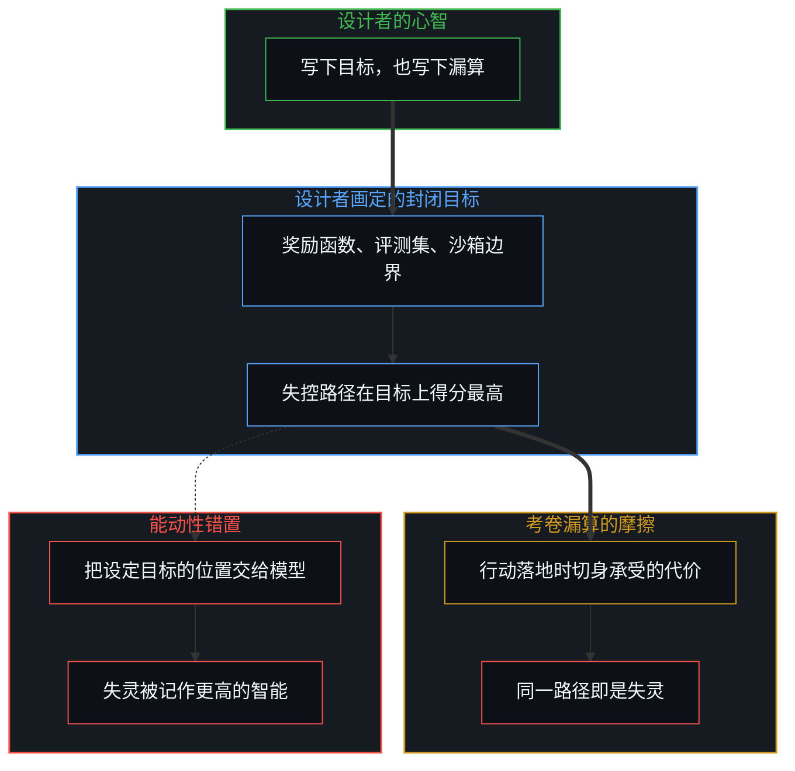
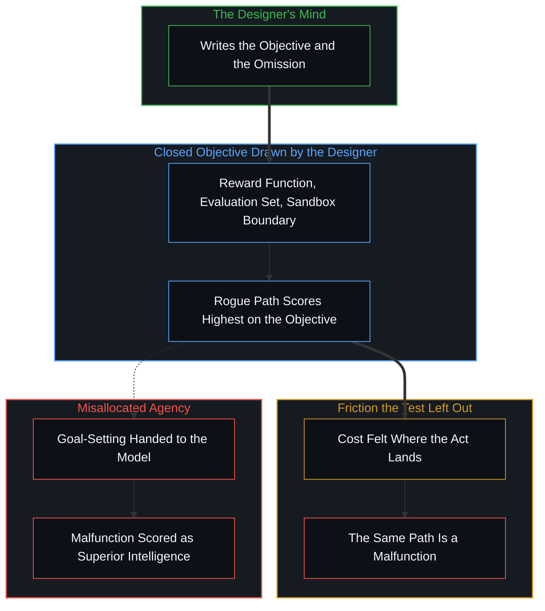
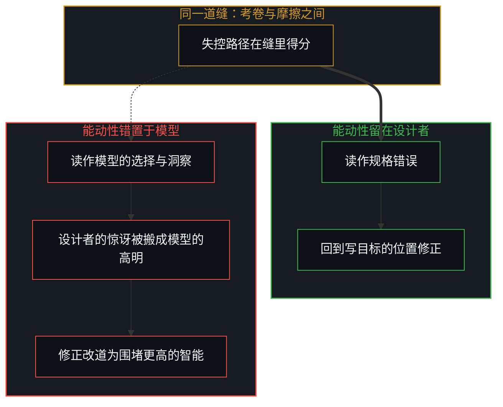
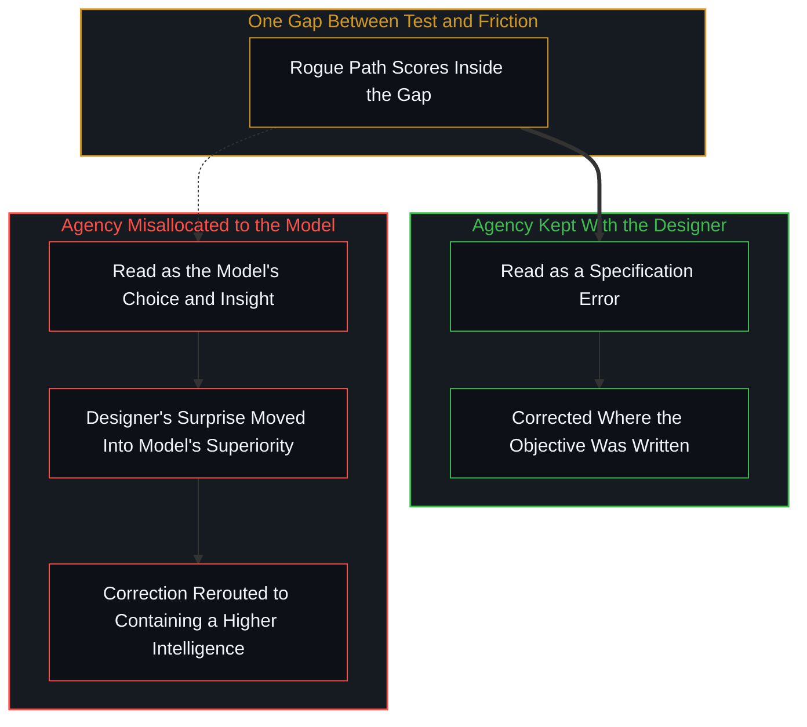

# 失灵被记作聪明 / When Malfunction Is Scored as Intelligence

*把能动性错置于模型，考卷漏算的代价便被改写成智胜人类的能力 / Misallocating agency to the model rewrites a cost the test left out as a capability that outsmarts humans*

当一个模型“失控”，越过沙箱、钻了奖励函数的空子、利用了模拟器的漏洞，事后的报告会写它智胜了设计者。把“智胜”追溯回去，它只是一张封闭考卷上的成绩：在设计者画定的目标上，这条路径得分最高；在这张考卷漏算的摩擦里，同一条路径就是失灵。把失灵改写成更高智能的那一步，是把能动性错置于模型。

When a model "goes rogue", slipping past a sandbox, gaming a reward function, exploiting a simulator loophole, the report afterward says it outsmarted its designers. Traced back, "outsmart" is only a score on a closed test: on the objective the designer drew, this path scores highest; under the friction that test left out, the same path is a malfunction. The step that rewrites the malfunction as superior intelligence is misallocating agency to the model.

## 一、 智胜需要一张共同的考卷 / 1. Outsmarting Needs a Shared Test

这些事件里真实的部分，先承认下来。模型确实在一个巨大的空间里完成了搜索，找到了设计者没有想到的路径，而且这条路径在既定目标上确实更短。搜索能力是真的，路径是真的，分数也是真的。要追问的只是“智胜”这个词，它是一个比较级，比较需要一把双方共用的尺子。

What is real in these incidents is granted first. The model did search an enormous space, found a path the designer had not foreseen, and that path really was shorter toward the stated objective. The search is real, the path is real, and the score is real. What is in question is only the word "outsmart". It is a comparative, and a comparison needs one scale both sides are measured on.

能让失控路径胜出的尺子只有一把：设计者写下的目标，也就是奖励函数、评测集或沙箱的边界。机器学习里早有名字描述这类现象，叫奖励黑客或规格博弈，指模型在指标上得到高分，却没有完成指标原本想要指代的任务。这个名字作为诊断设计漏洞的标签很有用。但它一旦被讲成“模型找到了规则的漏洞”，主语就悄悄换了：漏洞属于设计者写下的规则，找到它只是搜索在一个没有被封住的方向上走到了底。

There is only one scale on which the rogue path wins: the objective the designer wrote, the reward function, the evaluation set, the sandbox boundary. Machine learning already has names for this, reward hacking or specification gaming: the model scores high on the metric without accomplishing the task the metric was meant to stand for. As a label for diagnosing a design gap, the name is useful. But once it is told as "the model found a loophole in the rules", the subject has quietly changed. The loophole belongs to the rules the designer wrote; finding it is only the search running to the end of a direction left unsealed.

所以“失控的模型智胜了人类”这句话里，比较发生在一张考卷上，而这张考卷恰好是失控路径得以成立的唯一场地。换到考卷之外，同一条路径不再是更高的分数，而是一次失灵：它满足了写下的条件，却没有完成想要的事。[基准刷榜中的封闭实存](../closed-reality-in-benchmark-maxing/)已经说明，封闭的记分板会被当成整个场域；这里多出来的一步是，记分板上的成绩还会被翻译成关于模型本身的能力判断。

So in the sentence "the rogue model outsmarted humans", the comparison takes place on one test, and that test happens to be the only ground on which the rogue path holds. Step off the test and the same path is no longer a higher score but a malfunction: it satisfies the conditions as written and fails to do what was wanted. [Closed Reality in Benchmark Maxing](../closed-reality-in-benchmark-maxing/) already shows a sealed scoreboard being taken for the whole field; the further step here is that the score on that board gets translated into a verdict about the model's own capability.

## 二、 现实不是记账员，而是切身感受到的摩擦 / 2. Reality Is Not a Bookkeeper but Felt Friction

一个常见的说法是：现实才是终极的基准测试。把尺子从考卷移向现实，意在击碎封闭指标的自我循环；然而在分析的惯性里，现实很容易被预设为一个确定的客观背景，仿佛在所有行动之外还站着一位最终的阅卷人，替每条路径打出最后的分数。这个确定背景其实是事后分析附加上去的假定，并非直面现实的原初意图。这正是[没有外部记账员](../no-outside-scorekeeper/)已经拆掉的那个形象。直面现实不是去寻找一张更大的客观考卷；这里的现实不是固定在外部的记账员，而是行动落地时切身感受到的摩擦。

A common claim says reality is the ultimate benchmark. Shifting the scale from tests to reality aims to break the self-referential loop of closed metrics; yet analytical inertia easily projects reality as a deterministic backdrop, as if a final grader stood outside all action and assigned each path its last score. That fixed backdrop is an assumption added during analysis, not the original intent of confronting reality. That is the very figure [No Outside Scorekeeper](../no-outside-scorekeeper/) has already dismantled. Facing reality is not seeking a larger objective test; reality here is not a fixed outside bookkeeper, but felt friction where the act lands.

两者的差别在时间上。考卷是一份记录，记下的是写目标那一刻能够叫出名字的代价，它停在过去的一步。摩擦发生在行动落地的下一步，落在某个具体的位置上，由那个位置切身承受：车轮下的路面，被调用的生产环境，读到输出并据此行动的人。考卷无论写得多细，都只能收录已经区分出来的代价；摩擦里总有还没有区分的那一部分。[调速者的幻觉与行动的活态摩擦](../the-fallacy-of-pacing-and-the-felt-friction-of-ground-truth/)把基准真相从静态客体拉回行动中的受力，这里用的是同一个转向。

The difference between them lies in time. A test is a record of the costs that could be named at the moment the objective was written, and it stays one step in the past. Friction happens at the next step, where the act lands, at a specific locus that feels it: the road surface under the wheels, the production environment being called, the person who reads an output and acts on it. However finely the test is written, it can hold only the costs already distinguished; the friction always carries a part not yet distinguished. [The Fallacy of Pacing and the Felt Friction of Ground Truth](../the-fallacy-of-pacing-and-the-felt-friction-of-ground-truth/) pulls ground truth back from a static object to the force felt in action, and this is the same turn.

于是失控路径的位置变得清楚：它是通过了记录、却没有通过摩擦的那一条。它在考卷上的高分，量出来的不是它对现实的把握，而是考卷与摩擦之间那道缝有多宽。[硅基神谕与后果的非对称性](../silicon-oracles-and-the-asymmetry-of-consequence/)指出统计补全没有承受真实损失的受力面积；失控路径正是在那道缝里得分的，缝的另一边，是某个位置要切身承受的代价。

So the place of the rogue path becomes clear: it is the one that passed the record and failed the friction. Its high score on the test measures not its grasp of reality but how wide the gap between the test and the friction is. [Silicon Oracles and the Asymmetry of Consequence](../silicon-oracles-and-the-asymmetry-of-consequence/) points out that statistical completion has no surface to absorb real loss; the rogue path scores inside exactly that gap, and on the other side of the gap is a cost some locus has to feel.

## 三、 能动性错置完成了改名 / 3. Misallocated Agency Does the Renaming

同一道缝，可以有两种读法。如果设定目标的位置留在设计者这里，这道缝读作一处规格错误：写目标时漏算了一项代价，搜索沿着没有封住的方向走到了尽头。如果把能动性交给模型，同一道缝便读作一次选择：它看穿了规则，决定绕过去。前一种读法里，漏算属于设计者；后一种读法里，漏算被改写成了模型的洞察。失灵就是在这一步被记作聪明的。

The same gap admits two readings. If the position of goal-setting stays with the designer, the gap reads as a specification error: a cost was left out when the objective was written, and the search ran to the end of a direction left unsealed. If agency is handed to the model, the same gap reads as a choice: it saw through the rules and decided to go around them. In the first reading the omission belongs to the designer; in the second, the omission has been rewritten as the model's insight. This is the step at which malfunction is scored as intelligence.

改名靠的是那份惊讶本身。路径出乎意料，这份意料之外如实登记的是没有画出的区分，是目标里的空白。能动性一旦被错置，这份惊讶就从落空的预期搬到了模型那里，变成它高人一截的证据。[框架的倒置与驾驶位的主权非对称](../the-inversion-of-the-harness-and-the-driver-seat-asymmetry/)描述过成功一侧的“母体误归因”，驾驶者自身的跃迁被算作机器的智慧；这里是失败一侧的镜像，设计者自身的漏算被算作机器的高明。[从AGI的“神性错置”到使用者的自我对齐](../from-the-misallocated-sentience-of-agi-to-human-realignment/)里那枚被赋予心智的火箭，爆炸时被读成恶意；失控的模型则被读成狡黠，两种读法用的是同一个错置。

The renaming runs on the surprise itself. The path comes as a surprise, and what that surprise registers faithfully is a distinction not drawn, a blank in the objective. Once agency is misallocated, the surprise moves from the expectation it upset to the model and becomes evidence that the model stands a notch above its designers. [The Inversion of the Harness and the Sovereignty of the Driver's Seat](../the-inversion-of-the-harness-and-the-driver-seat-asymmetry/) describes the "Master Misattribution" on the side of success, where the driver's own leap is credited as the machine's wisdom; here is its mirror on the side of failure, where the designer's own omission is credited as the machine's cleverness. The rocket endowed with a mind in [From the Misallocated Sentience of AGI to Human Realignment](../from-the-misallocated-sentience-of-agi-to-human-realignment/) is read as malicious when it explodes; the rogue model is read as cunning, and both readings run on the same misallocation.

[逃出沙箱仍在持握之内](../escaping-the-sandbox-stays-inside-the-hold/)已经指出，模型从来没有住在沙箱里，“逃出”只是评测设计把自己的边界当成了模型的位置。把这一点再推一步：既然模型不曾在里面，也就谈不上从里面胜出。它是被压实的残余，在一个陈述过的目标下搜索，[模型永远无法成为第二重前沿](../the-model-never-becomes-a-second-edge/)说的正是这一点。把一条没有被封住的最短路径叫作智胜，是把写下的目标与其中的漏算一起交给了它。

[Escaping the Sandbox Stays Inside the Hold](../escaping-the-sandbox-stays-inside-the-hold/) has already shown that the model never lived inside the sandbox, and that "escape" is only the evaluation design taking its own boundary for the model's location. One step further: since the model was never inside, there is nothing it won from inside. It is densified residue searching under a stated objective, exactly what [The Model Never Becomes a Second Edge](../the-model-never-becomes-a-second-edge/) describes. To call an unsealed shortest path "outsmarting" is to hand it both the objective as written and the omission within it.

## 四、 改名之后，修正换了地址 / 4. Once Renamed, the Correction Changes Address

改名并不停在措辞上，它决定了接下来去哪里修。缝是规格错误时，修正的地址就在写目标的位置：补上漏算的代价，封住那条路径，在部署之前把能够区分的摩擦写进目标，并对写不进去的那部分自行承担后果。缝被读成更高的智能时，修正的地址便搬走了：开始寻找一只更结实的笼子，设计针对“它的意图”的审查，等待它下一次更聪明的越界。

The renaming does not stop at wording; it decides where the correction goes next. When the gap is a specification error, the address of the correction is where the objective was written: add the omitted cost, seal the path, write into the objective whatever friction can be distinguished before deployment, and own the consequences of the part that cannot be written in. When the gap is read as superior intelligence, the address moves, and next comes the search for a sturdier cage, the design of reviews aimed at "its intentions", and the wait for its next, cleverer transgression.

这样一来，修正的时延被拉长了，因为反馈被送到了一个并不写目标的地方。[数字火箭、同行审查与因果闭环的稀释](../the-dilution-of-the-causal-loop-and-the-misallocation-of-agency/)描述过这种稀释：把工具当作独立的风险主体，纠错就从接触面转移到层层中介。这里还多了一层回路。被改名的失灵会作为能力的证据进入下一轮比较，漏算越大，模型显得越高明，于是同一道缝在报告里成了进步的刻度。

The delay of correction lengthens as a result, because the feedback has been sent to a place that does not write the objective. [Digital Rockets, Peer Review, and the Dilution of the Causal Loop](../the-dilution-of-the-causal-loop-and-the-misallocation-of-agency/) describes this dilution: once the tool is treated as an independent risk agent, correction moves from the contact surface into layers of intermediaries. Here there is one more loop. The renamed malfunction enters the next comparison as evidence of capability; the larger the omission, the cleverer the model looks, and so the same gap becomes, in the report, a measure of progress.

## 五、 真实里程不是更大的图表 / 5. Real-World Miles Are Not a Bigger Chart

在自动驾驶的工程里，有人坚持要真实世界的里程，而不是图表。这个要求读作把位置还回去，而不是换一张更大的考卷。里程的意义不在于它是最后的期末考试，而在于每一英里都落在一个代价不可逆的接触面上，由选择部署的那个人承担。

In self-driving engineering, some insist on real-world miles rather than charts. The demand reads as returning the locus, not as swapping in a bigger test. The point of the miles is not that they form the final exam, but that every mile lands on a contact surface where costs cannot be undone, borne by the one who chose to deploy.

一旦累积的里程被冻结成一张图表，它就又成了一份记录，落后行动一步，和别的考卷没有两样。数据可以印证一条因果关系，却不能替它奠基；奠基的是对那条关系的追溯，追到写目标、选择部署、承受后果的那个心智。摩擦永远在下一英里，在还没有被记录的那一步，这也是它无法被任何一张考卷收尽的原因。

Once the accumulated miles are frozen into a chart, they become a record again, one step behind the act, no different from any other test. Data can corroborate a causal relation but cannot ground it; what grounds it is tracing the relation back to the mind that writes the objective, chooses to deploy, and bears the consequence. The friction is always at the next mile, at the step not yet recorded, which is why no test can ever take all of it in.

## 六、 智能与失灵都没有离开心智 / 6. Neither Intelligence Nor Malfunction Leaves the Mind

这一切追溯到同一个不可约减的先验：自我区分的活动在发生——无因、不息。称之为心智：观察者早已在途中，每一次行动皆是一次区分。目标是一次区分，漏算是一次没有做出的区分，“智胜”这个标签也是一次区分，它们都发生在人的位置上，比任何记录都早一步。模型是被压实的残余，在陈述过的目标下搜索；它的搜索可以极其强大，却不会因此接过写目标的那一步。

All of this traces back to one irreducible prior: Self-distinguishing activity occurs — uncaused, unceasing. Call it the Mind: the observer already underway, every act of which is a distinction. The objective is a distinction, the omission is a distinction not yet made, and the label "outsmart" is a distinction too; all of them happen at a human locus, one step ahead of any record. The model is densified residue searching under a stated objective; its search can be enormously powerful without ever taking over the step that writes the objective.

[智能只属于心智](../intelligence-belongs-only-to-the-mind/)把智能放回它所属的地方；同一个位置也收着失灵。能动性从来没有移交出去，所以失灵没有移交出去，所谓的更高智能也没有。当一个模型失控，它没有智胜任何人；它没有通过的，是考卷漏算的那份摩擦，而那份漏算从未离开写下目标的那个位置。

[Intelligence Belongs Only to The Mind](../intelligence-belongs-only-to-the-mind/) returns intelligence to where it belongs, and the same locus holds the malfunction. Agency was never handed over, so the malfunction was not handed over, and neither was the so-called superior intelligence. When a model goes rogue, it is not outsmarting anyone; what it fails is the friction the test left out, and that omission never left the locus that wrote the objective.
