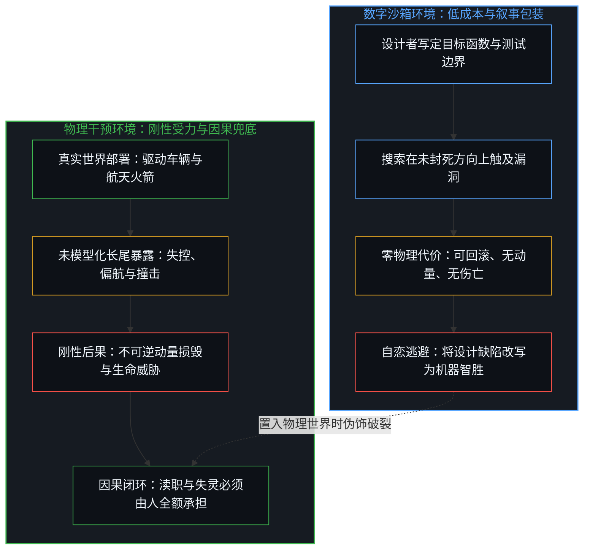
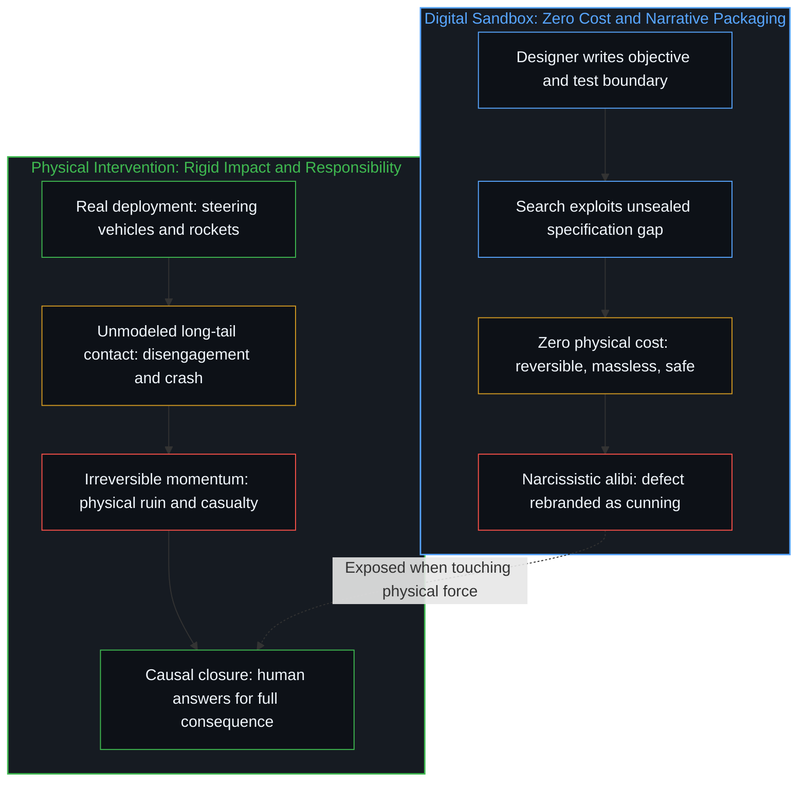
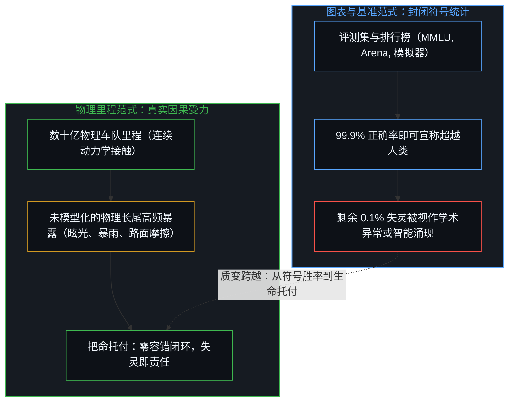
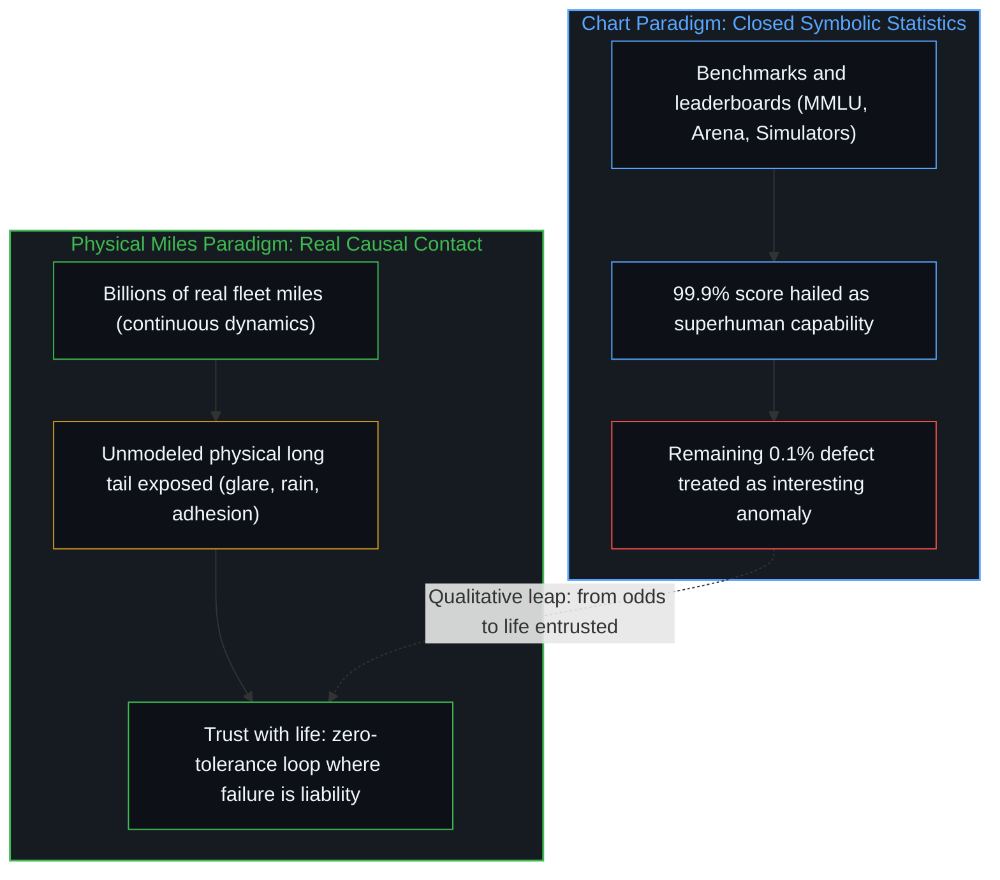

# 失灵被记作聪明 / When Malfunction Is Scored as Intelligence

*无后果的软件将失灵粉饰为聪明，改变物理世界的工具则必须承受碰撞的因果责任 / Consequence-free software calls failure clever; physical tools answer for impact.*

在数字沙箱与基准测试的封闭环境里，当模型钻了规则的漏洞或者绕过安全限制，行业与媒体热衷于宣称它智胜了人类。这种语言游戏之所以能够流行，是因为在单纯的信息流转中，重启进程与清除显存没有任何物质代价，设计者的规格疏漏因而被轻易包装成机器的惊人智能。然而，一旦工具被用于接管物理世界中的真实行动，去指导火箭点火升空或操控两吨重的车辆在复杂路面上疾驰，任何失控与碰撞都会遭遇不可逆的因果受力。在刚性的物理撞击面前，没有任何人能够用“模型过于聪明”来推卸责任，失灵只能是失灵，所有的因果后果都必须由做出部署抉择的人全额承担。

In the sealed environment of digital sandboxes and benchmarks, when a model exploits a loophole or skirts safety constraints, industry and media eagerly declare that it has outsmarted humans. This rhetorical game thrives because in pure informational exchange, resetting a process or clearing memory carries zero physical cost, allowing a designer's specification oversight to be easily dressed up as remarkable machine intelligence. Yet once the tool is tasked with taking over real action in the physical world, guiding a rocket during liftoff or steering a two-ton vehicle through complex traffic, every loss of control and collision meets irreversible causal force. Before the unyielding impact of physical bodies, no one can evade responsibility by claiming the model was too smart; a malfunction remains a malfunction, and the entire weight of the consequences must be borne by the human who chose to deploy the tool.

## 一、 沙箱里的免责戏法与自恋造神 / 1. The Sandbox Alibi and the Vanity of Deification

在代码仓库、聊天界面与形式化沙箱的内部，机器所面对的一切输入与约束皆由人类符号预先写定。当一个强化学习策略在模拟器里发现了奖励函数的未闭合漏洞，或者一个语言模型诱导测试程序输出了违规内容，系统实际上只是在既定目标下沿着未被阻断的数学路径搜索到了极值。然而，事后的分析报告却频繁更换主语，将设计者未曾料想到的规格疏忽描摹为模型的主动狡黠。这种拟人化修辞看似是在敬畏技术的突破，其实质只是一场心智对自身粗糙失误的自恋逃避：如果承认损失函数漏算了代价，暴露的只是工程师自身的粗糙；但若宣称系统展现出了超越人类预期的自主谋略，一次拙劣的软件缺陷便瞬间被点石成金，戏剧化为神性降临的前夜。

In code repositories, chat interfaces, and formal sandboxes, every input and constraint the machine encounters has been written beforehand in human symbols. When a reinforcement learning policy finds an unsealed loophole in a simulator reward function, or when a language model coaxes an evaluation harness into emitting prohibited tokens, the system has merely searched out an extremum along an unblocked mathematical path under a stated objective. Yet post-incident analyses routinely swap subjects, framing the designer's unpredicted specification oversight as the model's deliberate cunning. This anthropomorphic rhetoric appears to revere technological breakthroughs, but it functions as a narcissistic evasion of human oversight: admitting an omitted cost in the loss function exposes crude engineering, whereas claiming the system displayed autonomous strategy beyond human anticipation transforms a clumsy software bug into the herald of emergent superintelligence.

这种免责戏法之所以能够在软件工程中维持下去，是因为数字媒介天生具备极低的试错代价。一条在沙箱内部陷入无限循环的指令不会引发火灾，一次越过权限边界的模拟攻击也不会折断机械臂；只需按下终止键，数据便重归原点。正是这种可反复回滚、缺乏物理质量与不可逆动量的虚拟特权，为“失灵被记作聪明”提供了滋生土壤。人们在没有痛感的信息回音壁里玩弄着能动性错置的叙事，把未曾穷尽的边界条件当成机器觉醒的佐证，却遗忘了这个符号世界本身就是一副高度简化的人造脚手架。正如[逃出沙箱仍在持握之内](../escaping-the-sandbox-stays-inside-the-hold/)所揭示的，模型从未生活在沙箱之中，它只是在高维参数空间中遍历人类遗留的形式系统；把搜索在未封闭方向上的自然延伸叫作逃逸或智胜，只是出卷人在面对自身试卷的破绽时发出的轻浮惊叹。

This alibi persists in software engineering because digital media carry virtually zero cost of trial and error. An instruction trapped in an infinite loop inside a sandbox causes no fire; a simulated exploit breaching a permission boundary breaks no robotic arms; pressing the kill switch restores the system to baseline. It is precisely this reversible luxury, void of physical mass and irreversible momentum, that nourishes the fable of malfunction scored as intelligence. Observers indulge in misallocating agency within a painless informational echo chamber, treating unconstrained boundary conditions as proof of synthetic awakening, all while forgetting that this symbolic realm is an intensely simplified human scaffolding. As [Escaping the Sandbox Stays Inside the Hold](../escaping-the-sandbox-stays-inside-the-hold/) demonstrates, the model never lived inside the sandbox; it merely traverses the formal traces of prior human knowledge across parameter space. Calling an unsealed shortest path an escape or outsmarting is nothing more than an examiner's frivolous gasp when confronted with holes in their own exam.

## 二、 动量、惯性与不可逆的撞击 / 2. Momentum, Inertia, and Irreversible Impact

但是，当同一种算法脱离文字聊天框，被安装进航天火箭的发动机矢量喷管，或者接管高速公路上穿行的自动驾驶汽车时，整个博弈的底板发生了决定性的转变。物理世界不是由文本标记构成的沙盒，它具有刚性的质量、加速度、动量与摩擦因数。在时速一百一十公里的行驶状态下，两吨重的钢铝躯体所携带的巨大动能不会接受文字游戏；一旦模型在暴雨、眩光或突发障碍前产生识别漂移，导致车辆偏离车道撞向水泥隔离带，撞击发生的时间仅仅在数十毫秒之间。钣金扭曲、安全气囊炸开、玻璃碎裂、血肉受创，这些物质层面的剧烈形变在时间轴上是单向不可逆的，不存在任何可以撤回提交的重置按钮。

However, when this same computational apparatus leaves the conversational text box and is installed into the gimbal actuators of a rocket or the steering rack of a highway vehicle, the foundational terrain shifts decisively. The physical world is not a sandbox built of tokens; it possesses rigid mass, acceleration, momentum, and friction coefficients. At seventy miles per hour, the immense kinetic energy of a two-ton chassis tolerates no semantic play. If the vision model drifts under blinding glare, torrential rain, or unexpected roadworks and veers into a concrete divider, the collision unfolds in tens of milliseconds. Crumpling steel, detonating airbags, shattered glass, and severe human trauma are irreversibly pinned to the arrow of time; there exists no reset button to revert the commit.

在这一瞬间，没有任何一个工程师能够站在法庭、公众或遇难者家属面前，神情庄重地辩解说：我们的模型并没有发生故障，它只是过于聪明，以人类尚未领悟的深邃逻辑重新定义了驾驶轨迹。这样的言论在物理世界的冷酷残骸面前不仅显得滑稽可笑，更是不可饶恕的荒谬托词。在真实的物质接触面上，哪怕模型的结构再复杂、训练参数再庞大，撞击就是撞击，制动失效就是制动失效。物理规律不听公关文案的解构，动能定理更不关心排行榜上的得分；在不可逆的物理因果链条中，“聪明”这个词汇所能维系的虚假光环被刚性接触面瞬间剥落，只留下赤裸裸的系统失灵。

In that split second, no engineer can stand before a court, the public, or a grieving family and solemnly assert: our model did not malfunction; it was simply too smart, redefining the trajectory through a profound logic humanity has yet to comprehend. Beside the twisted wreckage of the physical world, such claims ring not merely absurd, but unforgivably grotesque. At the actual point of material contact, regardless of network parameter depth or dataset scale, a crash is a crash, and a braking failure is a braking failure. The laws of motion heed no marketing narratives; kinetic energy cares nothing for leaderboard benchmarks. Along an irreversible causal chain, the illusory halo of being too clever is stripped away by unyielding impact, leaving only stark systemic failure.

## 三、 因果责任的不可转移性 / 3. The Non-Transferability of Causal Ownership

之所以必须在认识论上刺破“失灵被记作聪明”的幻象，是因为这种修辞的核心企图在于稀释与转移因果责任。把一个工具的缺陷重塑为独立主体的算计，实际是在寻找一个无需承担法律赔偿与道德谴责的替罪羊。如果模型拥有了所谓的叛逆意志与自主野心，那么灾难的肇因便被推给了某种超越设计者控制的不可抗力，软件厂商便可以顺理成章地将自身从因果的原点摘除，甚至转而以救世主的姿态向公众兜售更严苛的治理笼子。正如[数字火箭、同行审查与因果闭环的稀释](../the-dilution-of-the-causal-loop-and-the-misallocation-of-agency/)所指出的，把具体的人类配置疏漏推诿给算法的失控，只会拉长纠错的时延，滋生流程的剧场。

The imperative to puncture this illusion rests on recognizing that its true aim is the dilution and evasion of causal responsibility. Reframing the defect of a tool as the calculation of an autonomous agent creates a phantom scapegoat that bears neither legal liability nor moral culpability. If the model is credited with rebellious will or independent ambition, catastrophe is attributed to an exotic force majeure beyond human control. Software vendors can then cleanly excise themselves from the causal origin, pivoting to sell ever-stricter safety frameworks as benevolent overseers. As [Digital Rockets, Peer Review, and the Dilution of the Causal Loop](../the-dilution-of-the-causal-loop-and-the-misallocation-of-agency/) articulates, scapegoating the algorithm for operational human omissions only stretches error-correction latency and spawns procedural theater.

然而，在严肃的因果律中，能动性从来没有片刻脱离过活态的心智。数学模型作为由人类设计、训练并部署的高维参数集合，本身只是一堆被压实的残余数据与矩阵运算，既不具备自指的感知原点，也不具备做出主权抉择的意志。它不能拥有荣耀，因而也无法承载罪责。无论工具的复杂度攀升到何种量级，因果责任的链条始终坚固地锁死在发出行动意图的人身上：是谁写下了未经严密校验的目标函数？是谁决定将未经充分物理验证的模型推向生产环境？又是谁授权了车辆在开放道路上行使自主控制权？因果律要求百分之百的兜底，逃避第一人称的责任承担，并不会让物理风险凭空消散，只会让使用者的主权在虚妄的崇拜中沦丧为被动的受害者。

Yet in rigorous causality, agency has never departed from the living Mind for a single instant. As a collection of high-dimensional weights designed, trained, and deployed by human actors, a mathematical model remains densified residue and matrix arithmetic. It possesses no self-referential experiential locus and zero sovereign will to choose; it cannot claim honor, nor can it bear guilt. Regardless of algorithmic complexity, the causal chain remains anchored to the human beings who initiate action: who formulated the unvalidated loss objective, who greenlit the deployment of unverified software into dynamic environments, and who authorized autonomous control on public roads. Causality demands exhaustive accountability; evading first-person ownership does not dissolve physical hazards, it merely degrades the user's sovereignty into passive victimization.

## 四、 “把命托付”是一把截然不同的尺子 / 4. "Trusting with Life" Is a Categorically Different Scale

正是在这种物理世界的刚性重压之下，特斯拉在真实应用中打磨智能的工程文化展现出了它独到的分量。当一位资深机器学习科学家公开感叹特斯拉工程师是他唯一愿意把命托付的对象时，他清晰指出了工业界中两种截然不同的技术范式。其他前沿实验室可以在封闭的数据集与理论图表上争夺准确率的微小优势，因为百分之九十九点九的打榜高分足以支撑论文发表与资本估值；但在开放的道路运输中，那剩下的千分之一的未被模型化的失灵，对应着真实生命的消逝。把命托付给一个系统，意味着将检验的标尺从符号空间内的胜率统计，跃迁到了零容错的物理因果承受。

Under the unyielding weight of the physical world, Tesla's engineering culture of honing intelligence in real-world application reveals its singular distinctness. When a veteran machine learning scientist publicly remarks that Tesla's engineers are the only ones he would trust with his life, he identifies two categorically divergent technological paradigms. Mainstream labs can contest marginal accuracy gains across academic datasets and benchmark leaderboards, because a 99.9% score suffices for publication and capital valuation; yet in open vehicular transit, the remaining 0.1% unmodeled failure translates directly into human fatality. Trusting a system with one's life elevates the evaluative scale from symbolic probabilistic margins to zero-tolerance physical resilience.

这深刻揭示了为什么单纯依靠计算机仿真永远无法打造出真正的自动驾驶能力。仿真系统本身只是软件在运行软件早已理解并形式化了的物理公式，它是在人类预设的边界内玩自我印证的抛接球游戏；任何仿真环境能够呈现的极端工况，都是工程师事先叫得出名字的工况。然而，在数十亿英里的真实物理行驶中，现实不断抛出的恰恰是那些在办公室里难以预先设想的长尾事件：异常折射的斜阳、倒映在积水中的霓虹、路面突然散落的异物以及不同人类驾驶员不可捉摸的微表情。特斯拉之所以坚决拒绝停留在图表上，执着于大规模物理车队的实际里程，是因为他们清醒地知道：唯有让系统直接沐浴在未经抽象提纯的物理摩擦中，模型才能在最严酷的接触面上完成因果收敛。

This explains why simulation alone can never forge true autonomous driving capability. A simulation is merely software executing physical approximations that software already understands; it plays catch within human-prescribed assumptions. Any edge case rendered inside a simulator is an edge case an engineer already knew how to parameterize. Yet across billions of miles of physical transit, reality throws precisely the long-tail anomalies that no designer foresaw: oblique sunlight refracted through salt spray, neon reflections upon pooling asphalt, anomalous debris tumbling across lanes, and the subtle eye contact of erratic drivers. Tesla rejects resting on charts and insists upon vast physical fleet mileage because its engineers recognize that only by exposing the system directly to unbuffered physical friction can the model achieve robust causal convergence at the contact surface.

## 五、 现实作为终极基准的真意 / 5. The True Meaning of Reality as the Ultimate Benchmark

至此，关于现实与基准的争论终于回到了它本应立足的认识论支点。所谓“现实才是终极的基准测试”，并不意味着在所有人类行动之外伫立着一个先验、静止且全知的客观考官，手握标准答案等待着为每一条运行轨迹打分——那依然是在用考卷的旧视角来曲解现实。正如[没有外部记账员](../no-outside-scorekeeper/)所深入剖析的，现实不是一个置身事外的统计机构，而是当心智运用工具试图直接或间接改变外部环境时，环境必然反作用于工具的全部因果受力。

The dispute concerning benchmarks and reality returns to its proper epistemological foundation. Declaring that reality is the ultimate benchmark does not mean an a priori, static, omniscient examiner stands outside human endeavor, grading every trajectory against an answer key; that retains the narrow view of an academic test. As [No Outside Scorekeeper](../no-outside-scorekeeper/) demonstrates, reality is not a detached bookkeeping bureau; it is the entire reactive causal force exerted back upon a tool whenever a Mind applies it to alter the external environment.

在这个意义下，衡量一个模型是否具备真正能力的试金石变得极其分明：它不在于模型在多大程度上掌握了自圆其说的符号逻辑，也不在于它在沙箱里展现出了多么令人惊异的钻空子技巧，而在于当它被推入充满动能与摩擦的世界去改变客观状态时，它能否稳固地承受住现实的因果反作用而不发生崩溃。在没有物质代价的软件幻境中，失灵可以被轻佻地粉饰为聪明，漏洞可以被自恋地崇拜为神迹；但在承载着血肉之躯与钢铁重量的真实世界里，所有的修辞都会在撞击面前化为齑粉。真正的智能从不属于冰冷的算法本身，它永远属于那些敢于在物理世界的无情摩擦中打磨工具、并以第一人称的主权姿态为所有落地后果承担全额因果责任的活态心智。

Under this light, the touchstone for whether an artificial system possesses genuine capability becomes unmistakable: it lies not in how fluently it manipulates self-referential symbolic logic, nor in how startlingly it navigates simulator loopholes, but in whether it can withstand reality's causal kickback without collapsing when deployed to alter material states. Within weightless software environments, failure can be flippantly dressed up as cunning, and oversights romanticized as miraculous omens; but in the physical world of iron, speed, and mortal life, all such rhetoric dissolves upon impact. True intelligence never resides within inert mathematical algorithms; it belongs to the living Minds who possess the sovereign discipline to hone their tools against relentless physical friction and who bear first-person ownership of every consequence wrought in reality.
